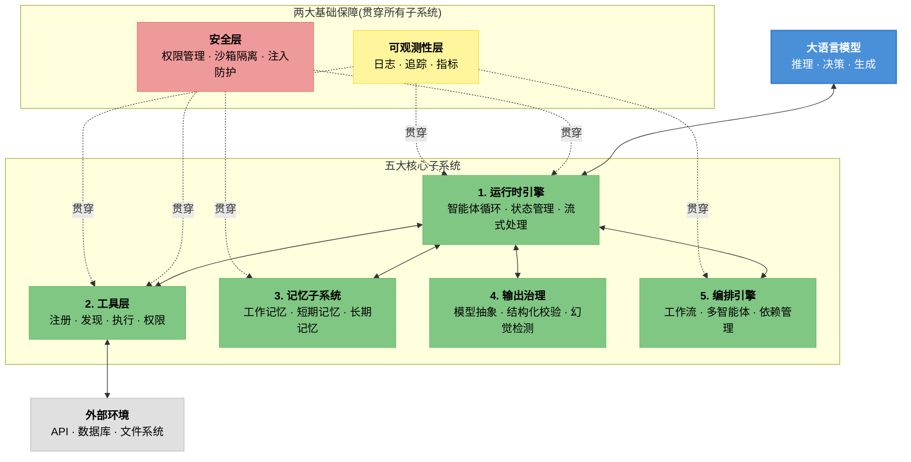
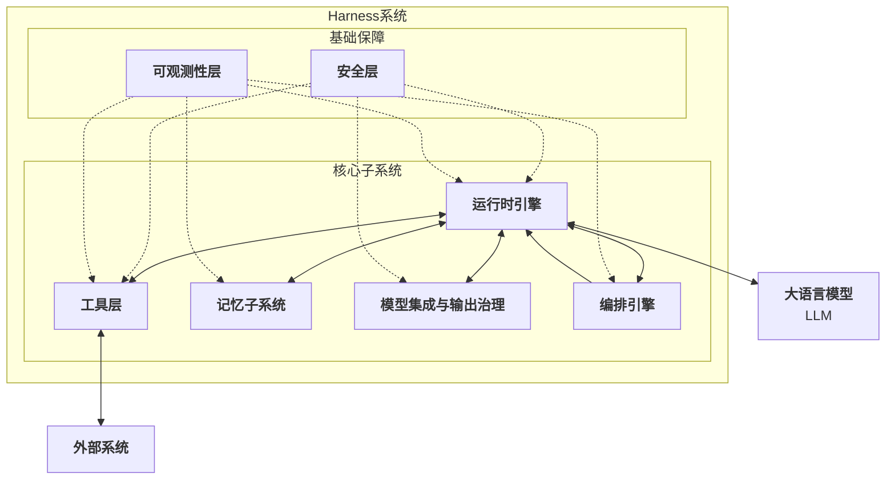
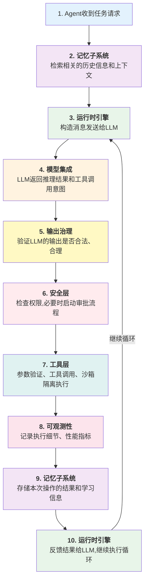

## 1.3 五大核心子系统总览

一个完整的Harness系统可以分解为五个核心子系统和两大基础保障。这个分类方案既符合系统工程的模块化原则，也便于在不同的场景中选择和组合。

下图展示了五大核心子系统与两大基础保障之间的整体关系：

图 1-1：Harness 五大核心子系统与两大基础保障

### 1.3.1 五大核心子系统

本小节逐一介绍运行时引擎、工具层、记忆子系统、输出治理和编排引擎五大子系统的核心职责和设计要点。

#### 1. 运行时引擎

**职责**：实现智能体的执行循环，协调各个子系统的交互。

运行时引擎是Harness的心脏。它维护智能体执行的主循环，通常遵循以下模式：

在这个循环中，运行时引擎的核心职责包括：

- **状态机管理**：智能体从初始化、执行、暂停、恢复到完成的各个状态转移
- **消息编排**：构造发给LLM的消息（包括上下文、历史记录、工具信息），以及处理来自LLM的响应
- **异步执行**：在I/O等待期间不阻塞，并发处理多个智能体任务
- **超时和中断**：设置合理的执行超时，支持优雅的任务中断和清理

在生产系统中，运行时引擎的实现策略因场景而异。Claude Code 面向交互式终端工作流，支持文件编辑、命令执行、权限模式切换和 MCP 扩展。OpenClaw 则强调 Gateway、Heartbeat/cron 触发和后台自动化，适合需要持续运行的智能体场景。

#### 2. 工具层

**职责**：抽象和管理各种外部工具的访问，提供统一的调用接口。

工具层是智能体与真实世界的连接点。它的设计直接影响智能体的能力范围和安全性。

核心职责包括：

- **工具注册**：维护一个工具注册表(Tool Registry)，记录每个可用工具的定义、参数、返回值类型、权限要求等
- **工具发现**：根据智能体的需求，推荐合适的工具。这可能涉及语义搜索、工具分类、相似度匹配等
- **参数验证**：在调用工具前，验证智能体提供的参数是否符合工具的签名，防止类型错误或格式不当
- **权限检查**：检查智能体是否有权限调用该工具，如果权限不足，启动审批流程
- **执行隔离**：在沙箱或容器中执行工具，防止工具故障对系统的影响
- **结果标准化**：将不同工具返回的结果统一为标准格式，方便智能体处理

在生产系统中，工具层的规模和管理方式差异显著。Claude Code 提供内置工具、MCP 和 skills 扩展，并通过权限模式控制文件编辑、命令执行和网络访问。OpenClaw 的 ClawHub 是公开的 skills/plugins 注册中心；skill 通常是包含 `SKILL.md` 的文件包，可带配置、脚本和元数据。

#### 3. 记忆子系统

**职责**：管理智能体的各种记忆，支持上下文理解和学习。

一个没有记忆的智能体，每次执行都要从零开始。记忆子系统让智能体能够学习、改进、个性化响应。

记忆的类型通常按生命周期分为三层：

- **工作记忆** (Working Memory)：当前对话的上下文窗口，包含最近的消息、执行结果和即时状态，容量受 LLM 上下文窗口限制
- **短期记忆** (Session Memory)：跨轮次但会话级别的信息，如会话摘要、用户在当前项目中的偏好、最近的执行结果，生命周期从数小时到数周
- **长期记忆** (Persistent Memory)：跨会话的用户档案、学到的模式、系统策略，生命周期可达数月至数年，通常借助向量索引支持语义检索

核心职责包括：

- **记忆存储**：实现支持快速访问和更新的存储结构（如向量数据库、缓存层）
- **记忆检索**：根据当前上下文，检索相关的历史信息
- **记忆压缩**：当记忆累积过多时，总结和压缩，以节省存储和计算成本
- **遗忘策略**：决定哪些信息应该被保留，哪些应该被清除

在生产系统中，记忆子系统的设计反映了不同的运行模式。以 Claude Code 为参照时，应优先描述公开的 memory、compact、hooks 与 subagents 机制，而不要把示意性名称写成官方内置引擎。OpenClaw 官方记忆模型采用明文 Markdown 文件：`MEMORY.md` 保存长期记忆，`memory/YYYY-MM-DD.md` 保存每日运行上下文。

#### 4. 模型集成与输出治理

**职责**：管理与LLM的交互，控制和验证模型的输出。

这个子系统解决一个关键问题：LLM的输出不一定总是可靠的。我们需要在充分利用LLM能力的同时，防止其产生幻觉、矛盾或危险的决策。

核心职责包括：

- **模型选择**：根据任务的复杂度、成本预算、延迟要求，选择合适的模型（可能是GPT、Claude、开源模型等）
- **提示词管理**：维护高质量的系统提示(system prompt)、任务描述、工具信息、示例等
- **输出解析**：从LLM的文本输出中，结构化地提取工具调用、参数、推理步骤等
- **输出验证**：检查输出是否符合预期的格式、是否包含自相矛盾、是否超出安全边界
- **降级策略**：当输出质量不满足要求时，进行重试、提示词调整、或切换到更强大的模型

在生产系统中，输出治理的侧重点各有不同。Claude Code 通过结构化工具调用、权限模式和上下文管理降低误操作风险。OpenClaw 则结合工具 allow/deny、执行审批、记忆文件和工作流审批点，约束 Agent 提议的操作边界。

#### 5. 编排引擎

**职责**：支持复杂的多步任务和多智能体协作。

单个智能体往往无法解决复杂的业务问题。编排引擎提供了一套机制，让多个智能体能够协作完成任务。

核心职责包括：

- **工作流定义**：支持定义复杂的任务流程，包括顺序执行、条件分支、并行执行、循环等
- **依赖管理**：跟踪任务之间的依赖关系，确保按照正确的顺序执行
- **智能体分配**：根据任务特点，将子任务分配给合适的智能体专家
- **结果聚合**：收集各个智能体的执行结果，进行验证和合并
- **故障恢复**：当某个智能体失败时，启动恢复策略（如重试、切换智能体、降级等）

在生产系统中，编排引擎的设计体现了确定性与灵活性之间的权衡。Claude Code 的 Coordinator 多智能体编排模块支持动态智能体生成、任务分解和结果合并。OpenClaw 的 Lobster 确定性工作流引擎支持 YAML 定义的流程，可以精确重放和审计每一步。

### 1.3.2 两大基础保障

除了五大核心子系统，还有两大基础保障贯穿整个Harness系统——它们不是独立的模块，而是渗透在每个子系统中的能力。

#### 6. 安全层

**职责**：在整个智能体生命周期中，防止安全威胁和风险。

安全层不是一个独立的模块，而是渗透在其他各个子系统中的一组原则和机制：

- **权限管理**：实现梯度化的权限模型(Free/Ask-first/Approve-once)
- **沙箱隔离**：在隔离环境中执行高危操作，限制其对系统的影响范围
- **输入验证**：对所有来自外部的输入进行严格验证，防止注入攻击
- **输出过滤**：在将智能体的决策转化为实际操作前，进行安全检查
- **审计日志**：记录所有安全相关的事件，支持事后审计和合规性验证

#### 7. 可观测性层

**职责**：提供对Harness系统运行的完整可见性。

一个无法观测的系统，一旦出现问题，就很难诊断和修复。可观测性层提供了三个维度的视图：

- **日志(Logs)**：记录详细的事件序列，支持文本搜索和过滤
- **追踪(Traces)**：跟踪单个请求或任务的完整执行路径，显示各个组件的耗时
- **指标(Metrics)**：收集系统级别的性能指标（如吞吐量、延迟、错误率），支持告警和趋势分析

### 1.3.3 架构总体图

Harness系统的整体架构可以概括为核心子系统与基础保障的有机结合，如下所示：

图 1-2：Harness 系统的五大核心子系统和两大基础保障

### 1.3.4 子系统间的交互流程

为了更清晰地理解这些子系统如何协作，让我们跟踪一个典型的Agent执行流程：

### 1.3.5 Claude Code vs OpenClaw的子系统对比

本节聚焦 Claude Code 与 OpenClaw 这两个参考系统；Codex 等其他系统会在后续章节按具体子系统补充对照。两个参考系统在子系统实现上有各自的特点：

| 子系统 | Claude Code | OpenClaw |
|-------|---------|---------|
| 运行时引擎 | 交互式终端循环 + 流式执行 | Gateway + Heartbeat/cron 后台触发 |
| 工具层 | 内置工具 + MCP + skills 扩展 | ClawHub skills/plugins 注册中心 |
| 记忆系统 | memory/compact/hooks 等公开机制 | `MEMORY.md` + 每日记忆文件 |
| 模型集成 | 结构化工具调用 + 权限模式 | 多模型策略 + 工具/审批约束 |
| 编排引擎 | Coordinator动态多智能体 | Lobster确定性工作流 |
| 安全层 | 权限模式 + protected files检查 | 工具 allow/deny + exec 审批策略 |
| 可观测性 | 分层追踪 + 实时指标 | Heartbeat监控 + 审计日志 |

这两个系统分别针对不同的应用场景进行了优化——Claude Code强调任务型和即时性，OpenClaw强调自驱型和持久性。

在后续章节，我们将对每个子系统进行深入的讨论，包括其设计原则、接口定义、实现方案和具体代码示例。
