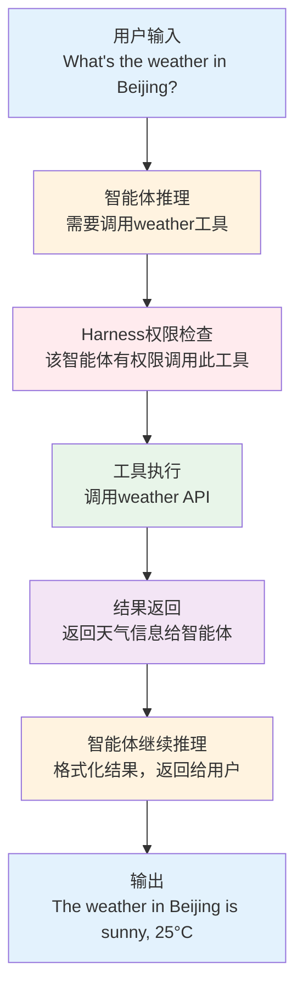

## 1.5 MiniHarness项目介绍

本节介绍MiniHarness项目的设计目标、快速开始方式、核心组件、代码结构和使用指南，帮助读者快速上手这个配套实战项目。

### 1.5.1 项目目标

MiniHarness是本书的配套实战项目，目的是帮助读者从零开始构建一个完整、可运行的Harness系统原型。

其设计原则是：

- **最小完整**：包含一个生产级Harness系统的所有核心概念和模块，但去掉了不必要的复杂性和优化
- **教学友好**：代码简洁、注释充分，易于理解和修改
- **易于扩展**：架构清晰，便于添加新的子系统或替换实现

通过MiniHarness，读者可以：

1. 理解Harness的各个子系统如何协作
2. 学习如何设计和实现工具调用、权限管理、记忆系统等核心组件
3. 有一个真实的基础代码，可以在此基础上构建生产应用

### 1.5.2 快速开始

按以下步骤快速搭建和运行miniharness：

```bash
# 克隆或下载项目
git clone https://github.com/yeasy/harness_engineering_guide
cd lab

# 创建虚拟环境
python3.11 -m venv venv
source venv/bin/activate  # 在Windows上: venv\Scripts\activate

# 安装依赖
pip install -e ".[dev]"

# 运行基本测试
pytest tests/unit/test_core.py -v

# 尝试示例
python examples/simple_agent.py
```

### 1.5.3 技术栈

MiniHarness使用Python 3.11+，选择的原因包括：

（1）**Python的优势**

- 生态完整：包含asyncio、httpx、pydantic等优秀库
- 语法清晰：代码易读易懂，适合教学
- 模型集成：大多数LLM SDK都提供Python版本
- 数据科学友好：便于后续集成向量数据库、指标收集等

（2）**核心依赖**

| 包 | 用途 | 选择理由 |
|---|------|-------|
| `pydantic>=2.0` | 数据验证和序列化 | 类型安全、自动验证、JSON序列化 |
| `httpx` | HTTP客户端 | 同时支持同步和异步 |
| `asyncio` | 异步编程 | Python标准库，充分满足需求 |
| `python-dotenv` | 环境变量管理 | 安全管理API密钥 |
| `anthropic` | Claude API | 作为示例LLM集成 |

（3）**开发依赖**
```python
pytest>=7.0          # 单元测试
pytest-asyncio       # 异步测试
black               # 代码格式化
pylint              # 代码质量检查
mypy                # 类型检查
```

### 1.5.4 项目结构规划

miniharness项目的目录结构如下所示：

- **lab/**
  - pyproject.toml - 项目配置和依赖
  - README.md - 项目说明
  - .env.example - 环境变量示例
  - **mini_harness/** - 源代码目录
    - __init__.py
    - **core/** - 核心接口定义
      - __init__.py
      - agent.py - 智能体基础类
      - message.py - 消息类型定义
      - tool.py - 工具接口
      - event.py - 事件定义
    - **runtime/** - 运行时引擎
      - __init__.py
      - engine.py - 智能体执行循环
      - executor.py - 工具执行器
      - state.py - 状态管理
    - **tools/** - 工具实现
      - __init__.py
      - registry.py - 工具注册表
      - builtin.py - 内置工具示例
      - validators.py - 参数验证
    - **memory/** - 记忆子系统
      - __init__.py
      - storage.py - 记忆存储
      - retriever.py - 记忆检索
      - manager.py - 记忆管理器
    - **models/** - 模型集成
      - __init__.py
      - base.py - 模型基类
      - claude.py - Claude集成
      - validators.py - 输出验证
    - **safety/** - 安全层
      - __init__.py
      - permissions.py - 权限管理
      - audit.py - 审计日志
      - sandbox.py - 执行隔离
    - **observability/** - 可观测性
      - __init__.py
      - logging.py - 日志配置
      - tracing.py - 分布式追踪
      - metrics.py - 性能指标
    - **utils/** - 工具函数
      - __init__.py
      - async_utils.py
      - config.py
  - **tests/** - 测试目录
    - __init__.py
    - **unit/** - 单元测试
      - test_runtime.py
      - test_tools.py
      - test_memory.py
    - **integration/** - 集成测试
      - test_agent_loop.py
    - fixtures.py - 测试夹具
  - **examples/** - 使用示例
    - simple_agent.py - 最简单的智能体
    - weather_agent.py - 天气查询智能体
    - todo_agent.py - 任务管理智能体

### 1.5.5 最终效果预览

完成第2章后，MiniHarness将具备以下能力：

#### 基础智能体

一个简单的智能体可以：


#### 完整的执行流程

以下是一个完整的miniharness执行示例：
```python
from mini_harness.runtime import AgentEngine
from mini_harness.models import ClaudeModel
from mini_harness.tools import ToolRegistry

# 初始化组件
model = ClaudeModel(api_key="sk-...")
tools = ToolRegistry()
tools.register_builtin()

# 创建智能体
engine = AgentEngine(
    model=model,
    tools=tools,
    permissions_level="Ask-first"  # 敏感操作需要审批
)

# 执行任务
result = await engine.run(
    task="Find the weather for Beijing and Tokyo"
)

print(result.output)  # 智能体的最终响应
print(result.execution_trace)  # 执行追踪
```

### 1.5.6 代码示例：项目结构验证

项目初始化后，可以通过以下代码验证安装：
```python
# test_setup.py
import asyncio
from mini_harness.core import Message, MessageType
from mini_harness.tools import ToolRegistry

async def test_basic_setup():
    """验证基本设置"""

    # 测试消息类型
    msg = Message(
        role="user",
        type=MessageType.TEXT,
        content="Hello, Agent"
    )
    assert msg.role == "user"
    assert msg.content == "Hello, Agent"

    # 测试工具注册表
    registry = ToolRegistry()
    assert len(registry.list_tools()) == 0  # 初始为空

    print("Setup verification passed!")

if __name__ == "__main__":
    asyncio.run(test_basic_setup())
```

### 1.5.7 学习路线

MiniHarness在各章中的发展路线：

**第1章**：项目规划和初始化

- 建立项目结构
- 定义核心接口

**第2章**：实现基础脚手架

- 消息系统
- 运行时引擎的基本循环
- 工具注册表

**第3章**：添加设计原则的实现

- 权限管理系统
- 结果验证机制
- 审计日志

**第4章及后续**：逐步完善各子系统

- 完整的工具执行流程
- 记忆管理系统
- 模型集成优化
- 可观测性基础设施

### 1.5.8 如何使用本项目

本小节覆盖快速开始指南、自定义扩展方法和相关学习资源。

#### 快速开始

按以下步骤快速搭建和运行miniharness：
```bash
# 克隆或下载项目
git clone https://github.com/yeasy/harness_engineering_guide
cd lab

# 创建虚拟环境
python3.11 -m venv venv
source venv/bin/activate  # 在Windows上: venv\Scripts\activate

# 安装依赖
pip install -e ".[dev]"

# 运行基本测试
pytest tests/unit/test_core.py -v

# 尝试示例
python examples/simple_agent.py
```

#### 自定义和扩展

MiniHarness的设计允许灵活的自定义：
```python
# 示例：注册自定义工具
from mini_harness.tools import Tool
from mini_harness.tools import ToolRegistry

class CustomTool(Tool):
    """自定义工具实现"""

    def __init__(self):
        super().__init__(
            name="custom_operation",
            description="执行自定义操作",
            input_schema={
                "type": "object",
                "properties": {
                    "param": {"type": "string"}
                },
                "required": ["param"]
            }
        )

    async def execute(self, **kwargs) -> str:
        param = kwargs["param"]
        # 自定义逻辑
        return f"Custom result for {param}"

# 注册工具
registry = ToolRegistry()
registry.register(CustomTool())
```

### 1.5.9 相关资源

- **完整源代码**：随书提供，也可在GitHub仓库获取
- **API文档**：包含在项目的docs/目录
- **示例应用**：examples/目录包含真实场景的使用案例
- **故障排查**：常见问题的解决方案见TROUBLESHOOTING.md

通过MiniHarness项目的逐步构建，读者将逐步理解Harness工程的各个方面，并最终掌握构建生产级AI Agent系统的能力。
