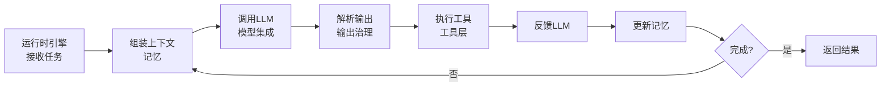
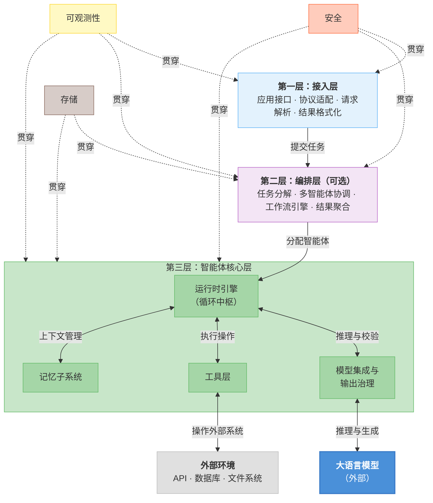
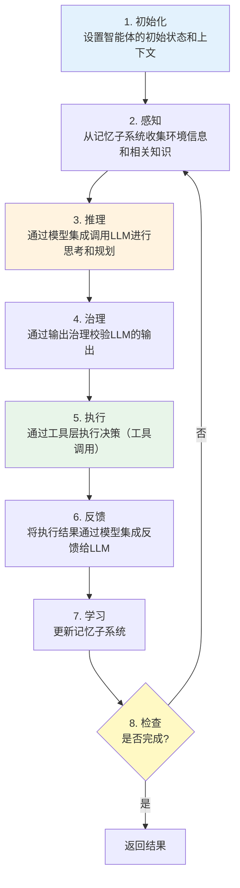
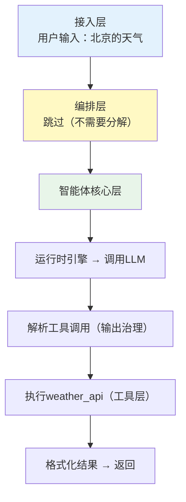
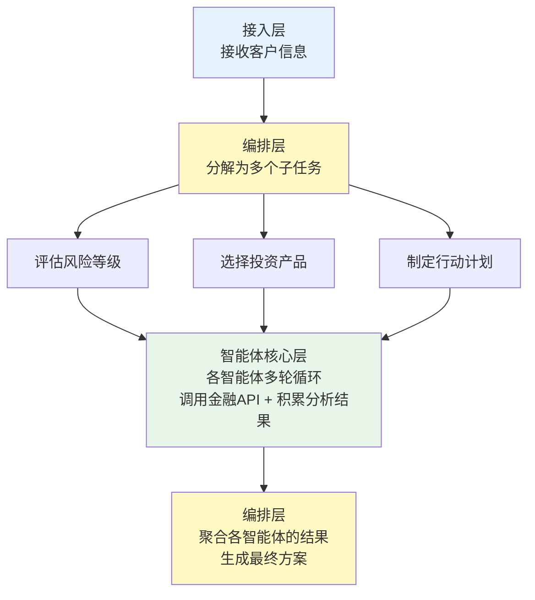
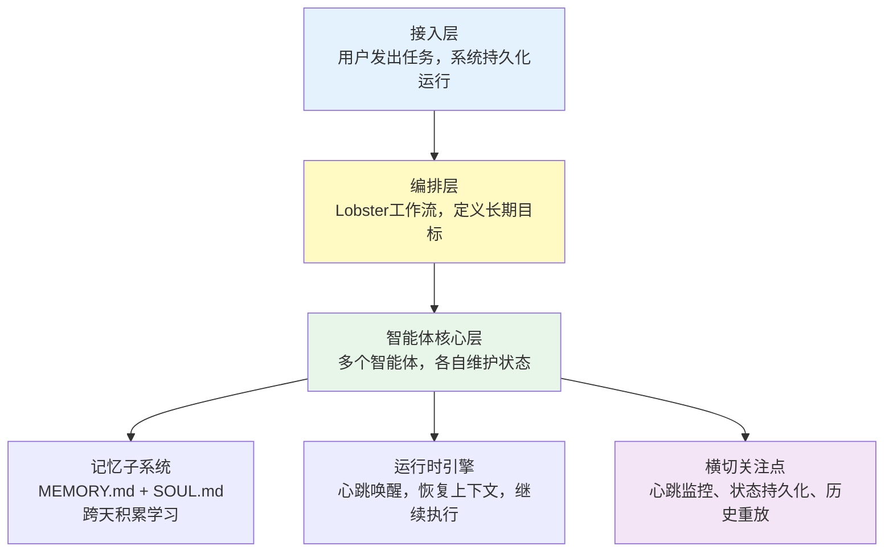

## 2.1 通用参考架构

本节介绍Harness系统的通用参考架构，包括其设计目标、核心特性、分层结构、关键决策点和实现变体，为后续各章的深入讨论提供架构基础。

### 2.1.1 为什么需要参考架构

在第一章中，我们讨论了Harness系统的五大核心子系统和两大基础保障。但从架构的角度看，仅仅列举子系统是不够的。我们需要一个能够显示这些子系统如何组织、如何交互的架构模型。

参考架构的作用是：

- **提供设计指引**：新的Harness系统可以参照这个架构进行设计
- **便于比较**：不同的实现方案可以在统一的框架下进行对比
- **支持演进**：当系统需要升级或扩展时，清晰的结构指导我们如何进行改动

本节提出的参考架构，是基于行业最佳实践的抽象。它既适用于简单的单智能体系统，也适用于复杂的多智能体协作系统。

### 2.1.2 三层 + 横切关注点参考架构

第一章中，我们看到运行时引擎是Harness的心脏，它与工具层、记忆子系统、输出治理、编排引擎四个子系统形成星型拓扑，同时安全与可观测性贯穿所有子系统。

这个观察揭示了一个关键的架构事实：**模型调用、工具执行、记忆更新并非各自独立的层级，而是在运行时引擎的同一个循环中交替发生的**。一个典型的智能体步骤如下：



在这个循环中，模型调用和工具执行是**同一层级内的交替操作**，而非上下层的调用关系。因此，将它们人为分到不同层级会割裂这种内在联系。

基于这一认识，Harness系统的参考架构采用**三层 + 横切关注点**的结构：


图2-1 Harness通用参考架构（三层 + 横切关注点）

#### 与第一章子系统模型的对应关系

这个架构与第一章定义的子系统模型完全一致：

| 第一章子系统 | 参考架构位置 |
|------------|------------|
| 运行时引擎 | 智能体核心层（循环中枢） |
| 工具层 | 智能体核心层 |
| 记忆子系统 | 智能体核心层 |
| 模型集成与输出治理 | 智能体核心层 |
| 编排引擎 | 编排层 |
| 安全 | 横切关注点 |
| 可观测性 | 横切关注点 |

与第一章一致，大语言模型和外部环境（API、数据库、文件系统）是Harness系统的**外部实体**，不属于Harness本身。模型集成通过标准接口与LLM交互，工具层通过适配器与外部环境交互。

接入层是第一章未展开讨论的部分——它负责Harness系统与外部世界的对接，本身不包含智能体逻辑。

#### 第一层：接入层

**职责**：与最终用户或上层系统的交互。

接入层定义了Harness系统对外的接口。它处理：

- **请求接收**：从用户、API客户端或其他系统接收任务请求
- **协议适配**：支持HTTP、WebSocket、CLI等不同接入方式
- **请求解析**：将请求解析为系统能够理解的任务定义
- **结果格式化**：将智能体的执行结果格式化为用户期望的形式
- **错误呈现**：以友好的方式呈现执行过程中发生的错误

接入层的设计应该尽可能简单，主要工作是转发——真正的复杂逻辑应该在下层实现。

下面的伪代码展示了接入层的典型实现模式。注意它只做三件事：解析请求、转发给下层、格式化响应。这种“薄层”设计确保接入层本身不会成为系统的复杂性来源。

```python
# 伪代码示例：接入层接口
class ApplicationInterface:
    async def submit_task(self, request: TaskRequest) -> TaskResponse:
        """接收用户任务。

        整个方法的流程非常直观：
        1. 把用户的原始请求（可能是HTTP JSON、CLI命令等）解析为统一的Task对象
        2. 交给编排层（或智能体核心层）去执行
        3. 把执行结果转换为用户能理解的响应格式
        """
        # 第一步：解析和验证请求
        # 例如，从HTTP请求体中提取任务描述、参数、用户身份等
        task = self._parse_request(request)

        # 第二步：提交给编排层（或直接提交给智能体核心层）
        # 接入层不关心任务是如何被执行的——这是下层的职责
        result = await self.orchestrator.execute(task)

        # 第三步：格式化响应
        # 例如，将内部的Result对象转换为HTTP JSON响应
        return self._format_response(result)
```

> **读者提示**：上面的 `async def` 表示这是一个异步方法——执行时不会阻塞整个系统，可以同时处理多个用户请求。在后续章节中，我们会看到异步编程在Harness系统中无处不在。

#### 第二层：编排层

**职责**：处理复杂任务的分解和多智能体的协作。

编排层是**可选的**。对于简单的单智能体系统，任务可以直接从接入层传递到智能体核心层。但当任务过于复杂，无法由单个智能体独立完成时，编排层会：

- **任务分解**：将复杂任务分解为多个子任务
- **智能体选择**：根据子任务特点，选择合适的智能体（或创建专业化的智能体）
- **执行顺序**：确定任务的执行顺序，处理依赖关系
- **结果聚合**：收集各个智能体的执行结果，进行验证和合并
- **故障处理**：当某个智能体失败时，决定是重试、切换智能体、还是降级处理

下面的伪代码展示了编排层的核心决策逻辑。它首先判断任务是否足够简单（可以直接交给一个智能体），如果不是，就将任务分解并分配给多个智能体并发执行。这个“先判断、再分解、最后聚合”的模式，是编排层最基本的工作流程。

```python
# 伪代码示例：编排层逻辑
class OrchestrationEngine:
    async def execute(self, task: Task) -> Result:
        # 关键决策点：任务是否需要分解？
        # 比如"查天气"不需要分解，但"制定全年财务计划"需要拆成多个子任务
        if self._is_simple_task(task):
            return await self._run_single_agent(task)

        # 任务分解：将复杂任务拆成多个子任务
        # 例如"制定财务计划" → ["评估风险", "选择产品", "制定行动计划"]
        subtasks = await self.decompose(task)

        # 并发执行：asyncio.gather 可以同时启动多个子任务
        # 每个子任务由一个独立的智能体处理
        results = await asyncio.gather(*[
            self._execute_subtask(st) for st in subtasks
        ])

        # 聚合结果：将各智能体的输出合并为最终答案
        return await self._aggregate_results(results)

    async def _execute_subtask(self, subtask: Task) -> Result:
        # 根据子任务类型选择合适的智能体
        # 例如，风险评估可能需要一个金融专家智能体
        agent = self._select_agent(subtask)
        try:
            return await agent.run(subtask)
        except Exception as e:
            # 故障处理：可能是重试、换一个智能体、或返回降级结果
            return await self._handle_failure(subtask, e)
```

> **读者提示**：`asyncio.gather` 是 Python 异步编程中的并发原语——它接收多个协程（coroutine），同时启动它们，然后等待所有协程完成后返回结果列表。这里用它来并行执行多个子任务，而不是逐个串行执行。

#### 第三层：智能体核心层

**职责**：单个智能体的完整执行，包含运行时引擎、模型集成、工具调用和记忆管理。

这是Harness系统中最核心的一层，也是与第一章星型拓扑直接对应的部分。智能体核心层包含四个紧密协作的子系统：

**a) 运行时引擎（Runtime Engine）——循环中枢**

运行时引擎是智能体核心层的中枢，协调其他三个子系统。一个典型的执行循环如下：


注意步骤3-7中，运行时引擎在**同一个循环内**交替调用模型集成、输出治理、工具层和记忆子系统。这正是将它们放在同一层而非分层的原因。

**b) 模型集成与输出治理（Model Integration & Output Governance）**

模型集成负责与LLM的交互：

- 支持多种LLM（Claude、GPT、开源模型等）
- 管理提示词和系统消息
- 处理token限制和成本优化
- 支持流式和批量调用

输出治理负责处理LLM输出中最不确定的部分：

- **格式校正**：如果LLM没有返回期望的JSON格式，尝试修复
- **语义验证**：检查工具调用的参数是否合理（比如，是否调用了不存在的工具）
- **安全检查**：检查输出是否包含有害内容或违反约束
- **置信度评估**：评估LLM对其输出的置信度，低置信度时触发重试或人工审批

为什么需要输出治理？因为LLM的输出是不可预测的。即使你在提示词中要求“请返回JSON格式”，LLM也可能返回一段Markdown、多余的解释文字，或者格式不完整的JSON。输出治理就是应对这种不确定性的防线。

下面的伪代码展示了输出治理的四步防御流程——从格式解析到安全检查，逐层过滤不合格的输出：

```python
# 伪代码示例：输出治理
class OutputGovernance:
    async def validate_and_fix(self, llm_output: str) -> ParsedOutput:
        """对LLM的原始输出进行校验和修复。

        为什么需要这个方法？
        LLM返回的是自然语言文本，即使要求返回JSON，也可能：
        - 格式错误（缺少引号、多余逗号）
        - 调用了不存在的工具
        - 包含不安全的操作指令
        这个方法通过四个步骤，把不可靠的文本转化为可信的结构化数据。
        """
        # 第一步：尝试将文本解析为JSON
        try:
            parsed = self._parse_json(llm_output)
        except JSONDecodeError:
            # 第二步：解析失败——让LLM自己修复格式错误
            # 这是一种常见的"自愈"策略：把出错的输出再发回给LLM，
            # 要求它修正格式问题
            llm_output = await self._ask_llm_to_fix(llm_output)
            parsed = self._parse_json(llm_output)

        # 第三步：语义验证——格式正确不代表内容正确
        # 比如LLM可能调用了一个系统中不存在的工具，
        # 或者传入了明显不合理的参数（如负数的文件大小）
        if not self._is_semantically_valid(parsed):
            raise ValidationError("Semantic validation failed")

        # 第四步：安全检查——即使内容合理，也要确保没有安全隐患
        # 比如LLM是否试图执行 "rm -rf /" 这样的危险命令
        if not await self._security_check(parsed):
            raise SecurityError("Output failed security check")

        return parsed
```

> **读者提示**：上面的 `try...except` 是 Python 的异常处理机制。`JSONDecodeError` 表示文本不是合法的 JSON 格式。当捕获到这个异常时，代码不会崩溃，而是尝试通过 `_ask_llm_to_fix` 方法让 LLM 修正自己的输出。这种“先尝试、失败后修复”的模式在 Harness 系统中非常常见。

**c) 工具层（Tool Layer）**

工具层是智能体与外部世界的桥梁。它管理：

- 工具的注册和发现
- 参数验证和类型检查
- 工具执行的隔离和超时控制
- 错误处理和结果标准化

**d) 记忆子系统（Memory System）**

记忆允许智能体跨步骤、跨会话地保持上下文。按生命周期分为三层：

- 工作记忆（当前对话的上下文窗口，受LLM上下文长度限制）
- 短期记忆（会话级摘要和临时状态，生命周期数小时到数周）
- 长期记忆（持久化的知识和学习，通常借助向量索引支持语义检索）

#### 横切关注点

横切关注点贯穿所有层级，提供非业务逻辑的技术支撑。

**a) 安全（Security）**

- 权限管理和授权
- 敏感操作的隔离和沙箱
- 输入验证和防注入
- 审计日志记录

**b) 可观测性（Observability）**

- 分布式追踪，跟踪请求的完整执行路径
- 结构化日志，便于搜索和分析
- 性能指标收集
- 错误告警和趋势分析

**c) 存储（Storage）**

- 长期记忆的持久化（如向量数据库）
- 审计日志的存储和查询
- 任务状态和执行历史的保存
- 缓存层，用于加速频繁访问的数据

### 2.1.3 层间通信的设计原则

一个清晰的架构不仅要定义每层的职责，更要定义层间的通信方式。

#### 向下的调用

上层调用下层时，应该使用 **明确的、类型安全的接口**。所谓“类型安全”，是指每个方法的输入参数和返回值都有明确的类型声明，这样在开发阶段就能发现参数传错的问题，而不是等到运行时才报错。

下面定义了两个接口——编排层调用 `AgentCore.run()`，接入层调用 `Orchestrator.execute()`。注意它们都接收 `Task` 类型、返回 `Result` 类型，保持了统一的调用契约：

```python
# 清晰的接口定义
class AgentCore:
    async def run(self, task: Task) -> Result:
        """执行单个智能体任务。

        这是编排层调用智能体核心层的入口。
        Task 包含任务描述、参数、上下文等信息；
        Result 包含执行结果、状态码、耗时等信息。
        """
        pass  # 具体实现在第4章运行时引擎中展开

class Orchestrator:
    async def execute(self, task: Task) -> Result:
        """编排多智能体任务。

        这是接入层调用编排层的入口。
        对于简单任务，编排层可能直接转发给AgentCore；
        对于复杂任务，会先分解再分配。
        """
        pass  # 具体实现在第8章编排引擎中展开
```

> **读者提示**：`pass` 是 Python 中的占位符，表示“这里还没有写具体实现”。在架构设计阶段，我们先定义接口的签名（方法名、参数类型、返回类型），具体实现留给后续章节。这种“先定义接口、后实现逻辑”的方法叫做**面向接口编程**，是软件工程中降低模块耦合度的重要手段。

#### 向上的反馈

下层向上层报告时，应该使用 **事件或回调机制**，而不是异常（异常应该只在真正的错误情况下使用）。

为什么用事件而不是异常？打个比方：异常就像火警警报，只在出了大问题时才响；而事件更像日常的工作汇报——“我开始执行了”、“我完成了第一步”、“我遇到了一个小问题但已经自行解决”。这些信息对于监控和调试系统至关重要，但它们不是“错误”，不适合用异常来表示。

下面的代码展示了如何通过事件机制实现这种“汇报”：

```python
@dataclass  # @dataclass 是Python的装饰器，自动为类生成构造方法和其他常用方法
class ExecutionEvent:
    """表示系统中发生的一个事件。

    所有层都可以发出事件，上层（或横切关注点中的可观测性模块）
    可以订阅这些事件来监控系统运行状态。
    """
    timestamp: datetime    # 事件发生的时间
    level: str             # 严重程度："info"（信息）, "warning"（警告）, "error"（错误）
    source: str            # 事件来源，如 "AgentCore", "ToolLayer"
    message: str           # 人类可读的描述
    context: dict          # 附加信息，如 {"task_id": "abc123", "tool_name": "search"}

class AgentCore:
    def __init__(self, event_handler: Callable[[ExecutionEvent], None]):
        """构造方法接收一个事件处理函数（回调函数）。

        Callable[[ExecutionEvent], None] 的含义是：
        一个接收 ExecutionEvent 参数、不返回值的函数。
        这个函数由上层提供——上层决定收到事件后做什么
        （比如写日志、发告警、更新UI等），
        而下层只负责发出事件，不关心上层如何处理。
        """
        self.event_handler = event_handler

    async def run(self, task: Task):
        # 在开始执行时，发出一个"任务开始"事件
        self.event_handler(
            ExecutionEvent(
                timestamp=datetime.now(),
                level="info",
                source="AgentCore",
                message="Task started",
                context={"task_id": task.id}
            )
        )
        # ... 后续的执行逻辑 ...
```

> **读者提示**：这里的 `event_handler` 是一个**回调函数**——它由调用方（上层）提供，在特定事件发生时被调用。这种模式的好处是：智能体核心层不需要知道上层的具体实现（是写文件日志？还是发送到监控系统？），只需要调用 `event_handler` 即可。这就实现了层与层之间的**解耦**。

#### 核心层内部的协作

智能体核心层内部，运行时引擎与其他子系统之间采用星型拓扑通信，正如第一章所述。这种设计意味着：

- 运行时引擎是唯一的协调者，其他子系统不直接互相调用
- 每个子系统通过明确定义的接口与运行时引擎交互
- 数据流始终经过运行时引擎中转，便于追踪和调试

### 2.1.4 Claude Code的模块化架构

Claude Code针对任务型应用进行了优化，其架构可以映射到参考架构。下面的映射表展示了Claude Code的各个模块分别对应参考架构的哪一层。如果你还不熟悉Claude Code的内部组件，只需关注左右两列的对应关系——它说明了参考架构的每一层在真实系统中是如何体现的：

| Claude Code架构 | 参考架构映射 |
|---|---|
| API入口 / CLI界面 | 接入层 |
| Coordinator（多智能体编排） | 编排层 |
| QueryEngine（异步循环） | 智能体核心层（运行时引擎） |
| 24+内置工具 | 智能体核心层（工具层） |
| 系统提示词缓存 | 智能体核心层（记忆子系统） |
| 输出验证 | 智能体核心层（输出治理） |
| 权限检查 + 追踪系统 | 横切关注点（安全 + 可观测性） |

Claude Code的特点：

- **流式优化**：支持流式工具执行，提高响应速度
- **类型安全**：TypeScript确保工具接口的类型安全
- **精细控制**：40+特性门控，提供细粒度的行为控制
- **核心层紧耦合**：QueryEngine在同一循环中完成模型调用、输出解析、工具执行和上下文管理，体现了智能体核心层的设计理念

### 2.1.5 OpenClaw的架构映射

OpenClaw是一个自驱型智能体系统，与Claude Code的“用户发起、快速响应”模式不同，OpenClaw的智能体可以长期自主运行。它的架构同样可以映射到参考架构，但在编排和记忆方面有明显不同的侧重点：

| OpenClaw架构 | 参考架构映射 |
|------|------|
| Gateway（长连接管理） | 接入层 |
| Lobster（工作流引擎） | 编排层 |
| 智能体执行循环 | 智能体核心层（运行时引擎） |
| ClawHub（技能注册与发现） | 智能体核心层（工具层） |
| MEMORY.md（记忆持久化） | 智能体核心层（记忆子系统） |
| 模型选择与约束 | 智能体核心层（模型集成与输出治理） |
| SOUL.md（行为约束）+ 三级权限 | 横切关注点（安全） |
| 心跳监控 + 日志系统 | 横切关注点（可观测性） |

OpenClaw的特点：

- **五平面设计**：数据平面、控制平面、管理平面、隔离平面、监控平面——这些平面与参考架构的横切关注点有很好的对应关系
- **强大的编排**：Lobster工作流引擎支持YAML定义的复杂流程
- **持久化智能体**：通过心跳机制，智能体可以长期运行和学习

### 2.1.6 架构在不同场景中的适配

虽然参考架构是通用的，但在不同的应用场景中，各层的重要性和复杂度会有所不同。下面通过三个由简到繁的场景，帮助读者直观理解架构各层在实际运行时是如何参与工作的。

#### 场景1：简单的单任务智能体

比如，一个“查询天气”的智能体：


在这个场景中，编排层完全跳过，智能体核心层只需一轮循环。重点应该放在确保工具调用的正确性。

#### 场景2：复杂的多步工作流

比如，“为客户创建一个完整的财务计划”：


在这个场景中，编排层变得至关重要——它需要确保各子任务的顺序、依赖关系和结果验证。

#### 场景3：多智能体长期协作

比如，OpenClaw的一个典型应用场景：


在这个场景中，记忆子系统和横切关注点中的存储变得至关重要，因为智能体需要在相当长的时间内维持一致的行为。

### 2.1.7 总结

三层 + 横切关注点的参考架构提供了一个通用的、可扩展的Harness系统设计框架。相比传统的多层线性模型，这个架构有三个关键优势：

1. **忠实反映真实执行流**：模型调用、工具执行、记忆更新在运行时引擎的同一循环中交替发生，将它们放在同一层（智能体核心层）符合实际
2. **与第一章子系统模型一致**：五大核心子系统和两大基础保障的划分，自然映射到三层结构和横切关注点
3. **灵活适配不同场景**：编排层可选，简单系统可以跳过；横切关注点按需启用，避免过度设计

通过这个框架：

- 新设计师可以快速理解Harness系统的全景
- 不同的实现可以在相同的抽象层次上进行比较
- 系统的演进和扩展有了清晰的方向

在接下来的章节中，我们将逐层深入，讨论每一层的具体设计和实现细节。
