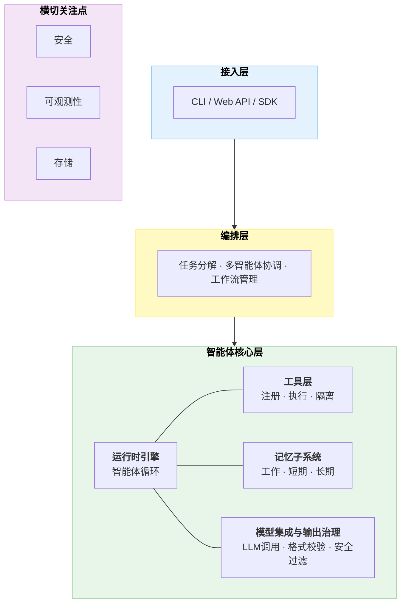
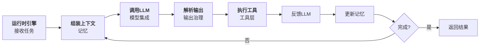
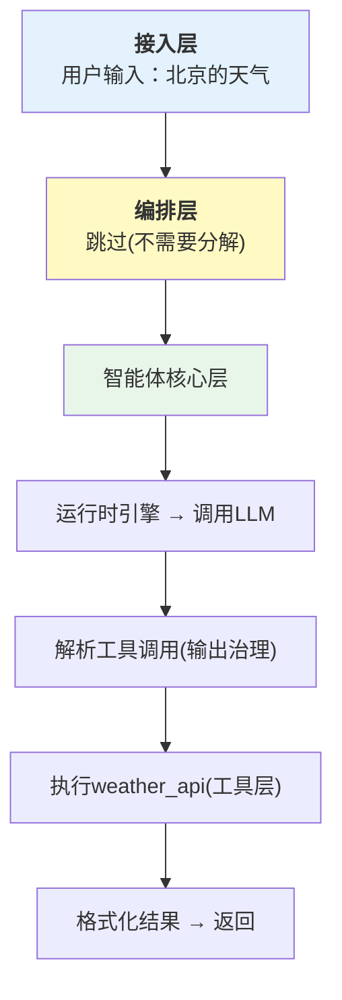
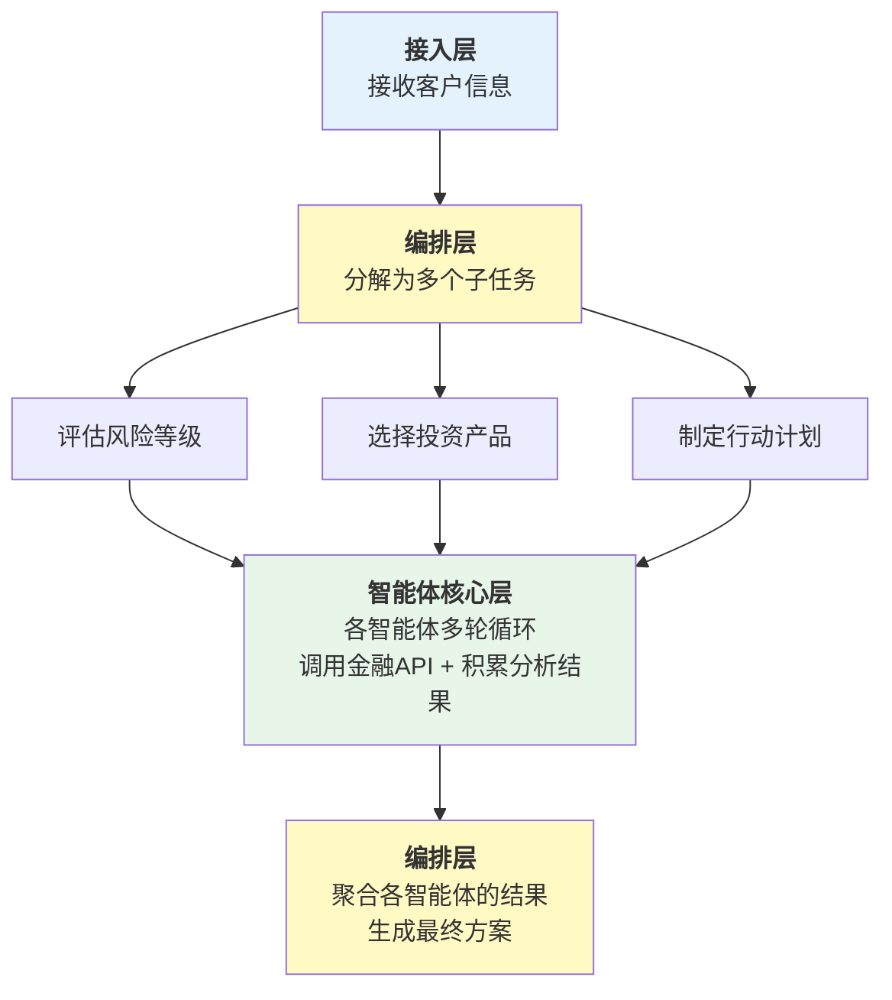
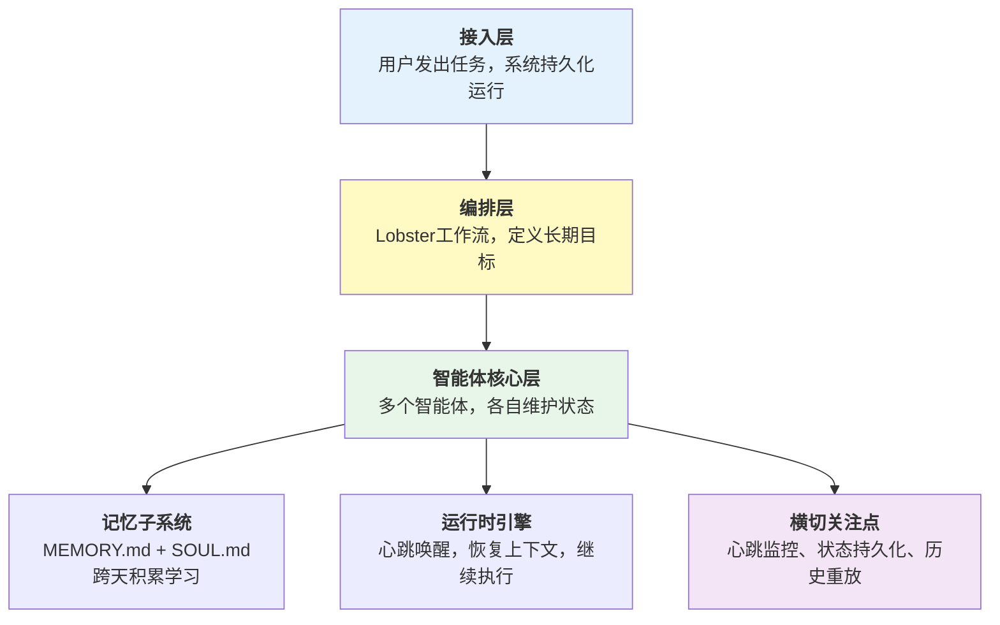

## 2.1 通用参考架构

本节介绍Harness系统的通用参考架构，包括其设计目标、核心特性、分层结构、关键决策点和实现变体，为后续各章的深入讨论提供架构基础。

### 2.1.1 为什么需要参考架构

在第一章中，我们讨论了Harness系统的五大核心子系统和两大基础保障。但从架构的角度看，仅仅列举子系统是不够的。我们需要一个能够显示这些子系统如何组织、如何交互的架构模型。

参考架构的作用是：

- **提供设计指引**：新的Harness系统可以参照这个架构进行设计
- **便于比较**：不同的实现方案可以在统一的框架下进行对比
- **支持演进**：当系统需要升级或扩展时，清晰的结构指导我们如何进行改动

本节提出的参考架构，是基于行业最佳实践的抽象。它既适用于简单的单智能体系统，也适用于复杂的多智能体协作系统。

### 2.1.2 三层 + 横切关注点参考架构

基于第一章的子系统分析，本书提出一个 **三层 + 横切关注点** 的参考架构。三层自上而下分别是：

1. **接入层（Access Layer）**：系统与外部世界的边界，负责接收用户请求、协议转换和响应格式化。CLI、Web API、SDK 都属于接入层的实现形式。
2. **编排层（Orchestration Layer）**：负责复杂任务的分解、多智能体的协调和工作流管理。对于简单的单步任务，编排层可以直接透传；对于需要多个智能体协作的复杂任务，编排层负责分配子任务、管理依赖和聚合结果。
3. **智能体核心层（Agent Core Layer）**：Harness 的核心执行引擎，包含运行时引擎、工具层、记忆子系统和模型集成与输出治理四个子系统。它们在运行时引擎的同一循环中交替协作，而非分层调用。

三层之外，**安全、可观测性和存储** 作为横切关注点贯穿所有层级。

以下架构图展示了三层结构和横切关注点的全景：



图 2-1：三层 + 横切关注点参考架构全景

下面逐层展开。

#### 接入层

接入层是用户与 Harness 系统交互的入口。它的职责相对简单但至关重要：

- **协议适配**：将不同来源的请求（CLI 命令、HTTP API、WebSocket 消息等）统一转换为内部任务格式
- **身份认证**：验证请求方身份，为后续的权限检查提供基础
- **响应格式化**：将内部执行结果转换为用户期望的输出格式（流式文本、JSON 等）

接入层的设计原则是“薄而稳定”——它不应包含业务逻辑，只做格式转换和路由分发。

#### 编排层

编排层处于接入层和智能体核心层之间，负责任务级别的调度：

- **任务分解**：将复杂任务拆分为可独立执行的子任务
- **依赖管理**：识别子任务间的依赖关系，构建执行 DAG
- **多智能体协调**：为每个子任务分配合适的智能体，管理智能体间的通信
- **结果聚合**：收集各子任务的结果，合并为最终输出

对于简单任务（如单轮问答），编排层可以直接透传请求到核心层，不做额外处理。

#### 智能体核心层

智能体核心层是 Harness 的心脏。第一章中，我们看到运行时引擎、工具层、记忆子系统、输出治理这四个核心子系统形成星型拓扑。

这里有一个关键的架构事实：**模型调用、工具执行、记忆更新并非各自独立的层级，而是在运行时引擎的同一个循环中交替发生的**。一个典型的智能体步骤如下：



图 2-7：运行时引擎的七步执行流程

注意步骤 3-7 中，运行时引擎在 **同一个循环内** 交替调用模型集成、输出治理、工具层和记忆子系统。这正是将它们放在同一层而非分层的原因。

核心层的四个子系统各司其职。

**a) 运行时引擎（Runtime Engine）**

运行时引擎是核心层的协调者，驱动上述七步循环。它负责：

- 管理智能体循环的生命周期（启动、暂停、恢复、终止）
- 维护消息类型系统和执行状态
- 协调其他三个子系统的调用顺序
- 处理错误恢复和漂移检测

**b) 模型集成与输出治理（Model Integration & Output Governance）**

模型集成负责与LLM的交互：

- 支持多种LLM（Claude、GPT、开源模型等）
- 管理提示词和系统消息
- 处理token限制和成本优化
- 支持流式和批量调用

输出治理负责处理LLM输出中最不确定的部分：

- **格式校正**：如果LLM没有返回期望的JSON格式，尝试修复
- **语义验证**：检查工具调用的参数是否合理（比如，是否调用了不存在的工具）
- **安全检查**：检查输出是否包含有害内容或违反约束
- **置信度评估**：评估LLM对其输出的置信度，低置信度时触发重试或人工审批

为什么需要输出治理？因为LLM的输出是不可预测的。即使你在提示词中要求“请返回JSON格式”，LLM也可能返回一段Markdown、多余的解释文字，或者格式不完整的JSON。输出治理就是应对这种不确定性的防线。

下面的伪代码展示了输出治理的四步防御流程——从格式解析到安全检查，逐层过滤不合格的输出：

```python
# 伪代码示例：输出治理
class OutputGovernance:
    async def validate_and_fix(self, llm_output: str) -> ParsedOutput:
        """对LLM的原始输出进行校验和修复。

        为什么需要这个方法？
        LLM返回的是自然语言文本，即使要求返回JSON，也可能：
        - 格式错误(缺少引号、多余逗号)
        - 调用了不存在的工具
        - 包含不安全的操作指令
        这个方法通过四个步骤，把不可靠的文本转化为可信的结构化数据。
        """
        # 第一步：尝试将文本解析为JSON
        try:
            parsed = self._parse_json(llm_output)
        except JSONDecodeError:
            # 第二步：解析失败——让LLM自己修复格式错误
            # 这是一种常见的"自愈"策略：把出错的输出再发回给LLM，
            # 要求它修正格式问题
            llm_output = await self._ask_llm_to_fix(llm_output)
            parsed = self._parse_json(llm_output)

        # 第三步：语义验证——格式正确不代表内容正确
        # 比如LLM可能调用了一个系统中不存在的工具，
        # 或者传入了明显不合理的参数(如负数的文件大小)
        if not self._is_semantically_valid(parsed):
            raise ValidationError("Semantic validation failed")

        # 第四步：安全检查——即使内容合理，也要确保没有安全隐患
        # 比如LLM是否试图执行 "rm -rf /" 这样的危险命令
        if not await self._security_check(parsed):
            raise SecurityError("Output failed security check")

        return parsed
```

**c) 工具层（Tool Layer）**

工具层是智能体与外部世界的桥梁。它管理：

- 工具的注册和发现
- 参数验证和类型检查
- 工具执行的隔离和超时控制
- 错误处理和结果标准化

**d) 记忆子系统（Memory System）**

记忆允许智能体跨步骤、跨会话地保持上下文。按生命周期分为三层：

- 工作记忆（当前对话的上下文窗口，受LLM上下文长度限制）
- 短期记忆（会话级摘要和临时状态，生命周期数小时到数周）
- 长期记忆（持久化的知识和学习，通常借助向量索引支持语义检索）

#### 横切关注点

横切关注点贯穿所有层级，提供非业务逻辑的技术支撑。

**a) 安全（Security）**

- 权限管理和授权
- 敏感操作的隔离和沙箱
- 输入验证和防注入
- 审计日志记录

**b) 可观测性（Observability）**

- 分布式追踪，跟踪请求的完整执行路径
- 结构化日志，便于搜索和分析
- 性能指标收集
- 错误告警和趋势分析

**c) 存储（Storage）**

- 长期记忆的持久化（如向量数据库）
- 审计日志的存储和查询
- 任务状态和执行历史的保存
- 缓存层，用于加速频繁访问的数据

### 2.1.3 层间通信的设计原则

一个清晰的架构不仅要定义每层的职责，更要定义层间的通信方式。

#### 向下的调用

上层调用下层时，应该使用 **明确的、类型安全的接口**。所谓“类型安全”，是指每个方法的输入参数和返回值都有明确的类型声明，这样在开发阶段就能发现参数传错的问题，而不是等到运行时才报错。

下面定义了两个接口——编排层调用 `AgentCore.run()`，接入层调用 `Orchestrator.execute()`。注意它们都接收 `Task` 类型、返回 `Result` 类型，保持了统一的调用契约：

```python
# 清晰的接口定义
class AgentCore:
    async def run(self, task: Task) -> Result:
        """执行单个智能体任务。

        这是编排层调用智能体核心层的入口。
        Task 包含任务描述、参数、上下文等信息；
        Result 包含执行结果、状态码、耗时等信息。
        """
        pass  # 具体实现在第4章运行时引擎中展开

class Orchestrator:
    async def execute(self, task: Task) -> Result:
        """编排多智能体任务。

        这是接入层调用编排层的入口。
        对于简单任务，编排层可能直接转发给AgentCore；
        对于复杂任务，会先分解再分配。
        """
        pass  # 具体实现在第8章编排引擎中展开
```

#### 向上的反馈

下层向上层报告时，应该使用 **事件或回调机制**，而不是异常（异常应该只在真正的错误情况下使用）。

为什么用事件而不是异常？打个比方：异常就像火警警报，只在出了大问题时才响；而事件更像日常的工作汇报——“我开始执行了”、“我完成了第一步”、“我遇到了一个小问题但已经自行解决”。这些信息对于监控和调试系统至关重要，但它们不是“错误”，不适合用异常来表示。

下面的代码展示了如何通过事件机制实现这种“汇报”：

```python
@dataclass  # @dataclass 是Python的装饰器，自动为类生成构造方法和其他常用方法
class ExecutionEvent:
    """表示系统中发生的一个事件。

    所有层都可以发出事件，上层(或横切关注点中的可观测性模块)
    可以订阅这些事件来监控系统运行状态。
    """
    timestamp: datetime    # 事件发生的时间
    level: str             # 严重程度："info"(信息), "warning"(警告), "error"(错误)
    source: str            # 事件来源，如 "AgentCore", "ToolLayer"
    message: str           # 人类可读的描述
    context: dict          # 附加信息，如 {"task_id": "abc123", "tool_name": "search"}

class AgentCore:
    def __init__(self, event_handler: Callable[[ExecutionEvent], None]):
        """构造方法接收一个事件处理函数(回调函数)。

        Callable[[ExecutionEvent], None] 的含义是：
        一个接收 ExecutionEvent 参数、不返回值的函数。
        这个函数由上层提供——上层决定收到事件后做什么
        (比如写日志、发告警、更新UI等)，
        而下层只负责发出事件，不关心上层如何处理。
        """
        self.event_handler = event_handler

    async def run(self, task: Task):
        # 在开始执行时，发出一个"任务开始"事件
        self.event_handler(
            ExecutionEvent(
                timestamp=datetime.now(),
                level="info",
                source="AgentCore",
                message="Task started",
                context={"task_id": task.id}
            )
        )
        # ... 后续的执行逻辑 ...
```

#### 核心层内部的协作

智能体核心层内部，运行时引擎与其他子系统之间采用星型拓扑通信，正如第一章所述。这种设计意味着：

- 运行时引擎是唯一的协调者，其他子系统不直接互相调用
- 每个子系统通过明确定义的接口与运行时引擎交互
- 数据流始终经过运行时引擎中转，便于追踪和调试

### 2.1.4 OpenAI Codex的性能型架构

OpenAI Codex 以 Rust 为核心语言（占比约 95%），围绕性能和系统级安全构建了完整的 Harness 架构。其组件到参考架构的映射如下：

| Codex 架构 | 参考架构映射 |
|---|---|
| CLI / TUI / Headless 三种入口 + MCP Server | 接入层 |
| Subagent 层级委派（支持 3+ 层深度） | 编排层 |
| codex-core（智能体循环） | 智能体核心层（运行时引擎） |
| skills / core-skills 模块 + MCP 工具集成 | 智能体核心层（工具层） |
| SQLite 持久化记忆 + AGENTS.md 项目文档 | 智能体核心层（记忆子系统） |
| execpolicy（Starlark 策略引擎） | 智能体核心层（输出治理） |
| 平台原生沙箱（Bubblewrap + seccomp / sandbox-exec） | 横切关注点（安全） |
| OpenTelemetry 原生集成 | 横切关注点（可观测性） |

Codex 的特点：

- **双层安全模型**：execpolicy 策略引擎控制智能体”可以尝试什么”，平台原生沙箱控制”能做什么”，两层独立运作形成纵深防御
- **线性成本的上下文管理**：通过提示缓存和异步上下文压缩，将推理成本从对话长度的二次增长降为线性增长
- **仓库即上下文**：以代码仓库本身作为智能体的首要上下文来源，通过 AGENTS.md 和分层目录结构实现确定性、可版本控制的智能体行为
- **60+ Cargo Crate 的模块化**：每个子系统对应独立的 Rust crate，通过 trait 定义清晰的模块边界

### 2.1.5 Claude Code的任务型架构

Claude Code 针对任务型应用进行了优化，其架构可以映射到参考架构：

| Claude Code 架构 | 参考架构映射 |
|---|---|
| API入口 / CLI界面 | 接入层 |
| Coordinator（多智能体编排） | 编排层 |
| QueryEngine（异步循环） | 智能体核心层（运行时引擎） |
| 24+ 内置工具 | 智能体核心层（工具层） |
| 系统提示词缓存 | 智能体核心层（记忆子系统） |
| 输出验证 | 智能体核心层（输出治理） |
| 权限检查 + 追踪系统 | 横切关注点（安全 + 可观测性） |

Claude Code 的特点：

- **流式优化**：支持流式工具执行，提高响应速度
- **类型安全**：TypeScript 确保工具接口的类型安全
- **精细控制**：40+ 特性门控，提供细粒度的行为控制
- **核心层紧耦合**：QueryEngine 在同一循环中完成模型调用、输出解析、工具执行和上下文管理，体现了智能体核心层的设计理念

### 2.1.6 OpenClaw的自驱型架构

OpenClaw 是一个自驱型智能体系统，与前两者的”用户发起、完成即停”模式不同，OpenClaw 的智能体可以长期自主运行。它的架构在编排和记忆方面有明显不同的侧重点：

| OpenClaw 架构 | 参考架构映射 |
|------|------|
| Gateway（长连接管理） | 接入层 |
| Lobster（工作流引擎） | 编排层 |
| 智能体执行循环 | 智能体核心层（运行时引擎） |
| ClawHub（技能注册与发现） | 智能体核心层（工具层） |
| MEMORY.md（记忆持久化） | 智能体核心层（记忆子系统） |
| 模型选择与约束 | 智能体核心层（模型集成与输出治理） |
| SOUL.md（行为约束）+ 三级权限 | 横切关注点（安全） |
| 心跳监控 + 日志系统 | 横切关注点（可观测性） |

OpenClaw 的特点：

- **五平面设计**：数据平面、控制平面、管理平面、隔离平面、监控平面——这些平面与参考架构的横切关注点有很好的对应关系
- **强大的编排**：Lobster 工作流引擎支持 YAML 定义的复杂流程
- **持久化智能体**：通过心跳机制，智能体可以长期运行和学习

### 2.1.7 架构在不同场景中的适配

虽然参考架构是通用的，但在不同的应用场景中，各层的重要性和复杂度会有所不同。下面通过三个由简到繁的场景，帮助读者直观理解架构各层在实际运行时是如何参与工作的。

#### 场景1：简单的单任务智能体

比如，一个“查询天气”的智能体：



在这个场景中，编排层完全跳过，智能体核心层只需一轮循环。重点应该放在确保工具调用的正确性。

#### 场景2：复杂的多步工作流

比如，“为客户创建一个完整的财务计划”：



在这个场景中，编排层变得至关重要——它需要确保各子任务的顺序、依赖关系和结果验证。

#### 场景3：多智能体长期协作

比如，OpenClaw的一个典型应用场景：



在这个场景中，记忆子系统和横切关注点中的存储变得至关重要，因为智能体需要在相当长的时间内维持一致的行为。

### 2.1.8 总结

三层 + 横切关注点的参考架构提供了一个通用的、可扩展的Harness系统设计框架。相比传统的多层线性模型，这个架构有三个关键优势：

1. **忠实反映真实执行流**：模型调用、工具执行、记忆更新在运行时引擎的同一循环中交替发生，将它们放在同一层（智能体核心层）符合实际
2. **与第一章子系统模型一致**：五大核心子系统和两大基础保障的划分，自然映射到三层结构和横切关注点
3. **灵活适配不同场景**：编排层可选，简单系统可以跳过；横切关注点按需启用，避免过度设计

通过这个框架：

- 新设计师可以快速理解Harness系统的全景
- 不同的实现可以在相同的抽象层次上进行比较
- 系统的演进和扩展有了清晰的方向

在接下来的章节中，我们将逐层深入，讨论每一层的具体设计和实现细节。
