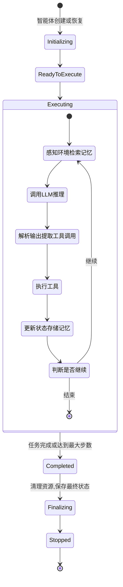
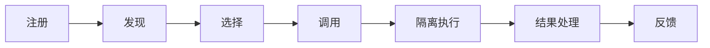

## 2.2 执行层的详细设计

执行层是Harness系统的核心工作区域。它包括三个紧密相关的子系统：运行时引擎、工具层和记忆子系统。本节将深入讨论它们的设计原则、职责边界和接口规范。

### 2.2.1 运行时引擎

运行时引擎是执行层的核心，负责驱动智能体的“感知—推理—行动”循环。本小节介绍其核心职责、执行循环的设计、终止条件和接口规范。

#### 核心职责

运行时引擎管理智能体从创建到销毁的完整生命周期。以下状态机展示了这个生命周期的各个阶段：



图 2-3：运行时引擎的状态机与执行循环

#### 执行循环的六个步骤

执行循环是运行时引擎的核心。每一轮循环由六个步骤组成，每个步骤都有明确的输入、输出和职责边界。

**步骤 1：感知(Perceive)** — 收集当前任务需要的所有上下文信息。这包括三个来源：用户的原始输入（显式上下文）、最近几轮的对话历史（短期记忆）、以及与当前任务语义相关的历史经验（长期记忆的向量检索结果）。感知步骤的质量直接决定了后续推理的质量——如果遗漏了关键上下文，LLM 的推理就会偏离方向。

**步骤 2：推理(Reasoning)** — 将感知阶段收集的上下文组装为 LLM 的输入（系统提示 + 用户消息 + 可用工具列表），然后调用 LLM 获取响应。这一步的关键设计决策是 **上下文组装策略**——哪些信息放在系统提示中、哪些放在用户消息中、如何在有限的Token预算内优先保留最重要的内容。第四章和第六章将深入讨论这些策略。

**步骤 3：决策(Decision)** — 解析 LLM 的输出，提取其中的工具调用请求或最终答案。LLM 的输出可能包含多个工具调用（并行或顺序），也可能是一段文本回复。决策步骤需要验证每个工具调用的合法性：工具是否存在、参数格式是否正确、参数值是否在合理范围内。

**步骤 4：执行(Execution)** — 将验证通过的工具调用交给工具层执行。每个工具调用都设有超时限制，执行过程中的异常不会终止整个循环，而是被捕获并记录为错误结果。这种“容错继续”的策略确保单个工具的失败不会导致整个任务中断。

**步骤 5：学习(Learning)** — 将本轮循环的完整记录（输入上下文、LLM 推理、工具调用、执行结果）写入记忆系统。短期记忆总是写入；如果这一步具有较高的学习价值（例如遇到了新类型的错误），还会同步写入长期记忆。

**步骤 6：判断(Judgment)** — 决定是否继续下一轮循环。终止条件通常包括三种：LLM 已输出最终答案、已达到最大步数限制、已超过总执行时间。这些保护机制防止智能体陷入无限循环或消耗过多资源。

#### 接口设计

运行时引擎对外暴露的接口应当简洁明确，核心方法包括：

- `initialize(agent, task)`：初始化执行环境，加载智能体配置和任务定义
- `step()`：执行单步循环，返回本步骤的结果——这是最重要的方法，也是测试和调试的主要入口
- `run(task, max_steps, timeout)`：完整地执行一个任务，内部反复调用 `step()` 直到满足终止条件
- `pause()` / `resume()`：暂停和恢复执行，支持长时任务的中断和续行
- `get_state()`：获取当前执行状态，供可观测性系统使用

其中 `step()` 和 `run()` 的分离是一个重要的设计决策。`step()` 暴露了单步粒度的控制，使得外部系统可以在每一步之间插入检查点、审批流程或日志记录；`run()` 则提供了更简洁的“一键执行”接口，适用于不需要细粒度控制的场景。

### 2.2.2 工具层

工具层是智能体与外部世界交互的桥梁。LLM 本身只能生成文本，而工具层将文本形式的“意图”转化为真实的系统操作——执行代码、查询数据库、调用 API 等。本小节介绍工具的生命周期、注册表设计、执行流水线和隔离策略。

#### 工具的生命周期

一个工具从被系统感知到执行完毕，经历以下阶段：



图 2-4：工具从注册到执行的完整生命周期

**注册** 是工具进入系统的入口。每个工具需要提供一份结构化的“自我介绍”：名称、功能描述、输入参数的 JSON Schema、所需权限、超时限制等。这些元数据不仅供系统内部使用，更重要的是 **供 LLM 理解工具的能力和使用方式**——LLM 根据工具描述来决定何时调用哪个工具、传入什么参数。因此，工具描述的质量直接影响 LLM 的工具选择准确率。

**发现和选择** 发生在运行时引擎调用 LLM 之前。运行时引擎从注册表中检索当前任务可用的工具列表，将其以 LLM 能理解的格式（通常是 JSON Schema）注入到提示词中。对于工具数量较多的系统，可能需要动态筛选——只向 LLM 暴露与当前任务相关的工具，避免工具列表过长导致 LLM 选择困难。

**隔离执行** 是工具层最关键的环节。工具的执行可能涉及文件操作、网络请求、shell 命令等高风险操作，因此必须在受控的环境中运行。隔离的粒度从低到高包括：异常捕获（最轻量）、进程隔离（通过 subprocess）、容器隔离（通过 Docker）、系统级沙箱（如 Linux 的 seccomp 或 Bubblewrap）。第十二章将详细讨论各级隔离方案的权衡。

#### 注册表设计

工具注册表的核心是一个“名称 → 定义 + 执行器”的映射。设计上有两个关键决策：

**定义与执行器分离**。工具的元数据描述(ToolDefinition)和实际执行逻辑(executor)分开存储。这种分离使得同一个工具定义可以对应不同环境下的执行器——例如测试时使用 mock 执行器，生产时使用真实的 API 调用。

**LLM 友好的导出**。注册表需要提供一个 `list_for_llm()` 方法，将工具定义转换为 LLM API 所要求的格式。不同的 LLM 提供商对工具描述的格式要求略有不同（如 Anthropic 的 tool_use 和 OpenAI 的 function_calling），注册表应封装这些差异。

#### 执行流水线

工具执行器的职责不只是“调用函数”，而是一条完整的流水线，每一步都有明确的目的：

1. **查找工具**：从注册表中获取工具定义和执行器。找不到则立即返回错误，避免后续无效操作。
2. **权限检查**：验证当前智能体是否有权使用该工具。这是安全层的第一道防线——即使 LLM 输出了工具调用，如果智能体没有对应权限，调用也会被拒绝。
3. **参数验证**：根据工具定义中的 JSON Schema 验证参数的类型和取值范围。LLM 生成的参数并不总是正确的，验证可以在执行前发现明显的格式错误。
4. **隔离执行**：在设定的超时限制内执行工具逻辑。超时保护防止工具长时间阻塞运行时引擎。
5. **结果标准化**：无论工具执行成功还是失败，都返回统一格式的 `ToolResult`（包含状态码、输出内容、错误信息），使得运行时引擎可以用一致的方式处理所有工具的执行结果。

第五章将深入探讨每个环节的工程实现细节，包括参数校正、重试策略和结果缓存等高级特性。

### 2.2.3 记忆子系统

本小节讨论记忆子系统的设计动机、分层策略、检索机制和统一接口设计。

#### 为什么需要分层记忆

人类的记忆天然是分层的：工作记忆容量有限但响应极快，长期记忆容量几乎无限但检索较慢。智能体的记忆系统采用了类似的分层策略，但动机更直接—— **LLM 的上下文窗口是有限的**。即使最新的模型支持数十万Token的上下文，也无法将智能体所有的执行历史、学习经验和领域知识一次性塞入上下文。因此，记忆子系统的核心任务是：在有限的上下文预算内，为当前任务提供最相关的信息。

这个问题可以类比数据库的存储层级：CPU 缓存（快但小）→ 内存（中等）→ 磁盘（慢但大）。每一层在容量、延迟和访问模式上有不同的特点，系统需要智能地决定什么数据放在哪一层。

#### 记忆的分层结构

按生命周期和访问模式划分，从存储实现的视角看，记忆系统通常包含三层（1.3 节概念分层中的“工作记忆”在此视角下并入会话级短期记忆，“向量检索层”则是长期记忆的语义索引）：

| 层级 | 生命周期 | 容量 | 延迟 | 典型内容 | 实现方式 |
|------|---------|------|------|---------|---------|
| 短期记忆 | 当前会话 | 小（受上下文窗口限制） | 极低 | 最近的对话轮次、临时观察、已完成步骤摘要 | 内存中的双端队列 |
| 长期记忆 | 跨会话持久化 | 大 | 中等 | 成功的执行模式、用户偏好、学到的规则 | 数据库或文件系统 |
| 向量检索层 | 随长期记忆同步 | 大 | 较高 | 长期记忆的语义索引 | 向量数据库 |

**短期记忆** 是智能体的“工作台”。它保存当前会话中最近的执行步骤，供运行时引擎在每一轮循环中组装上下文。短期记忆的关键设计决策是 **容量上限**——当记忆超出上下文窗口的预算时，需要丢弃或压缩旧的条目。常见策略包括滑动窗口（丢弃最早的条目）和摘要压缩（将多条记录浓缩为一段摘要）。

**长期记忆** 让智能体能够跨会话积累经验。并非所有执行步骤都值得长期保存——一个关键的设计决策是 **重要性过滤**：只有满足一定重要性阈值的记录才会写入长期存储。判断重要性的常见信号包括：任务是否成功、是否遇到过异常、用户是否给出了反馈等。

**向量检索层** 为长期记忆提供语义搜索能力。传统的按时间或关键词检索在面对大量记忆时效果有限——智能体需要的是“找到与当前任务最相关的历史经验”，这正是向量检索擅长的。它将每条记忆编码为高维向量，通过余弦相似度等度量找到语义上最接近的记忆条目。

为避免概念混淆，本书区分三类状态：**运行时状态 / 事件日志** 是当前执行的权威记录；**记忆** 保存可检索的事实、摘要、偏好和经验；**上下文** 是运行时在每次模型调用前从状态与记忆中投影出的输入片段。三者可以互相引用，但不能互相替代。

#### 检索策略

记忆管理器需要根据不同的场景选择合适的检索策略：

- **时间优先**：获取最近 N 条记录。适用于需要了解“刚才发生了什么”的场景，例如在多步任务中回顾上一步的结果。
- **语义优先**：按查询与记忆条目的语义相似度排序。适用于“以前遇到过类似问题吗”的场景，例如智能体在执行一个新任务时搜索历史中的类似案例。
- **混合检索**：先通过时间窗口缩小候选集，再按语义排序。这种方式在实践中最为常用，因为它既保证了时效性，又利用了语义匹配的精确度。

#### 统一接口设计

尽管底层有多层存储，记忆管理器应对外暴露统一的接口，让运行时引擎无需关心记忆存储在哪一层。核心接口只需两个操作：

```python
class MemoryManager:
    """统一的记忆接口"""

    async def store_step(self, record: StepRecord, importance: float = 0.5) -> None:
        """存储一步执行记录。短期记忆总是写入;超过重要性阈值时同步写入长期记忆和向量索引。"""

    async def retrieve(self, query: str = None, recent_only: bool = False, top_k: int = 5) -> list[StepRecord]:
        """检索记忆。recent_only=True 走短期记忆;有 query 走向量语义检索;否则走长期记忆时间排序。"""
```

这种“写入时分层、读取时统一”的设计，使得运行时引擎只需调用 `store_step` 和 `retrieve`，而分层逻辑、重要性判断、向量编码等复杂性全部封装在记忆管理器内部。第六章将深入探讨每一层的工程实现细节。

### 2.2.4 执行层各子系统的协作

前面分别讨论了运行时引擎、工具层和记忆子系统各自的设计。但在实际执行中，这三个子系统并非独立运行，而是在每一步循环中紧密协作。理解它们的协作方式，是理解执行层整体设计的关键。

#### 协作的核心原则

执行层采用 **星型拓扑**：运行时引擎是唯一的协调者，工具层和记忆子系统不直接相互调用。这个设计看似增加了间接性，实则带来了三个重要的工程优势：

- **可追踪性**：所有数据流都经过运行时引擎，便于构建完整的执行轨迹
- **可测试性**：每个子系统可以独立 mock，无需搭建完整的系统环境
- **可替换性**：更换记忆后端（如从内存切换到 Redis）不会影响工具层的实现

因此，工具层只返回标准化 `ToolResult` 和执行元数据；是否写入事件日志、短期记忆或长期记忆，由运行时引擎根据审计、重要性和隐私策略决定。

#### 一步执行的协作流程

在每一步执行中，三个子系统按以下顺序协作：

1. **记忆 → 运行时引擎**：运行时引擎从记忆管理器检索当前任务相关的上下文（最近的对话历史、语义相似的历史经验），组装成 LLM 的输入
2. **运行时引擎 → LLM**：运行时引擎将组装好的上下文发送给 LLM，获取推理结果
3. **运行时引擎 → 工具层**：如果 LLM 输出了工具调用请求，运行时引擎将其转交给工具执行器，由工具层完成参数验证、权限检查和隔离执行
4. **工具层 → 运行时引擎 → 记忆**：工具执行结果返回给运行时引擎，引擎将本步骤的完整记录（输入、推理、动作、结果）写入记忆管理器

这个循环不断重复，直到 LLM 输出最终答案或达到步数上限。

#### 重要性评估

在步骤 4 中，运行时引擎需要为每条记录评估“重要性”，以决定是否写入长期记忆。常见的评估信号包括：工具调用是否失败（失败的经验往往更值得记住）、用户是否给出了明确的反馈、当前任务是否是新类型等。这个评估逻辑虽然简单，却直接影响智能体的长期学习效果——第六章将对此做深入讨论。

### 2.2.5 托管Agent虚拟化：Brain/Hands解耦架构

传统的Harness架构将“大脑”（推理引擎）和“手”（执行环境）紧密耦合在一起。这种单体设计在小规模场景中运作良好，但在长期运行的生产环境中面临两个核心问题：

1. **假设快速老化**：Harness中编码的关于“模型能力的假设”会随着模型升级而过时。例如，Claude Sonnet 4.5表现出的“上下文焦虑”（在接近上下文限制时过早结束任务）在升级到Claude Opus 4.6后消失了，使得针对此行为的特殊处理变成了无效的开销。
2. **容错性不足**：容器作为“宠物”（手工维护的单个实例）需要精心照顾。任何容器故障都导致整个Agent停机，而无法通过重试恢复。

**托管Agent虚拟化** 解决这些问题的关键在于将Agent的生命周期拆分为三个独立的抽象：

#### 三层虚拟化架构

**会话层 (Session)** — 追加式的事件日志
- 记录Agent整个生命周期中发生的每一件事
- 不关心事件的存储位置或格式，仅追加
- 提供 `getEvents()` 接口，支持选择性检索：按范围取切片、按时间戳倒回、按关键词搜索
- 外部状态管理：与Harness实现无关，持久化到外部数据库或文件系统

```python
class Session:
    """会话：持久化的事件日志"""

    def __init__(self, session_id: str, storage_backend):
        self.session_id = session_id
        self.storage = storage_backend  # S3, PostgreSQL, 文件系统等
        self.event_stream = []

    async def append_event(self, event: AgentEvent):
        """追加事件，不可删除"""
        event.timestamp = time.time()
        event.session_id = self.session_id
        await self.storage.append(event)

    async def get_events(self,
                        start_index: int = None,
                        start_timestamp: float = None,
                        limit: int = None) -> list[AgentEvent]:
        """灵活检索事件，支持从中间继续、倒回到特定时刻"""
        return await self.storage.query_events(
            session_id=self.session_id,
            start_index=start_index,
            start_timestamp=start_timestamp,
            limit=limit
        )
```

**Harness层** — 循环逻辑的无状态实现
- 读取Session中的事件来恢复上下文，而非依赖内存状态
- 实现Agent的核心循环逻辑（感知→推理→执行）
- 对Session中的新事件完全无知：只负责生成新事件并写回Session
- 允许多个Harness实例共同处理同一个Session（例如从另一个实例恢复执行）

```python
class Harness:
    """Harness：无状态的循环引擎"""

    async def step(self, session: Session, resumption_point: int = None):
        """执行一步，从恢复点继续"""
        # 1. 从Session恢复上下文
        events = await session.get_events(start_index=resumption_point or 0)
        context = self._reconstruct_context(events)

        # 2. 执行单步循环
        perception = self._perceive(context)
        reasoning = await self.llm.infer(perception)
        decision = self._parse_decision(reasoning)

        # 3. 执行工具调用（可能失败）
        results = []
        for tool_call in decision.tool_calls:
            result = await self.tools.execute(tool_call)
            results.append(result)  # 记录执行结果，即使失败也继续

        # 4. 追加事件到Session
        await session.append_event(AgentStepCompleted(
            step_number=len(events),
            perception=perception,
            reasoning=reasoning,
            actions=decision.tool_calls,
            results=results
        ))

    def _reconstruct_context(self, events: list[AgentEvent]) -> dict:
        """从事件流重建当前上下文"""
        context = {"history": [], "state": {}}
        for event in events:
            if isinstance(event, AgentStepCompleted):
                context["history"].append({
                    "input": event.perception,
                    "reasoning": event.reasoning,
                    "actions": event.actions
                })
            elif isinstance(event, StateChanged):
                context["state"].update(event.changes)
        return context
```

**沙箱层 (Sandbox)** — 执行环境的可替换实现
- 独立管理代码执行、文件操作、API调用等环境
- 与Harness和Session完全解耦
- 容器故障不影响Session，因为失败的工具调用会记录到Session中，Harness可以重试
- 支持热切换：同一个Session可以在不同的容器中继续执行

```python
class Sandbox:
    """沙箱：可替换的执行环境"""

    async def execute_tool(self, tool_call: ToolCall) -> ToolResult:
        """在隔离环境中执行工具"""
        # 真实实现可能涉及：
        # - Docker容器内代码执行
        # - API网关代理外部服务调用
        # - 文件系统隔离
        try:
            result = await self._run_isolated(tool_call)
            return ToolResult(status="success", output=result)
        except Exception as e:
            return ToolResult(status="error", error=str(e))
            # 注意：错误被返回给Harness，不会导致Session中断
```

#### 长期任务的上下文管理

对于超过LLM上下文窗口的长期任务，Session作为“外部上下文对象”解决了这个问题：

```python
async def run_long_horizon_task(task: Task, max_total_time: int):
    """长期任务执行，跨越多个上下文窗口"""
    session = Session(task.id, storage_backend=postgresql)
    harness = Harness(model="claude-opus-4-7")
    sandbox = Sandbox(docker_config)

    start_time = time.time()
    step_count = 0

    while time.time() - start_time < max_total_time:
        # 1. 恢复：从Session中取最近1000个token的事件
        # （即使任务已运行10000步，也只加载最近的上下文）
        recent_events = await session.get_events(
            start_index=max(0, step_count - 50),  # 最近50步
            limit=1000  # 最多1000个token
        )

        # 2. 循环：Harness执行一步
        await harness.step(session, resumption_point=step_count)
        step_count += 1

        # 3. 检查是否完成
        latest_event = await session.get_events(start_index=step_count-1, limit=1)
        if latest_event[0].type == "task_completed":
            break

    # 4. 完整恢复（用于事后分析）
    full_history = await session.get_events()
    return analyze_execution(full_history)
```

#### 托管Agent的优势

| 问题 | 单体设计 | 虚拟化设计 |
|-----|--------|---------|
| 容器故障 | Agent中断 | 在不同容器继续执行 |
| 模型升级 | 旧假设变成死代码 | Harness可灵活适配新模型能力 |
| 上下文溢出 | 需要复杂的压缩策略 | Session外部管理，Harness读取切片 |
| 可观测性 | 依赖日志系统 | 事件流天然提供完整轨迹 |
| 多实例并行 | 互相干扰 | 完全隔离，可实现分布式执行 |

这种虚拟化设计遵循操作系统的哲学——将具体实现细节抽象成稳定的接口（Session的事件API、Harness的循环契约、Sandbox的工具执行接口），使得系统能够长期演进而无需破坏性改动。

### 2.2.6 总结

执行层通过三个紧密协作的子系统：

- **运行时引擎**：实现智能体的执行循环，从感知、推理、决策到执行的完整流程
- **工具层**：提供安全、标准化的工具调用机制，包括注册、验证、隔离执行
- **记忆系统**：支持工作、短期、长期三层记忆与向量语义检索，让智能体能够学习和改进

这三个子系统的清晰接口设计，使得它们可以独立演进，也可以灵活组合以适应不同的场景需求。

在生产级别的托管Agent场景中，进一步的虚拟化（Session/Harness/Sandbox三层解耦）提供了更强的容错性和适应性，使得系统能够处理长期运行任务并适应模型能力的演进。
