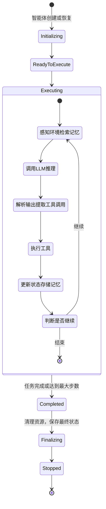
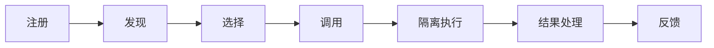

## 2.2 执行层的详细设计

执行层是Harness系统的核心工作区域。它包括三个紧密相关的子系统：运行时引擎、工具层和记忆子系统。本节将深入讨论它们的设计原则、职责边界和接口规范。

### 2.2.1 运行时引擎

本小节详细介绍运行时引擎的核心职责、执行循环、接口设计和实现模式。

#### 核心职责

运行时引擎实现智能体的执行循环。这个循环可以用以下的状态机来表示：



#### 执行循环的详细步骤

**步骤1：感知（Perceive）**
```python
async def perceive(self) -> PerceptionState:
    """感知当前环境和上下文"""
    # 获取当前的显式上下文（用户输入、任务定义）
    explicit_context = self.current_task.context

    # 从记忆中检索相关的历史信息
    recent_history = await self.memory.retrieve_recent(
        limit=10,
        filters={"agent_id": self.agent_id}
    )

    # 检索长期记忆中的相关知识
    long_term_knowledge = await self.memory.retrieve_semantic(
        query=self.current_task.description,
        top_k=5
    )

    return PerceptionState(
        explicit_context=explicit_context,
        recent_history=recent_history,
        knowledge=long_term_knowledge,
        timestamp=datetime.now()
    )
```

**步骤2：推理（Reasoning）**
```python
async def reason(self, perception: PerceptionState) -> LLMOutput:
    """调用LLM进行推理"""
    # 构造系统提示（定义智能体的角色和约束）
    system_prompt = self._build_system_prompt()

    # 构造用户消息（包含任务和上下文）
    user_message = self._build_user_message(
        task=self.current_task,
        context=perception
    )

    # 调用LLM
    response = await self.model.generate(
        system=system_prompt,
        messages=[user_message],
        tools=self.tools.list_for_llm()  # 告诉LLM可用的工具
    )

    return response
```

**步骤3：决策（Decision）**
```python
async def decide(self, llm_output: LLMOutput) -> List[Action]:
    """从LLM输出中提取动作"""
    actions = []

    # 如果LLM决定调用工具
    if llm_output.has_tool_calls:
        for tool_call in llm_output.tool_calls:
            # 验证工具是否存在
            tool = self.tools.get(tool_call.tool_name)
            if tool is None:
                raise InvalidToolError(
                    f"Tool {tool_call.tool_name} not found"
                )

            # 验证参数
            validated_params = await tool.validate_params(
                tool_call.params
            )

            actions.append(Action(
                type="tool_call",
                tool_name=tool_call.tool_name,
                params=validated_params
            ))

    # 如果LLM决定输出最终答案
    if llm_output.has_final_answer:
        actions.append(Action(
            type="final_answer",
            content=llm_output.final_answer
        ))

    return actions
```

**步骤4：执行（Execution）**
```python
async def execute(self, actions: List[Action]) -> List[ActionResult]:
    """执行动作"""
    results = []

    for action in actions:
        try:
            if action.type == "tool_call":
                # 通过工具层执行工具调用
                result = await self.tool_executor.execute(
                    tool_name=action.tool_name,
                    params=action.params,
                    timeout=30  # 30秒超时
                )
            elif action.type == "final_answer":
                result = ActionResult(
                    status="success",
                    output=action.content
                )

            results.append(result)

        except Exception as e:
            # 记录错误，但继续执行其他动作
            results.append(ActionResult(
                status="error",
                error=str(e),
                error_type=type(e).__name__
            ))

    return results
```

**步骤5：学习（Learning）**
```python
async def learn(
    self,
    perception: PerceptionState,
    actions: List[Action],
    results: List[ActionResult]
) -> None:
    """更新状态和记忆"""
    # 记录这一步的执行
    step_record = StepRecord(
        agent_id=self.agent_id,
        task_id=self.current_task.id,
        step_number=self.step_count,
        perception=perception,
        actions=actions,
        results=results,
        timestamp=datetime.now()
    )

    # 存储到短期记忆
    await self.memory.store_recent(step_record)

    # 如果这是一个特别重要的步骤，存储到长期记忆
    if self._is_important(step_record):
        await self.memory.store_long_term(step_record)

    # 更新智能体的内部状态
    self.execution_state.update(
        last_step=step_record,
        total_steps=self.step_count,
        last_updated=datetime.now()
    )
```

**步骤6：判断（Judgment）**
```python
def should_continue(self) -> bool:
    """判断是否继续执行"""
    # 检查是否有最终答案
    if self.execution_state.has_final_answer:
        return False

    # 检查是否超过最大步数
    if self.step_count >= self.max_steps:
        return False

    # 检查是否超过超时时间
    if datetime.now() - self.start_time > self.timeout:
        return False

    # 默认继续
    return True
```

#### 运行时引擎的接口设计

运行时引擎的核心接口定义如下：
```python
class RuntimeEngine:
    """智能体的运行时引擎"""

    async def initialize(
        self,
        agent: Agent,
        task: Task
    ) -> None:
        """初始化智能体执行"""

    async def step(self) -> StepResult:
        """执行一个步骤，返回这一步的执行结果"""

    async def run(
        self,
        task: Task,
        max_steps: int = 10,
        timeout: timedelta = timedelta(minutes=5)
    ) -> FinalResult:
        """完整地执行一个任务"""

    async def pause(self) -> None:
        """暂停执行，可以稍后恢复"""

    async def resume(self) -> None:
        """恢复暂停的执行"""

    async def stop(self) -> None:
        """停止执行，清理资源"""

    def get_state(self) -> ExecutionState:
        """获取当前执行状态"""
```

### 2.2.2 工具层

本小节介绍工具的生命周期、注册表设计、执行器实现和权限控制机制。

#### 工具的生命周期

工具在系统中从注册到执行完毕的整个生命周期包括以下阶段：


#### 工具注册表的设计

工具注册表管理系统中所有可用工具的元数据和调用接口：
```python
from typing import Protocol, Callable, Optional
from pydantic import BaseModel, Field

class ToolInputSchema(BaseModel):
    """工具的输入参数schema"""
    type: str = "object"
    properties: dict[str, dict]
    required: list[str] = []

class ToolDefinition(BaseModel):
    """工具的完整定义"""
    name: str = Field(..., description="工具的唯一标识符")
    description: str = Field(..., description="工具的功能描述")
    input_schema: ToolInputSchema
    permissions_required: list[str] = []
    timeout_seconds: int = 30
    max_retries: int = 3
    tags: list[str] = []  # 用于分类和搜索

class ToolRegistry:
    """工具注册表"""

    def __init__(self):
        self._tools: dict[str, ToolDefinition] = {}
        self._executors: dict[str, Callable] = {}

    def register(
        self,
        definition: ToolDefinition,
        executor: Callable
    ) -> None:
        """注册一个工具"""
        if definition.name in self._tools:
            raise ValueError(f"Tool {definition.name} already registered")

        self._tools[definition.name] = definition
        self._executors[definition.name] = executor

    def get(self, tool_name: str) -> Optional[ToolDefinition]:
        """获取工具定义"""
        return self._tools.get(tool_name)

    def get_executor(self, tool_name: str) -> Optional[Callable]:
        """获取工具执行器"""
        return self._executors.get(tool_name)

    def search(self, query: str) -> list[ToolDefinition]:
        """按名称或描述搜索工具"""
        query_lower = query.lower()
        results = [
            tool for tool in self._tools.values()
            if query_lower in tool.name.lower()
            or query_lower in tool.description.lower()
        ]
        return results

    def list_for_llm(self) -> list[dict]:
        """返回LLM可理解的工具格式"""
        return [
            {
                "name": tool.name,
                "description": tool.description,
                "input_schema": tool.input_schema.model_dump()
            }
            for tool in self._tools.values()
        ]
```

#### 工具执行器的设计

工具执行器负责安全地调用工具并处理其执行结果，其设计如下：
```python
class ToolExecutor:
    """执行工具调用"""

    async def execute(
        self,
        tool_name: str,
        params: dict,
        timeout: int = 30,
        agent_id: str = None
    ) -> ToolResult:
        """执行一个工具调用"""
        # 1. 获取工具定义和执行器
        tool_def = self.registry.get(tool_name)
        executor = self.registry.get_executor(tool_name)

        if tool_def is None or executor is None:
            return ToolResult(
                status="error",
                error="Tool not found",
                tool_name=tool_name
            )

        # 2. 权限检查
        if not await self._check_permissions(tool_name, agent_id):
            return ToolResult(
                status="permission_denied",
                error="Agent does not have permission to use this tool",
                tool_name=tool_name
            )

        # 3. 参数验证
        try:
            validated_params = self._validate_params(
                params,
                tool_def.input_schema
            )
        except ValidationError as e:
            return ToolResult(
                status="validation_error",
                error=str(e),
                tool_name=tool_name
            )

        # 4. 隔离执行
        try:
            result = await asyncio.wait_for(
                self._isolated_execute(executor, validated_params),
                timeout=timeout
            )
            return ToolResult(
                status="success",
                output=result,
                tool_name=tool_name
            )
        except asyncio.TimeoutError:
            return ToolResult(
                status="timeout",
                error=f"Tool execution exceeded {timeout}s timeout",
                tool_name=tool_name
            )
        except Exception as e:
            return ToolResult(
                status="error",
                error=str(e),
                tool_name=tool_name
            )

    async def _isolated_execute(
        self,
        executor: Callable,
        params: dict
    ) -> Any:
        """在隔离环境中执行工具"""
        # 实现细节取决于具体的隔离方式
        # 可以是：
        # - 简单的try-catch（最小隔离）
        # - 进程隔离（subprocess）
        # - 容器隔离（Docker）
        # - 沙箱隔离（seccomp, AppArmor等）

        if asyncio.iscoroutinefunction(executor):
            return await executor(**params)
        else:
            # 异步运行同步函数，避免阻塞
            loop = asyncio.get_event_loop()
            return await loop.run_in_executor(
                None,
                executor,
                **params
            )
```

### 2.2.3 记忆子系统

本小节讨论多层记忆体系的分层结构、每层的设计目标、实现方式和检索机制。

#### 记忆的分层结构与检索机制

按生命周期划分，记忆系统包含短期和长期两层存储，并通过向量检索机制支持语义搜索。

**短期记忆（Session Memory）**

- 存储当前对话的历史信息
- 生命周期：会话期间
- 访问模式：频繁读写
- 实现：内存中的列表或双端队列
```python
class SessionMemory:
    """短期记忆：当前会话的执行历史"""

    def __init__(self, max_size: int = 100):
        self.history: Deque[StepRecord] = deque(maxlen=max_size)

    async def add(self, record: StepRecord) -> None:
        """添加一条记录"""
        self.history.append(record)

    async def get_recent(self, limit: int = 10) -> list[StepRecord]:
        """获取最近的n条记录"""
        return list(self.history)[-limit:]

    async def clear(self) -> None:
        """清空短期记忆"""
        self.history.clear()
```

**长期记忆（Long-term Memory）**

- 存储跨会话的知识和学习
- 生命周期：持久化存储
- 访问模式：定期写，频繁读
- 实现：数据库、文件系统
```python
class LongTermMemory:
    """长期记忆：跨会话的持久化知识"""

    def __init__(self, storage: MemoryStorage):
        self.storage = storage

    async def store(
        self,
        record: StepRecord,
        importance: float = 0.5
    ) -> None:
        """存储一条记录到长期记忆"""
        # 只存储重要的记录，以节省存储空间
        if importance < 0.5:
            return

        await self.storage.save(
            key=f"step:{record.task_id}:{record.step_number}",
            value=record.model_dump(),
            ttl=timedelta(days=365)  # 保留1年
        )

    async def retrieve_recent(self, agent_id: str, limit: int = 10):
        """检索最近的记录"""
        return await self.storage.query(
            filter={"agent_id": agent_id},
            order_by="timestamp",
            limit=limit
        )
```

**向量检索层（Vector Retrieval）**

- 为长期记忆提供语义搜索能力，将记忆编码为向量
- 生命周期：随长期记忆同步更新
- 访问模式：语义相似性查询
- 实现：向量数据库（如 Pinecone、Weaviate）
```python
class VectorMemory:
    """向量检索层：为长期记忆提供语义搜索能力"""

    def __init__(self, vector_db: VectorStore, embedding_model):
        self.vector_db = vector_db
        self.embedding_model = embedding_model

    async def store(self, record: StepRecord) -> None:
        """存储记录的向量表示"""
        # 将记录转换为文本
        text = self._record_to_text(record)

        # 生成向量
        vector = await self.embedding_model.embed(text)

        # 存储到向量数据库
        await self.vector_db.add(
            id=f"step:{record.task_id}:{record.step_number}",
            vector=vector,
            metadata={"agent_id": record.agent_id, "timestamp": record.timestamp}
        )

    async def retrieve_semantic(
        self,
        query: str,
        agent_id: str = None,
        top_k: int = 5
    ) -> list[StepRecord]:
        """按语义相似性检索"""
        # 生成查询的向量
        query_vector = await self.embedding_model.embed(query)

        # 搜索相似的向量
        results = await self.vector_db.search(
            vector=query_vector,
            filter={"agent_id": agent_id} if agent_id else None,
            top_k=top_k
        )

        # 从存储中加载完整的记录
        records = []
        for result in results:
            record = await self.storage.load(result.id)
            records.append(record)

        return records
```

#### 记忆管理器的接口

记忆管理器提供统一的接口来访问短期记忆、长期记忆和向量检索：
```python
class MemoryManager:
    """统一的记忆接口"""

    def __init__(
        self,
        session_memory: SessionMemory,
        long_term_memory: LongTermMemory,
        vector_memory: VectorMemory
    ):
        self.session = session_memory
        self.long_term = long_term_memory
        self.vector = vector_memory

    async def store_step(
        self,
        record: StepRecord,
        importance: float = 0.5
    ) -> None:
        """存储一步的执行记录"""
        # 总是存储到短期记忆
        await self.session.add(record)

        # 根据重要性决定是否存储到长期记忆
        if importance > 0.5:
            await self.long_term.store(record, importance)
            await self.vector.store(record)

    async def retrieve(
        self,
        query: str = None,
        agent_id: str = None,
        recent_only: bool = False,
        top_k: int = 5
    ) -> list[StepRecord]:
        """检索相关的记忆"""
        if recent_only:
            # 仅从短期记忆检索
            return await self.session.get_recent(limit=top_k)

        if query:
            # 通过向量检索进行语义搜索
            return await self.vector.retrieve_semantic(
                query=query,
                agent_id=agent_id,
                top_k=top_k
            )

        # 从长期记忆检索最近的记录
        return await self.long_term.retrieve_recent(
            agent_id=agent_id,
            limit=top_k
        )
```

### 2.2.4 执行层各子系统的协作

执行层的各个子系统需要紧密协作以实现智能体的正常运行，具体协作方式如下：
```python
class ExecutionContext:
    """执行的上下文，协调三个子系统"""

    def __init__(
        self,
        runtime_engine: RuntimeEngine,
        tool_executor: ToolExecutor,
        memory_manager: MemoryManager
    ):
        self.runtime = runtime_engine
        self.tools = tool_executor
        self.memory = memory_manager

    async def execute_step(self) -> StepResult:
        """执行一步：感知→推理→决策→执行→学习"""
        # 1. 感知：从记忆中检索相关信息
        perception = await self.memory.retrieve(
            query=self.runtime.current_task.description,
            recent_only=False,
            top_k=10
        )

        # 2. 推理和决策：由运行时引擎处理
        actions = await self.runtime.decide(perception)

        # 3. 执行：使用工具执行器
        results = []
        for action in actions:
            result = await self.tools.execute(
                tool_name=action.tool_name,
                params=action.params
            )
            results.append(result)

        # 4. 学习：存储到记忆
        step_record = StepRecord(
            perception=perception,
            actions=actions,
            results=results
        )
        await self.memory.store_step(
            record=step_record,
            importance=self._calculate_importance(results)
        )

        return StepResult(
            perception=perception,
            actions=actions,
            results=results
        )

    def _calculate_importance(self, results: list[ActionResult]) -> float:
        """计算这一步的重要性"""
        # 如果有工具调用失败，标记为高重要性（以便日后学习）
        if any(r.status != "success" for r in results):
            return 0.8

        # 否则中等重要性
        return 0.5
```

### 2.2.5 总结

执行层通过三个紧密协作的子系统：

- **运行时引擎**：实现智能体的执行循环，从感知、推理、决策到执行的完整流程
- **工具层**：提供安全、标准化的工具调用机制，包括注册、验证、隔离执行
- **记忆系统**：支持短期、长期、向量三层记忆，让智能体能够学习和改进

这三个子系统的清晰接口设计，使得它们可以独立演进，也可以灵活组合以适应不同的场景需求。
