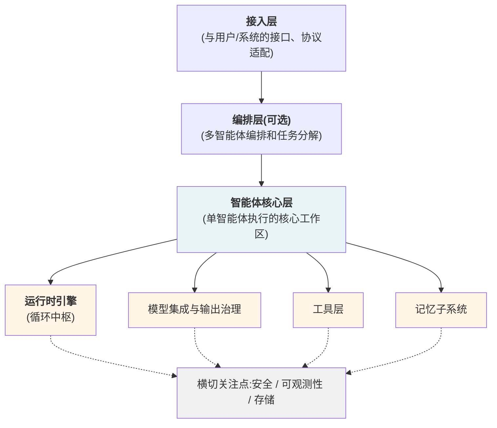
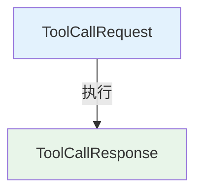
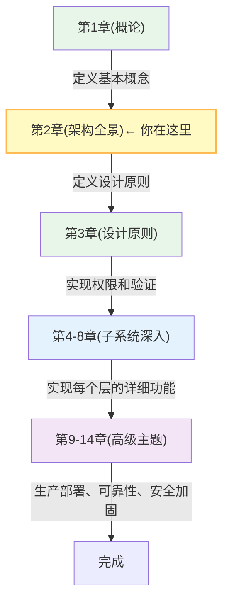

## 本章小结

本章系统地阐述了 Harness 的整体架构设计，包括三层+横切关注点的参考架构、核心组件的深入设计、层间接口规范和参考实现对比。以下是主要内容的总结。

### 核心架构模型

**三层 + 横切关注点参考架构**

Harness 系统采用三层结构加横切关注点的方式组织，清晰地分离了不同的关注点：

图 2-5：Harness 三层+横切关注点架构总览

这个架构与第一章的星型子系统模型一致：模型调用、工具执行、记忆更新在运行时引擎的同一循环中交替发生，因此归属同一层（智能体核心层），而非人为分到不同层级。

### 智能体核心层的深入设计

智能体核心层是 Harness 系统的核心，包含四个紧密协作的子系统（运行时引擎、模型集成与输出治理、工具层、记忆子系统）：

#### 运行时引擎

实现智能体的执行循环：

1. **感知**：从记忆中检索相关信息
2. **推理**：调用 LLM 进行思考
3. **决策**：提取工具调用意图
4. **执行**：通过工具层执行操作
5. **学习**：更新记忆和状态

关键设计模式：状态机管理、异步协调、超时控制

#### 工具层

提供安全、标准化的外部系统访问：

- **工具注册表**：管理所有可用工具
- **参数验证**：确保格式和类型正确
- **权限检查**：验证执行权限
- **隔离执行**：在沙箱中运行，防止副作用
- **结果标准化**：统一的输出格式

#### 记忆子系统

按生命周期支持分层记忆结构：

- **工作记忆**：当前对话的上下文窗口（LLM 上下文）
- **短期记忆**：会话级的摘要和临时状态（内存或文件）
- **长期记忆**：跨会话的持久化知识（数据库），借助向量索引支持语义检索

这三层记忆的协作，使得智能体能够跨越时间维度学习和改进。

### 安全与可观测性

两个横切的关注点贯穿整个系统：

#### 安全层的关键要素

1. **权限管理**：梯度化的权限模型(Free → Ask-first → Approve-once)
2. **沙箱隔离**：进程级、容器级或 VM 级隔离
3. **审计日志**：记录所有关键操作
4. **输入验证**：防止注入攻击

#### 可观测性层的三个支柱

1. **日志(Logs)**：结构化、可搜索的事件记录
2. **追踪(Traces)**：分布式追踪，追踪请求的完整路径
3. **指标(Metrics)**：性能指标和趋势分析

### 层间接口规范

清晰的接口是模块化系统的基础：

#### 统一的消息格式

所有层间通信都使用结构化的 Message 对象：

- **消息基类**
  - ToolCallMessage（工具调用）
  - ToolResultMessage（工具结果）
  - TextMessage（文本信息）

#### 工具调用协议

标准化的请求-响应模式：

图 2-6：工具调用的请求-响应模式

#### 事件流规范

事件总线实现发布-订阅模式，支持异步通信和解耦。

### 参考实现的对比

#### OpenAI Codex

- **语言**：Rust（核心语言，具体比例以官方代码库统计为准），60+ Cargo crate 模块化
- **安全**：execpolicy 策略引擎 + 平台原生沙箱双层防御
- **上下文**：提示缓存 + 异步压缩，线性成本增长
- **编排**：Subagent 层级委派，支持 3+ 层深度

优势：系统级性能和安全保障，适合对延迟和隔离要求高的场景

#### Claude Code

- **语言**：TypeScript（~50 万行），类型安全
- **架构**：模块化设计，40+ 特性门控
- **编排**：Coordinator 动态多智能体
- **集成**：24+ 内置工具 + MCP 扩展

优势：响应快速，类型安全，易于集成

#### OpenClaw

- **通信**：WebSocket 长连接 + 心跳机制
- **架构**：Gateway WebSocket 作为单一控制平面 + 节点传输
- **工作流**：Lobster 确定性引擎
- **记忆**：MEMORY.md + 每日记忆文件（SOUL.md 承担行为约束）

优势：支持长期自主运行，适合持久化应用

### MiniHarness 脚手架

本章完成了 MiniHarness 项目的初始化：

#### 文件结构

MiniHarness 项目的完整文件结构如下所示：

- **lab/**
  - pyproject.toml - 项目配置和依赖
  - **mini_harness/**
    - **core/** - 核心接口定义
      - message.py
      - tool.py
      - agent.py
      - event.py
    - **tools/** - 工具注册表
      - registry.py
    - **utils/** - 工具函数
      - config.py
  - **tests/unit/** - 测试套件
    - test_core.py
    - test_tools.py

#### 核心接口已定义

- **Message**：统一的消息类型
- **Tool/ToolDefinition**：工具的抽象
- **Agent**：智能体的配置
- **Event**：事件定义
- **ToolRegistry**：工具管理

#### 可运行的代码

已实现完整的类型定义、序列化、注册表逻辑，并提供了基本的单元测试。

### 与其他章节的关系

各个章节之间的联系和依赖关系如下所示：

图 2-7：Harness 工程指南全书的章节结构与学习路径

### 关键学习点总结

| 概念 | 说明 | 实践体现 |
|------|------|---------|
| 分层架构 | 三层 + 横切关注点，明确职责 | 接入层-编排层-智能体核心层 + 安全/可观测性/存储 |
| 执行循环 | 智能体的核心是感知-推理-决策-执行的循环 | RuntimeEngine 的步骤实现 |
| 工具抽象 | 统一各种外部系统的接口 | ToolRegistry 和 Tool 基类 |
| 三层记忆 | 工作+短期+长期（向量检索作语义索引），支持学习 | MemoryManager 的设计 |
| 权限管理 | 梯度化信任，从 Free 到 Approve-once | PermissionManager 和 AuditLog |
| 可观测性 | 日志+追踪+指标 | Logger, Tracer, MetricsCollector |
| 接口规范 | 清晰的消息格式和协议 | Message, ToolCallRequest/Response |

### 常见设计问题与答案

#### Q: 为什么要有编排层？

**A**: 当任务过于复杂，无法由单个 Agent 完成时，编排层负责分解任务、分配给专门的 Agent、汇总结果。即使对于简单系统，编排层也可以很轻薄。

#### Q: 为什么需要三层记忆？

**A**: 不同的使用场景对记忆的要求不同。工作记忆快速访问当前上下文，短期记忆保留会话级的摘要和状态，长期记忆持久化跨会话的知识并借助向量索引支持语义检索。三层按生命周期递进，形成完整的记忆体系。

#### Q: 工具层的权限检查和安全层的权限检查重复了吗？

**A**: 不应各自维护独立政策。安全层提供统一的策略决策服务；工具层负责本地前置条件和参数能力检查，输出治理负责在执行前消费同一策略决策。这样可以同时保留细粒度控制和系统级一致性。

#### Q: 为什么需要事件总线？

**A**: 事件总线实现了不同子系统的解耦。监控系统可以订阅所有事件来进行可观测性，权限系统可以订阅工具执行事件，而不需要运行时引擎直接依赖它们。

### 后续学习路径

1. **第 3 章**：深入学习设计原则，特别是“约束优先”和“渐进信任”
2. **第 4 章**：实现完整的运行时引擎，包括错误处理和重试策略
3. **第 5 章**：实现各种工具的适配器，学习如何集成真实系统
4. **第 6 章**：实现记忆系统，包括向量数据库集成

### 代码审查清单

完成本章的脚手架搭建后，检查以下内容：

- [ ] 项目目录结构完整
- [ ] pyproject.toml 依赖配置正确
- [ ] 核心接口(message, tool, agent, event)已定义
- [ ] 工具注册表实现正确
- [ ] 所有单元测试通过
- [ ] 代码风格一致（Black 格式化）
- [ ] 类型提示完整（mypy 检查）
- [ ] 文档注释充分

完成这些检查后，MiniHarness 项目将为后续的功能开发提供坚实的基础。
