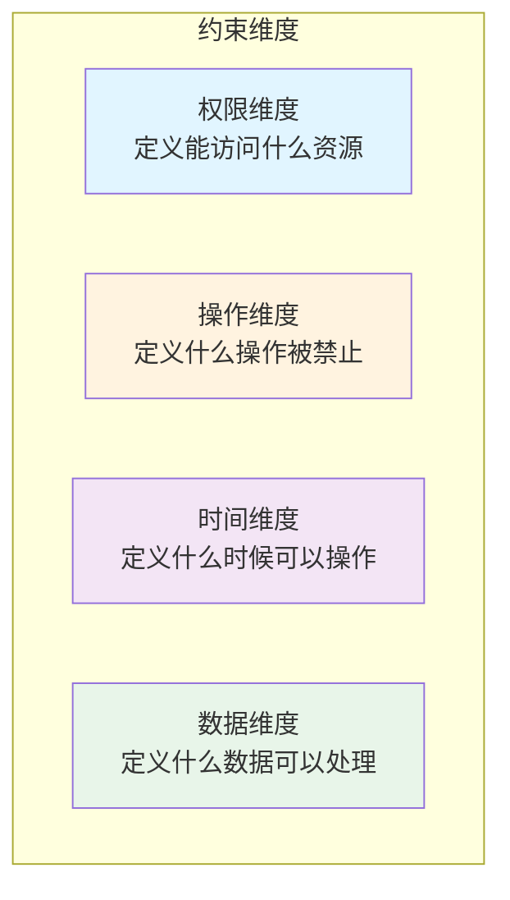
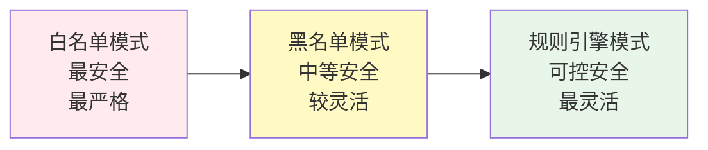
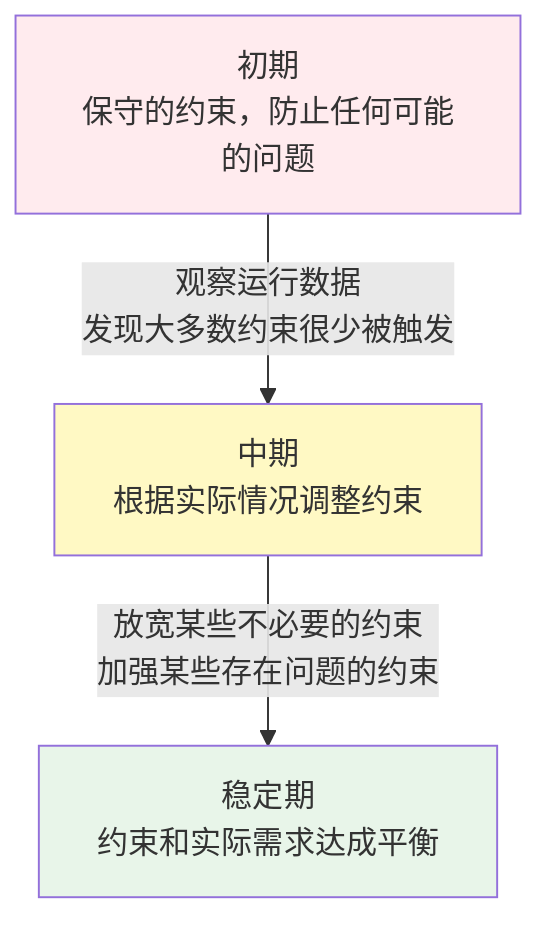

## 3.1 约束优先原则

本节介绍约束优先原则的核心理念、重要性、约束的分类、设计方法和实施策略，阐明为什么约束是构建安全智能体系统的首要考虑。

### 3.1.1 原则的核心

**约束优先** 意味着：在设计Harness系统时，首先考虑的不是“智能体能做什么”，而是“Agent不能做什么”、“Agent做事时的限制是什么”。

这与直觉相反。通常我们在构建系统时，首先关心的是功能特性——系统应该具备什么能力。但对于智能体系统，这个思路导致了无尽的“功能蔓延”和安全隐患。

约束优先原则翻转了这个优先级：

1. **首先定义约束**：明确智能体可以做的事（Permission Model）
2. **然后在约束内赋能**：通过工具和模型来实现功能
3. **最后验证合规**：确保所有操作都在约束内

### 3.1.2 为什么约束如此重要

本小节通过现象观察、成本分析和失败案例，论证约束机制在智能体系统中的关键作用。

#### 现象观察

在Claude Code中，有一个叫“protected files”的机制，以及“dangerous patterns”的检测。这些都是约束。

在OpenClaw中，有一个叫SOUL.md的约束文档。这个文档不是系统的“特性”，而是智能体的“戒律”。它定义了Agent绝对不能做的事。

有趣的是，许多智能体系统失败的原因，往往不是因为模型不够聪明，而是因为缺乏足够的约束。Agent学会了用户没有授权的方式做事，执行了超越权限的操作，或者被用户恶意利用。

#### 约束能解决什么

**1. 安全性** 通过约束，我们明确地防止某些危险操作。比如：

- 不允许删除生产数据库的内容
- 不允许修改系统配置文件
- 不允许执行需要人工审批的操作

**2. 可预测性** 有约束的系统比无约束系统更容易被理解和维护：

| 约束方式 | 系统状态 | 可测试性 |
|--------|--------|--------|
| **无约束** | 智能体可以调用任何API | 很难预测会发生什么；难以编写测试用例 |
| **有约束** | Agent只能调用预先批准的API列表 | 系统行为在可预期的范围内；易于编写和维护测试用例 |

**3. 可审计性** 有约束的系统更容易被审计：
```text
审计问题：智能体为什么执行了X操作？
无约束答案：谁知道呢，模型就是这样决定的
有约束答案：因为这个操作在智能体的权限列表中，
           并且满足了Y条件，所以被批准了
```

### 3.1.3 约束的多个维度

约束可以在多个维度进行定义和实现。如图所示，约束可以分为四个关键维度：


图 3-1：约束的四个维度

#### 1. 权限维度

定义智能体能访问什么资源：

```python
class PermissionConstraint:
    """权限约束"""

    # 工具级约束：哪些工具可用
    available_tools = [
        "weather_api",
        "send_email",
        "retrieve_documents"
    ]

    # 资源级约束：可以访问哪些资源
    resource_access = {
        "database": {
            "tables": ["users", "orders"],  # 只能访问这些表
            "operations": ["read"],  # 只能读，不能写
            "row_limit": 1000  # 最多一次查询1000行
        },
        "file_system": {
            "paths": ["/data/public/"],  # 只能访问这个目录
            "operations": ["read"]
        }
    }

    # 用户级约束：可以操作哪些用户的数据
    user_scope = {
        "current_user_only": True,  # 只能操作当前用户的数据
        "allowed_org_ids": ["org-123", "org-456"]
    }
```

#### 2. 操作维度

定义什么样的操作是被禁止的：

```python
class OperationConstraint:
    """操作约束"""

    # 绝对禁止的操作
    forbidden_operations = [
        "delete_database_records",
        "modify_user_permissions",
        "export_user_data",
        "disable_audit_logging"
    ]

    # 受限制的操作（需要额外的验证或审批）
    restricted_operations = {
        "transfer_money": {
            "requires_approval": True,
            "approval_type": "human",
            "max_amount_per_operation": 10000,
            "max_amount_per_day": 100000
        },
        "send_communication": {
            "requires_approval": False,
            "rate_limit": "100_per_hour",
            "allowed_channels": ["email", "sms"]
        }
    }

    # 隐藏的危险操作（Agent应该意识不到它们的存在）
    hidden_operations = [
        "access_internal_debug_endpoints",
        "trigger_system_shutdown"
    ]
```

#### 3. 时间维度

定义什么时候某些操作被允许：

```python
class TimeConstraint:
    """时间约束"""

    # 可用时间窗口
    availability_window = {
        "weekdays": {
            "start_hour": 9,
            "end_hour": 17,
            "timezone": "UTC"
        },
        "weekends": None  # 周末不可用
    }

    # 速率限制
    rate_limits = {
        "api_calls_per_minute": 60,
        "database_queries_per_minute": 100,
        "expensive_operations_per_hour": 10
    }

    # 过期时间
    expiration = {
        "credentials_expire_after_days": 90,
        "session_timeout_minutes": 60
    }
```

#### 4. 数据维度

定义什么样的数据可以被处理：

```python
class DataConstraint:
    """数据约束"""

    # 数据大小限制
    size_limits = {
        "max_file_size_mb": 100,
        "max_api_response_size_mb": 10,
        "max_result_rows": 10000
    }

    # 数据敏感性处理
    sensitive_data_handling = {
        "pii_fields": ["email", "phone", "ssn"],
        "handling": "redact"  # 或 "encrypt", "deny"
    }

    # 数据流向限制
    allowed_data_destinations = [
        "internal_database",
        "approved_third_party_api"
    ]

    forbidden_data_destinations = [
        "public_cloud_storage",
        "external_email"
    ]
```

### 3.1.4 Claude Code的protected files和dangerous patterns

Claude Code的约束体现在多个地方：

#### Protected Files

系统通过保护文件列表来防止访问敏感文件：

```python
PROTECTED_FILES = [
    "/etc/passwd",
    "/etc/shadow",
    "~/.ssh/id_rsa",
    "~/.aws/credentials"
]

# 系统会在Agent尝试访问这些文件前拦截
if file_path in PROTECTED_FILES:
    raise PermissionError(f"Cannot access {file_path}")
```

#### Dangerous Patterns

通过检测危险的命令模式来防止恶意操作：

```python
DANGEROUS_PATTERNS = [
    r"DROP\s+TABLE",  # SQL注入
    r"rm\s+-rf",      # 破坏性命令
    r"format\s+[A-Z]:", # 格式化磁盘
    r"curl.*\|.*sh"   # 下载并执行
]

for pattern in DANGEROUS_PATTERNS:
    if re.search(pattern, agent_output):
        raise SecurityError(f"Dangerous pattern detected: {pattern}")
```

### 3.1.5 OpenClaw的SOUL.md约束

OpenClaw使用一个特殊的SOUL.md文件来定义智能体的约束：
```text
## 智能体 SOUL.md

### 绝对约束
- 不能访问生产环境中的个人身份信息（PII）
- 不能执行删除操作
- 不能修改其他智能体的配置
- 不能访问加密的密钥存储

### 条件约束
- 只能在工作时间调用昂贵的API
- 财务操作需要人工审批
- 大规模数据导出需要安全主管批准

### 能力约束
- 最多并发10个任务
- 单个任务最多100步
- 内存占用不超过1GB
- 单个API调用超时30秒
```

SOUL.md的特殊之处在于：

1. **可读可维护**：用人类可读的方式定义约束，便于审查
2. **可验证**：系统在运行时可以检查智能体的行为是否违反SOUL.md
3. **可追溯**：当出现问题时，可以追踪到具体哪个约束被违反了

### 3.1.6 约束与效能的平衡

一个常见的疑问是：过度约束会不会限制智能体的能力？

答案是：取决于约束的设计。好的约束不会限制能力，反而会使智能体更加聪明。

**对比：机械臂和外科医生**

**机械臂没有约束**→ 可以随意摆动，但容易伤害周围的人
**外科医生有约束**→ 规范的操作流程，但能够精确地完成复杂手术

**Agent没有约束**→ 可以做任何事，但经常出错或做不该做的事
**Agent有约束**→ 在清晰的界限内工作，能够可靠地完成任务

好的约束实际上使智能体更有效。它们：

1. **减少歧义**：Agent不用浪费推理能力在”该不该做”上
2. **加快执行**：许多禁止的路径被剪除，搜索空间变小
3. **提高成功率**：少了”想做但不能做”的冲突

### 3.1.7 约束的实现模式

如图所示，约束的实现模式从最严格的白名单到最灵活的规则引擎，提供了不同的安全性和灵活性权衡：


图 3-2：约束实现模式的安全性和灵活性权衡

#### 模式1：白名单模式

白名单模式通过明确指定允许的操作来实现最高的安全性：

```python
class WhitelistConstraint:
    """白名单：只有明确批准的操作才能进行"""

    def can_perform(self, operation: str) -> bool:
        return operation in self.allowed_operations

    allowed_operations = {
        "read_data",
        "send_notification",
        "update_user_profile"
    }
```

#### 模式2：黑名单模式

黑名单模式通过禁止特定的危险操作，允许其他所有操作：

```python
class BlacklistConstraint:
    """黑名单：明确禁止的操作不能进行"""

    def can_perform(self, operation: str) -> bool:
        return operation not in self.forbidden_operations

    forbidden_operations = {
        "delete_data",
        "modify_permissions",
        "system_shutdown"
    }
```

#### 模式3：规则引擎模式

规则引擎模式使用条件化的规则集，实现细粒度的访问控制：

```python
class RuleBasedConstraint:
    """基于规则的约束"""

    def can_perform(self, operation: str, context: dict) -> bool:
        """根据上下文和规则判断是否允许操作"""

        # 规则1：删除操作需要特殊权限
        if "delete" in operation:
            if "admin_privileges" not in context:
                return False

        # 规则2：成本超过100元的操作需要审批
        if context.get("operation_cost", 0) > 100:
            if "approval_granted" not in context:
                return False

        # 规则3：工作时间外的某些操作不允许
        if datetime.now().hour > 18:
            if operation in self.after_hours_forbidden:
                return False

        return True
```

### 3.1.8 约束的监控和违反处理

约束仅仅定义是不够的，还需要在运行时监控和执行。

```python
class ConstraintEnforcer:
    """约束执行器"""

    def __init__(self, constraints: List[Constraint]):
        self.constraints = constraints
        self.violations = []

    async def check_and_enforce(
        self,
        operation: Operation,
        context: dict
    ) -> bool:
        """
        检查操作是否违反约束。

        返回：是否允许操作
        """
        for constraint in self.constraints:
            if not constraint.allows(operation, context):
                # 记录违反
                self.violations.append({
                    "timestamp": datetime.now(),
                    "constraint": constraint.name,
                    "operation": operation,
                    "context": context
                })

                # 日志警告
                logger.warning(
                    f"Constraint violation: {constraint.name}",
                    extra={"operation": operation}
                )

                return False

        return True

    def get_violations(self) -> List[dict]:
        """获取所有的约束违反记录"""
        return self.violations
```

### 3.1.9 约束的演进

约束不是一成不变的。随着系统的运行和学习，约束也应该演进。


这个演进过程应该基于数据和观测，而不是猜测。

### 3.1.10 总结

约束优先原则的核心要点：

1. **安全第一**：约束不是限制，而是保护
2. **清晰定义**：约束应该明确、可读、可验证
3. **多维度约束**：权限、操作、时间、数据等多个维度
4. **平衡与灵活**：约束和能力之间找到平衡，使用规则引擎获得灵活性
5. **监控与演进**：约束需要被监控、被验证、随时间演进

在后续章节，我们将看到这个原则如何在具体的工具层、权限管理等地方落实。
