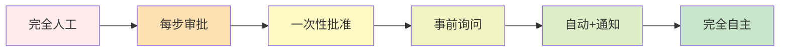
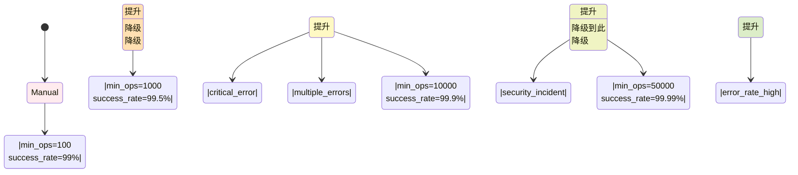

## 3.3 渐进信任原则

本节阐述渐进信任原则，介绍权限梯度模型、信任评分机制、动态权限调整和实施策略，说明如何通过观察和学习逐步提升智能体的自主权。

### 3.3.1 原则的核心

**渐进信任** 意味着：不要期望一下子就完全信任智能体的自主执行。而是应该设计一个逐步提升信任等级的过程，从完全人工控制，通过观察和学习，最终达到自主执行。

这个过程可以用一个信任梯度来表示：

| 信任等级 | 权限配置 | 实现方式 |
|---------|---------|---------|
| Level 0: Manual Only | 完全人工操作 | 每一步都需要人工批准 |
| Level 1: Approve Always | 每步审批 | 每个操作都需要批准 |
| Level 2: Approve Once | 一次性批准 | 任务开始时批准一次 |
| Level 3: Ask First | 事前询问 | 执行前要求人工确认 |
| Level 4: Auto with Notification | 自动+通知 | 自动执行并发送通知 |
| Level 5: Full Trust | 充分信任 | 完全自主，无需监控 |

这个梯度不是固定的，而是应该根据系统的表现动态调整的。如图所示，信任等级从完全人工操作逐步提升到完全自主执行：



图 3-3：渐进信任的六个等级

### 3.3.2 为什么需要渐进信任

本小节分析信任陡崖问题，说明渐进信任相比传统二元模式的优势。

#### 问题背景

许多 AI 系统的部署都失败于“信任陡崖”：

- 开发阶段：我们对模型进行了充分的测试，认为它已经足够聪明
- 部署阶段：我们突然给予它完全的自主权
- 灾难阶段：系统在真实世界中出现意外的行为

这种模式很像是：“我们在学校考试中得了 A，所以直接让这个学生毕业去当医生”。

渐进信任的思想是：**逐步提升权限，同时持续观察系统的行为**。

#### 渐进信任的收益

**1. 降低风险** 新权限的错误不会立即导致大规模灾难，而是被限制在较小的范围内。

**2. 积累证据** 通过观察系统在较低权限级别的表现，我们可以获得足够的证据，来判断是否应该提升权限。

**3. 快速恢复** 如果智能体在某个权限级别出错，我们可以降回之前的级别，而不是直接禁用。

**4. 用户信心** 逐步的权限提升给了用户看得见的进展和控制感。

### 3.3.3 权限梯度的详细设计

本小节详细介绍六个权限等级，从完全人工到完全信任，每个级别的实现方式和适用场景。

#### Level 0: Manual Only

完全人工模式要求每一步操作都经过人工审批，提供最高的控制和安全性：

```python
class ManualOnlyMode:
    """完全人工操作模式"""

    async def execute_operation(self, operation: Operation) -> Result:
        """
        每一步都需要人工批准。
        """
        # 1. Agent提议操作
        proposal = await agent.propose_operation(task)

        # 2. 等待人工批准
        approval = await request_human_approval(
            operation=proposal,
            timeout=timedelta(hours=24)
        )

        if approval.approved:
            # 3. 由人工或系统执行
            result = await execute_operation(proposal)
        else:
            result = Result(status="rejected", reason=approval.reason)

        return result
```

**适用场景**：系统刚上线，信任度最低

#### Level 1: Approve Always

每步审批模式要求每个操作执行前都获得人工批准，适合高风险操作：

```python
class ApproveAlwaysMode:
    """每个操作都需要人工审批"""

    async def execute_operation(self, operation: Operation) -> Result:
        """
        每个操作都需要事前批准。
        """
        # 请求批准
        approval = await request_human_approval(
            operation=operation,
            timeout=timedelta(minutes=5)
        )

        if not approval.approved:
            return Result(status="rejected")

        # 执行操作
        return await execute_operation(operation)
```

**适用场景**：高风险操作，每一步都需要人工确认

#### Level 2: Approve Once

一次性批准模式在任务开始时获得完整批准，减少审批频次同时保持控制：

```python
class ApprovedOnceMode:
    """任务开始时批准一次"""

    async def execute_task(self, task: Task) -> Result:
        """
        在任务开始时,对整个任务进行一次审批。
        一旦批准,任务执行过程中不再询问。
        """
        # 1. 任务规划阶段:Agent提议任务计划
        plan = await agent.plan_task(task)

        # 2. 人工审查:人工查看任务计划
        approval = await request_task_approval(
            task=task,
            plan=plan,
            timeout=timedelta(hours=1)
        )

        if not approval.approved:
            return Result(status="rejected")

        # 3. 执行阶段:任务自动执行
        result = await execute_task_plan(plan)

        # 4. 完成:生成执行报告
        report = generate_execution_report(result)

        return Result(
            status="success",
            output=result,
            report=report
        )
```

**适用场景**：生产环境，系统已证明可靠性

#### Level 3: Ask First

事前询问模式仅在执行关键操作前进行交互确认，平衡了自动化和安全性：

```python
class AskFirstMode:
    """关键操作事前询问"""

    # 定义哪些操作被认为是关键的
    CRITICAL_OPERATIONS = {
        "delete_data",
        "transfer_money",
        "modify_permissions"
    }

    async def execute_operation(self, operation: Operation) -> Result:
        """
        关键操作需要事前询问,其他操作自动执行。
        """
        if operation.type in self.CRITICAL_OPERATIONS:
            # 关键操作:询问
            approval = await request_human_approval(
                operation=operation,
                timeout=timedelta(minutes=5)
            )

            if not approval.approved:
                return Result(status="rejected")

        # 执行操作
        return await execute_operation(operation)
```

**适用场景**：开发/测试环境，系统表现良好但仍需对关键操作保持警觉

#### Level 4: Auto with Notification

自动执行加通知模式允许自动执行，同时实时通知用户进度和异常情况：

```python
class AutoWithNotificationMode:
    """自动执行,并发送通知"""

    async def execute_operation(self, operation: Operation) -> Result:
        """
        自动执行操作,执行后发送通知。
        """
        try:
            # 执行操作
            result = await execute_operation(operation)

            # 发送通知
            await notify_user(
                message=f"Operation {operation.type} completed",
                details=result,
                urgency="low"
            )

            return result

        except Exception as e:
            # 出错时发送警告通知
            await notify_user(
                message=f"Operation {operation.type} failed",
                error=str(e),
                urgency="high"
            )
            return Result(status="error", error=str(e))
```

**适用场景**：低风险日常操作，需要用户知晓

#### Level 5: Full Trust

充分信任模式完全自主执行，适合已充分验证且风险极低的场景：

```python
class FullTrustMode:
    """充分信任,无需额外监控"""

    async def execute_operation(self, operation: Operation) -> Result:
        """
        完全信任Agent,无需额外的验证或监控。
        """
        return await execute_operation(operation)
```

**适用场景**：系统已经运行多年，证明了其可靠性（罕见）

### 3.3.4 从一个等级提升到下一个等级

权限提升不应该是自动的，而应该基于明确的证据。

```python
class TrustEvaluator:
    """信任等级评估器"""

    # 各信任等级的提升标准
    PROMOTION_CRITERIA = {
        "Manual Only → Approve Always": {
            "min_operations": 100,
            "min_success_rate": 0.99,  # 99%成功率
            "min_duration_days": 7,    # 运行至少7天
            "no_critical_errors": True
        },
        "Approve Always → Approve Once": {
            "min_operations": 1000,
            "min_success_rate": 0.995,  # 99.5%
            "min_duration_days": 30,
            "no_critical_errors": True,
            "recent_error_rate": 0.005  # 最近的错误率<0.5%
        },
        "Approve Once → Ask First": {
            "min_operations": 10000,
            "min_success_rate": 0.999,  # 99.9%
            "min_duration_days": 90,
            "no_critical_errors": True
        },
        "Ask First → Auto with Notification": {
            "min_operations": 50000,
            "min_success_rate": 0.9999,  # 99.99%
            "min_duration_days": 180,
            "no_critical_errors_in_recent_month": True
        },
        "Auto with Notification → Full Trust": {
            "min_operations": 1000000,
            "min_success_rate": 0.99999,  # 99.999%
            "min_duration_days": 365,
            "no_critical_errors_in_recent_quarter": True
        }
    }

    async def evaluate_promotion(
        self,
        current_level: TrustLevel,
        agent_history: AgentHistory
    ) -> Optional[TrustLevel]:
        """
        评估是否应该提升智能体的信任等级。
        """
        next_level = self._get_next_level(current_level)
        criteria = self.PROMOTION_CRITERIA.get(f"{current_level} → {next_level}")

        if criteria is None:
            return None  # 已经是最高等级

        # 检查所有标准
        checks = {
            "operations": agent_history.total_operations >= criteria["min_operations"],
            "success_rate": agent_history.success_rate >= criteria["min_success_rate"],
            "duration": agent_history.days_running >= criteria["min_duration_days"],
            "critical_errors": not criteria.get("no_critical_errors", False)
                               or not agent_history.has_critical_errors
        }

        # 所有标准都满足才能提升
        if all(checks.values()):
            logger.info(f"Agent {agent_history.agent_id} promoted from {current_level} to {next_level}",
                       extra={"checks": checks})
            return next_level

        logger.info(f"Agent promotion blocked",
                   extra={"agent_id": agent_history.agent_id, "failed_checks": {k: v for k, v in checks.items() if not v}})
        return None

    def _get_next_level(self, current_level: TrustLevel) -> TrustLevel:
        """获取下一个信任等级"""
        levels = [
            "Manual Only",
            "Approve Always",
            "Approve Once",
            "Ask First",
            "Auto with Notification",
            "Full Trust"
        ]
        idx = levels.index(current_level)
        return levels[idx + 1] if idx < len(levels) - 1 else None
```

### 3.3.5 降级机制

信任不仅可以提升，也应该在必要时降级。如图所示，智能体的信任等级通过提升和降级机制动态调整，以保持安全性和有效性的平衡：



图 3-4：信任等级的提升和降级机制

```python
class TrustDemotionTrigger:
    """信任降级触发器"""

    # 触发降级的条件
    DEMOTION_TRIGGERS = {
        "critical_error": 1,           # 一次严重错误
        "multiple_errors_in_short_time": 3,  # 短时间内多次错误
        "security_incident": 1,        # 一次安全事件
        "user_complaint": 5            # 5个用户投诉
    }

    async def check_and_demote(
        self,
        agent_id: str,
        recent_history: List[AgentEvent]
    ) -> Optional[TrustLevel]:
        """
        检查是否应该降级智能体的信任等级。
        """
        current_level = await get_agent_trust_level(agent_id)

        # 计数各类事件
        event_counts = {
            "critical_errors": sum(1 for e in recent_history if e.type == "critical_error"),
            "errors_24h": sum(1 for e in recent_history if e.type == "error" and
                             e.timestamp > datetime.now() - timedelta(hours=24)),
            "security_incidents": sum(1 for e in recent_history if e.type == "security_incident"),
            "complaints": sum(1 for e in recent_history if e.type == "user_complaint")
        }

        # 检查触发条件
        if event_counts["critical_errors"] >= self.DEMOTION_TRIGGERS["critical_error"]:
            demoted_level = self._get_previous_level(current_level)
            logger.warning(f"Agent {agent_id} demoted due to critical error",
                          extra={"from": current_level, "to": demoted_level})
            return demoted_level

        if event_counts["errors_24h"] >= self.DEMOTION_TRIGGERS["multiple_errors_in_short_time"]:
            demoted_level = self._get_previous_level(current_level)
            logger.warning(f"Agent {agent_id} demoted due to multiple errors",
                          extra={"event_counts": event_counts})
            return demoted_level

        if event_counts["security_incidents"] >= self.DEMOTION_TRIGGERS["security_incident"]:
            demoted_level = "Ask First"  # 直接降回询问级别
            logger.error(f"Agent {agent_id} demoted to Ask First due to security incident")
            return demoted_level

        return None

    def _get_previous_level(self, current_level: TrustLevel) -> TrustLevel:
        """获取前一个信任等级"""
        # 至少降级一个等级,最多保留在Ask-First
        levels = ["Manual Only", "Approve Always", "Approve Once", "Ask First", "Auto with Notification", "Full Trust"]
        idx = max(0, levels.index(current_level) - 1)
        return levels[idx]
```

### 3.3.6 可视化信任演进

我们可以通过代码来可视化每个智能体的信任等级演进历史：

```python
def visualize_trust_evolution(agent_history: AgentHistory) -> str:
    """生成Agent信任等级演进的可视化"""
    lines = [f"Agent: {agent_history.agent_id}"]
    lines.append(f"Current Trust Level: {agent_history.current_trust_level}\n")

    # 时间线
    lines.append("Timeline of Trust Changes:")
    for event in agent_history.trust_changes:
        lines.append(f"  {event.timestamp.strftime('%Y-%m-%d')} "
                    f"{event.from_level} → {event.to_level}")

    # 统计数据
    lines.append(f"\nStats:")
    lines.append(f"  Total Operations: {agent_history.total_operations}")
    lines.append(f"  Success Rate: {agent_history.success_rate:.2%}")
    lines.append(f"  Critical Errors: {agent_history.critical_errors}")
    lines.append(f"  Days Running: {agent_history.days_running}")

    # 提升建议
    next_level = agent_history.promotion_readiness
    if next_level:
        lines.append(f"\nPromotion Eligible: {agent_history.current_trust_level} → {next_level}")

    return "\n".join(lines)
```

### 3.3.7 总结

渐进信任原则的关键要点：

1. **信任是逐步建立的**，不要期望一步到位
2. **有明确的提升标准**，不是主观决定
3. **也要有降级机制**，快速响应问题
4. **持续监控**，收集足够的证据
5. **透明可视**，让所有相关者了解信任的演进过程

这个原则特别适用于长期运行的系统，如 OpenClaw 的自驱型 Agent，它们需要在生产环境中逐步获得更多的权限和自主性。
