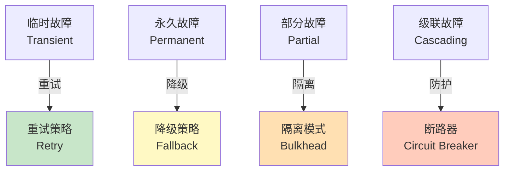
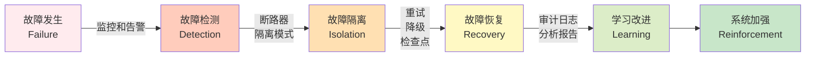

## 3.4 故障假设原则

故障假设是构建可靠系统的基础原则。本节介绍这一原则的核心概念，以及对不同故障类型的处理策略、检查点机制、监控告警和完整的故障恢复流程。

### 3.4.1 原则的核心

**故障假设** 意味着：在设计系统时，**主动假设每一步都可能失败**，并提前设计如何处理这些失败。这不是悲观主义，而是现实主义的系统工程。

与其相反的方法是对比如下：

| 设计方法 | 处理方式 | 结果 |
|--------|--------|------|
| **乐观设计** | 假设一切都会正常运行 | 当出现意外时，系统直接崩溃；用户蒙受损失，系统陷入不一致状态 |
| **故障假设** | 假设会出现意外 | 当出现意外时，系统有预案；优雅地降级，数据保持一致 |

### 3.4.2 为什么故障假设如此重要

#### 墨菲定律的启示

墨菲定律说：“任何可能出错的事情，最终都会出错，而且会在最糟糕的时刻出错。”

在智能体系统中，这尤其真实，因为我们处理的是概率系统。LLM不是确定的，网络不是可靠的，外部API也会偶尔宕机。

#### 数据统计

在一个真实的生产系统中：

- **API调用失败率**：通常在0.1-1%
- **网络超时率**：通常在0.01-0.1%
- **数据库连接失败**：通常在0.001-0.01%

乍一看这些比率很低，但在高并发系统中，这意味着什么？

假设系统每天处理100万个任务，每个任务平均进行10个API调用：
```text
总API调用数：100万 × 10 = 1000万次
在0.5%失败率下：1000万 × 0.005 = 50,000次失败
```

50,000次失败每天都会发生。如果系统没有为这些失败做准备，那就是50,000个用户的糟糕体验。

### 3.4.3 故障的类型和处理策略

如图所示，系统需要针对不同类型的故障采用不同的处理策略，从临时故障的重试到级联故障的断路器防护：


图 3-5：故障类型和处理策略

#### 类型1：临时故障

网络超时、API临时不可用等，通常过一段时间就会恢复。

**处理策略：重试**
```python
class RetryStrategy:
    """重试策略"""

    def __init__(
        self,
        max_retries: int = 3,
        base_delay_seconds: float = 1.0,
        exponential_base: float = 2.0,
        jitter: bool = True
    ):
        self.max_retries = max_retries
        self.base_delay_seconds = base_delay_seconds
        self.exponential_base = exponential_base
        self.jitter = jitter

    async def execute_with_retry(
        self,
        operation: Callable,
        *args,
        **kwargs
    ) -> Any:
        """
        执行操作，失败时自动重试。
        """
        last_error = None

        for attempt in range(self.max_retries + 1):
            try:
                return await operation(*args, **kwargs)

            except Exception as e:
                last_error = e

                # 判断是否应该重试
                if not self._is_retryable(e):
                    raise

                # 计算延迟
                if attempt < self.max_retries:
                    delay = self._calculate_delay(attempt)
                    logger.info(
                        f"Retry attempt {attempt + 1}/{self.max_retries} "
                        f"after {delay:.1f}s",
                        extra={"error": str(e)}
                    )
                    await asyncio.sleep(delay)

        # 所有重试都失败了
        raise last_error

    def _is_retryable(self, error: Exception) -> bool:
        """判断错误是否可重试"""
        retryable_errors = (
            asyncio.TimeoutError,
            ConnectionError,
            TimeoutError,
            # 某些HTTP错误可以重试
        )
        return isinstance(error, retryable_errors)

    def _calculate_delay(self, attempt: int) -> float:
        """计算重试延迟（指数退避）"""
        delay = self.base_delay_seconds * (self.exponential_base ** attempt)

        if self.jitter:
            # 添加随机抖动，避免"羊群效应"
            jitter = random.uniform(0, delay * 0.1)
            delay += jitter

        # 设置最大延迟
        max_delay = 60  # 最多等60秒
        return min(delay, max_delay)

# 使用示例
retry_strategy = RetryStrategy(max_retries=3, base_delay_seconds=0.5)

async def call_weather_api(city: str):
    """调用天气API"""
    return await retry_strategy.execute_with_retry(
        weather_api.get,
        city=city
    )
```

#### 类型2：永久故障

API被删除、数据库不存在、权限不足等，重试也无法解决。

**处理策略：降级/回退**
```python
class FallbackStrategy:
    """降级/回退策略"""

    def __init__(self, fallbacks: List[Callable]):
        """
        初始化降级策略。
        fallbacks是一个优先级列表，包含多个备选方案。
        """
        self.fallbacks = fallbacks

    async def execute_with_fallback(
        self,
        *args,
        **kwargs
    ) -> Any:
        """
        尝试执行，如果失败则使用备选方案。
        """
        last_error = None

        for i, fallback in enumerate(self.fallbacks):
            try:
                result = await fallback(*args, **kwargs)
                logger.info(
                    f"Fallback {i} succeeded",
                    extra={"fallback": fallback.__name__}
                )
                return result

            except Exception as e:
                last_error = e
                logger.warning(
                    f"Fallback {i} failed, trying next",
                    extra={"error": str(e)}
                )

        # 所有回退都失败了
        raise last_error

# 使用示例：如果无法获取实时天气，使用缓存数据，再不行使用默认值

async def get_weather_with_fallback(city: str):
    """获取天气，支持降级"""

    # 备选方案优先级：实时数据 > 缓存数据 > 默认值
    strategy = FallbackStrategy([
        lambda c: real_time_weather_api.get(c),
        lambda c: cached_weather.get(c),
        lambda c: default_weather_for(c)
    ])

    return await strategy.execute_with_fallback(city)
```

#### 类型3：部分故障

在一个分布式系统中，一部分组件失败，但其他部分仍在运行。

**处理策略：分离和隔离**
```python
class BulkheadPattern:
    """隔离模式：防止一个故障影响整个系统"""

    def __init__(self, num_compartments: int = 10):
        self.compartments = [asyncio.Semaphore(10) for _ in range(num_compartments)]

    def get_compartment(self, request_id: str) -> asyncio.Semaphore:
        """根据请求ID，将其分配到某个隔离舱"""
        compartment_idx = hash(request_id) % len(self.compartments)
        return self.compartments[compartment_idx]

    async def execute_isolated(
        self,
        request_id: str,
        operation: Callable,
        *args,
        **kwargs
    ) -> Any:
        """
        在隔离的舱中执行操作。
        如果一个舱出现问题，不会影响其他舱。
        """
        compartment = self.get_compartment(request_id)

        async with compartment:
            return await operation(*args, **kwargs)

# 使用示例
bulkhead = BulkheadPattern(num_compartments=20)

async def process_request(request_id: str, request_data: dict):
    """处理请求，使用隔离模式"""
    return await bulkhead.execute_isolated(
        request_id,
        process_request_logic,
        request_data
    )
```

#### 类型4：级联故障

一个组件的故障导致其他组件也失败，最终整个系统崩溃。

**处理策略：断路器**
```python
from enum import Enum

class CircuitState(Enum):
    CLOSED = "closed"          # 正常状态
    OPEN = "open"              # 故障状态，拒绝请求
    HALF_OPEN = "half_open"    # 恢复测试状态

class CircuitBreaker:
    """断路器：防止级联故障"""

    def __init__(
        self,
        failure_threshold: int = 5,
        recovery_timeout_seconds: int = 60
    ):
        self.failure_threshold = failure_threshold
        self.recovery_timeout_seconds = recovery_timeout_seconds
        self.state = CircuitState.CLOSED
        self.failure_count = 0
        self.last_failure_time = None
        self.last_recovery_attempt = None

    async def execute(
        self,
        operation: Callable,
        *args,
        **kwargs
    ) -> Any:
        """
        通过断路器执行操作。
        """
        # 检查是否应该转换到HALF_OPEN状态
        self._update_state()

        # 根据当前状态决定是否执行
        if self.state == CircuitState.OPEN:
            raise CircuitBreakerOpenError(
                f"Circuit breaker is OPEN, rejecting request"
            )

        try:
            result = await operation(*args, **kwargs)
            # 成功，重置计数
            self._record_success()
            return result

        except Exception as e:
            # 失败，记录
            self._record_failure()
            raise

    def _update_state(self):
        """更新断路器状态"""
        if self.state == CircuitState.OPEN:
            # 如果已经打开足够长的时间，尝试恢复
            if (datetime.now() - self.last_failure_time).seconds > self.recovery_timeout_seconds:
                self.state = CircuitState.HALF_OPEN
                self.last_recovery_attempt = datetime.now()
                logger.info("Circuit breaker transitioned to HALF_OPEN")

    def _record_success(self):
        """记录成功"""
        if self.state == CircuitState.HALF_OPEN:
            # 从HALF_OPEN成功恢复到CLOSED
            self.state = CircuitState.CLOSED
            self.failure_count = 0
            logger.info("Circuit breaker recovered to CLOSED")
        elif self.state == CircuitState.CLOSED:
            # 恢复失败计数
            if self.failure_count > 0:
                self.failure_count = max(0, self.failure_count - 1)

    def _record_failure(self):
        """记录失败"""
        self.failure_count += 1
        self.last_failure_time = datetime.now()

        if self.failure_count >= self.failure_threshold and self.state != CircuitState.OPEN:
            self.state = CircuitState.OPEN
            logger.warning(
                f"Circuit breaker opened after {self.failure_count} failures"
            )

class CircuitBreakerOpenError(Exception):
    """断路器打开时的异常"""
    pass

# 使用示例
breaker = CircuitBreaker(failure_threshold=5, recovery_timeout_seconds=30)

async def call_external_api():
    return await breaker.execute(external_api.request)
```

### 3.4.4 检查点和事务

对于长流程的操作，需要设置检查点，以便从中间进行恢复。
```python
class CheckpointedExecution:
    """支持检查点的执行"""

    def __init__(self, checkpoint_storage):
        self.checkpoint_storage = checkpoint_storage

    async def execute_with_checkpoints(
        self,
        task_id: str,
        steps: List[Step]
    ) -> Result:
        """
        执行一系列步骤，每个步骤前后都保存检查点。
        """
        # 检查是否有之前的检查点，以便恢复
        checkpoint = await self.checkpoint_storage.load(task_id)
        start_idx = checkpoint.last_completed_step + 1 if checkpoint else 0

        results = []

        for i in range(start_idx, len(steps)):
            step = steps[i]

            try:
                # 执行步骤
                result = await execute_step(step)
                results.append(result)

                # 保存检查点
                await self.checkpoint_storage.save(
                    task_id,
                    CheckPoint(
                        last_completed_step=i,
                        results_so_far=results
                    )
                )

            except Exception as e:
                # 步骤失败，保存失败检查点
                await self.checkpoint_storage.save_error(
                    task_id,
                    ErrorCheckPoint(
                        failed_step=i,
                        error=str(e),
                        partial_results=results
                    )
                )
                raise

        # 完成后，清理检查点
        await self.checkpoint_storage.delete(task_id)
        return Result(status="success", outputs=results)

    async def resume_task(self, task_id: str, steps: List[Step]) -> Result:
        """
        恢复一个之前失败的任务。
        """
        checkpoint = await self.checkpoint_storage.load(task_id)
        if checkpoint is None:
            raise ValueError(f"No checkpoint found for task {task_id}")

        logger.info(
            f"Resuming task {task_id} from step {checkpoint.last_completed_step + 1}",
            extra={"step_index": checkpoint.last_completed_step + 1}
        )

        return await self.execute_with_checkpoints(
            task_id,
            steps
        )
```

### 3.4.5 监控和告警

故障假设的最后一部分是：**快速检测故障**。
```python
class HealthMonitor:
    """系统健康监控"""

    async def monitor(self):
        """持续监控系统健康"""
        while True:
            metrics = await self._collect_metrics()

            # 检查关键指标
            alerts = []

            # 1. 错误率过高
            if metrics["error_rate"] > 0.01:  # >1%
                alerts.append(Alert(
                    severity="critical",
                    message=f"Error rate {metrics['error_rate']:.2%} exceeds threshold"
                ))

            # 2. 响应时间过长
            if metrics["avg_response_time_ms"] > 1000:
                alerts.append(Alert(
                    severity="warning",
                    message=f"Avg response time {metrics['avg_response_time_ms']:.0f}ms"
                ))

            # 3. 任务积压
            if metrics["pending_tasks"] > 10000:
                alerts.append(Alert(
                    severity="warning",
                    message=f"{metrics['pending_tasks']} tasks pending"
                ))

            # 4. 外部依赖不可用
            for dependency, available in metrics["dependencies"].items():
                if not available:
                    alerts.append(Alert(
                        severity="critical",
                        message=f"Dependency {dependency} is unavailable"
                    ))

            # 发送告警
            for alert in alerts:
                await self._send_alert(alert)

            await asyncio.sleep(60)  # 每分钟检查一次
```

### 3.4.6 故障恢复的总结

故障恢复包括以下几个关键阶段。如图所示，完整的故障处理流程包括从故障检测到学习改进的全过程：


图 3-6：完整的故障恢复流程

### 3.4.7 总结

故障假设原则的关键要点：

1. **接受故障会发生**，而不是希望它们不发生
2. **为每种故障类型设计处理机制**：重试、降级、隔离、断路器
3. **设置检查点和事务**，允许从中间恢复
4. **持续监控和告警**，快速检测故障
5. **从故障中学习**，不断改进系统韧性

这个原则将一个脆弱的系统变成了一个真正“可靠”（reliable）的系统。
