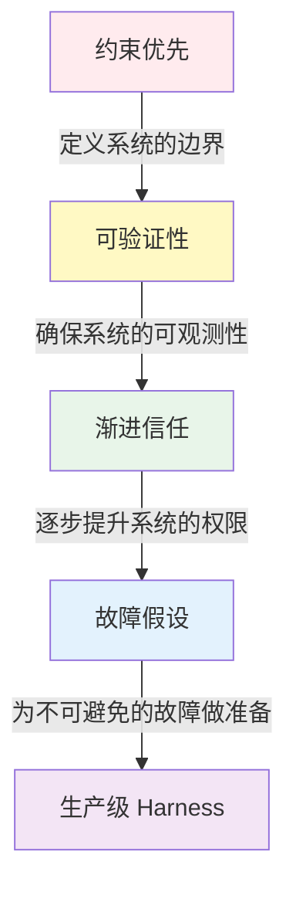
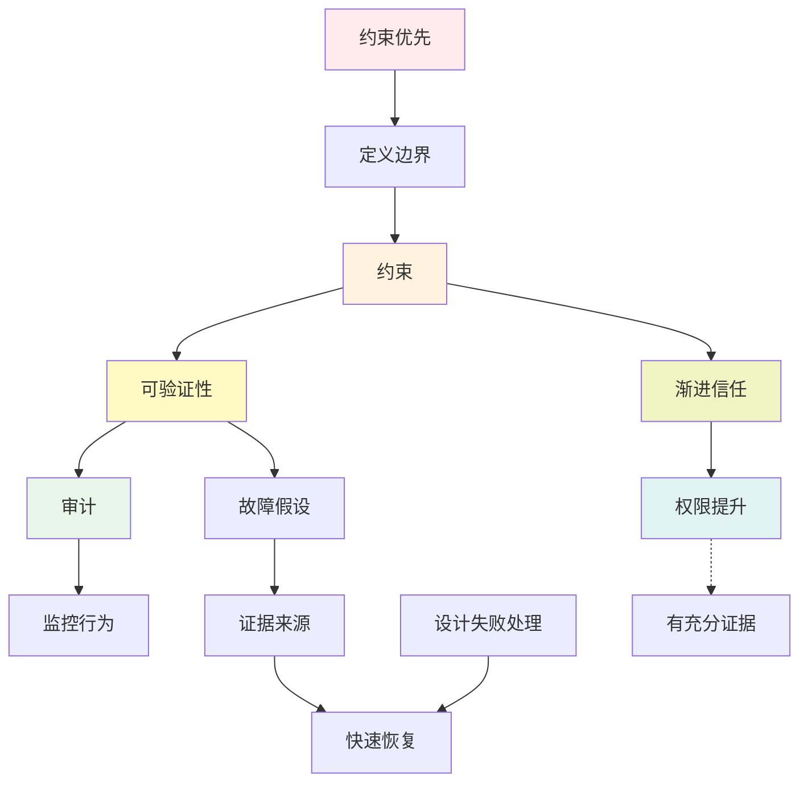
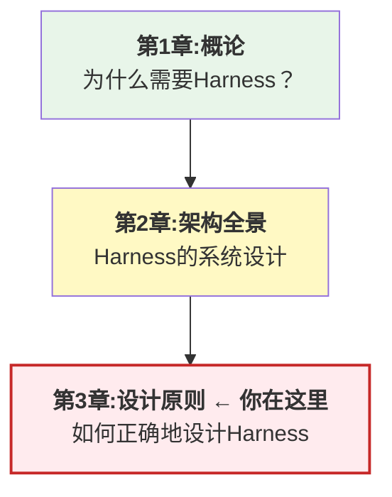

## 本章小结

本章阐述了Harness系统的四大设计原则，以下是核心要点的系统回顾。

### 四大设计原则的完整体系

本章介绍了构建生产级Harness系统的四大设计原则。这些原则相互补充、形成了一个完整的设计哲学体系：



### 四大原则的各自职责

#### 1. 约束优先

**核心思想**：首先定义Agent不能做什么，然后在这个框架内赋予能力。

**关键要素**：

- 权限维度：可以访问哪些资源
- 操作维度：禁止哪些操作
- 时间维度：什么时候允许操作
- 数据维度：什么样的数据可以处理

**实现方法**：

- 白名单（最安全）
- 黑名单（最灵活）
- 规则引擎（最平衡）

在实践中，Claude Code 通过 protected files 和 dangerous patterns 实现约束优先，OpenClaw 则通过 SOUL.md 约束文档来定义边界。

#### 2. 可验证性

**核心思想**：系统的每一个操作都应该是可观测的、可追踪的、可重放的。

**三个层次**：

1. **操作日志**：记录发生了什么
2. **执行追踪**：记录操作之间的因果关系
3. **可重放性**：给定相同输入，能够重现执行

**关键实现**：

- 结构化日志，便于搜索和分析
- 分布式追踪，显示完整的执行路径
- 执行重放，验证系统一致性

在实践中，Claude Code 基于 OpenTelemetry 实现分布式追踪，OpenClaw 则通过 Lobster 确定性日志实现执行重放。

#### 3. 渐进信任

**核心思想**：不要期望一下子完全信任Agent，而是通过观察和学习逐步提升权限。

**信任梯度** （从低到高）：

1. Manual Only：完全人工操作
2. Approve Always：每步审批
3. Approve Once：任务开始时批准一次
4. Ask First：关键操作事前询问
5. Auto with Notification：自动执行并通知
6. Full Trust：充分信任（罕见）

**提升和降级**：

- 提升需要明确的证据和标准
- 降级可以快速响应问题
- 持续的监控和评估

#### 4. 故障假设

**核心思想**：主动假设每一步都可能失败，并提前设计失败处理。

**故障类型和处理**：

- 临时故障 → 重试(Retry)
- 永久故障 → 降级/回退(Fallback)
- 部分故障 → 隔离(Bulkhead)
- 级联故障 → 断路器(Circuit Breaker)

**关键机制**：

- 指数退避重试，避免羊群效应
- 检查点和事务，支持中间恢复
- 持续监控和告警，快速检测故障

### 四大原则的相互关系

四大原则并非孤立，而是相互支撑的完整体系，如下所示：



### 实践中的集成应用

这四大原则在实际系统设计中是高度集成的：

**设计一个转账系统**

**约束优先**：定义智能体的权限

```python
permissions = {
    "transfer_money": {
        "max_amount_per_operation": 1000,
        "max_amount_per_day": 10000,
        "requires_approval": "Approve Always"
    }
}
```

**可验证性**：记录每个转账操作

```yaml
Trace ID: trace-2024-04-01-001
Step 1: Check balance
Step 2: Validate transfer
Step 3: Execute transfer
Step 4: Send confirmation
→ 完整的操作日志供后续审计
```

**渐进信任**：根据Agent表现逐步提升权限

```text
初期:Approve Always(每次转账都需要人工批准)
一周后:Ask First(小额转账自动,大额需要确认)
一月后:Auto with Notification(自动执行并通知用户)
```

**故障假设**：为可能的失败设计处理

```text
失败场景1:网络超时 → 重试3次
失败场景2:余额不足 → 报告给用户
失败场景3:外部API宕机 → 使用缓存的汇率
失败场景4:多个转账失败 → 启动断路器,停止新转账
```

### 与前两章的关系

本章与前两章的关系和递进逻辑如下：



### MiniHarness中应用这些原则

在MiniHarness项目中，这些原则的应用包括：

#### MiniHarness中的约束优先

在工具注册表中实现约束优先原则：

```python
# 第2章已经定义了ToolRegistry
# 第3章应该添加权限检查

from mini_harness.security.permissions import PermissionDecisionEngine

class ToolRegistry:
    async def call_tool(self, tool_name, params):
        # 首先检查权限
        if not await permission_manager.check_permission(tool_name):
            raise PermissionError(f"Tool {tool_name} not allowed")

        # 然后执行
        return await self._execute_tool(tool_name, params)
```

#### MiniHarness中的可验证性

通过结构化日志实现可验证性：

```python
# 添加审计日志

from mini_harness.reliability.logging import StructuredLogger

class ToolExecutor:
    async def execute(self, tool_name, params):
        logger.info("Tool execution started", extra={
            "tool_name": tool_name,
            "params": params
        })

        result = await self._execute_tool(tool_name, params)

        logger.info("Tool execution completed", extra={
            "tool_name": tool_name,
            "status": result.status,
            "duration_ms": result.duration
        })

        return result
```

#### MiniHarness中的渐进信任

实现权限等级管理以支持渐进信任：

```python
# 添加权限等级管理

from mini_harness.security.permissions import PermissionLevel

class AgentTrustManager:
    async def update_trust_level(self, agent_id):
        # 评估是否应该提升信任等级
        # 根据agent历史记录调整权限等级
        history = await self.get_agent_history(agent_id)

        # 简化的信任提升逻辑 - 实际实现可更复杂
        if history.success_rate > 0.95:
            new_level = PermissionLevel.AUTO
        else:
            new_level = PermissionLevel.ASK

        current_level = await self.get_agent_level(agent_id)
        if new_level and new_level.value > current_level.value:
            await self.promote_agent(agent_id, new_level)
```

#### MiniHarness中的故障假设

实现容错机制以处理故障场景：

```python
# 添加重试和降级机制

from mini_harness.reliability.resilience import RetryConfig, CircuitBreaker

class ResilientToolExecutor:
    async def execute(self, tool_name, params):
        # 重试配置
        retry_config = RetryConfig(max_attempts=3, initial_delay=1.0)

        try:
            # 使用重试机制执行工具调用
            attempt = 1
            while attempt <= retry_config.max_attempts:
                try:
                    return await self.tool_registry.call_tool(tool_name, params)
                except Exception as e:
                    if not retry_config.should_retry(e):
                        raise
                    if attempt >= retry_config.max_attempts:
                        raise
                    delay = retry_config.calculate_delay(attempt)
                    await asyncio.sleep(delay)
                    attempt += 1
        except Exception as e:
            # 降级到缓存结果或默认值
            cached = self.cached_results.get(tool_name)
            if cached:
                return cached
            return self.default_value_for(tool_name)
```

### 评估清单

在实现一个Harness系统时，检查以下清单来确保所有四大原则都被正确应用：

#### 约束优先检查清单

- [ ] 明确定义了智能体可以访问的资源
- [ ] 列出了禁止的操作
- [ ] 实现了权限检查机制
- [ ] 定义了时间和数据的约束

#### 可验证性检查清单

- [ ] 所有操作都被记录在审计日志中
- [ ] 支持执行追踪（可以看到完整的执行路径）
- [ ] 关键操作可以被重放
- [ ] 提供了人类可读的摘要和机器可读的详细日志

#### 渐进信任检查清单

- [ ] 定义了信任等级和升级标准
- [ ] 实现了权限提升评估机制
- [ ] 实现了权限降级触发器
- [ ] 可以可视化信任的演进过程

#### 故障假设检查清单

- [ ] 识别了可能的故障类型
- [ ] 为每种故障设计了处理机制
- [ ] 实现了重试、降级、隔离、断路器等机制
- [ ] 有监控和告警系统，快速检测故障

### 常见的误区

#### 误区1：过度约束

**问题**：为了安全起见，给Agent几乎没有权限。
**结果**：Agent无法完成任何有意义的工作。
**解决**：使用渐进信任，逐步扩展权限。

#### 误区2：忽视可验证性

**问题**：为了性能，不记录详细日志。
**结果**：出现问题时无法诊断。
**解决**：记录足够的信息用于调试，但使用异步日志避免性能影响。

#### 误区3：假设不会出现故障

**问题**：认为系统足够可靠，不需要额外的故障处理。
**结果**：小故障导致大事件。
**解决**：主动设计故障处理机制。

#### 误区4：权限一成不变

**问题**：定义权限后，再也不调整。
**结果**：权限要么太宽松（安全问题），要么太严格（效率问题）。
**解决**：根据运行数据定期评估和调整。

### 与业界最佳实践的对齐

这四大原则与业界的系统工程最佳实践高度对齐：

- **约束优先** ↔ “白名单优于黑名单”（安全工程）
- **可验证性** ↔ “日志和追踪”（SRE最佳实践）
- **渐进信任** ↔ “逐步展开”（DevOps实践）
- **故障假设** ↔ “混沌工程”（系统可靠性）

### 总结和后续步骤

本章确立了Harness系统的四大设计原则。这些原则：

1. **相互补充**：组合在一起，形成了一个完整的安全、可靠、可管理的系统
2. **可操作化**：不是抽象的哲学，而是可以具体实现的工程实践
3. **可度量**：每个原则都有具体的指标可以评估

从第4章开始，我们将进入各个子系统的深入实现，而这四大原则将在每个子系统中不断体现。

### 关键概念回顾表

| 原则 | 核心思想 | 关键实现 | 检验标准 |
|------|---------|---------|---------|
| 约束优先 | 限制比赋能更重要 | 权限检查、隔离 | 能清楚回答智能体能做什么 |
| 可验证性 | 每步都可审计 | 日志、追踪、重放 | 能重现任何操作的细节 |
| 渐进信任 | 信任逐步建立 | 权限评估、升降级 | 有明确的升级标准 |
| 故障假设 | 故障总会发生 | 重试、降级、隔离 | 单个故障不会导致系统崩溃 |

下一章将深入运行时引擎的实现，这些设计原则将在实践中得到充分体现。
