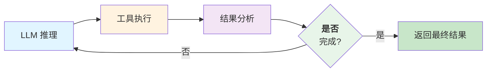
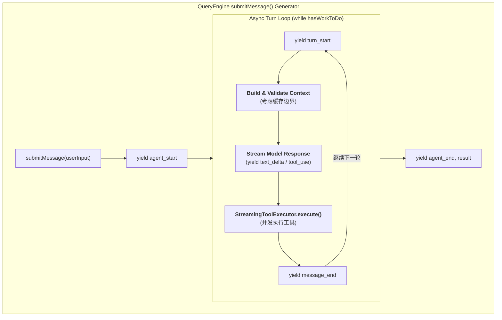
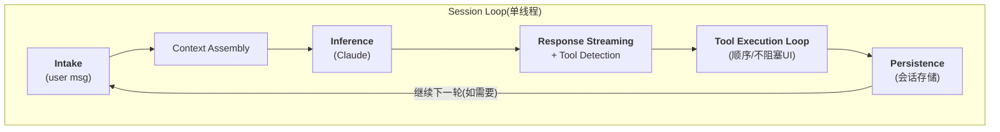

## 4.1 智能体循环的工程实现

智能体循环是运行时的核心执行模式，定义了Agent如何在思考、行动和观察三个阶段间反复迭代。本节对比Claude Code和OpenClaw两种实现模式，分析循环的终止条件和消息流演化。

### 4.1.1 概念模型：思考-行动-观察循环

智能体循环（Agent Loop）是智能体系统的核心执行模式。经典的“思考-行动-观察”(Think-Act-Observe)循环定义如下：

1. **思考(Think)**：Agent 基于当前上下文（历史、状态、工具信息）进行推理，生成意图和下一步行动计划
2. **行动(Act)**：Agent 执行工具调用或发起 API 请求，改变外部世界状态
3. **观察(Observe)**：Agent 获得工具执行结果，更新内部认知模型，为下一轮思考做准备

如果工具调用失败或返回意外结果，观察阶段会将其作为“负面证据”反馈给思考模块，触发错误恢复或备选方案。

**思考-行动-观察循环流程：**



图 4-1：思考-行动-观察循环

**为什么是循环而不是链**

传统的链式智能体(Chain-of-Thought)将思考和行动分开，形如：提示→思考→规划→工具调用→输出。这种设计的缺点是：

- **缺乏适应性**：一旦执行遇到问题（工具调用失败、输出超限），难以动态调整策略
- **低效率**：规划阶段必须预测所有可能的工具调用，容易过度规划或不足规划
- **不可恢复**：一旦规划失败，需要重新启动整个流程

**循环设计** 允许智能体逐步细化目标，在每个循环迭代中获得反馈，动态调整策略。这更符合人类解决问题的过程。

### 4.1.2 工程实现模式对比

#### Claude Code 的异步生成器模式

Claude Code采用异步生成器模式实现智能体循环，具体如下：



**特点**：

- 异步生成器模式，客户端可以逐个处理事件
- 支持流式响应实时推送(text_delta)
- StreamingToolExecutor 支持工具的并发执行
- 上下文构建时考虑缓存边界(SYSTEM_PROMPT_DYNAMIC_BOUNDARY)
- AppState 管理会话状态（150+ 字段）

**Claude Code 的核心代码骨架** （伪代码）：

```python
class QueryEngine:
    async def submitMessage(self, user_input: str):
        """异步生成器循环,每次 yield 一个事件"""
        yield AgentStartEvent()

        # 初始化会话状态
        app_state = self.init_app_state(user_input)

        while app_state.has_work_to_do():
            yield TurnStartEvent()

            # 构建完整的消息和上下文
            # 考虑缓存边界,分离系统提示词和动态上下文
            system_prompt = self.get_system_prompt()
            messages = await self.build_messages(app_state)

            # 检查Token预算
            if self.estimate_tokens(system_prompt + messages) > self.token_budget:
                messages = self.auto_compact_history(messages)

            # 流式调用模型
            stream = await self.model_client.create_message_stream(
                messages=messages,
                system=system_prompt,
                tools=self.get_available_tools()
            )

            # 逐个处理流中的事件
            async for event in stream:
                if event.type == "content_block_start":
                    # 新的内容块开始(文本或工具使用)
                    yield event

                elif event.type == "content_block_delta":
                    if event.delta.type == "text_delta":
                        yield TextDeltaEvent(event.delta.text)
                    elif event.delta.type == "input_json_delta":
                        yield ToolInputDeltaEvent(event.delta.text)

                elif event.type == "message_delta":
                    # 消息完成
                    message = event.message

                    # 异步执行工具(StreamingToolExecutor)
                    tool_results = await self.execute_tools(
                        message.content,
                        app_state
                    )

                    # 更新应用状态
                    app_state.add_message(message)
                    app_state.add_tool_results(tool_results)

                    yield MessageEndEvent(message)

                    # 检查是否需要继续
                    if not tool_results:
                        app_state.mark_done()
                    # 否则继续下一轮(while 循环)

        # 返回最终结果
        yield AgentEndEvent(
            result=app_state.final_response,
            message_count=len(app_state.messages)
        )
```

#### OpenClaw 的线性流水线模式

OpenClaw采用线性流水线模式，在单个事件循环中顺序执行，具体如下：



**特点**：

- 每轮循环是独立的阶段：input → assembly → inference → execution → persist
- 单线程执行，一次一个会话，不支持会话间并发
- 工具执行与流式响应紧耦合
- 错误作为“观察”(ToolResultBlock)反馈回消息流

**OpenClaw 的核心代码骨架** （伪代码）：

```python
class SessionRuntime:
    def run_session(self, session_id: str):
        """单个会话的运行时主循环"""
        while True:
            # 1. Intake:获取用户输入或等待事件
            user_message = self.intake_queue.get(timeout=30)
            if user_message is None:
                break  # 会话结束

            # 2. Context Assembly:组装上下文（每条新用户消息只组装一次）
            context = self.context_engine.assemble(
                session_id=session_id,
                user_input=user_message,
                system_prompt=self.system_prompt,
                tools_schema=self.get_tools_schema(),
                memory=self.memory_store.load(session_id)
            )

            # Initialize messages from context
            messages = context.messages.copy()

            # 3-4. 推理与工具调用循环：直到模型不再请求工具（4.1.3 的"工具调用耗尽"终止条件）
            while True:
                # 3. Inference:调用模型
                response = self.model_client.create_message(
                    messages=messages,
                    system=context.system_prompt,
                    tools=context.tools,
                    max_tokens=context.token_budget
                )

                # 4. Tool Execution Loop:处理本轮 response 中的所有工具调用
                tool_results = []
                for tool_use in response.content:
                    if isinstance(tool_use, ToolUseBlock):
                        result = self.execute_tool(
                            tool_use.name,
                            tool_use.input
                        )
                        tool_results.append(ToolResultBlock(
                            tool_use_id=tool_use.id,
                            content=result
                        ))

                # 没有工具调用 → 推理完成，跳出内层循环
                if not tool_results:
                    break

                # 有工具调用 → 把原 response 与 tool_results 追加到 messages，继续内层推理
                # 注意：tool_result 块按 Anthropic Messages 约定属于 user 角色消息
                messages.extend(response.content)
                messages.extend(tool_results)

            # 5. Persistence:持久化（仅在内层循环结束、得到最终回复后执行一次）
            self.message_store.save(session_id, response)
            self.memory_store.maybe_consolidate(session_id)

            # 返回最终响应
            return response
```

### 4.1.3 循环的终止条件

两个系统都需要明确定义何时停止循环，避免无限循环：

#### 终止条件的类型

1. **工具调用耗尽**：Agent 推理出最后一条消息，不包含工具调用，直接回复用户
2. **最大轮数限制**：防止无限循环的安全机制，通常设为 10-30 轮
3. **Token预算耗尽**：当前轮推理会导致上下文溢出，无法继续
4. **显式停止信号**：用户取消、超时、或智能体发出停止标记
5. **目标达成**：可选的高层目标追踪（自驱型智能体）

#### 实现示例

以下是循环终止检查器的实现示例：

```python
class LoopTerminationChecker:
    def __init__(self, max_turns: int = 20, token_limit: int = 100000):
        self.max_turns = max_turns
        self.token_limit = token_limit

    def should_continue(self, state: AgentState) -> bool:
        """判断是否应该继续循环"""

        # 检查1:轮数上限
        if state.turn_count >= self.max_turns:
            state.termination_reason = "max_turns_reached"
            return False

        # 检查2:是否有工具调用
        last_message = state.messages[-1]
        if not self._has_tool_calls(last_message):
            state.termination_reason = "no_tool_calls"
            return False

        # 检查3:Token预算
        next_turn_tokens = self._estimate_tokens_for_next_turn(state)
        if next_turn_tokens > self.token_limit:
            state.termination_reason = "token_limit_exceeded"
            return False

        # 检查4:显式停止信号
        if state.stop_signal_received:
            state.termination_reason = "user_stop"
            return False

        return True

    def _has_tool_calls(self, message: Message) -> bool:
        """检查消息中是否有工具调用块"""
        for block in message.content:
            if isinstance(block, ToolUseBlock):
                return True
        return False

    def _estimate_tokens_for_next_turn(self, state: AgentState) -> int:
        """估计下一轮推理的Token使用"""
        # 简化版本,实际需要调用计数器
        history_tokens = len(state.messages) * 50  # 粗略估计
        new_input_tokens = 100  # 工具结果的平均大小
        return history_tokens + new_input_tokens
```

### 4.1.4 消息流的演化过程

一个完整的 智能体循环中，消息流如何演化：

```bash
轮次 1:
  Input:  [UserMessage("Find files modified in last 7 days")]
  Output: [AssistantMessage([
    TextBlock("I'll find recent files for you."),
    ToolUseBlock(name="bash", input="find /data -mtime -7")
  ])]

轮次 2(工具执行):
  Input:  [
    UserMessage("Find files modified in last 7 days"),
    AssistantMessage([...]),
    ToolResultBlock(tool_use_id=xxx, content="file1.txt\nfile2.log\n...")
  ]
  Output: [AssistantMessage([
    TextBlock("Found 3 recent files: file1.txt, file2.log, file3.csv")
  ])]  # 不再有工具调用,循环终止

最终消息历史:
  [UserMessage, AssistantMessage(Tool 1), ToolResultBlock, AssistantMessage(Final)]
```

这种结构保证了：

- 完整的推理链条可追踪
- 每次工具调用都有对应的结果
- 智能体的决策过程对用户透明

### 4.1.5 Codex 智能体循环协议规范

Codex Harness采用了JSON-RPC作为循环协议的基础，通过严格的通信原语确保循环的可靠性和可观测性。本节介绍Codex循环的协议层设计。

#### 三层通信原语

Codex Agent Loop定义了三个核心的JSON-RPC通信原语，从底层到顶层分别为：

1. **Item** （项）：最小的原子通信单元，代表单次输入/输出操作。每个Item都有明确的生命周期：
   - `item/started`：Item开始处理
   - 可选的 `item/{type}/delta`：内容流式增量到达（适用于文本、工具执行结果等）
   - `item/completed`：Item完成并返回最终payload

   Item的类型包括用户消息、助手消息、工具执行、审批请求、差异(diff)等，类型化设计使客户端能够进行强类型校验。

2. **Turn** （轮）：由用户输入发起的单位工作。一个Turn包含一个有序的Item序列，表示从用户请求到最终输出的整个执行过程：
   - `turn/start`：接收用户输入（例如“运行测试并总结失败原因”）
   - 中间步骤：思考、工具调用、获取结果等（各自作为Item）
   - `turn/completed`：最终助手消息返回，Turn结束

3. **Thread** （线程）：持久化的会话容器，包含多个Turn。Threads支持创建、恢复、分叉和归档，历史记录持久化确保客户端可以重连并恢复一致的状态。

#### 前缀一致性与缓存优化

Codex的JSON-RPC协议强制执行 **前缀一致性** 原则：每一轮推理的输入都是上一轮输出的精确前缀。这一设计直接启用了模型推理的 **提示词缓存** (Prompt Caching)，使多轮对话的成本从二次方复杂度降至线性复杂度。

具体地，如果第一轮推理的完整消息列表为 `[msg1, msg2, ..., msgN]`，第二轮新增工具结果后的列表必须为 `[msg1, msg2, ..., msgN, toolResult, assistantMsg]`，旧消息部分保持不变。这对循环的构建有两个影响：

- **工具枚举顺序的重要性**：MCP工具在初始化时必须以 **确定的顺序** 枚举，否则工具列表顺序变化会破坏前缀，导致缓存未命中(Cache Miss)。Codex发现过一个bug：MCP工具枚举的顺序不确定，在长会话中每一轮都造成缓存未命中，性能严重下降。
- **配置变更的处理**：若在对话中途需要改变权限设置、沙箱配置或工作目录，Codex不会修改历史消息，而是追加一个新的`role=developer`消息声明配置变更，保持前缀的完整性。

#### 双向通信模式

App Server的JSON-RPC协议是 **完全双向的**，不同于传统的单向请求-响应模式：

- **客户端请求**：初始化握手(initialize)、线程和轮次创建(thread/start, turn/start)、输入提交
- **服务端通知**：进度更新（thread/started, turn/started, item/started等）、Item的增量内容（delta事件）、Item完成(item/completed)
- **服务端请求**：当需要用户审批（例如“是否允许执行 pnpm test”）时，服务端主动向客户端发起请求，转为 **暂停** 状态，直到客户端响应批准或拒绝

这种双向特性使循环成为一个 **响应式的流程**：客户端UI可以在Item开始时立即开始渲染，流式地接收delta事件进行增量更新，在Item完成时进行最终定稿。服务端也可以在关键决策点（如权限检查）暂停转移控制权给用户。

### 4.1.6 本节小结

智能体循环的工程实现有两种主要模式：

- **Claude Code 的异步生成器** 追求低延迟与高并发，通过事件驱动的方式支持流式响应，适合交互式的任务场景
- **OpenClaw 的线性流水线** 强调确定性与可追踪性，通过单线程阶段化执行保证顺序，适合需要完全控制的自驱型场景

在生产级Codex系统中，通过 **JSON-RPC协议的三层原语** (Item/Turn/Thread)、 **前缀一致性缓存优化** 和 **双向通信模式**，实现了高效可靠的循环编排。这些设计模式的核心是“思考-行动-观察”循环，但将其具体化为可观测、可缓存、可控制的protocol-level操作。

理解这两种实现模式和协议规范，是构建生产级Harness运行时的基础。
