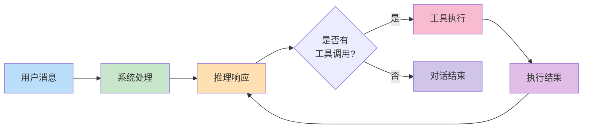

## 4.2 消息类型系统与状态管理

清晰的消息类型系统和适当的状态管理方式是运行时的基础。本节介绍消息流转的完整类型体系，对比两种状态管理模式，并讨论消息历史的窗口管理策略。

### 4.2.1 消息类型的完整体系

在 智能体循环中流转的不仅是文本，还包括多种类型的内容块。清晰的消息类型系统是实现可靠智能体系统的基础。

**核心消息类型：** 系统中使用的核心消息类型定义如下：



图 4-2：消息流转流程

```python
# 基础消息类型枚举
class MessageRole(Enum):
    USER = "user"           # 用户输入
    ASSISTANT = "assistant" # 智能体响应

class ContentBlockType(Enum):
    TEXT = "text"                     # 纯文本
    TOOL_USE = "tool_use"             # 工具调用请求
    TOOL_RESULT = "tool_result"       # 工具执行结果
    THINKING = "thinking"             # 推理过程(optional)
    IMAGE = "image"                   # 图像内容
```

**消息对象的定义：** 消息对象的数据结构定义如下：

```python
from typing import List, Dict, Any, Optional
from dataclasses import dataclass, field
from datetime import datetime
from enum import Enum
import json

@dataclass
class TextBlock:
    """纯文本块"""
    type: str = "text"
    text: str = ""

    def to_dict(self) -> Dict[str, Any]:
        return {"type": self.type, "text": self.text}

@dataclass
class ToolUseBlock:
    """工具调用块：Agent 发起工具调用请求"""
    type: str = "tool_use"
    id: str = ""           # 工具使用的唯一ID，用于匹配结果
    name: str = ""         # 工具名称
    input: Dict[str, Any] = field(default_factory=dict)  # 工具参数，已解析为字典

    def __post_init__(self):
        if self.input is None:
            self.input = {}
        if not self.id:
            # 自动生成UUID
            import uuid
            self.id = f"tooluse_{uuid.uuid4().hex[:12]}"

    def to_dict(self) -> Dict[str, Any]:
        return {
            "type": self.type,
            "id": self.id,
            "name": self.name,
            "input": self.input
        }

@dataclass
class ToolResultBlock:
    """工具结果块：工具执行完成后的结果"""
    type: str = "tool_result"
    tool_use_id: str = ""  # 关联的 ToolUseBlock.id
    content: str = ""      # 工具执行结果(文本)
    is_error: bool = False # 是否为错误结果
    error_type: Optional[str] = None  # 错误类型(如果是错误)

    def to_dict(self) -> Dict[str, Any]:
        return {
            "type": self.type,
            "tool_use_id": self.tool_use_id,
            "content": self.content,
            "is_error": self.is_error,
            "error_type": self.error_type
        }

@dataclass
class ThinkingBlock:
    """推理块：Agent 的内部思考过程(使用 extended thinking 时)"""
    type: str = "thinking"
    thinking: str = ""     # 思考内容

    def to_dict(self) -> Dict[str, Any]:
        return {"type": self.type, "thinking": self.thinking}

@dataclass
class Message:
    """完整的消息对象"""
    role: str  # "user" 或 "assistant"
    content: List[Any]  # 可以包含 TextBlock, ToolUseBlock, ToolResultBlock 等
    timestamp: datetime = None
    message_id: str = ""  # 唯一标识符

    def __post_init__(self):
        if self.timestamp is None:
            self.timestamp = datetime.utcnow()
        if not self.message_id:
            import uuid
            self.message_id = f"msg_{uuid.uuid4().hex[:12]}"

    @classmethod
    def user(cls, text: str) -> "Message":
        """工厂方法：创建用户消息"""
        return cls(
            role="user",
            content=[TextBlock(text=text)]
        )

    @classmethod
    def assistant(cls, content: List[Any]) -> "Message":
        """工厂方法：创建助手消息"""
        return cls(
            role="assistant",
            content=content
        )

    def has_tool_calls(self) -> bool:
        """检查是否包含工具调用"""
        return any(isinstance(block, ToolUseBlock) for block in self.content)

    def get_tool_calls(self) -> List[ToolUseBlock]:
        """提取所有工具调用块"""
        return [block for block in self.content if isinstance(block, ToolUseBlock)]

    def get_text(self) -> str:
        """提取所有文本块，拼接为单个字符串"""
        texts = [block.text for block in self.content if isinstance(block, TextBlock)]
        return "".join(texts)

    def to_dict(self) -> Dict[str, Any]:
        """序列化为字典"""
        return {
            "role": self.role,
            "content": [block.to_dict() for block in self.content],
            "timestamp": self.timestamp.isoformat(),
            "message_id": self.message_id
        }

    @classmethod
    def from_dict(cls, data: Dict[str, Any]) -> "Message":
        """从字典反序列化"""
        content = []
        for block_data in data.get("content", []):
            block_type = block_data.get("type")
            if block_type == "text":
                content.append(TextBlock(**block_data))
            elif block_type == "tool_use":
                content.append(ToolUseBlock(**block_data))
            elif block_type == "tool_result":
                content.append(ToolResultBlock(**block_data))
            elif block_type == "thinking":
                content.append(ThinkingBlock(**block_data))

        return cls(
            role=data["role"],
            content=content,
            timestamp=datetime.fromisoformat(data.get("timestamp", "")),
            message_id=data.get("message_id", "")
        )
```

### 4.2.2 状态管理模式

**发布-订阅模式：** Claude Code 采用发布-订阅模式：维护可变的 AppState，但通过事件发射的方式通知订阅者状态变化。

```python
from typing import Callable, List
from enum import Enum

class StateChangeEvent(Enum):
    MESSAGE_ADDED = "message_added"
    TOOL_EXECUTED = "tool_executed"
    STATE_RESET = "state_reset"

@dataclass
class AppState:
    """可变的应用状态"""
    session_id: str
    messages: List[Message] = field(default_factory=list)
    current_turn: int = 0
    token_count: int = 0
    _subscribers: List[Callable[[StateChangeEvent, Any], None]] = field(
        default_factory=list
    )

    def subscribe(self, callback: Callable[[StateChangeEvent, Any], None]):
        """订阅状态变化"""
        self._subscribers.append(callback)

    def _notify(self, event: StateChangeEvent, data: Any):
        """通知所有订阅者"""
        for callback in self._subscribers:
            try:
                callback(event, data)
            except Exception as e:
                print(f"Subscriber error: {e}")

    def add_message(self, message: Message):
        """添加消息(修改当前状态)"""
        self.messages.append(message)
        self.token_count += self._estimate_tokens(message)
        self.current_turn += 1
        # 通知订阅者
        self._notify(StateChangeEvent.MESSAGE_ADDED, message)

    def execute_tool(self, tool_name: str, result: str):
        """记录工具执行"""
        # ... 工具执行逻辑
        self._notify(StateChangeEvent.TOOL_EXECUTED, {
            "tool_name": tool_name,
            "result": result
        })

# 发布-订阅模式使用示例
app_state = AppState(session_id="sess_456")

def on_state_change(event: StateChangeEvent, data: Any):
    print(f"State changed: {event} -> {data}")

app_state.subscribe(on_state_change)
app_state.add_message(Message.user("Hello"))  # 触发 MESSAGE_ADDED 事件
```

**不可变状态模式：** OpenClaw 采用不可变状态模式：每次状态变化都产生新的状态对象，保留历史状态链。这种方式的优点：

- **可追踪性**：任何时间点的状态都可恢复
- **并发安全**：多个工作线程无需同步即可读取（因为对象不变）
- **调试友好**：可以记录完整的状态转移序列

```python
from dataclasses import dataclass, field
from typing import List, Tuple

@dataclass(frozen=True)  # frozen=True 使对象不可变
class ImmutableSessionState:
    """不可变的会话状态"""
    session_id: str
    messages: Tuple[Message, ...] = field(default_factory=tuple)
    current_turn: int = 0
    token_count: int = 0
    last_updated: datetime = field(default_factory=datetime.utcnow)

    def add_message(self, message: Message) -> "ImmutableSessionState":
        """添加消息，返回新的状态对象"""
        new_messages = tuple(list(self.messages) + [message])
        return ImmutableSessionState(
            session_id=self.session_id,
            messages=new_messages,
            current_turn=self.current_turn + 1,
            token_count=self.token_count + self._estimate_tokens(message),
            last_updated=datetime.utcnow()
        )

    def _estimate_tokens(self, message: Message) -> int:
        """粗略估计消息的令牌数"""
        return len(message.get_text().split()) * 1.3  # 简化估计

# 不可变状态模式使用示例
state = ImmutableSessionState(session_id="sess_123")
print(f"初始状态 ID: {id(state)}")

state = state.add_message(Message.user("Hello"))
print(f"添加用户消息后的状态 ID: {id(state)}")  # 不同对象

state = state.add_message(Message.assistant([TextBlock(text="Hi there!")]))
print(f"添加助手消息后的状态 ID: {id(state)}")  # 又是不同对象
```

### 4.2.3 状态设计的对比

| 方面 | 发布-订阅(Claude Code) | 不可变状态(OpenClaw) |
|------|-------|----------|
| 内存开销 | 低（原地修改） | 高（每次变化都复制整个状态） |
| 时间复杂度 | O(1) 更新成本 | O(n) 复制成本 |
| 调试能力 | 中（需要日志） | 优（完整历史保留） |
| 并发友好 | 中（需要锁或事件队列） | 优（无竞态条件） |
| 实时反应 | 优（即时通知） | 中（需要后处理历史） |

### 4.2.4 消息历史的窗口管理

由于 LLM 上下文有限，不能无限保留所有消息。需要实现消息窗口管理：

```python
class MessageWindow:
    """消息窗口管理器"""

    def __init__(self, max_messages: int = 50, max_tokens: int = 100000):
        self.max_messages = max_messages
        self.max_tokens = max_tokens

    def filter_messages(self, messages: List[Message]) -> List[Message]:
        """根据约束条件过滤消息"""

        # 策略1：按消息数量限制
        if len(messages) > self.max_messages:
            # 保留最后 max_messages 条，丢弃早期消息
            messages = messages[-self.max_messages:]

        # 策略2：按令牌数量限制
        total_tokens = sum(self._estimate_tokens(m) for m in messages)
        if total_tokens > self.max_tokens:
            # 移除早期消息直到满足令牌限制
            while messages and total_tokens > self.max_tokens:
                removed = messages.pop(0)
                total_tokens -= self._estimate_tokens(removed)

        return messages

    def _estimate_tokens(self, message: Message) -> int:
        """估计消息的令牌数"""
        text = message.get_text()
        return len(text.split()) * 1.3

    def insert_system_context(self, messages: List[Message],
                             system_blocks: List[TextBlock]) -> List[Message]:
        """在消息历史前插入系统上下文"""
        result = []
        # 添加系统消息(不计入限制)
        for block in system_blocks:
            result.append(Message.assistant([block]))
        # 添加过滤后的消息历史
        result.extend(self.filter_messages(messages))
        return result
```

### 4.2.5 本节小结

清晰的消息类型系统和合理的状态管理方式是运行时的基础：

1. **消息类型体系** 定义了 智能体循环中的各种信息（文本、工具调用、工具结果、思考过程），提供类型安全的接口

2. **不可变状态模式** 适合需要完整追踪和并发安全的场景，代价是内存和性能

3. **发布-订阅模式** 适合需要低延迟反应和实时流式处理的场景，代价是需要额外的同步机制

4. **消息窗口管理** 确保在有限的上下文窗口内动态调度消息，是处理长对话的必需能力
