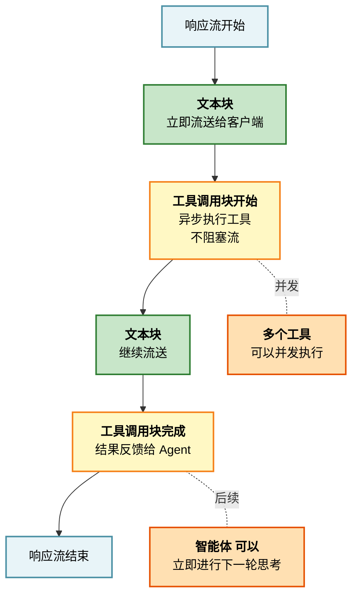
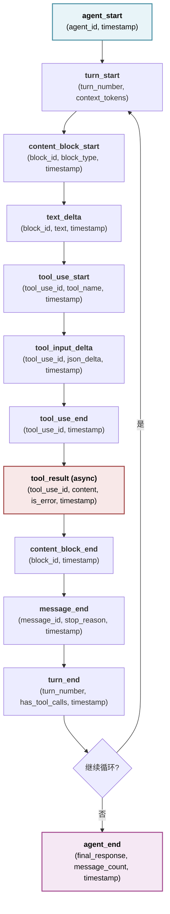

## 4.3 流式处理与事件驱动架构

流式处理和事件驱动是现代智能体系统的必要能力，支持低延迟和高吞吐。本节介绍流式处理的优势，对比OpenClaw和Claude Code的实现方式，并讨论事件流架构和背压控制机制。

### 4.3.1 为什么工具必须在流式响应期间执行

传统的批处理模型（Batch Model）将智能体推理与工具执行分离：

```python
推理完成 → 提取工具调用 → 执行工具 → 等待全部完成 → 反馈给 Agent
```

这种模式的问题：

1. **高延迟**：必须等待所有工具执行完成才能继续推理，单个慢工具阻塞整个流程
2. **无法流式响应**：用户无法看到实时的智能体思考过程
3. **低效的资源利用**：CPU 和网络资源无法充分并发
4. **错误恢复困难**：工具失败后难以进行灵活的备选处理

**流式处理模型**（Streaming Model）将工具执行集成到流式响应中：



图 4-3：流式处理架构

**流式处理的核心优势**

1. **低时间延迟**：用户可以立即看到智能体的首字节响应，而不需要等待所有工具完成
2. **高吞吐量**：工具并发执行，单个工具的网络延迟不影响整体响应
3. **更好的用户体验**：实时反馈让用户感知到系统正在工作
4. **灵活的错误恢复**：工具失败时可以立即重试或选择替代方案

### 4.3.2 Claude Code 的 StreamingToolExecutor 设计

Claude Code 采用 **流式响应 + 异步工具执行** 的模式：

```python
class StreamingToolExecutor:
    “””流式工具执行器：在响应流中处理工具调用”””

    def __init__(self, tool_registry: ToolRegistry, max_concurrent: int = 5):
        self.tool_registry = tool_registry
        self.max_concurrent = max_concurrent
        self._pending_executions: Dict[str, asyncio.Task] = {}

    async def execute_tools(
        self,
        tool_uses: List[ToolUseBlock],
        app_state: AppState
    ) -> Dict[str, ToolResultBlock]:
        “””
        并发执行多个工具调用，返回所有结果
        使用 asyncio.Semaphore 限制并发数
        “””
        semaphore = asyncio.Semaphore(self.max_concurrent)
        tasks = []

        for tool_use in tool_uses:
            task = self._execute_single_tool(tool_use, app_state, semaphore)
            tasks.append(task)
            self._pending_executions[tool_use.id] = task

        # 并发等待所有工具完成
        results = await asyncio.gather(*tasks, return_exceptions=True)

        # 组织结果
        tool_results = {}
        for tool_use, result in zip(tool_uses, results):
            if isinstance(result, Exception):
                tool_results[tool_use.id] = ToolResultBlock(
                    tool_use_id=tool_use.id,
                    content=f”Tool execution error: {str(result)}”,
                    is_error=True,
                    error_type=type(result).__name__
                )
            else:
                tool_results[tool_use.id] = result

        return tool_results

    async def _execute_single_tool(
        self,
        tool_use: ToolUseBlock,
        app_state: AppState,
        semaphore: asyncio.Semaphore
    ) -> ToolResultBlock:
        “””执行单个工具”””
        async with semaphore:
            try:
                # 1. 查找工具
                tool = self.tool_registry.get(tool_use.name)
                if not tool:
                    raise ToolNotFoundError(f”Tool '{tool_use.name}' not found”)

                # 2. 权限检查
                if not tool.check_permissions(app_state):
                    raise PermissionDeniedError(
                        f”Permission denied for tool '{tool_use.name}'”
                    )

                # 3. 执行工具
                result = await tool.call(tool_use.input)

                # 4. 组织结果
                return ToolResultBlock(
                    tool_use_id=tool_use.id,
                    content=str(result),
                    is_error=False
                )

            except Exception as e:
                return ToolResultBlock(
                    tool_use_id=tool_use.id,
                    content=str(e),
                    is_error=True,
                    error_type=type(e).__name__
                )

    def get_tool_progress(self, tool_use_id: str) -> Optional[ToolProgress]:
        “””获取某个工具的执行进度(如果可用)”””
        task = self._pending_executions.get(tool_use_id)
        if not task:
            return None
        # 实现细节：从工具对象的进度属性中提取(如果工具支持)
        # 通常通过工具返回的结果对象或单独的进度查询接口获取
        # 这是一个简化的实现，实际需要根据具体工具的API调整
        if hasattr(task, '_progress'):
            return task._progress
        return None
```

### 4.3.3 OpenClaw 的响应流处理

OpenClaw 采用“响应流优先”的设计，在流式响应过程中持续检测工具调用：

```python
class StreamingResponseHandler:
    “””处理 API 流式响应”””

    def handle_stream(self, stream):
        “””逐个处理流中的事件”””
        accumulated_input_json = “”  # 累积工具参数的 JSON

        for event in stream:
            if event.type == “content_block_start”:
                if event.content_block.type == “text”:
                    # 开始新的文本块
                    pass

                elif event.content_block.type == “tool_use”:
                    # 工具调用开始
                    accumulated_input_json = “”

            elif event.type == “content_block_delta”:
                if event.delta.type == “text_delta”:
                    # 文本增量，直接转发给前端
                    self.send_to_frontend(TextDeltaEvent(event.delta.text))

                elif event.delta.type == “input_json_delta”:
                    # 累积 JSON 参数
                    accumulated_input_json += event.delta.partial_json

            elif event.type == “content_block_stop”:
                if event.content_block.type == “tool_use”:
                    # 工具调用完成，此时有完整的 accumulated_input_json
                    tool_name = event.content_block.name
                    tool_input = json.loads(accumulated_input_json)

                    # 立即执行工具(可能阻塞，但用户已看到实时响应)
                    result = self.execute_tool(tool_name, tool_input)
                    self.send_to_frontend(ToolResultEvent(result))
```

### 4.3.4 事件流架构

完整的 智能体循环产生的事件序列：



**事件流的实现**

```python
from dataclasses import dataclass
from typing import AsyncIterator
from enum import Enum

class EventType(Enum):
    AGENT_START = "agent_start"
    TURN_START = "turn_start"
    CONTENT_BLOCK_START = "content_block_start"
    TEXT_DELTA = "text_delta"
    TOOL_USE_START = "tool_use_start"
    TOOL_INPUT_DELTA = "tool_input_delta"
    TOOL_USE_END = "tool_use_end"
    TOOL_RESULT = "tool_result"
    CONTENT_BLOCK_END = "content_block_end"
    MESSAGE_END = "message_end"
    TURN_END = "turn_end"
    AGENT_END = "agent_end"
    ERROR = "error"

@dataclass
class Event:
    """事件基类"""
    event_type: EventType
    timestamp: datetime = field(default_factory=datetime.utcnow)
    metadata: Dict[str, Any] = field(default_factory=dict)

    def to_json(self) -> str:
        """序列化为 JSON(用于流式传输)"""
        return json.dumps({
            "event_type": self.event_type.value,
            "timestamp": self.timestamp.isoformat(),
            "metadata": self.metadata
        })

class QueryEngine:
    """生成事件流的查询引擎"""

    async def submit_message(self, user_input: str) -> AsyncIterator[Event]:
        """异步生成器：逐个 yield 事件"""
        try:
            yield Event(EventType.AGENT_START, metadata={
                "user_input_length": len(user_input)
            })

            app_state = AppState(session_id=str(uuid.uuid4()))
            turn_number = 0

            while True:
                turn_number += 1
                yield Event(EventType.TURN_START, metadata={
                    "turn_number": turn_number,
                    "context_tokens": app_state.token_count
                })

                # 构建上下文
                messages = await self._build_messages(app_state)
                system_prompt = self._get_system_prompt()

                # 流式调用模型
                tool_uses = []
                async for event in self._stream_model_response(
                    messages=messages,
                    system=system_prompt
                ):
                    # 转发模型流中的文本和工具使用事件
                    yield event

                    if event.event_type == EventType.TOOL_USE_END:
                        tool_uses.append(event.metadata["tool_use"])

                # 执行工具(异步，不阻塞事件流)
                if tool_uses:
                    tool_results = await self.executor.execute_tools(
                        tool_uses, app_state
                    )

                    # 发出工具结果事件
                    for tool_use_id, result in tool_results.items():
                        yield Event(EventType.TOOL_RESULT, metadata={
                            "tool_use_id": tool_use_id,
                            "is_error": result.is_error,
                            "content_length": len(result.content)
                        })

                    # 更新应用状态以继续下一轮推理
                    app_state.add_tool_results(tool_results)

                else:
                    # 没有工具调用，循环结束
                    break

                yield Event(EventType.TURN_END, metadata={
                    "turn_number": turn_number,
                    "has_tool_calls": bool(tool_uses)
                })

            yield Event(EventType.AGENT_END, metadata={
                "final_response": app_state.get_final_response(),
                "turn_count": turn_number,
                "message_count": len(app_state.messages)
            })

        except Exception as e:
            yield Event(EventType.ERROR, metadata={
                "error_type": type(e).__name__,
                "error_message": str(e)
            })
```

### 4.3.5 背压与流量控制

在流式处理中，如果客户端处理事件的速度慢于服务器生成事件的速度，会导致内存溢出。需要实现背压机制：

```python
class BackpressureQueue:
    """带背压的事件队列"""

    def __init__(self, max_queue_size: int = 100):
        self.queue: asyncio.Queue = asyncio.Queue(maxsize=max_queue_size)

    async def put_event(self, event: Event):
        """发送事件，如果队列满则等待"""
        try:
            self.queue.put_nowait(event)
        except asyncio.QueueFull:
            # 队列满，等待消费者处理
            await self.queue.put(event)

    async def get_event(self) -> Event:
        """接收事件，带超时"""
        return await asyncio.wait_for(
            self.queue.get(),
            timeout=30.0  # 30秒超时
        )

    def queue_size(self) -> int:
        """获取当前队列大小"""
        return self.queue.qsize()
```

### 4.3.6 本节小结

流式处理与事件驱动是现代智能体系统的必要能力：

1. **流式处理的优势** 明显：低延迟、高吞吐、更好的用户体验、灵活的错误恢复

2. **工具必须在流式响应期间执行**，而不是批处理，这样智能体可以立即获得结果反馈进行下一轮推理

3. **事件流架构** 定义了清晰的状态转移和事件序列，使得系统行为可观测、可预测、可调试

4. **Claude Code 的异步生成器模式和 OpenClaw 的流响应处理** 都实现了这一原则，但编程模型不同（其中 Claude Code 采用异步并发，OpenClaw 采用流式顺序处理）

5. **背压管理** 是生产环境中必需的，防止内存溢出和系统过载
