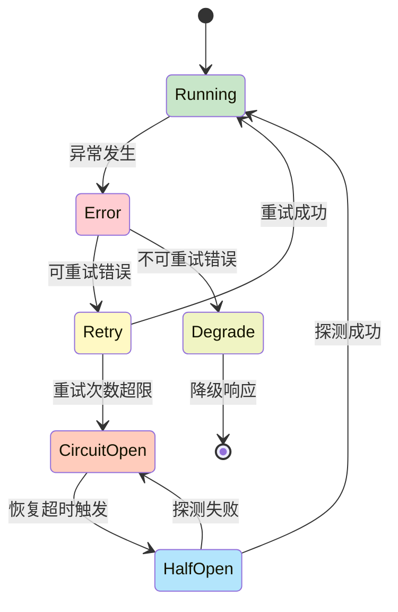

## 4.4 错误处理与故障恢复

在智能体运行时，会遇到多种类型的错误，包括工具执行失败、API 调用超时、输出解析错误等。本节介绍如何对这些错误进行分类、设计恢复策略，以及 OpenClaw 的“错误即观察”模式。

### 4.4.1 错误的分类与应对策略

智能体循环中可能遇到的错误分为几类，每类需要不同的处理策略：

**1. 工具执行错误：** 工具调用失败、权限拒绝、参数错误、工具崩溃
**影响范围**：当前工具调用
**恢复策略**：作为“观察”反馈给 Agent

```python
import asyncio

class ToolExecutionError(Exception):
    """工具执行错误"""
    def __init__(self, tool_name: str, message: str,
                 error_type: str = None, retry_count: int = 0):
        self.tool_name = tool_name
        self.message = message
        self.error_type = error_type or type(self).__name__
        self.retry_count = retry_count
        super().__init__(message)

class ToolTimeoutError(ToolExecutionError):
    """工具执行超时"""
    pass

class ToolPermissionError(ToolExecutionError):
    """工具权限不足"""
    pass

# 处理示例
async def execute_tool_with_recovery(
    tool_use: ToolUseBlock,
    executor: ToolExecutor,
    max_retries: int = 3
) -> ToolResultBlock:
    """执行工具,带重试机制"""

    for attempt in range(max_retries):
        try:
            result = await executor.execute(tool_use.name, tool_use.input)
            return ToolResultBlock(
                tool_use_id=tool_use.id,
                content=str(result),
                is_error=False
            )

        except ToolTimeoutError as e:
            # 超时:使用指数退避重试
            if attempt < max_retries - 1:
                backoff_seconds = 2 ** attempt  # 1, 2, 4 秒
                await asyncio.sleep(backoff_seconds)
                continue
            else:
                # 最后一次重试失败,返回错误
                return ToolResultBlock(
                    tool_use_id=tool_use.id,
                    content=f"Tool timeout after {max_retries} retries: {str(e)}",
                    is_error=True,
                    error_type="ToolTimeoutError"
                )

        except ToolPermissionError as e:
            # 权限错误:不重试,立即反馈
            return ToolResultBlock(
                tool_use_id=tool_use.id,
                content=f"Permission denied: {str(e)}",
                is_error=True,
                error_type="ToolPermissionError"
            )

        except ToolExecutionError as e:
            # 其他工具错误:重试一次
            if attempt < max_retries - 1:
                continue
            else:
                return ToolResultBlock(
                    tool_use_id=tool_use.id,
                    content=f"Tool execution failed: {str(e)}",
                    is_error=True,
                    error_type=e.error_type
                )

        except Exception as e:
            # 未预期的异常
            return ToolResultBlock(
                tool_use_id=tool_use.id,
                content=f"Unexpected error: {str(e)}",
                is_error=True,
                error_type=type(e).__name__
            )
```

#### 2. API 调用错误

**类型**：模型 API 超时、速率限制、认证失败、API 服务中断
**影响范围**：当前推理轮次
**恢复策略**：重试或回退到备用模型

```python
class ModelAPIError(Exception):
    """模型 API 错误"""
    pass

class RateLimitError(ModelAPIError):
    """速率限制"""
    def __init__(self, retry_after: int = None):
        self.retry_after = retry_after or 60
        super().__init__(f"Rate limited, retry after {self.retry_after}s")

class ModelTimeoutError(ModelAPIError):
    """模型调用超时"""
    pass

class RetryPolicy:
    """重试策略"""

    def __init__(self,
                 max_retries: int = 3,
                 initial_backoff: int = 1,
                 max_backoff: int = 60,
                 exponential_base: float = 2.0):
        self.max_retries = max_retries
        self.initial_backoff = initial_backoff
        self.max_backoff = max_backoff
        self.exponential_base = exponential_base

    async def execute_with_retry(self,
                                 coro_fn,
                                 *args, **kwargs) -> Any:
        """执行异步操作,带重试"""

        for attempt in range(self.max_retries):
            try:
                return await coro_fn(*args, **kwargs)

            except RateLimitError as e:
                # 速率限制:等待指定时间
                if attempt < self.max_retries - 1:
                    await asyncio.sleep(e.retry_after)
                    continue
                else:
                    raise

            except ModelTimeoutError as e:
                # 超时:指数退避
                if attempt < self.max_retries - 1:
                    backoff = min(
                        self.initial_backoff * (self.exponential_base ** attempt),
                        self.max_backoff
                    )
                    await asyncio.sleep(backoff)
                    continue
                else:
                    raise

            except ModelAPIError as e:
                # 其他 API 错误:重试
                if attempt < self.max_retries - 1:
                    backoff = min(
                        self.initial_backoff * (self.exponential_base ** attempt),
                        self.max_backoff
                    )
                    await asyncio.sleep(backoff)
                    continue
                else:
                    raise

# API重试策略使用示例
retry_policy = RetryPolicy()

async def call_model_with_retry(engine: QueryEngine, message: str):
    try:
        result = await retry_policy.execute_with_retry(
            engine.infer,
            messages=[Message.user(message)]
        )
        return result
    except ModelAPIError as e:
        # 重试失败,返回降级响应
        return Message.assistant([TextBlock(
            text=f"Sorry, I encountered an error: {str(e)}"
        )])
```

#### 3. 输出解析错误

**类型**：模型输出格式不符、工具参数非法、JSON 解析失败
**影响范围**：当前推理结果
**恢复策略**：要求智能体重新生成或修复

```python
class OutputParsingError(Exception):
    """输出解析错误"""
    pass

class ToolParameterValidationError(OutputParsingError):
    """工具参数验证失败"""
    def __init__(self, tool_name: str, errors: List[str]):
        self.tool_name = tool_name
        self.errors = errors
        super().__init__(
            f"Tool '{tool_name}' parameter validation failed: {errors}"
        )

def validate_tool_parameters(
    tool_name: str,
    parameters: Dict[str, Any],
    schema: Dict[str, Any]
) -> Tuple[bool, List[str]]:
    """验证工具参数是否符合 Schema"""

    errors = []

    # 检查必需参数
    required = schema.get("required", [])
    for param_name in required:
        if param_name not in parameters:
            errors.append(f"Missing required parameter: {param_name}")

    # 检查参数类型
    properties = schema.get("properties", {})
    for param_name, param_value in parameters.items():
        if param_name not in properties:
            errors.append(f"Unknown parameter: {param_name}")
            continue

        param_schema = properties[param_name]
        expected_type = param_schema.get("type")

        if expected_type == "string" and not isinstance(param_value, str):
            errors.append(
                f"Parameter '{param_name}' should be string, got {type(param_value).__name__}"
            )
        elif expected_type == "integer" and not isinstance(param_value, int):
            errors.append(
                f"Parameter '{param_name}' should be integer, got {type(param_value).__name__}"
            )
        elif expected_type == "array" and not isinstance(param_value, list):
            errors.append(
                f"Parameter '{param_name}' should be array, got {type(param_value).__name__}"
            )

    return len(errors) == 0, errors

# 在工具执行前进行验证
async def execute_tool_validated(tool_use: ToolUseBlock,
                                 tool_registry: ToolRegistry) -> ToolResultBlock:
    """执行工具前进行参数验证"""

    tool = tool_registry.get(tool_use.name)
    if not tool:
        return ToolResultBlock(
            tool_use_id=tool_use.id,
            content=f"Tool '{tool_use.name}' not found",
            is_error=True,
            error_type="ToolNotFoundError"
        )

    # 验证参数
    schema = tool.get_input_schema()
    is_valid, errors = validate_tool_parameters(
        tool_use.name,
        tool_use.input,
        schema
    )

    if not is_valid:
        return ToolResultBlock(
            tool_use_id=tool_use.id,
            content=f"Parameter validation failed:\n" + "\n".join(errors),
            is_error=True,
            error_type="ParameterValidationError"
        )

    # 参数有效,执行工具
    try:
        result = await tool.call(tool_use.input)
        return ToolResultBlock(
            tool_use_id=tool_use.id,
            content=str(result),
            is_error=False
        )
    except Exception as e:
        return ToolResultBlock(
            tool_use_id=tool_use.id,
            content=str(e),
            is_error=True,
            error_type=type(e).__name__
        )
```

#### 4. 上下文溢出与Token耗尽

**类型**：消息历史太长、推理输出超过 max_tokens
**影响范围**：整个会话
**恢复策略**：清理历史、压缩上下文、或启动新会话

```python
class ContextOverflowError(Exception):
    """上下文溢出"""
    pass

class TokenBudgetExceededError(ContextOverflowError):
    """Token预算超支"""
    def __init__(self, current_tokens: int, budget: int):
        self.current_tokens = current_tokens
        self.budget = budget
        super().__init__(
            f"Token budget exceeded: {current_tokens} > {budget}"
        )

class ContextCompressor:
    """上下文压缩器"""

    def __init__(self, max_summary_length: int = 500):
        self.max_summary_length = max_summary_length

    def compress_message_history(
        self,
        messages: List[Message],
        target_tokens: int,
        summarizer = None  # 可选的摘要函数
    ) -> List[Message]:
        """压缩消息历史以满足Token预算"""

        total_tokens = sum(self._estimate_tokens(m) for m in messages)

        if total_tokens <= target_tokens:
            return messages  # 无需压缩

        # 策略1:先对过长的 Assistant 响应做摘要（信息损失最小）
        if summarizer:
            summarized_messages = []
            for message in messages:
                if message.role == "assistant":
                    # 摘要 Assistant 的长响应
                    original_text = message.get_text()
                    if len(original_text) > self.max_summary_length:
                        summary = summarizer(original_text,
                                           max_length=self.max_summary_length)
                        message = Message.assistant([TextBlock(text=summary)])
                summarized_messages.append(message)

            messages = summarized_messages
            total_tokens = sum(self._estimate_tokens(m) for m in messages)

        # 策略2:摘要后仍超出预算,再从最早的消息开始移除
        while messages and total_tokens > target_tokens:
            removed = messages.pop(0)
            total_tokens -= self._estimate_tokens(removed)

        return messages

    def _estimate_tokens(self, message: Message) -> int:
        """估计消息的Token数"""
        text = message.get_text()
        return int(len(text.split()) * 1.3)  # 粗略估计

# 上下文压缩使用示例
compressor = ContextCompressor()

async def infer_with_context_management(
    engine: QueryEngine,
    messages: List[Message],
    token_budget: int = 100000
) -> Message:
    """推理,带自动的上下文管理"""

    estimated_tokens = compressor._estimate_tokens(
        Message.assistant([TextBlock(text="".join(m.get_text() for m in messages))])
    )

    if estimated_tokens > token_budget * 0.8:  # 80% 阈值
        messages = compressor.compress_message_history(
            messages,
            target_tokens=int(token_budget * 0.5)
        )

    try:
        return await engine.infer(messages)
    except TokenBudgetExceededError as e:
        # Token预算溢出,再次压缩
        messages = compressor.compress_message_history(
            messages,
            target_tokens=int(token_budget * 0.3)
        )
        return await engine.infer(messages)
```

### 4.4.2 OpenClaw 的“错误即观察”模式

OpenClaw 的设计哲学是 **将所有错误作为观察反馈回 Agent**：

```python
class ErrorAsObservationHandler:
    """将错误作为观察反馈给 Agent"""

    def handle_tool_error(self, tool_use: ToolUseBlock, error: Exception):
        """处理工具错误"""
        # 而不是抛出异常,构造一个 ToolResultBlock,表示错误
        error_message = f"[Tool Error]\nTool: {tool_use.name}\n"
        error_message += f"Error Type: {type(error).__name__}\n"
        error_message += f"Error Message: {str(error)}\n"
        error_message += "Please analyze the error and try a different approach."

        return ToolResultBlock(
            tool_use_id=tool_use.id,
            content=error_message,
            is_error=True,
            error_type=type(error).__name__
        )

    def handle_api_error(self, error: ModelAPIError) -> Message:
        """处理 API 错误"""
        # 返回一条特殊的 Assistant 消息,告知智能体发生了错误
        return Message.assistant([TextBlock(text=(
            f"An error occurred while processing your request:\n"
            f"Error: {str(error)}\n"
            f"The system will retry the request automatically."
        ))])

    def handle_context_overflow(self,
                               messages: List[Message],
                               token_budget: int) -> List[Message]:
        """处理上下文溢出"""
        # 通过压缩历史来恢复
        return self.compress_history(messages, token_budget)
```

优点：

- 智能体可以看到所有错误信息，学习如何处理
- 系统行为更透明、更可预测
- 智能体可以提出替代方案（例如，文件不存在，试试列出目录）

### 4.4.3 断路器模式

对于可能频繁失败的外部调用（如模型 API、文件系统操作），使用断路器模式防止级联失败。

**错误恢复与断路器状态转移：**



图 4-4：断路器状态转移图

```python
class CircuitBreakerState(Enum):
    CLOSED = "closed"      # 正常,允许请求
    OPEN = "open"         # 失败过多,拒绝请求
    HALF_OPEN = "half_open"  # 尝试恢复,允许一个请求

class CircuitBreaker:
    """断路器模式"""

    def __init__(self, failure_threshold: int = 5,
                 recovery_timeout: int = 60):
        self.failure_threshold = failure_threshold
        self.recovery_timeout = recovery_timeout
        self.failure_count = 0
        self.state = CircuitBreakerState.CLOSED
        self.last_failure_time = None

    async def call(self, coro_fn, *args, **kwargs):
        """通过断路器调用函数"""

        # 检查是否应该打开断路器
        if self.state == CircuitBreakerState.OPEN:
            if self._should_attempt_recovery():
                self.state = CircuitBreakerState.HALF_OPEN
            else:
                raise Exception("Circuit breaker is OPEN, rejecting request")

        try:
            result = await coro_fn(*args, **kwargs)
            self._on_success()
            return result
        except Exception as e:
            self._on_failure()
            raise

    def _on_success(self):
        """成功后的处理"""
        self.failure_count = 0
        self.state = CircuitBreakerState.CLOSED

    def _on_failure(self):
        """失败后的处理"""
        self.failure_count += 1
        self.last_failure_time = time.time()
        if self.failure_count >= self.failure_threshold:
            self.state = CircuitBreakerState.OPEN

    def _should_attempt_recovery(self) -> bool:
        """判断是否应该尝试恢复"""
        if not self.last_failure_time:
            return False
        return time.time() - self.last_failure_time > self.recovery_timeout
```

### 4.4.4 本节小结

错误处理是智能体系统可靠性的关键：

1. **分类处理**：不同类型的错误需要不同的恢复策略（重试、降级、打断路器）

2. **工具执行错误** 最常见，应该被作为“观察”反馈给 Agent，而不是中断循环

3. **API 错误** 需要重试策略（指数退避、速率限制感知）

4. **输出解析错误** 需要参数验证，防止传递无效的工具调用

5. **上下文溢出** 需要动态压缩和历史管理

6. **断路器模式** 可以防止级联失败和资源耗尽
