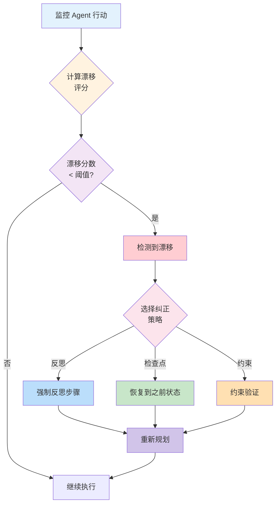
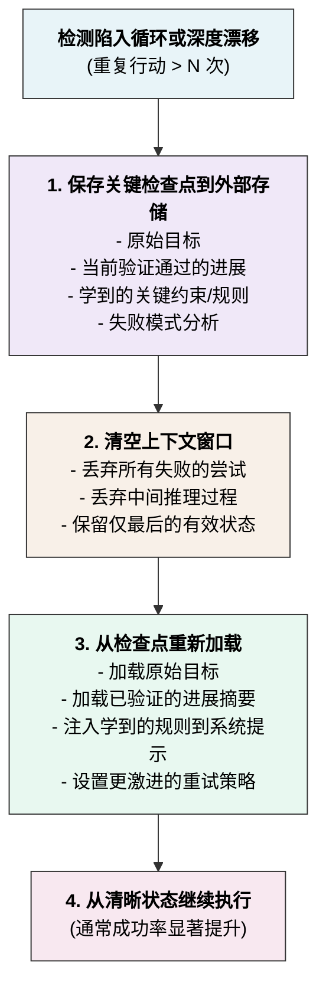

## 4.5 长时任务的漂移检测与纠正

### 4.5.1 什么是目标漂移

在长时运行的智能体任务中，存在一个常见问题：Agent 在中间某个环节偏离了原始目标，逐步走向错误的方向。这种现象称为 **目标漂移（Goal Drift）**。

#### 漂移的表现形式

1. **目标遗忘**：Agent 忘记了原始任务，开始追求无关的子目标
2. **目标替代**：Agent 用某个中间目标替代了主目标
3. **范围蠕变**：原始任务范围逐步扩大，导致成本失控
4. **方向漂移**：推理过程偏离最优路径，走向局部最优

#### 漂移的危害

- 任务失败率提高（Agent 最终无法完成原始目标）
- 资源浪费（执行了大量无关的工具调用）
- 用户体验差（Agent 变得不可预测）
- 难以调试（漂移原因通常隐含在推理过程中）

### 4.5.2 漂移检测机制

**目标漂移的检测与纠正流程：**



图 4-5：漂移检测与纠正流程

#### 1. 目标与当前行动的相似度检查

通过关键词匹配检查Agent是否偏离原始目标：

```python
from dataclasses import dataclass
from typing import List, Optional
import math

@dataclass
class Goal:
    """任务目标定义"""
    original_goal: str
    main_keywords: List[str]  # 从目标中提取的关键词
    metric: Optional[str] = None  # 成功指标
    deadline: Optional[int] = None  # 轮数限制

class DriftDetector:
    """漂移检测器"""

    def __init__(self, similarity_threshold: float = 0.3,
                 window_size: int = 5):
        self.similarity_threshold = similarity_threshold
        self.window_size = window_size  # 检查最近 N 轮的行动

    def detect_drift(self, goal: Goal,
                    current_state: AgentState) -> Tuple[bool, float, str]:
        """
        检测是否发生了漂移
        返回: (is_drifted, drift_score, reason)
        """

        recent_actions = self._get_recent_actions(current_state)

        # 计算相似度
        drift_score = self._compute_drift_score(goal, recent_actions)

        if drift_score < self.similarity_threshold:
            # 相似度太低，表示已漂移
            reason = f"Low similarity with goal (score={drift_score:.2f})"
            return True, drift_score, reason

        # 检查其他漂移指标
        is_expanding = self._detect_scope_expansion(goal, current_state)
        if is_expanding:
            return True, drift_score, "Scope expansion detected"

        is_local_optimal = self._detect_local_optimum(goal, current_state)
        if is_local_optimal:
            return True, drift_score, "Stuck in local optimum"

        return False, drift_score, "No drift detected"

    def _get_recent_actions(self, state: AgentState) -> List[str]:
        """提取最近 window_size 轮的工具调用"""
        recent = []
        for msg in state.messages[-self.window_size * 2:]:
            if msg.role == "assistant":
                for tool_use in msg.get_tool_calls():
                    recent.append(f"{tool_use.name}({', '.join(tool_use.input.keys())})")
        return recent

    def _compute_drift_score(self, goal: Goal, actions: List[str]) -> float:
        """计算动作与目标的相关性"""
        if not actions:
            return 0.0

        # 简化版本：检查关键词出现在动作中的频率
        keyword_matches = 0
        for keyword in goal.main_keywords:
            for action in actions:
                if keyword.lower() in action.lower():
                    keyword_matches += 1

        return keyword_matches / len(actions) if actions else 0.0

    def _detect_scope_expansion(self, goal: Goal,
                               state: AgentState) -> bool:
        """检测范围蠕变"""
        # 检查工具调用数量是否超过合理范围
        tool_count = sum(
            len(msg.get_tool_calls())
            for msg in state.messages
            if msg.role == "assistant"
        )

        # 启发式：假设大多数任务不需要 > 50 次工具调用
        if tool_count > 50:
            return True

        return False

    def _detect_local_optimum(self, goal: Goal,
                             state: AgentState) -> bool:
        """检测是否陷入局部最优"""
        # 检查是否重复执行相同的工具调用
        action_counts = {}
        for msg in state.messages[-self.window_size:]:
            if msg.role == "assistant":
                for tool_use in msg.get_tool_calls():
                    key = f"{tool_use.name}({tool_use.input.get('path', '')})"
                    action_counts[key] = action_counts.get(key, 0) + 1

        # 如果有工具被调用了 > 2 次（在小窗口内）
        return max(action_counts.values()) > 2 if action_counts else False
```

#### 2. 语义检测

通过向量相似度检测目标与当前操作的语义偏离：

```python
class SemanticDriftDetector:
    """使用语义相似度的漂移检测"""

    def __init__(self, embedding_model):
        self.embedding_model = embedding_model  # 如 OpenAI embeddings

    async def detect_semantic_drift(
        self,
        original_goal: str,
        recent_messages: List[Message]
    ) -> Tuple[bool, float]:
        """
        使用语义相似度检测漂移
        """

        # 获取原始目标的嵌入
        goal_embedding = await self.embedding_model.embed(original_goal)

        # 获取最近消息内容的嵌入
        recent_text = " ".join(
            msg.get_text() for msg in recent_messages[-10:]
        )
        recent_embedding = await self.embedding_model.embed(recent_text)

        # 计算余弦相似度
        similarity = self._cosine_similarity(goal_embedding, recent_embedding)

        # 相似度 < 0.6 表示可能漂移
        is_drifted = similarity < 0.6

        return is_drifted, similarity

    def _cosine_similarity(self, vec1, vec2) -> float:
        """计算两个向量的余弦相似度"""
        dot_product = sum(a * b for a, b in zip(vec1, vec2))
        norm1 = math.sqrt(sum(a ** 2 for a in vec1))
        norm2 = math.sqrt(sum(b ** 2 for b in vec2))

        if norm1 == 0 or norm2 == 0:
            return 0.0

        return dot_product / (norm1 * norm2)
```

### 4.5.3 纠正策略

#### 1. 强制反思步骤

OpenClaw 定期在智能体循环中插入强制反思步骤，要求智能体重新评估当前进度：

```python
class ReflectionStep:
    """强制反思步骤"""

    def __init__(self, reflection_interval: int = 5):
        """每 reflection_interval 轮执行一次"""
        self.reflection_interval = reflection_interval

    def should_reflect(self, turn_count: int) -> bool:
        """判断是否应该进行反思"""
        return turn_count > 0 and turn_count % self.reflection_interval == 0

    def build_reflection_prompt(self, goal: Goal,
                               state: AgentState) -> Message:
        """构造反思提示"""
        reflection_prompt = f"""
### Reflection Point

Original goal: {goal.original_goal}

Current progress (last 3 turns):
{self._summarize_recent_progress(state)}

Please answer:
1. Are we still on track to achieve the original goal?
2. Have we deviated from the original objective?
3. Should we adjust our approach?
4. What's the next best action?

Be concise and critical.
"""
        return Message.user(reflection_prompt)

    def _summarize_recent_progress(self, state: AgentState) -> str:
        """摘要最近的进度"""
        summary = []
        for i, msg in enumerate(state.messages[-6:]):
            if msg.role == "assistant":
                text = msg.get_text()[:200]  # 限制长度
                summary.append(f"Turn {i}: {text}")
        return "\n".join(summary)

# 在 智能体循环中使用
reflection = ReflectionStep(reflection_interval=5)

async def agent_loop_with_reflection(
    engine: QueryEngine,
    goal: Goal,
    max_turns: int = 30
) -> AgentState:
    """带反思的 智能体循环"""

    state = AgentState(goal=goal)

    for turn in range(max_turns):
        # 正常推理
        response = await engine.infer(state.messages)
        state.add_message(response)

        # 检查是否需要反思
        if reflection.should_reflect(turn):
            print(f"[Turn {turn}] Performing reflection...")
            reflection_prompt = reflection.build_reflection_prompt(goal, state)

            # 让智能体进行反思
            reflection_response = await engine.infer(
                state.messages + [reflection_prompt]
            )

            # 分析反思结果，判断是否需要调整策略
            is_on_track = self._analyze_reflection(reflection_response)

            if not is_on_track:
                print(f"[Turn {turn}] Drift detected, correcting course...")
                # 发送纠正提示
                correction_prompt = Message.user(
                    "Your reflection indicates a deviation. "
                    "Please refocus on the original goal and provide a corrected action plan."
                )
                state.add_message(reflection_response)
                state.add_message(correction_prompt)

        # 继续循环
        if not response.has_tool_calls():
            break

    return state

def _analyze_reflection(self, reflection_response: Message) -> bool:
    """分析反思结果"""
    text = reflection_response.get_text().lower()
    off_track_keywords = ["deviated", "off track", "wrong", "mistake"]
    return not any(kw in text for kw in off_track_keywords)
```

#### 2. 检查点与恢复

使用检查点机制实现恢复功能，快速回到上一个正确状态：

```python
@dataclass
class Checkpoint:
    """检查点：记录某个时刻的完整状态"""
    turn_number: int
    messages: List[Message]
    goal: Goal
    timestamp: datetime
    drift_score: float = 0.0

class CheckpointManager:
    """检查点管理"""

    def __init__(self, checkpoint_dir: str = "./checkpoints"):
        self.checkpoint_dir = checkpoint_dir
        os.makedirs(checkpoint_dir, exist_ok=True)

    def save_checkpoint(self, state: AgentState, goal: Goal) -> str:
        """保存检查点"""
        checkpoint = Checkpoint(
            turn_number=state.current_turn,
            messages=state.messages.copy(),
            goal=goal,
            timestamp=datetime.utcnow()
        )

        checkpoint_id = f"ckpt_{datetime.utcnow().strftime('%Y%m%d_%H%M%S')}"
        filepath = os.path.join(self.checkpoint_dir, f"{checkpoint_id}.json")

        with open(filepath, 'w') as f:
            json.dump(
                {
                    "turn_number": checkpoint.turn_number,
                    "messages": [m.to_dict() for m in checkpoint.messages],
                    "goal": goal.original_goal,
                    "timestamp": checkpoint.timestamp.isoformat()
                },
                f,
                indent=2
            )

        return checkpoint_id

    def restore_checkpoint(self, checkpoint_id: str) -> Tuple[AgentState, Goal]:
        """恢复检查点"""
        filepath = os.path.join(self.checkpoint_dir, f"{checkpoint_id}.json")

        with open(filepath, 'r') as f:
            data = json.load(f)

        messages = [Message.from_dict(m) for m in data["messages"]]
        goal = Goal(original_goal=data["goal"])

        state = AgentState(goal=goal)
        state.messages = messages
        state.current_turn = data["turn_number"]

        return state, goal

# 使用
checkpoint_mgr = CheckpointManager()

async def agent_loop_with_checkpointing(
    engine: QueryEngine,
    goal: Goal,
    max_turns: int = 30,
    drift_detector: DriftDetector = None
) -> AgentState:
    """带检查点的 智能体循环，支持漂移恢复"""

    state = AgentState(goal=goal)
    drift_detector = drift_detector or DriftDetector()

    for turn in range(max_turns):
        # 每 5 轮保存一个检查点
        if turn % 5 == 0:
            ckpt_id = checkpoint_mgr.save_checkpoint(state, goal)
            print(f"[Checkpoint {ckpt_id}] Saved at turn {turn}")

        # 推理
        response = await engine.infer(state.messages)
        state.add_message(response)

        # 漂移检测
        is_drifted, score, reason = drift_detector.detect_drift(goal, state)

        if is_drifted:
            print(f"[Turn {turn}] Drift detected: {reason}")

            # 回滚到最近的检查点，重新开始
            if turn >= 5:
                prev_ckpt_id = f"ckpt_{(turn - 5):03d}"
                try:
                    state, goal = checkpoint_mgr.restore_checkpoint(prev_ckpt_id)
                    print(f"[Restored] From checkpoint {prev_ckpt_id}")
                    continue
                except FileNotFoundError:
                    pass

            # 如果没有检查点可恢复，发送纠正提示
            correction_msg = Message.user(
                f"The current approach has deviated from the goal. "
                f"Original goal: {goal.original_goal}. "
                f"Please refocus and provide a new action plan."
            )
            state.add_message(correction_msg)

        if not response.has_tool_calls():
            break

    return state
```

#### 3. 约束验证

通过约束验证器确保智能体行为在预定界限内：

```python
class ConstraintValidator:
    """约束验证器，确保智能体行为在预定界限内"""

    def __init__(self):
        self.constraints = []

    def add_constraint(self, name: str, check_fn: Callable[[AgentState], bool],
                      violation_msg: str):
        """添加约束条件"""
        self.constraints.append({
            "name": name,
            "check_fn": check_fn,
            "violation_msg": violation_msg
        })

    def validate(self, state: AgentState) -> Tuple[bool, List[str]]:
        """验证所有约束"""
        violations = []
        for constraint in self.constraints:
            if not constraint["check_fn"](state):
                violations.append(constraint["violation_msg"])

        return len(violations) == 0, violations

# 使用示例
validator = ConstraintValidator()

# 添加约束：工具调用不超过 50 次
validator.add_constraint(
    name="max_tool_calls",
    check_fn=lambda state: sum(
        len(msg.get_tool_calls()) for msg in state.messages
        if msg.role == "assistant"
    ) <= 50,
    violation_msg="Exceeded maximum tool call limit (50)"
)

# 添加约束：消息总长度不超过 1M 字符
validator.add_constraint(
    name="max_message_length",
    check_fn=lambda state: sum(
        len(msg.get_text()) for msg in state.messages
    ) <= 1_000_000,
    violation_msg="Message history exceeded 1M characters"
)

# 添加约束：执行时间不超过 1 小时
validator.add_constraint(
    name="max_execution_time",
    check_fn=lambda state: (datetime.utcnow() - state.start_time).total_seconds() < 3600,
    violation_msg="Execution time exceeded 1 hour"
)

async def agent_loop_with_constraints(
    engine: QueryEngine,
    goal: Goal,
    validator: ConstraintValidator
) -> AgentState:
    """带约束的 智能体循环"""

    state = AgentState(goal=goal)

    while True:
        # 在每轮推理前验证约束
        is_valid, violations = validator.validate(state)

        if not is_valid:
            print(f"[Constraint Violation] {', '.join(violations)}")
            break

        # 继续推理
        response = await engine.infer(state.messages)
        state.add_message(response)

        if not response.has_tool_calls():
            break

    return state
```

### 4.5.4 上下文重置

当智能体陷入循环或漂移过远时，传统的漂移纠正方法（反思、修补、约束）可能效果有限。在这种情况下，可以采用一种更激进的方法：**上下文重置**，即清空积累的上下文，从干净状态重新开始。Anthropic 在其 Harness 设计实践中也采用了这一模式，尤其是在处理早期模型的上下文焦虑问题时效果显著。

#### 核心思想

上下文重置是一种\u201c重启\u201d机制，类似于计算机系统的重新启动。当系统积累太多错误状态或陷入深度循环时，与其尝试逐步修复，不如清空并重新开始——但仅保留关键信息。

**关键原则：**

- **清空累积的噪音**：移除所有失败的尝试、错误的推理步骤和无关的中间状态
- **保留关键状态**：将重要信息（原始目标、已验证的进展、关键发现）持久化到外部存储
- **简化上下文窗口**：用清晰的摘要替代冗长的历史记录
- **对比增量压缩**：与其试图压缩所有历史（增量压缩往往失去细节），不如直接丢弃并恢复关键部分

#### 实现流程

以下是上下文重置的完整流程，当检测到陷入循环或深度漂移时执行：



#### 伪代码实现

下面是上下文重置管理器的具体实现示例：

```python
class ContextResetManager:
    """上下文重置管理器"""

    def __init__(self, checkpoint_store, max_iterations_before_reset=10):
        self.checkpoint_store = checkpoint_store
        self.max_iterations = max_iterations_before_reset
        self.reset_count = 0

    def should_reset(self, state: AgentState) -> bool:
        """判断是否需要重置上下文"""
        # 检查最近 N 轮是否重复同样的行动（循环）
        recent_actions = self._get_recent_actions(state, window=5)
        if len(set(recent_actions)) < 2:  # 只有 0-1 种不同的行动
            return True

        # 检查消息长度是否过度增长
        total_chars = sum(len(msg.get_text()) for msg in state.messages)
        if total_chars > 100_000:  # 超过 100K 字符
            return True

        return False

    def extract_and_save_checkpoint(self, state: AgentState, goal: Goal):
        """提取关键信息并保存检查点"""
        checkpoint = {
            "timestamp": datetime.utcnow().isoformat(),
            "original_goal": goal.original_goal,
            "verified_progress": self._extract_verified_progress(state),
            "learned_constraints": self._extract_learned_rules(state),
            "failure_patterns": self._analyze_failure_patterns(state),
        }

        checkpoint_id = self.checkpoint_store.save(checkpoint)
        return checkpoint_id

    def reset_context(self, state: AgentState, checkpoint_id: str) -> AgentState:
        """重置上下文并从检查点恢复"""
        # 加载检查点
        checkpoint = self.checkpoint_store.load(checkpoint_id)

        # 创建新的清晰状态
        new_state = AgentState(goal=Goal(original_goal=checkpoint["original_goal"]))

        # 注入已验证的进展
        progress_msg = Message.assistant(
            f"Previous verified progress:\n{checkpoint['verified_progress']}"
        )
        new_state.add_message(progress_msg)

        # 构造系统提示，包含学到的规则
        system_prompt = self._build_reset_system_prompt(checkpoint)

        # 返回重置后的状态
        return new_state, system_prompt

    def _extract_verified_progress(self, state: AgentState) -> str:
        """从状态中提取已验证完成的部分"""
        # 简化的实现：找到最后一个成功的工具调用
        for msg in reversed(state.messages):
            if msg.has_tool_result() and msg.tool_result_success:
                return f"Successfully: {msg.get_text()[:500]}"
        return "No verified progress yet"

    def _extract_learned_rules(self, state: AgentState) -> List[str]:
        """从失败和纠正过程中提取规则"""
        rules = []
        # 扫描是否有"应该避免"的模式
        for msg in state.messages[-20:]:  # 最近 20 条消息
            if "should not" in msg.get_text().lower():
                rules.append(msg.get_text())
        return rules

    def _analyze_failure_patterns(self, state: AgentState) -> dict:
        """分析常见的失败模式"""
        failure_types = {}
        for msg in state.messages:
            if msg.has_tool_error():
                error_type = self._categorize_error(msg.tool_error)
                failure_types[error_type] = failure_types.get(error_type, 0) + 1
        return failure_types

    def _build_reset_system_prompt(self, checkpoint: dict) -> str:
        """构造重置后的系统提示，包含学到的约束"""
        prompt = f"""
You are solving: {checkpoint['original_goal']}

Previous verified progress:
{checkpoint['verified_progress']}

Learned constraints:
{chr(10).join(checkpoint['learned_constraints'])}

Common failure patterns to avoid:
{checkpoint['failure_patterns']}

Continue from the verified progress and avoid previous mistakes.
"""
        return prompt.strip()

    def _get_recent_actions(self, state: AgentState, window: int) -> List[str]:
        """获取最近的行动序列"""
        actions = []
        for msg in state.messages[-window * 2:]:
            if msg.role == "assistant" and msg.has_tool_calls():
                for tool in msg.get_tool_calls():
                    actions.append(tool.name)
        return actions


# 使用示例
async def agent_loop_with_context_reset(
    engine: QueryEngine,
    goal: Goal,
    max_turns: int = 50
) -> AgentState:
    """带上下文重置的智能体循环"""

    reset_mgr = ContextResetManager(checkpoint_store)
    state = AgentState(goal=goal)

    for turn in range(max_turns):
        # 检查是否需要重置
        if reset_mgr.should_reset(state):
            print(f"[Turn {turn}] Detecting loop/deep drift, performing context reset...")

            # 保存关键信息
            ckpt_id = reset_mgr.extract_and_save_checkpoint(state, goal)

            # 重置上下文
            state, new_prompt = reset_mgr.reset_context(state, ckpt_id)
            print(f"[Reset] Context cleared, restarting from checkpoint {ckpt_id}")

        # 正常推理
        response = await engine.infer(state.messages)
        state.add_message(response)

        if not response.has_tool_calls():
            break

    return state
```

#### 何时使用上下文重置

- **循环检测**：同样的工具调用重复超过 3-5 次
- **深度漂移**：即使多轮纠正也无法回到轨道
- **上下文膨胀**：消息历史超过可用上下文窗口的 70%
- **学习瓶颈**：智能体无法从之前的错误中学习

### 4.5.5 本节小结

长时任务的漂移检测与纠正是智能体系统高可靠性的必要条件：

1. **漂移检测** 有多种方式：基于关键词的启发式、语义相似度、行动重复检测

2. **强制反思步骤** 让智能体定期评估进度，OpenClaw 通过在推理中插入反思提示实现

3. **检查点机制** 允许任务在漂移时恢复到之前的正确状态

4. **约束验证** 在任务执行前确保遵守硬约束（令牌数、时间限制、工具调用数）

5. **上下文重置** 当其他方法失效时，清空积累的上下文并从关键检查点重新开始

6. 这些机制相互配合，构成了可靠的漂移检测与纠正体系
