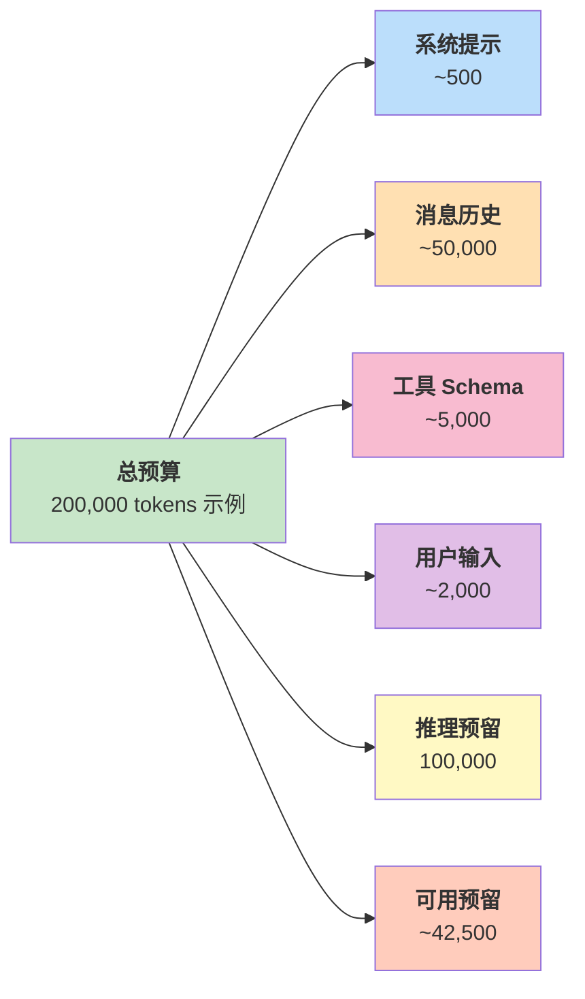

## 4.6 令牌预算与上下文动态管理

在有限的上下文窗口内运行长时任务，需要对令牌使用进行精细管理。本节介绍令牌预算的组成、动态管理策略，以及三级预算控制体系。

### 4.6.1 令牌预算的关键概念

在 LLM 智能体系统中，每个 API 调用都有令牌成本和延迟成本。在有限的上下文窗口内，需要精细的令牌预算管理，确保：

1. **不超过上下文限制**：防止 API 调用失败
2. **保持可用余额**：为推理输出预留空间
3. **最大化有效上下文**：在有限令牌内承载最多有用信息
4. **支持长对话**：通过动态压缩和历史管理支持跨越多轮的对话

**令牌预算分配结构：**



图 4-6：令牌预算分配图

#### 令牌预算的组成

令牌预算的详细构成情况如下所示：

| 预算项目 | 分配 | 说明 |
|---------|------|------|
| **总令牌预算** | **200,000（示例）** | 模型上下文窗口，实际值随模型变化 |
| 系统提示词 | ~500 | 系统级指令 |
| 消息历史 | ~50,000 | 上下文消息 |
| 工具 Schema | ~5,000 | 工具定义 |
| 用户输入 | ~2,000 | 当前查询 |
| 可用预留 | ~142,500 | **总计** |
| &ensp;&ensp;推理预留 | 100,000 | 思考过程 |
| &ensp;&ensp;实际可用 | ~42,500 | 可用输出空间 |

#### 令牌计数的准确性

使用令牌计数器精确追踪令牌使用情况：

```python
class TokenCounter:
    """令牌计数器"""

    def __init__(self, model_name: str = "claude-sonnet-4-5"):
        self.model_name = model_name
        # 可以使用 tiktoken (OpenAI) 或 Claude 官方的计数 API
        self._initialize_counter()

    def _initialize_counter(self):
        """初始化计数器"""
        # 简化版本:使用粗略估计
        # 实际应使用官方 API:https://docs.anthropic.com/en/docs/build-a-quick-start-with-the-tokens-api
        pass

    def count_text_tokens(self, text: str) -> int:
        """计算文本的令牌数"""
        from anthropic import Anthropic
        client = Anthropic()
        response = client.messages.count_tokens(
            model=self.model_name,
            messages=[{"role": "user", "content": text}]
        )
        return response.input_tokens

    def count_message_tokens(self, message: Message) -> int:
        """计算消息的令牌数"""
        return self.count_text_tokens(message.get_text())

    def count_messages_tokens(self, messages: List[Message]) -> int:
        """计算多个消息的总令牌数"""
        # 可以一次性计数,效率更高
        combined_text = "\n".join(msg.get_text() for msg in messages)
        return self.count_text_tokens(combined_text)

    def count_tool_schema_tokens(self, tools: List[Dict]) -> int:
        """计算工具 Schema 定义的令牌数"""
        schema_json = json.dumps(tools, indent=2)
        return self.count_text_tokens(schema_json)
```

### 4.6.2 令牌预算管理策略

#### 1. 前向估计

在发送请求前估计可能的令牌消耗：

```python
class TokenBudgetManager:
    """令牌预算管理器"""

    def __init__(self, total_budget: int = 200000,
                 safety_margin: int = 10000):
        self.total_budget = total_budget
        self.safety_margin = safety_margin  # 10k 的安全裕度
        self.token_counter = TokenCounter()

    def get_available_budget(self, current_state: AgentState) -> int:
        """计算当前可用的令牌预算"""
        used_tokens = self._estimate_current_usage(current_state)
        available = self.total_budget - used_tokens - self.safety_margin
        return max(0, available)

    def _estimate_current_usage(self, state: AgentState) -> int:
        """估计当前的令牌使用"""
        system_tokens = 500  # 系统提示词
        history_tokens = self.token_counter.count_messages_tokens(state.messages)
        tools_tokens = 5000  # 工具 Schema(缓存)
        return system_tokens + history_tokens + tools_tokens

    def can_continue_inference(self, state: AgentState,
                              expected_output_tokens: int = 2000) -> bool:
        """检查是否还有足够的预算继续推理"""
        available = self.get_available_budget(state)
        return available >= expected_output_tokens

    def plan_inference(self, state: AgentState) -> Dict[str, int]:
        """规划推理的令牌分配"""
        available = self.get_available_budget(state)

        return {
            "available_budget": available,
            "recommended_max_tokens": min(available, 4000),
            "warning_threshold": available * 0.2
        }

# 令牌预算管理使用示例
budget_mgr = TokenBudgetManager()

async def infer_with_budget_check(engine: QueryEngine,
                                 state: AgentState) -> Optional[Message]:
    """推理前检查预算"""

    if not budget_mgr.can_continue_inference(state):
        print(f"Token budget exhausted. Current usage: "
              f"{budget_mgr._estimate_current_usage(state)} / {budget_mgr.total_budget}")
        return None

    plan = budget_mgr.plan_inference(state)
    print(f"[Budget] Available: {plan['available_budget']}, "
          f"Max tokens: {plan['recommended_max_tokens']}")

    response = await engine.infer(
        state.messages,
        max_tokens=plan['recommended_max_tokens']
    )

    return response
```

#### 2. 自动压缩

当令牌使用接近阈值时，自动压缩历史：

```python
class AutoCompactor:
    """自动压缩器:当令牌使用超过阈值时触发压缩"""

    def __init__(self, compression_threshold: float = 0.8):
        """
        compression_threshold: 触发压缩的百分比
        例如 0.8 表示当使用到总预算的 80% 时触发
        """
        self.compression_threshold = compression_threshold
        self.token_counter = TokenCounter()

    def should_compact(self, budget_mgr: TokenBudgetManager,
                       state: AgentState) -> bool:
        """判断是否应该进行压缩"""
        used_tokens = budget_mgr._estimate_current_usage(state)
        threshold_tokens = budget_mgr.total_budget * self.compression_threshold
        return used_tokens > threshold_tokens

    def compact_messages(self, messages: List[Message],
                        target_token_count: int,
                        summarizer = None) -> List[Message]:
        """压缩消息历史以满足令牌目标"""

        current_tokens = self.token_counter.count_messages_tokens(messages)

        if current_tokens <= target_token_count:
            return messages  # 无需压缩

        print(f"[Compacting] {current_tokens} tokens -> {target_token_count} tokens")

        # 策略 1:移除早期消息
        compacted = list(messages)
        while compacted and self.token_counter.count_messages_tokens(compacted) > target_token_count:
            # 移除最早的消息
            removed = compacted.pop(0)
            print(f"  Removed: {removed.get_text()[:80]}...")

        return compacted

    def compact_with_summarization(
        self,
        messages: List[Message],
        target_token_count: int,
        summarizer
    ) -> List[Message]:
        """使用摘要进行压缩"""

        # 首先尝试移除消息
        compacted = self.compact_messages(messages, target_token_count)

        # 如果还是太大,使用摘要压缩
        if self.token_counter.count_messages_tokens(compacted) > target_token_count:
            compacted = self._apply_summarization(compacted, summarizer, target_token_count)

        return compacted

    def _apply_summarization(self, messages: List[Message],
                            summarizer, target_tokens: int) -> List[Message]:
        """应用摘要压缩"""
        result = []

        for message in messages:
            if message.role == "assistant" and len(message.get_text()) > 500:
                # 摘要长响应
                summary = summarizer(
                    message.get_text(),
                    max_length=int(len(message.get_text()) * 0.5)
                )
                summary_msg = Message.assistant([TextBlock(text=summary)])
                result.append(summary_msg)
            else:
                result.append(message)

        return result

# 自动压缩使用示例
compactor = AutoCompactor(compression_threshold=0.8)
budget_mgr = TokenBudgetManager()

async def agent_loop_with_auto_compaction(engine: QueryEngine,
                                         state: AgentState):
    """智能体循环,带自动压缩"""

    while True:
        # 检查是否需要压缩
        if compactor.should_compact(budget_mgr, state):
            print(f"[Turn {state.current_turn}] Triggering auto-compaction...")

            # 压缩到预算的 50%
            target_tokens = budget_mgr.total_budget * 0.5
            state.messages = compactor.compact_messages(
                state.messages,
                int(target_tokens)
            )

            print(f"  Compacted to {budget_mgr._estimate_current_usage(state)} tokens")

        # 继续推理
        if not budget_mgr.can_continue_inference(state):
            print(f"Cannot continue: insufficient token budget")
            break

        response = await engine.infer(state.messages)
        state.add_message(response)

        if not response.has_tool_calls():
            break
```

#### 3. 历史片段化

选择性地移除消息，保留最重要的部分：

```python
class HistorySnipper:
    """历史片段化:选择性保留消息"""

    def snip_history(self, messages: List[Message],
                    target_count: int = 20) -> List[Message]:
        """
        保留最重要的消息,进行片段化:
        1. 保留最后 N 条消息(最近的对话)
        2. 保留第一条消息(初始上下文)
        3. 移除中间的消息
        """

        if len(messages) <= target_count:
            return messages

        # 保留最后 target_count 条消息
        recent_messages = messages[-target_count:]

        # 保留第一条消息(通常是系统消息或初始用户输入)
        if messages and messages[0] not in recent_messages:
            result = [messages[0]] + recent_messages
        else:
            result = recent_messages

        return result

    def snip_by_importance(self,
                          messages: List[Message],
                          target_count: int = 20,
                          importance_scorer = None) -> List[Message]:
        """
        基于重要性评分进行片段化
        importance_scorer: 返回消息重要性分数(0-1)的函数
        """

        if len(messages) <= target_count:
            return messages

        # 计算每条消息的重要性
        scores = []
        for i, msg in enumerate(messages):
            if importance_scorer:
                score = importance_scorer(msg, i, len(messages))
            else:
                score = self._default_importance_score(msg, i, len(messages))
            scores.append((i, score, msg))

        # 选择重要性最高的 target_count 条消息
        selected = sorted(scores, key=lambda x: x[1], reverse=True)[:target_count]

        # 按原始顺序重新排列
        selected.sort(key=lambda x: x[0])

        return [msg for _, _, msg in selected]

    def _default_importance_score(self, msg: Message, index: int,
                                 total_count: int) -> float:
        """默认的重要性评分"""
        # 最后的消息最重要(权重 0.5)
        recency_score = index / max(total_count - 1, 1) * 0.5

        # 包含工具调用或长文本的消息较重要(权重 0.3)
        if msg.role == "assistant" and msg.has_tool_calls():
            content_score = 0.3
        else:
            content_score = (len(msg.get_text()) / 1000) * 0.15

        # 第一条消息很重要(权重 0.2)
        if index == 0:
            initial_score = 0.2
        else:
            initial_score = 0

        return recency_score + content_score + initial_score
```

### 4.6.3 Claude Code 的模型窗口阈值警告

Claude Code 在构建消息时采用分层的令牌预算管理。注意：截至 2026-05-16，Anthropic 官方[上下文窗口说明](https://docs.anthropic.com/en/docs/build-with-claude/context-windows)中既有 200K 级模型，也有 Claude Sonnet 4.6、Opus 4.6/4.7 等 1M 级模型；下面的 200K 是保守示例，不应硬编码为所有 Claude 或 Claude Code 场景的上限。

```python
class AdaptiveContextManager:
    """自适应上下文管理"""

    def __init__(self, model_name: str = "claude-sonnet-4-5",
                 total_budget: int = 200_000):
        self.model_name = model_name
        self.total_budget = total_budget
        self.safety_margin = 10000
        self.token_counter = TokenCounter()

    def build_messages_with_budget(self, original_messages: List[Message],
                                   tools: List[Dict]) -> List[Message]:
        """构建消息,考虑令牌预算"""

        system_tokens = 500
        tools_tokens = self.token_counter.count_tool_schema_tokens(tools)
        reserved_output = 4000  # 为输出预留空间

        available_for_messages = (
            self.total_budget -
            system_tokens -
            tools_tokens -
            reserved_output -
            self.safety_margin
        )

        # 估计当前消息的令牌数
        current_tokens = self.token_counter.count_messages_tokens(original_messages)

        if current_tokens > available_for_messages:
            # 超出预算,需要压缩
            print(f"[Warning] Messages exceed budget: "
                  f"{current_tokens} > {available_for_messages}")

            # 发出警告
            self._emit_warning(current_tokens, available_for_messages)

            # 进行压缩
            return self._compress_messages_smart(
                original_messages,
                available_for_messages
            )

        return original_messages

    def _emit_warning(self, current: int, available: int):
        """发出令牌预算警告"""
        usage_percent = (current / self.total_budget) * 100
        print(f"[Token Budget Warning] {usage_percent:.1f}% used "
              f"({current}/{self.total_budget} tokens)")

    def _compress_messages_smart(self, messages: List[Message],
                                target_tokens: int) -> List[Message]:
        """智能压缩消息"""

        snipper = HistorySnipper()
        compactor = AutoCompactor()

        # 首先尝试片段化
        snipped = snipper.snip_by_importance(messages, target_count=30)

        if self.token_counter.count_messages_tokens(snipped) <= target_tokens:
            return snipped

        # 如果片段化还不够,进行压缩
        return compactor.compact_messages(snipped, target_tokens)
```

### 4.6.4 OpenClaw 的 70% 上下文触发

OpenClaw 采用更激进的提前压缩策略：

```python
class OpenClawContextManager:
    """OpenClaw 风格的上下文管理"""

    def __init__(self, total_budget: int = 200_000):
        self.total_budget = total_budget
        self.trigger_threshold = 0.7  # 70% 触发压缩

    def should_trigger_consolidation(self, current_tokens: int) -> bool:
        """检查是否应该触发记忆整合(压缩)"""
        threshold = self.total_budget * self.trigger_threshold
        return current_tokens > threshold

    def consolidate_memory(self, session_id: str,
                          state: AgentState,
                          memory_store) -> AgentState:
        """
        触发记忆整合:
        1. 摘要当前会话中的重要事实
        2. 更新长期记忆
        3. 清理当前会话的历史
        """

        # 1. 识别关键事实
        key_facts = self._extract_key_facts(state.messages)

        # 2. 保存到长期记忆
        memory_store.add_facts(session_id, key_facts)

        # 3. 清理消息历史
        # 只保留最后几条消息和初始上下文
        cleaned_messages = [
            state.messages[0],  # 保留初始消息
            *state.messages[-5:]  # 保留最后 5 条
        ]

        # 4. 创建摘要消息
        summary = self._create_summary_message(key_facts)
        cleaned_messages.insert(1, summary)

        state.messages = cleaned_messages
        return state

    def _extract_key_facts(self, messages: List[Message]) -> List[str]:
        """从消息中提取关键事实"""
        facts = []

        for msg in messages:
            if msg.role == "assistant":
                text = msg.get_text()
                # 简化版本:提取包含特定关键词的句子
                sentences = text.split('.')
                for sentence in sentences:
                    if any(keyword in sentence for keyword in
                           ['found', 'result', 'error', 'success']):
                        facts.append(sentence.strip())

        return facts[:10]  # 最多 10 个事实

    def _create_summary_message(self, facts: List[str]) -> Message:
        """创建摘要消息"""
        summary_text = "## Session Summary\n\n"
        for i, fact in enumerate(facts, 1):
            summary_text += f"{i}. {fact}\n"

        return Message.assistant([TextBlock(text=summary_text)])
```

### 4.6.5 三级预算控制体系

生产级系统仅靠单次请求的令牌预算管理远远不够。成熟的 Harness 需要建立 **三级预算控制体系**，从单次调用到全局账期逐层约束：

| 控制层级 | 控制粒度 | 典型阈值 | 超限策略 |
|---------|---------|---------|---------|
| **Per-Request** | 单次 API 调用 | 4k-100k output tokens | 截断输出、降级模型 |
| **Per-Task** | 一个完整任务（可能包含多轮循环） | 50-200 次 API 调用 / 累计 1M tokens | 强制总结、终止循环 |
| **Per-Day/Month** | 账期级全局预算 | $50/天、$1000/月 | 排队、降级、拒绝服务 |

```python
class ThreeTierBudgetController:
    """三级预算控制器"""

    def __init__(self, config: dict):
        # 第一级:单次请求
        self.per_request_max_tokens = config.get("per_request_max_tokens", 4096)

        # 第二级:任务级
        self.per_task_max_calls = config.get("per_task_max_calls", 100)
        # 跨多次 API 调用累计，不代表单次请求上下文窗口。
        self.per_task_max_tokens = config.get("per_task_max_tokens", 1_000_000)

        # 第三级:账期级
        self.daily_budget_usd = config.get("daily_budget_usd", 50.0)
        self.monthly_budget_usd = config.get("monthly_budget_usd", 1000.0)

        # 运行时计数器
        self._task_call_count = 0
        self._task_token_count = 0
        self._daily_cost_usd = 0.0

    def check_budget(self, estimated_tokens: int) -> dict:
        """在每次 API 调用前检查三级预算"""

        # 第一级:请求级检查
        request_tokens = min(estimated_tokens, self.per_request_max_tokens)

        # 第二级:任务级检查
        if self._task_call_count >= self.per_task_max_calls:
            return {"allowed": False, "reason": "task_call_limit",
                    "action": "force_summarize_and_stop"}

        if self._task_token_count + request_tokens > self.per_task_max_tokens:
            return {"allowed": False, "reason": "task_token_limit",
                    "action": "force_summarize_and_stop"}

        # 第三级:账期级检查
        estimated_cost = self._estimate_cost(request_tokens)
        if self._daily_cost_usd + estimated_cost > self.daily_budget_usd:
            return {"allowed": False, "reason": "daily_budget_exceeded",
                    "action": "queue_or_downgrade"}

        return {"allowed": True, "max_tokens": request_tokens}

    def record_usage(self, input_tokens: int, output_tokens: int,
                     cost_usd: float):
        """记录实际使用量"""
        self._task_call_count += 1
        self._task_token_count += input_tokens + output_tokens
        self._daily_cost_usd += cost_usd

    def _estimate_cost(self, tokens: int) -> float:
        """估算成本(简化版)"""
        return tokens * 3.0 / 1_000_000  # $3/M tokens 近似值
```

三级预算控制与前面介绍的多模型路由（详见 10.3.4 节）协同使用效果更佳：当账期预算紧张时，路由器可以自动将更多请求降级到低成本模型，在不中断服务的前提下控制支出。

### 4.6.6 本节小结

令牌预算管理是长时智能体任务的关键：

1. **前向估计** 在发送请求前预估令牌使用，防止超限

2. **自动压缩** 在令牌使用接近阈值时触发，保留最重要的信息

3. **历史片段化** 选择性保留消息，平衡信息完整性与令牌成本

4. **Claude Code 的模型窗口阈值警告** 提前感知预算压力，主动调整策略

5. **OpenClaw 的 70% 触发** 更激进地进行记忆整合，维持较低的上下文使用

6. **三级预算控制** 从单次请求到账期级逐层约束，防止成本失控

这些策略相互配合，使得智能体能够在有限的上下文窗口内处理长时任务，同时将成本控制在可预测的范围内。
