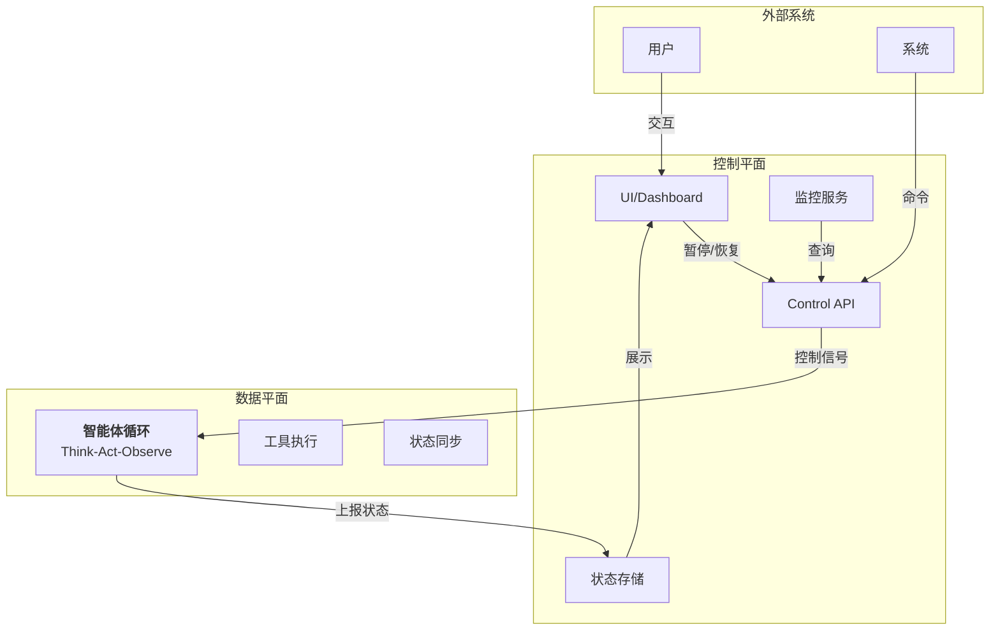

## 4.8 实时控制平面

在长时运行的Agent系统中，需要一套实时控制机制，使得外部系统（如UI、监控服务、用户干预系统）能够动态地暂停、恢复、修改和终止Agent执行，同时保持系统的正确性和一致性。本节介绍实时控制平面的架构、关键组件和实现模式。

**设计演示说明**：本节涵盖的详细控制平面实现（CheckpointManager、ActionStream、InterventionHandler 等）为设计参考示例。Lab 已在 `runtime/checkpoint.py` 实现工具调用结果的恢复与重复副作用保护，但它不是完整 AgentState 快照；暂停/恢复、ActionStream 和干预点仍需按本节设计扩展。

### 4.8.1 控制平面架构

实时控制平面将 Agent 系统分为 **数据平面** 和 **控制平面** 两部分：

- **数据平面**：Agent的主循环，负责执行任务、调用工具、生成结果
- **控制平面**：暴露的外部接口，接收暂停、恢复、干预等控制命令，管理Agent的执行状态



控制平面通过以下机制与数据平面通信：

1. **控制队列**：Agent周期性检查控制队列中的指令
2. **状态检查点**：Agent在安全位置（如工具调用前后）暂停和检查控制信号
3. **异步回调**：控制命令通过回调机制通知Agent做出响应
4. **检查点存储**：暂停时保存Agent状态，便于后续恢复

### 4.8.2 暂停与恢复机制

#### 状态序列化与检查点创建

Agent在运行过程中需要在特定的安全点创建检查点，以便暂停和恢复执行：

```python
# core/control_plane.py
from dataclasses import dataclass, field
from typing import Any, Dict, Optional, List
from enum import Enum
from datetime import datetime
import asyncio
import json
import uuid

class AgentState(Enum):
    """Agent执行状态"""
    RUNNING = "running"
    PAUSED = "paused"
    RESUMING = "resuming"
    COMPLETED = "completed"
    FAILED = "failed"
    TERMINATED = "terminated"

@dataclass
class Checkpoint:
    """检查点:包含Agent的完整可恢复状态"""
    checkpoint_id: str
    agent_state: Dict[str, Any]  # Agent的内部状态快照
    message_history: List[Dict[str, Any]]  # 完整消息历史
    tool_context: Dict[str, Any]  # 当前工具调用上下文
    execution_context: Dict[str, Any]  # 任务执行上下文
    timestamp: datetime
    iteration: int
    safe_point: str  # 检查点所在的安全位置标识
    metadata: Dict[str, Any] = field(default_factory=dict)

    def serialize(self) -> bytes:
        """序列化检查点为 JSON 字节，避免反序列化执行任意代码"""
        payload = {
            "checkpoint_id": self.checkpoint_id,
            "agent_state": self.agent_state,
            "message_history": self.message_history,
            "tool_context": self.tool_context,
            "execution_context": self.execution_context,
            "timestamp": self.timestamp.isoformat(),
            "iteration": self.iteration,
            "safe_point": self.safe_point,
            "metadata": self.metadata,
        }
        return json.dumps(payload, ensure_ascii=False).encode("utf-8")

    @classmethod
    def deserialize(cls, data: bytes) -> 'Checkpoint':
        """从 JSON 字节恢复检查点；只接受显式字段"""
        payload = json.loads(data.decode("utf-8"))
        return cls(
            checkpoint_id=payload["checkpoint_id"],
            agent_state=payload["agent_state"],
            message_history=payload["message_history"],
            tool_context=payload["tool_context"],
            execution_context=payload["execution_context"],
            timestamp=datetime.fromisoformat(payload["timestamp"]),
            iteration=payload["iteration"],
            safe_point=payload["safe_point"],
            metadata=payload.get("metadata", {}),
        )

class CheckpointManager:
    """检查点管理器"""

    def __init__(self, storage_backend=None):
        self.checkpoints: Dict[str, Checkpoint] = {}
        self.storage_backend = storage_backend  # 可选的持久化存储
        self.latest_checkpoint_id: Optional[str] = None

    async def create_checkpoint(
        self,
        agent: 'ControlledAgent',
        safe_point: str
    ) -> Checkpoint:
        """在指定的安全点创建检查点"""
        checkpoint = Checkpoint(
            checkpoint_id=str(uuid.uuid4()),
            agent_state=agent._serialize_state(),
            message_history=agent.message_history.copy(),
            tool_context=agent.tool_context.copy(),
            execution_context=agent.execution_context.copy(),
            timestamp=datetime.now(),
            iteration=agent.iteration,
            safe_point=safe_point,
            metadata={
                "task_id": agent.task_id,
                "user_id": agent.user_id,
            }
        )

        # 如果有持久化存储,异步保存
        if self.storage_backend:
            await self.storage_backend.save(checkpoint)

        self.checkpoints[checkpoint.checkpoint_id] = checkpoint
        self.latest_checkpoint_id = checkpoint.checkpoint_id

        return checkpoint

    async def restore_from_checkpoint(
        self,
        agent: 'ControlledAgent',
        checkpoint_id: str
    ) -> bool:
        """从检查点恢复Agent状态"""
        checkpoint = self.checkpoints.get(checkpoint_id)
        if not checkpoint:
            if self.storage_backend:
                checkpoint = await self.storage_backend.load(checkpoint_id)
            else:
                return False

        # 恢复Agent状态
        agent._restore_state(checkpoint.agent_state)
        agent.message_history = checkpoint.message_history.copy()
        agent.tool_context = checkpoint.tool_context.copy()
        agent.execution_context = checkpoint.execution_context.copy()
        agent.iteration = checkpoint.iteration

        return True

    async def list_checkpoints(self) -> List[Dict[str, Any]]:
        """列出所有检查点摘要"""
        return [
            {
                "id": cp.checkpoint_id,
                "timestamp": cp.timestamp.isoformat(),
                "iteration": cp.iteration,
                "safe_point": cp.safe_point,
                "task_id": cp.metadata.get("task_id")
            }
            for cp in self.checkpoints.values()
        ]

    async def delete_checkpoint(self, checkpoint_id: str) -> bool:
        """删除检查点"""
        if checkpoint_id in self.checkpoints:
            del self.checkpoints[checkpoint_id]
            if self.storage_backend:
                await self.storage_backend.delete(checkpoint_id)
            return True
        return False
```

#### 优雅暂停的实现

Agent在到达安全点时检查暂停信号，并创建检查点：

```python
# core/graceful_pause.py

class ControlledAgent:
    """带控制平面的Agent"""

    def __init__(self, model_client, checkpoint_manager: CheckpointManager):
        self.model_client = model_client
        self.checkpoint_manager = checkpoint_manager
        self.state = AgentState.RUNNING
        self.pause_requested = False
        self.iteration = 0
        self.message_history = []
        self.tool_context = {}
        self.execution_context = {}
        self.task_id = str(uuid.uuid4())
        self.user_id = None
        self.current_checkpoint = None

    def _serialize_state(self) -> Dict[str, Any]:
        """序列化内部状态"""
        return {
            "state": self.state.value,
            "iteration": self.iteration,
            "task_id": self.task_id,
            # 其他需要保存的状态
        }

    def _restore_state(self, state_dict: Dict[str, Any]):
        """恢复内部状态"""
        self.state = AgentState(state_dict.get("state", "running"))
        self.iteration = state_dict.get("iteration", 0)
        self.task_id = state_dict.get("task_id", self.task_id)

    async def _check_pause_at_safe_point(self):
        """在安全点检查暂停请求"""
        if self.pause_requested and self.state == AgentState.RUNNING:
            # 创建检查点
            checkpoint = await self.checkpoint_manager.create_checkpoint(
                self,
                safe_point="tool_execution_boundary"
            )
            self.current_checkpoint = checkpoint

            # 转换状态为已暂停
            self.state = AgentState.PAUSED
            print(f"Agent paused at iteration {self.iteration}, checkpoint: {checkpoint.checkpoint_id}")
            return True
        return False

    async def request_pause(self) -> Dict[str, Any]:
        """请求暂停(从外部调用)"""
        terminal_states = {AgentState.COMPLETED, AgentState.FAILED, AgentState.TERMINATED}
        if self.state in terminal_states:
            return {"status": "error", "message": f"Cannot pause from state {self.state.value}"}

        self.pause_requested = True
        # 等待Agent到达安全点并暂停，但不能无限等待
        deadline = asyncio.get_running_loop().time() + 10.0
        while self.state not in {AgentState.PAUSED, *terminal_states}:
            if asyncio.get_running_loop().time() >= deadline:
                self.pause_requested = False
                return {"status": "error", "message": "Pause timed out before safe point"}
            await asyncio.sleep(0.1)

        if self.state in terminal_states:
            self.pause_requested = False
            return {"status": "error", "message": f"Agent reached {self.state.value} before pausing"}

        return {
            "status": "paused",
            "checkpoint_id": self.current_checkpoint.checkpoint_id if self.current_checkpoint else None,
            "iteration": self.iteration
        }

    async def resume(self, checkpoint_id: Optional[str] = None) -> Dict[str, Any]:
        """恢复执行"""
        if self.state == AgentState.PAUSED:
            if checkpoint_id:
                # 从指定检查点恢复
                success = await self.checkpoint_manager.restore_from_checkpoint(self, checkpoint_id)
                if not success:
                    return {"status": "error", "message": "Checkpoint not found"}
            # 清除暂停标记
            self.pause_requested = False
            self.state = AgentState.RUNNING
            # 如果暂停时主循环已经退出，调用方需要重新调度 run()
            return {"status": "resuming", "iteration": self.iteration}
        else:
            return {"status": "error", "message": f"Cannot resume from state {self.state.value}"}
```

### 4.8.3 实时行动流

Agent的每个动作（工具调用、决策、结果生成）都应该以流的形式实时传送到UI或日志系统，支持SSE（Server-Sent Events）和WebSocket模式：

```python
# core/action_streaming.py
from typing import AsyncGenerator, Callable
import json

class ActionStream:
    """Agent行动流"""

    def __init__(self):
        self.listeners: List[Callable] = []
        self.history: List[Dict[str, Any]] = []

    async def emit_action(
        self,
        action_type: str,
        content: Dict[str, Any],
        metadata: Dict[str, Any] = None
    ):
        """发出一个行动事件"""
        event = {
            "type": action_type,
            "timestamp": datetime.now().isoformat(),
            "content": content,
            "metadata": metadata or {}
        }
        self.history.append(event)

        # 通知所有监听者
        for listener in self.listeners:
            try:
                if asyncio.iscoroutinefunction(listener):
                    await listener(event)
                else:
                    listener(event)
            except Exception as e:
                print(f"Error notifying listener: {e}")

    def subscribe(self, listener: Callable):
        """订阅行动事件"""
        self.listeners.append(listener)

    def unsubscribe(self, listener: Callable):
        """取消订阅"""
        if listener in self.listeners:
            self.listeners.remove(listener)

    async def stream_sse(self) -> AsyncGenerator[str, None]:
        """以SSE格式流式发出事件"""
        last_sent = 0
        while True:
            if len(self.history) > last_sent:
                for event in self.history[last_sent:]:
                    yield f"data: {json.dumps(event)}\n\n"
                last_sent = len(self.history)
            await asyncio.sleep(0.1)


class AgentWithStreaming(ControlledAgent):
    """支持行动流的Agent"""

    def __init__(self, model_client, checkpoint_manager: CheckpointManager):
        super().__init__(model_client, checkpoint_manager)
        self.action_stream = ActionStream()

    async def _emit_thinking(self, reasoning: str):
        """发出思考事件"""
        await self.action_stream.emit_action(
            action_type="thinking",
            content={"reasoning": reasoning},
            metadata={"iteration": self.iteration}
        )

    async def _emit_tool_call(self, tool_name: str, tool_args: Dict[str, Any]):
        """发出工具调用事件"""
        await self.action_stream.emit_action(
            action_type="tool_call",
            content={"tool": tool_name, "arguments": tool_args},
            metadata={"iteration": self.iteration}
        )

    async def _emit_tool_result(self, tool_name: str, result: Any, duration_ms: float):
        """发出工具结果事件"""
        await self.action_stream.emit_action(
            action_type="tool_result",
            content={"tool": tool_name, "result": str(result)},
            metadata={"iteration": self.iteration, "duration_ms": duration_ms}
        )

    async def run(self) -> Any:
        """Agent主循环,支持行动流"""
        while self.state == AgentState.RUNNING:
            self.iteration += 1

            # 安全点:检查暂停请求
            if await self._check_pause_at_safe_point():
                break

            # LLM推理
            reasoning = "Analyzing current task..."
            await self._emit_thinking(reasoning)

            # 工具调用
            tool_name = "process_data"
            tool_args = {"step": self.iteration}
            await self._emit_tool_call(tool_name, tool_args)

            # 工具执行(模拟)
            import time
            start = time.time()
            result = f"Iteration {self.iteration} completed"
            duration_ms = (time.time() - start) * 1000
            await self._emit_tool_result(tool_name, result, duration_ms)

            # 安全点:检查暂停
            if await self._check_pause_at_safe_point():
                break

            # 模拟工作
            await asyncio.sleep(0.2)

            # 循环终止
            if self.iteration >= 5:
                self.state = AgentState.COMPLETED
                await self.action_stream.emit_action(
                    action_type="completion",
                    content={"result": "Task completed"},
                    metadata={"total_iterations": self.iteration}
                )

        return {"status": self.state.value, "iterations": self.iteration}
```

### 4.8.4 干预点设计

干预点是智能体循环中允许外部系统注入控制的位置。设计良好的干预点确保不会破坏Agent的内部不变量：

```python
# core/intervention_points.py
from enum import Enum

class InterventionPoint(Enum):
    """干预点标识"""
    BEFORE_LLM_CALL = "before_llm"
    AFTER_LLM_CALL = "after_llm"
    BEFORE_TOOL_CALL = "before_tool"
    AFTER_TOOL_CALL = "after_tool"
    AT_TASK_BOUNDARY = "task_boundary"
    BEFORE_STATE_COMMIT = "before_commit"

class InterventionHandler:
    """干预点处理器"""

    def __init__(self):
        self.handlers: Dict[InterventionPoint, List[Callable]] = {
            point: [] for point in InterventionPoint
        }

    def register_intervention(self, point: InterventionPoint, handler: Callable):
        """在干预点注册处理器"""
        self.handlers[point].append(handler)

    async def call_intervention(
        self,
        point: InterventionPoint,
        context: Dict[str, Any]
    ) -> Dict[str, Any]:
        """调用干预点处理器"""
        result = {"proceeded": True, "modifications": {}}

        for handler in self.handlers[point]:
            try:
                handler_result = await handler(context) if asyncio.iscoroutinefunction(handler) else handler(context)

                if handler_result and not handler_result.get("proceeded", True):
                    result["proceeded"] = False
                    break

                if handler_result and "modifications" in handler_result:
                    result["modifications"].update(handler_result["modifications"])
            except Exception as e:
                print(f"Error in intervention handler: {e}")

        return result


class AgentWithInterventions(AgentWithStreaming):
    """支持干预点的Agent"""

    def __init__(self, model_client, checkpoint_manager: CheckpointManager):
        super().__init__(model_client, checkpoint_manager)
        self.intervention_handler = InterventionHandler()

    async def run(self) -> Any:
        """智能体循环,支持干预点"""
        while self.state == AgentState.RUNNING:
            self.iteration += 1

            # 干预点:工具调用前
            context = {"iteration": self.iteration, "message_count": len(self.message_history)}
            intervention = await self.intervention_handler.call_intervention(
                InterventionPoint.BEFORE_TOOL_CALL,
                context
            )

            if not intervention["proceeded"]:
                print(f"Intervention blocked tool call at iteration {self.iteration}")
                self.state = AgentState.FAILED
                break

            # 应用修改
            if intervention["modifications"]:
                self._apply_modifications(intervention["modifications"])

            # 暂停检查
            if await self._check_pause_at_safe_point():
                break

            # 工具调用
            await self._emit_tool_call("process", {})
            await self._emit_tool_result("process", "ok", 100.0)

            # 干预点:工具调用后
            intervention = await self.intervention_handler.call_intervention(
                InterventionPoint.AFTER_TOOL_CALL,
                {"iteration": self.iteration}
            )

            await asyncio.sleep(0.1)

            if self.iteration >= 5:
                self.state = AgentState.COMPLETED

        return {"status": self.state.value, "iterations": self.iteration}

    def _apply_modifications(self, modifications: Dict[str, Any]):
        """应用干预点的修改"""
        if "system_override" in modifications:
            print(f"System override applied: {modifications['system_override']}")
```

### 4.8.5 成本与安全控制

控制平面应管理资源消耗（Token预算、API调用次数）和安全限制（超时、kill switch）：

```python
# core/cost_safety_control.py
from dataclasses import dataclass

@dataclass
class CostBudget:
    """成本预算"""
    max_tokens: int
    max_api_calls: int
    max_duration_seconds: int
    current_tokens: int = 0
    current_api_calls: int = 0

class CostSafetyController:
    """成本与安全控制器"""

    def __init__(self, budget: CostBudget):
        self.budget = budget
        self.start_time = datetime.now()
        self.kill_switch_activated = False

    def check_token_budget(self, tokens_used: int) -> bool:
        """检查Token预算"""
        self.budget.current_tokens += tokens_used
        exceeded = self.budget.current_tokens > self.budget.max_tokens
        if exceeded:
            print(f"Token budget exceeded: {self.budget.current_tokens} > {self.budget.max_tokens}")
        return not exceeded

    def check_api_calls(self) -> bool:
        """检查API调用限制"""
        self.budget.current_api_calls += 1
        exceeded = self.budget.current_api_calls > self.budget.max_api_calls
        if exceeded:
            print(f"API call limit exceeded: {self.budget.current_api_calls}")
        return not exceeded

    def check_timeout(self) -> bool:
        """检查执行超时"""
        elapsed = (datetime.now() - self.start_time).total_seconds()
        exceeded = elapsed > self.budget.max_duration_seconds
        if exceeded:
            print(f"Timeout exceeded: {elapsed}s > {self.budget.max_duration_seconds}s")
        return not exceeded

    def activate_kill_switch(self, reason: str):
        """激活kill switch强制终止"""
        self.kill_switch_activated = True
        print(f"Kill switch activated: {reason}")

    async def check_all_constraints(self) -> Dict[str, bool]:
        """检查所有约束"""
        return {
            "tokens_ok": self.budget.current_tokens <= self.budget.max_tokens,
            "api_calls_ok": self.budget.current_api_calls <= self.budget.max_api_calls,
            "timeout_ok": self.check_timeout(),
            "kill_switch": not self.kill_switch_activated
        }

    def get_status(self) -> Dict[str, Any]:
        """获取当前状态"""
        return {
            "tokens": {
                "used": self.budget.current_tokens,
                "max": self.budget.max_tokens,
                "remaining": max(0, self.budget.max_tokens - self.budget.current_tokens)
            },
            "api_calls": {
                "used": self.budget.current_api_calls,
                "max": self.budget.max_api_calls,
                "remaining": max(0, self.budget.max_api_calls - self.budget.current_api_calls)
            },
            "duration": {
                "elapsed": (datetime.now() - self.start_time).total_seconds(),
                "max": self.budget.max_duration_seconds
            },
            "kill_switch": self.kill_switch_activated
        }


class ControlledAgentWithSafety(AgentWithInterventions):
    """带成本与安全控制的Agent"""

    def __init__(self, model_client, checkpoint_manager: CheckpointManager, budget: CostBudget):
        super().__init__(model_client, checkpoint_manager)
        self.cost_safety = CostSafetyController(budget)

    async def run(self) -> Any:
        """智能体循环,集成成本与安全控制"""
        while self.state == AgentState.RUNNING:
            # 检查所有约束
            constraints = await self.cost_safety.check_all_constraints()
            if not all(constraints.values()):
                print(f"Constraint violation: {constraints}")
                self.state = AgentState.TERMINATED
                break

            self.iteration += 1

            # 检查超时
            if not self.cost_safety.check_timeout():
                self.state = AgentState.TERMINATED
                break

            # 工具调用和资源计费
            await self._emit_tool_call("expensive_operation", {})
            tokens_used = 100
            if not self.cost_safety.check_token_budget(tokens_used):
                self.state = AgentState.TERMINATED
                break

            api_ok = self.cost_safety.check_api_calls()
            if not api_ok:
                self.state = AgentState.TERMINATED
                break

            await self._emit_tool_result("expensive_operation", "ok", 50.0)

            if self.iteration >= 5:
                self.state = AgentState.COMPLETED

            await asyncio.sleep(0.1)

        return {
            "status": self.state.value,
            "iterations": self.iteration,
            "cost_report": self.cost_safety.get_status()
        }
```

### 4.8.6 实战：完整的实时控制平面

以下是一个完整的示例，展示如何在实际Agent中使用控制平面：

```python
# examples/realtime_control_example.py
import asyncio

async def demo_realtime_control_plane():
    """演示实时控制平面"""

    # 初始化管理器
    checkpoint_manager = CheckpointManager()
    budget = CostBudget(
        max_tokens=5000,
        max_api_calls=10,
        max_duration_seconds=30
    )
    agent = ControlledAgentWithSafety(
        model_client=None,
        checkpoint_manager=checkpoint_manager,
        budget=budget
    )

    # 订阅行动流
    async def log_action(event):
        print(f"[STREAM] {event['type']}: {event['content']}")

    agent.action_stream.subscribe(log_action)

    # 创建后台任务:动态控制
    async def control_agent():
        await asyncio.sleep(0.5)  # 让Agent运行一会儿

        # 请求暂停
        print("\n=== Requesting pause ===")
        result = await agent.request_pause()
        print(f"Pause result: {result}")

        # 查询检查点
        checkpoints = await checkpoint_manager.list_checkpoints()
        print(f"Available checkpoints: {checkpoints}")

        await asyncio.sleep(0.5)

        # 恢复执行
        if checkpoints:
            print("\n=== Resuming from checkpoint ===")
            result = await agent.resume(checkpoints[0]["id"])
            print(f"Resume result: {result}")

        await asyncio.sleep(1)

        # 注册干预点处理器
        async def prevent_tool_calls_at_iteration_3(context):
            if context["iteration"] >= 3:
                return {"proceeded": False, "reason": "Too many iterations"}
            return {"proceeded": True}

        # 注意:这在Agent已启动后添加,在这个示例中不会立即生效
        agent.intervention_handler.register_intervention(
            InterventionPoint.BEFORE_TOOL_CALL,
            prevent_tool_calls_at_iteration_3
        )

    # 并发运行Agent和控制任务
    agent_task = asyncio.create_task(agent.run())
    control_task = asyncio.create_task(control_agent())

    results = await asyncio.gather(agent_task, control_task)

    print("\n=== Final Report ===")
    print(f"Agent result: {results[0]}")
    print(f"Cost report:\n{json.dumps(results[0].get('cost_report', {}), indent=2)}")
    print(f"Action history length: {len(agent.action_stream.history)}")


if __name__ == "__main__":
    import json
    asyncio.run(demo_realtime_control_plane())
```

### 4.8.7 总结

实时控制平面的关键组件：

| 组件 | 功能 | 实现机制 |
|-----|------|--------|
| 检查点管理 | 保存/恢复Agent状态 | 序列化、存储后端 |
| 暂停/恢复 | 优雅暂停和状态恢复 | 安全检查点、状态锁 |
| 行动流 | 实时发送Agent行动 | 发布-订阅、SSE/WebSocket |
| 干预点 | 外部系统控制Agent | 回调注册、点间插入 |
| 成本控制 | Token与API调用预算 | 计数器、约束检查 |
| 安全控制 | 超时和kill switch | 计时器、强制终止 |

实时控制平面使得Agent系统能够响应动态的用户需求和外部约束，是生产级Harness的必要组件。
