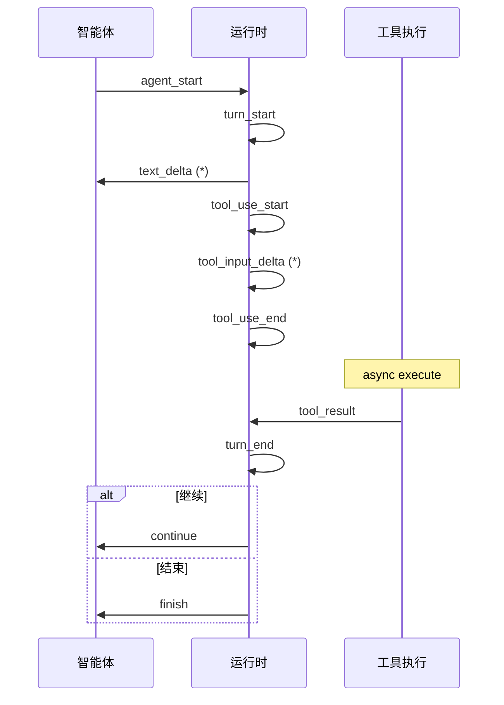
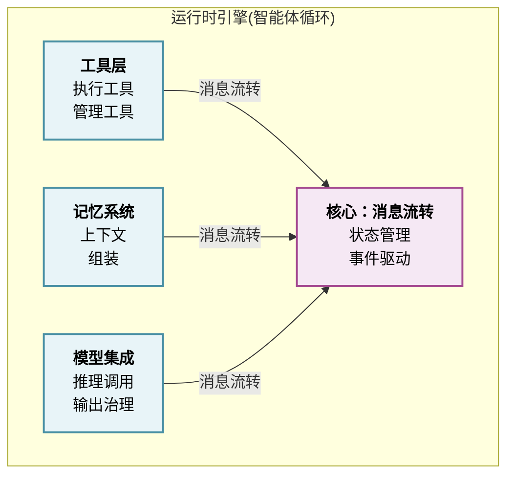

## 本章小结

### 核心要点

#### 运行时的本质

运行时引擎是智能体系统的执行核心，定义了系统如何在每一轮循环中协调推理、行动和观察。两个参考系统展现了不同的设计哲学：

- **Claude Code 的异步生成器**：基于 submitMessage() 异步生成器的事件驱动循环，支持实时流式响应和并发工具执行，适合交互式任务
- **OpenClaw 的线性流水线**：顺序执行 intake → context assembly → inference → tool execution → persistence，提供完整的可追踪性，适合自驱型长时任务

#### 设计权衡

选择哪种模式取决于应用场景的需求：

| 考虑因素 | Claude Code 异步模式 | OpenClaw 线性模式 |
|--------|------------|------------|
| 可追踪性 | 中（需要日志） | 优（完整阶段化） |
| 响应延迟 | 低（流式响应） | 较高（同步执行） |
| 并发能力 | 高（并发工具执行） | 低（单会话单线程） |
| 调试难度 | 中等（异步调试复杂） | 容易（确定的执行序列） |
| 长时任务 | 中（需要主动管理） | 优（状态管理完善） |

#### 智能体循环的终止条件

明确的终止条件防止无限循环或过度执行：

1. **工具调用耗尽**：最后一条消息不包含工具调用
2. **轮数限制**：通常 10-30 轮
3. **令牌预算耗尽**：无法继续推理
4. **显式停止信号**：用户取消或智能体发出停止标记
5. **目标达成**：自驱型智能体的目标检查

### 消息与状态管理的核心抉择

#### 消息类型系统

完整的消息类型系统提供类型安全和可追踪性：

| 字段 | 类型 | 说明 |
|------|------|------|
| role | `"user"` 或 `"assistant"` | 消息发送者角色 |
| content | array | 消息内容块数组，包含： - TextBlock: 纯文本 - ToolUseBlock: 工具调用请求 - ToolResultBlock: 工具执行结果 - ThinkingBlock: 推理过程（可选） |

#### 状态管理模式

两种模式的权衡：

- **发布-订阅**：原地修改状态，通过事件通知订阅者，低开销但需要额外同步
- **不可变状态**：每次变化产生新对象，完整的历史链可追踪，但内存和性能开销大

### 流式处理的必要性

工具必须在流式响应期间执行，而非批处理，这决定了系统的关键性能特性：

**为什么**：

1. 用户可以立即看到首字节响应
2. 工具可以并发执行
3. 智能体可以基于工具结果立即进行下一轮推理

**事件流架构**：

### 错误处理的分层策略

| 错误类型 | 影响范围 | 处理策略 | 示例 |
|--------|--------|---------|------|
| 工具执行错误 | 单个工具 | 重试或作为观察反馈 | 文件不存在 |
| API 调用错误 | 当前轮次 | 指数退避重试 | 速率限制、超时 |
| 输出解析错误 | 当前结果 | 参数验证、重新生成 | JSON 格式错误 |
| 上下文溢出 | 整个会话 | 自动压缩、历史管理 | 超过令牌限制 |

**OpenClaw 的“错误即观察”**：所有错误都被转换为 ToolResultBlock 反馈给 Agent，使其能够学习和调适。

### 长时任务的漂移检测与纠正

#### 漂移的表现

- 目标遗忘：Agent 忘记了原始任务
- 目标替代：用中间目标替代主目标
- 范围蠕变：任务范围逐步扩大
- 方向漂移：推理偏离最优路径

#### 检测方法

1. **启发式**：关键词匹配、重复行动检测
2. **语义**：向量相似度检测（与原始目标的语义距离）
3. **约束检查**：令牌数、工具调用数、执行时间约束

#### 纠正策略

1. **强制反思**：定期插入反思步骤，要求智能体重新评估进度（OpenClaw）
2. **检查点恢复**：保存中间状态，漂移时回滚
3. **约束验证**：硬约束防止出界

### 令牌预算管理的实践

#### 预算组成

令牌预算的详细分配方案如下所示：

| 预算项目 | 分配 | 说明 |
|---------|------|------|
| **总预算** | **200,000 tokens** | - |
| 系统提示词 | ~500 | 系统级指令 |
| 消息历史 | ~50,000 | 上下文消息 |
| 工具 Schema | ~5,000 | 工具定义 |
| 用户输入 | ~2,000 | 当前查询 |
| 预留余额 | ~142,500 | **总计** |
| &ensp;&ensp;推理预留 | 100,000 | 思考过程 |
| &ensp;&ensp;实际可用 | ~42,500 | 可用输出空间 |

#### 管理策略

1. **前向估计**：发送请求前预估令牌数，避免超限
2. **自动压缩**：80% 阈值触发压缩（Claude Code）或 70% 触发记忆整合（OpenClaw）
3. **历史片段化**：保留最重要的消息，丢弃中间的
4. **动态边界**：系统提示词与动态上下文的分离缓存（Claude Code）

### MiniHarness 实现的启示

通过从零实现一个完整的运行时，我们理解了：

1. **架构分层** 的重要性：模型层、事件层、工具层、运行时层的清晰划分
2. **异步编程** 的必要性：用 asyncio 实现高效的事件驱动循环
3. **可测试性**：每个组件都可以独立测试和扩展
4. **扩展性**：通过注册表、工具抽象、事件系统实现易于扩展

### 与其他部分的联系

运行时引擎是整个 Harness 系统的枢纽，与其他子系统的关系：

### 学习路径建议

1. **入门**：理解 智能体循环的基本概念（Think-Act-Observe）
2. **进阶**：对比两种实现模式的权衡，选择适合的架构
3. **实践**：实现 MiniHarness 或扩展其功能（添加真实模型、记忆系统等）
4. **深化**：研究特定场景的优化（流式处理、漂移检测、令牌管理）
5. **生产**：在实际项目中应用这些原则和模式

### 关键术语速查

| 术语 | 定义 |
|------|------|
| 智能体循环 | 思考-行动-观察的重复过程 |
| 消息窗口 | 保留在上下文中的消息历史大小 |
| 令牌预算 | 单次推理允许的最大令牌数 |
| 漂移检测 | 识别智能体偏离目标 |
| 流式处理 | 响应和工具执行的实时交互 |
| 事件驱动 | 基于事件的异步编程模型 |
| 工具执行 | 运行智能体调用的外部工具或函数 |
| 上下文组装 | 将系统、历史、工具信息组合成推理输入 |
| 不可变状态 | 每次变化都产生新状态对象 |
| 发布-订阅 | 通过事件通知状态变化 |

### 延伸阅读建议

- 第五章（工具层）：工具的注册、发现、权限管理
- 第六章（记忆系统）：长期记忆对 智能体循环的支持
- 第七章（模型集成）：推理调用、输出治理、质量控制
- 第十章（生产部署）：运行时的可观测性、监控、扩展

### 实践练习

1. **扩展 MiniHarness**：添加文件读写工具、网络请求工具
2. **实现漂移检测**：在 MiniHarness 中添加简单的漂移检测机制
3. **令牌管理**：实现消息自动压缩（基于消息数或字符长度）
4. **对比实验**：实现线性流水线版本和异步生成器版本，对比性能
5. **真实集成**：将 MiniHarness 与真实的 LLM API（如 Claude）集成

### 第四章完成

本章深入讲解了 Harness 运行时引擎的设计与实现，涵盖了 智能体循环的核心模式、消息状态管理、流式处理、错误恢复、漂移检测和令牌管理等关键主题。通过 MiniHarness 的实现，我们展示了这些概念如何落地成可运行的代码。

下一章将深入 **工具层** 的设计，研究工具的抽象、注册、执行、权限管理和动态加载。
