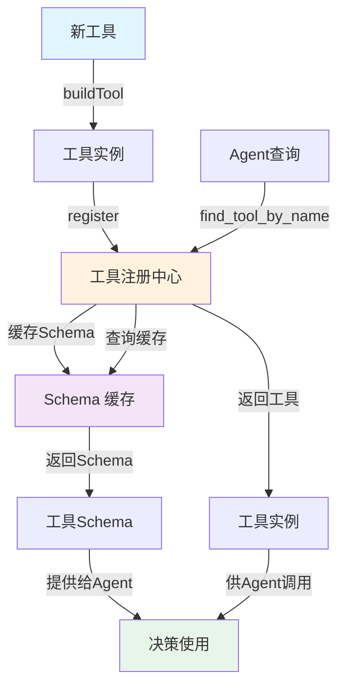

## 5.1 工具抽象接口设计

工具抽象接口是工具系统的核心基础，需要在通用性、类型安全、可观测性和性能间取得平衡。本节介绍Claude Code的泛型设计、工具实现示例、注册中心机制，以及权限管理策略。

### 5.1.1 统一工具接口的设计目标

工具抽象接口的设计需要平衡以下目标：

1. **通用性**：支持各种异构工具（文件、网络、计算、数据库等）
2. **类型安全**：在编译时（或运行时）检查参数和返回值类型
3. **可观测性**：支持进度报告、事件发射、日志记录
4. **可扩展性**：易于添加新工具类型
5. **性能**：最小化开销，支持并发执行
6. **安全性**：权限检查、资源限制、错误隔离

### 5.1.2 Claude Code 的 Tool<Input,Output,Progress> 泛型设计

Claude Code 采用泛型 Tool 接口，明确定义输入、输出和进度类型：

```python
"""
Claude Code 风格的工具接口
"""

from abc import ABC, abstractmethod
from dataclasses import dataclass
from typing import Generic, TypeVar, Optional, Dict, Any, List
import asyncio

# 类型变量
InputType = TypeVar('InputType')
OutputType = TypeVar('OutputType')
ProgressType = TypeVar('ProgressType')

@dataclass
class ToolProgress:
    """工具执行进度"""
    step: int              # 当前步骤号
    total_steps: int       # 总步骤数
    current_status: str    # 当前状态描述
    estimated_time_remaining: Optional[float] = None  # 剩余时间(秒)

    def percentage(self) -> float:
        """进度百分比"""
        return (self.step / self.total_steps * 100) if self.total_steps > 0 else 0

class Tool(ABC, Generic[InputType, OutputType]):
    """通用工具抽象"""

    @abstractmethod
    async def call(self, input_data: InputType) -> OutputType:
        """
        执行工具

        Args:
            input_data: 工具输入,已验证和类型检查过

        Returns:
            工具执行结果

        Raises:
            ToolExecutionError: 工具执行失败
        """
        pass

    @abstractmethod
    def name(self) -> str:
        """工具名称"""
        pass

    @abstractmethod
    def description(self) -> str:
        """工具描述"""
        pass

    @abstractmethod
    def input_schema(self) -> Dict[str, Any]:
        """输入的 JSON Schema"""
        pass

    def check_permissions(self, context: Any) -> bool:
        """
        检查当前上下文是否有权限调用此工具

        Args:
            context: 执行上下文(包含用户、会话信息等)

        Returns:
            是否有权限
        """
        return True  # 默认允许

    async def get_progress(self) -> Optional[ToolProgress]:
        """
        获取工具执行进度

        Returns:
            进度对象,如果工具不支持进度报告则返回 None
        """
        return None

    def supports_streaming(self) -> bool:
        """工具是否支持流式输出"""
        return False

    async def stream_output(self, input_data: InputType):
        """
        流式输出(可选)

        Yields:
            OutputType: 逐个产生的输出
        """
        if not self.supports_streaming():
            output = await self.call(input_data)
            yield output
```

### 5.1.3 工具实现示例

#### 1. 简单工具：Bash 执行

一个简单的Bash命令执行工具的实现如下：

```python
@dataclass
class BashInput:
    command: str
    timeout: int = 30
    cwd: Optional[str] = None

@dataclass
class BashOutput:
    stdout: str
    stderr: str
    returncode: int
    execution_time: float

class BashTool(Tool[BashInput, BashOutput]):
    """Bash 命令执行工具"""

    async def call(self, input_data: BashInput) -> BashOutput:
        """执行 bash 命令"""
        import subprocess
        import time

        start_time = time.time()

        try:
            result = subprocess.run(
                input_data.command,
                shell=True,
                capture_output=True,
                timeout=input_data.timeout,
                text=True,
                cwd=input_data.cwd
            )

            return BashOutput(
                stdout=result.stdout,
                stderr=result.stderr,
                returncode=result.returncode,
                execution_time=time.time() - start_time
            )

        except subprocess.TimeoutExpired:
            raise ToolExecutionError(
                f"Bash command timeout after {input_data.timeout}s"
            )
        except Exception as e:
            raise ToolExecutionError(f"Bash execution failed: {str(e)}")

    def name(self) -> str:
        return "bash_exec"

    def description(self) -> str:
        return "Execute bash commands on the system"

    def input_schema(self) -> Dict[str, Any]:
        return {
            "type": "object",
            "properties": {
                "command": {
                    "type": "string",
                    "description": "The bash command to execute"
                },
                "timeout": {
                    "type": "integer",
                    "description": "Command timeout in seconds",
                    "default": 30
                },
                "cwd": {
                    "type": "string",
                    "description": "Current working directory"
                }
            },
            "required": ["command"]
        }

    def check_permissions(self, context: Any) -> bool:
        """Bash 工具需要特殊权限"""
        if hasattr(context, 'is_admin'):
            return context.is_admin
        return False
```

#### 2. 支持进度报告的工具：文件复制

一个支持进度报告的文件复制工具，展示如何在长时间运行的操作中提供实时反馈：

```python
@dataclass
class FileCopyInput:
    source: str
    destination: str
    overwrite: bool = False

@dataclass
class FileCopyOutput:
    success: bool
    bytes_copied: int
    destination: str

class FileCopyTool(Tool[FileCopyInput, FileCopyOutput]):
    """文件复制工具,支持进度报告"""

    def __init__(self):
        self._current_progress = None

    async def call(self, input_data: FileCopyInput) -> FileCopyOutput:
        """复制文件"""
        import shutil
        import os

        # 检查源文件是否存在
        if not os.path.exists(input_data.source):
            raise ToolExecutionError(f"Source file not found: {input_data.source}")

        # 检查目标是否已存在
        if os.path.exists(input_data.destination) and not input_data.overwrite:
            raise ToolExecutionError(
                f"Destination already exists: {input_data.destination}"
            )

        # 获取文件大小用于进度报告
        file_size = os.path.getsize(input_data.source)
        chunk_size = 1024 * 1024  # 1MB chunks

        bytes_copied = 0

        # 自定义复制逻辑以支持进度报告
        with open(input_data.source, 'rb') as src, \
             open(input_data.destination, 'wb') as dst:
            while True:
                chunk = src.read(chunk_size)
                if not chunk:
                    break

                dst.write(chunk)
                bytes_copied += len(chunk)

                # 更新进度
                self._current_progress = ToolProgress(
                    step=bytes_copied,
                    total_steps=file_size,
                    current_status=f"Copying {bytes_copied}/{file_size} bytes"
                )

        return FileCopyOutput(
            success=True,
            bytes_copied=bytes_copied,
            destination=input_data.destination
        )

    async def get_progress(self) -> Optional[ToolProgress]:
        """获取进度"""
        return self._current_progress

    def name(self) -> str:
        return "file_copy"

    def description(self) -> str:
        return "Copy files with progress reporting"

    def input_schema(self) -> Dict[str, Any]:
        return {
            "type": "object",
            "properties": {
                "source": {
                    "type": "string",
                    "description": "Source file path"
                },
                "destination": {
                    "type": "string",
                    "description": "Destination file path"
                },
                "overwrite": {
                    "type": "boolean",
                    "description": "Whether to overwrite existing file",
                    "default": False
                }
            },
            "required": ["source", "destination"]
        }
```

#### 3. 流式输出工具：数据库查询

一个支持流式输出的数据库查询工具，展示如何处理大结果集：

```python
from dataclasses import dataclass
from typing import Dict, Any
import asyncio

@dataclass
class DatabaseQueryInput:
    query: str
    limit: int = 1000

@dataclass
class DatabaseQueryRow:
    columns: Dict[str, Any]

class DatabaseQueryTool(Tool[DatabaseQueryInput, DatabaseQueryRow]):
    """数据库查询工具,支持流式输出"""

    def __init__(self, connection_string: str):
        self.connection_string = connection_string

    async def call(self, input_data: DatabaseQueryInput) -> str:
        """执行查询并返回结果"""
        # 这个实现中,我们只返回所有结果的摘要
        # 实际使用应该使用流式输出
        all_rows = []
        async for row in self.stream_output(input_data):
            all_rows.append(row)

        return f"Query returned {len(all_rows)} rows"

    async def stream_output(self, input_data: DatabaseQueryInput):
        """流式输出查询结果"""
        # 在实际实现中,这里会连接到真实的数据库
        # 示例:连接到 PostgreSQL、MySQL 等

        # 模拟流式输出
        for i in range(min(input_data.limit, 10)):
            yield DatabaseQueryRow(
                columns={
                    "id": i,
                    "name": f"Row {i}",
                    "value": i * 100
                }
            )
            await asyncio.sleep(0.1)  # 模拟网络延迟

    def supports_streaming(self) -> bool:
        return True

    def name(self) -> str:
        return "database_query"

    def description(self) -> str:
        return "Query database with streaming results"

    def input_schema(self) -> Dict[str, Any]:
        return {
            "type": "object",
            "properties": {
                "query": {
                    "type": "string",
                    "description": "SQL query to execute"
                },
                "limit": {
                    "type": "integer",
                    "description": "Maximum number of rows to return",
                    "default": 1000
                }
            },
            "required": ["query"]
        }
```

### 5.1.4 buildTool() 工厂函数

Claude Code 使用工厂函数动态构造工具，支持参数化和延迟初始化：

```python
def build_tool(tool_spec: Dict[str, Any]) -> Tool:
    """
    工厂函数:根据规范构造工具

    Args:
        tool_spec: 工具规范
            {
                "type": "bash" | "file" | "network" | ...,
                "name": "tool_name",
                "config": {...}  # 工具特定的配置
            }

    Returns:
        构造的工具实例
    """

    tool_type = tool_spec.get("type")
    config = tool_spec.get("config", {})

    if tool_type == "bash":
        return BashTool()

    elif tool_type == "file_copy":
        return FileCopyTool()

    elif tool_type == "database_query":
        return DatabaseQueryTool(
            connection_string=config.get("connection_string")
        )

    elif tool_type == "custom":
        # 动态导入和加载自定义工具
        module_path = config.get("module")
        class_name = config.get("class")

        # 使用 importlib 动态加载
        import importlib
        module = importlib.import_module(module_path)
        tool_class = getattr(module, class_name)
        return tool_class(**config.get("args", {}))

    else:
        raise ValueError(f"Unknown tool type: {tool_type}")
```

### 5.1.5 工具注册中心

工具注册中心是所有工具的中枢，负责工具的注册、发现和管理。下面的流程图展示了工具的注册、发现和查询的完整流程：



图 5-1：工具注册与发现流程

```python
class ToolRegistry:
    """工具注册中心,管理所有可用工具"""

    def __init__(self):
        self.tools: Dict[str, Tool] = {}
        self.tool_cache: Dict[str, Dict[str, Any]] = {}  # Schema 缓存

    def register(self, tool: Tool):
        """注册工具"""
        name = tool.name()
        self.tools[name] = tool

        # 缓存工具的 Schema
        self.tool_cache[name] = {
            "name": name,
            "description": tool.description(),
            "input_schema": tool.input_schema()
        }

        print(f"Tool registered: {name}")

    def get(self, name: str) -> Optional[Tool]:
        """获取工具"""
        return self.tools.get(name)

    def list_tools(self) -> List[Dict[str, Any]]:
        """列出所有工具的 Schema"""
        return list(self.tool_cache.values())

    def get_tool_schema(self, name: str) -> Optional[Dict[str, Any]]:
        """获取单个工具的 Schema"""
        return self.tool_cache.get(name)

    def tool_exists(self, name: str) -> bool:
        """检查工具是否存在"""
        return name in self.tools

    def unregister(self, name: str):
        """注销工具"""
        if name in self.tools:
            del self.tools[name]
            del self.tool_cache[name]
            print(f"Tool unregistered: {name}")

# 使用示例
registry = ToolRegistry()

# 注册内置工具
registry.register(BashTool())
registry.register(FileCopyTool())
registry.register(DatabaseQueryTool("postgresql://localhost/mydb"))

# 列出所有工具
for tool_schema in registry.list_tools():
    print(f"- {tool_schema['name']}: {tool_schema['description']}")

# 获取特定工具
bash_tool = registry.get("bash_exec")
if bash_tool:
    print(f"Found tool: {bash_tool.name()}")
```

### 5.1.6 OpenClaw 的工具策略模型

OpenClaw 支持更细粒度的权限管理：

```python
class ToolStrategy(Enum):
    """工具使用策略"""
    ALLOW = "allow"           # 允许使用
    DENY = "deny"            # 禁止使用
    REQUIRE_APPROVAL = "require_approval"  # 需要用户批准

class ToolPolicy:
    """工具策略:定义哪些智能体可以使用哪些工具"""

    def __init__(self):
        self.policies: Dict[str, Dict[str, ToolStrategy]] = {}
        # policies[agent_id][tool_name] = strategy

    def set_policy(self, agent_id: str, tool_name: str,
                  strategy: ToolStrategy):
        """设置工具策略"""
        if agent_id not in self.policies:
            self.policies[agent_id] = {}
        self.policies[agent_id][tool_name] = strategy

    def can_use_tool(self, agent_id: str, tool_name: str) -> bool:
        """检查智能体是否可以使用工具"""
        if agent_id not in self.policies:
            return True  # 默认允许

        strategy = self.policies[agent_id].get(
            tool_name,
            ToolStrategy.ALLOW
        )

        return strategy != ToolStrategy.DENY

    def requires_approval(self, agent_id: str, tool_name: str) -> bool:
        """检查是否需要审批"""
        if agent_id not in self.policies:
            return False

        strategy = self.policies[agent_id].get(tool_name)
        return strategy == ToolStrategy.REQUIRE_APPROVAL
```

### 5.1.7 本节小结

工具抽象接口的设计决定了整个工具系统的质量和可维护性：

1. **Claude Code 的 Tool<I,O,P> 泛型设计** 提供了强类型检查，但需要 Python 的高级类型系统支持

2. **工具工厂函数** 支持动态工具构造和参数化配置

3. **工具注册中心** 管理工具的生命周期和 Schema 缓存

4. **权限检查** 在工具调用前进行，可以是简单的 boolean 也可以是复杂的策略模型

5. **OpenClaw 的工具策略模型** 提供更细粒度的权限管理，支持不同智能体的不同权限

好的工具抽象应该既通用又灵活，既简单又强大。在实践中，需要根据具体场景选择合适的抽象级别。
