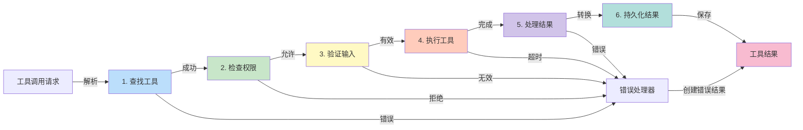

## 5.2 工具执行流水线

### 5.2.1 执行流水线的完整过程

工具从被调用到返回结果的完整流程可以分为以下6个阶段：



图5-2：工具执行流水线的6个阶段

### 5.2.2 完整的执行流水线实现

工具执行流水线的实现可以分为四个主要部分：初始化和主流程、验证阶段、执行和结果处理、以及缓存管理。

#### 第一部分：流水线初始化与主流程

首先定义执行流水线的主体和6个阶段的总体流程：

```python
"""工具执行流水线"""

from dataclasses import dataclass
from typing import Optional, Dict, Any, Callable
import asyncio
import time
import json

class ExecutionPipeline:
    """工具执行流水线"""

    def __init__(self,
                 tool_registry: ToolRegistry,
                 max_result_size: int = 1024 * 1024,
                 default_timeout: int = 30):
        self.tool_registry = tool_registry
        self.max_result_size = max_result_size
        self.default_timeout = default_timeout
        self.execution_history = []
        self.result_cache = {}

    async def execute(self,
                     tool_use: ToolUseBlock,
                     context: Any,
                     progress_callback: Optional[Callable] = None) -> ToolResultBlock:
        """执行工具的完整流水线"""
        execution_record = {
            "tool_use_id": tool_use.id,
            "tool_name": tool_use.name,
            "start_time": time.time(),
            "stages": {}
        }

        try:
            # 阶段1：工具发现
            tool, error = await self._find_tool(tool_use.name, execution_record)
            if error:
                return self._create_error_result(tool_use, error)

            # 阶段2：权限检查
            is_allowed, error = await self._check_permissions(
                tool, context, execution_record
            )
            if not is_allowed:
                return self._create_error_result(tool_use, error)

            # 阶段3：输入验证
            is_valid, error = await self._validate_input(
                tool, tool_use.input, execution_record
            )
            if not is_valid:
                return self._create_error_result(tool_use, error)

            # 阶段4：工具执行
            result, error = await self._execute_tool(
                tool, tool_use.input, execution_record, progress_callback
            )
            if error:
                return self._create_error_result(tool_use, error)

            # 阶段5：结果处理
            processed_result, error = await self._process_result(
                result, execution_record
            )
            if error:
                return self._create_error_result(tool_use, error)

            # 阶段6：持久化
            await self._persist_result(
                tool_use.id, processed_result, execution_record
            )

            self.execution_history.append(execution_record)

            return ToolResultBlock(
                tool_use_id=tool_use.id,
                content=str(processed_result),
                is_error=False
            )

        except Exception as e:
            execution_record["error"] = str(e)
            self.execution_history.append(execution_record)
            return self._create_error_result(tool_use, str(e))
```

**设计说明**：主流程采用“早期返回”（Early Return）模式。任何阶段失败都立即返回错误，避免继续执行。这提高了效率并简化了错误处理。

#### 第二部分：验证阶段（工具发现、权限检查、输入验证）

这部分处理执行前的三个验证阶段：

```python
    async def _find_tool(self, tool_name: str,
                        execution_record: Dict) -> Tuple[Optional[Tool], Optional[str]]:
        """阶段1：工具发现"""
        start = time.time()
        tool = self.tool_registry.get(tool_name)
        execution_record["stages"]["find_tool"] = {
            "duration": time.time() - start,
            "found": tool is not None
        }
        if not tool:
            return None, f"Tool '{tool_name}' not found"
        return tool, None

    async def _check_permissions(self, tool: Tool, context: Any,
                                execution_record: Dict) -> Tuple[bool, Optional[str]]:
        """阶段2：权限检查"""
        start = time.time()
        try:
            has_permission = tool.check_permissions(context)
            execution_record["stages"]["check_permissions"] = {
                "duration": time.time() - start,
                "result": has_permission
            }
            if not has_permission:
                return False, f"Permission denied for tool '{tool.name()}'"
            return True, None
        except Exception as e:
            return False, f"Permission check error: {str(e)}"

    async def _validate_input(self, tool: Tool, input_data: Dict[str, Any],
                             execution_record: Dict) -> Tuple[bool, Optional[str]]:
        """阶段3：输入验证"""
        start = time.time()
        schema = tool.input_schema()
        errors = []

        required = schema.get("required", [])
        for field in required:
            if field not in input_data:
                errors.append(f"Missing required field: {field}")

        properties = schema.get("properties", {})
        for field_name, field_value in input_data.items():
            if field_name not in properties:
                errors.append(f"Unknown field: {field_name}")
                continue
            field_schema = properties[field_name]
            if not self._check_type(field_value, field_schema):
                expected_type = field_schema.get("type", "unknown")
                errors.append(
                    f"Field '{field_name}' validation failed: "
                    f"expected {expected_type}"
                )

        execution_record["stages"]["validate_input"] = {
            "duration": time.time() - start,
            "valid": len(errors) == 0,
            "errors": errors
        }

        if errors:
            return False, "; ".join(errors)
        return True, None

    def _check_type(self, value: Any, schema: Dict[str, Any]) -> bool:
        """基于JSON Schema的类型验证"""
        import jsonschema
        try:
            jsonschema.validate(value, schema)
            return True
        except jsonschema.ValidationError:
            return False
```

**设计说明**：验证阶段按顺序执行，逐步变严格。工具发现最快，然后是权限检查，最后是复杂的输入验证。这样可以快速拒绝无效请求。

#### 第三部分：执行和结果处理（工具执行、结果处理、持久化）

这部分处理核心的执行逻辑和结果的后处理：

```python
    async def _execute_tool(self,
                           tool: Tool,
                           input_data: Dict[str, Any],
                           execution_record: Dict,
                           progress_callback: Optional[Callable] = None
                           ) -> Tuple[Any, Optional[str]]:
        """阶段4：工具执行（带超时控制）"""
        start = time.time()
        try:
            result = await asyncio.wait_for(
                tool.call(input_data),
                timeout=self.default_timeout
            )
            execution_record["stages"]["execute_tool"] = {
                "duration": time.time() - start,
                "success": True
            }
            return result, None
        except asyncio.TimeoutError:
            error = f"Tool execution timeout ({self.default_timeout}s)"
            execution_record["stages"]["execute_tool"] = {
                "duration": time.time() - start,
                "success": False,
                "error": "timeout"
            }
            return None, error
        except Exception as e:
            execution_record["stages"]["execute_tool"] = {
                "duration": time.time() - start,
                "success": False,
                "error": type(e).__name__
            }
            return None, f"Tool execution error: {str(e)}"

    async def _process_result(self, result: Any,
                             execution_record: Dict) -> Tuple[str, Optional[str]]:
        """阶段5：结果处理（序列化和截断）"""
        start = time.time()
        try:
            if isinstance(result, str):
                result_str = result
            elif isinstance(result, (dict, list)):
                result_str = json.dumps(result, indent=2)
            else:
                result_str = str(result)

            if len(result_str) > self.max_result_size:
                original_size = len(result_str)
                result_str = result_str[:self.max_result_size]
                result_str += f"\n... [Output truncated from {original_size} bytes]"
                execution_record["stages"]["process_result"] = {
                    "duration": time.time() - start,
                    "truncated": True,
                    "original_size": original_size,
                }
            else:
                execution_record["stages"]["process_result"] = {
                    "duration": time.time() - start,
                    "truncated": False,
                    "size": len(result_str)
                }
            return result_str, None
        except Exception as e:
            return None, f"Result processing error: {str(e)}"

    async def _persist_result(self, tool_use_id: str, result: str,
                             execution_record: Dict):
        """阶段6：持久化（缓存）"""
        start = time.time()
        self.result_cache[tool_use_id] = {
            "content": result,
            "timestamp": time.time()
        }
        execution_record["stages"]["persist_result"] = {
            "duration": time.time() - start,
            "cached": True
        }

    def _create_error_result(self, tool_use: ToolUseBlock,
                            error: str) -> ToolResultBlock:
        """创建错误结果"""
        return ToolResultBlock(
            tool_use_id=tool_use.id,
            content=error,
            is_error=True,
            error_type="ExecutionError"
        )
```

**设计说明**：`_execute_tool` 使用 `asyncio.wait_for` 实现超时控制，防止卡顿。`_process_result` 对大结果进行截断，确保不超过最大大小限制。这两个措施都是保护系统稳定性的关键。

#### 第四部分：执行历史和缓存管理

最后是查询执行历史和清理缓存的工具方法：

```python
    def get_execution_history(self, tool_use_id: Optional[str] = None):
        """获取执行历史"""
        if tool_use_id:
            return [r for r in self.execution_history
                   if r["tool_use_id"] == tool_use_id]
        return self.execution_history

    def clear_cache(self, max_age: int = 3600):
        """清理缓存（删除超过max_age秒的项）"""
        now = time.time()
        to_delete = [
            key for key, value in self.result_cache.items()
            if now - value["timestamp"] > max_age
        ]
        for key in to_delete:
            del self.result_cache[key]
        return len(to_delete)
```

### 5.2.3 进度事件流

支持长时间运行的工具的进度报告：
```python
from typing import Optional, Dict
import asyncio
import time

class ProgressMonitor:
    """进度监控器"""

    def __init__(self, tool_use_id: str):
        self.tool_use_id = tool_use_id
        self.progress_events = []

    def report_progress(self, step: int, total_steps: int,
                       status: str, estimated_time_remaining: Optional[float] = None):
        """报告进度"""
        event = {
            "tool_use_id": self.tool_use_id,
            "timestamp": time.time(),
            "step": step,
            "total_steps": total_steps,
            "percentage": (step / total_steps * 100) if total_steps > 0 else 0,
            "status": status,
            "estimated_time_remaining": estimated_time_remaining
        }
        self.progress_events.append(event)
        return event

    def get_current_progress(self) -> Optional[Dict]:
        """获取当前进度"""
        return self.progress_events[-1] if self.progress_events else None

# 在工具执行中使用
async def long_running_tool_call(progress_monitor: ProgressMonitor):
    """长时间运行的工具调用示例"""
    total_items = 1000

    for i in range(total_items):
        # 执行工作
        await asyncio.sleep(0.01)  # 模拟工作

        # 报告进度
        if i % 100 == 0:
            progress_monitor.report_progress(
                step=i,
                total_steps=total_items,
                status=f"Processing item {i}/{total_items}",
                estimated_time_remaining=(total_items - i) * 0.01
            )

    return f"Processed {total_items} items"
```

### 5.2.4 并发工具执行

具体实现如下：
```python
from typing import List, Dict, Any
import asyncio

class StreamingToolExecutor:
    """并发工具执行器"""

    def __init__(self, pipeline: ExecutionPipeline,
                 max_concurrent: int = 5):
        self.pipeline = pipeline
        self.max_concurrent = max_concurrent

    async def execute_tools(self,
                           tool_uses: List[ToolUseBlock],
                           context: Any) -> Dict[str, ToolResultBlock]:
        """
        并发执行多个工具

        Args:
            tool_uses: 工具调用列表
            context: 执行上下文

        Returns:
            {tool_use_id: tool_result_block}
        """

        semaphore = asyncio.Semaphore(self.max_concurrent)

        async def execute_with_semaphore(tool_use):
            async with semaphore:
                return tool_use.id, await self.pipeline.execute(
                    tool_use, context
                )

        results = await asyncio.gather(
            *[execute_with_semaphore(tu) for tu in tool_uses],
            return_exceptions=True
        )

        # 组织结果
        result_dict = {}
        for tool_use_id, result in results:
            if isinstance(result, Exception):
                result_dict[tool_use_id] = ToolResultBlock(
                    tool_use_id=tool_use_id,
                    content=str(result),
                    is_error=True,
                    error_type=type(result).__name__
                )
            else:
                result_dict[tool_use_id] = result

        return result_dict
```

### 5.2.5 本节小结

工具执行流水线的设计决定了系统的可靠性和性能：

1. **6 个执行阶段** 清晰分离，每个阶段有明确的职责和错误处理

2. **权限检查** 在执行前进行，防止未授权的操作

3. **输入验证** 基于 JSON Schema，确保工具收到有效参数

4. **超时控制** 防止工具阻塞整个系统

5. **结果处理** 包括序列化、截断、缓存，处理大结果的问题

6. **执行历史记录** 支持审计和调试

7. **并发执行** 和 **进度报告** 支持长时间运行的工具
