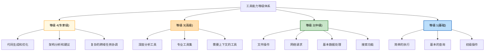

## 5.3 工具类型体系

### 5.3.1 工具分类

按功能和特点，Agent 系统的工具可分为以下几类：

#### 1. 执行工具

在本地系统执行代码或命令的工具。

```python
class BashTool(Tool):
    """执行 bash 命令"""
    def name(self) -> str: return "bash_exec"

class PythonTool(Tool):
    """执行 Python 代码"""
    def name(self) -> str: return "python_exec"

class FileReadTool(Tool):
    """读取文件内容"""
    def name(self) -> str: return "file_read"

class FileWriteTool(Tool):
    """写入文件"""
    def name(self) -> str: return "file_write"

class FileListTool(Tool):
    """列出目录内容"""
    def name(self) -> str: return "file_list"
```

**特点**：

- 直接影响本地系统状态
- 需要严格的权限控制
- 可能长时间运行
- 需要超时保护

#### 2. 网络工具

通过网络访问远程资源的工具。

```python
class HTTPTool(Tool):
    """发送 HTTP 请求"""
    def name(self) -> str: return "http_request"

class WebSearchTool(Tool):
    """网络搜索"""
    def name(self) -> str: return "web_search"

class APIDelegationTool(Tool):
    """调用第三方 API"""
    def name(self) -> str: return "api_call"
```

**特点**：

- 依赖网络连接
- 可能有速率限制
- 需要处理超时和重试
- 可能涉及认证令牌管理

#### 3. 智能体工具

让智能体调用其他智能体的工具。

```python
class SubAgentTool(Tool):
    """创建和委托子任务给另一个 Agent"""
    def name(self) -> str: return "delegate_to_agent"

class ParallelAgentsTool(Tool):
    """并行执行多个 Agent"""
    def name(self) -> str: return "parallel_agents"
```

**特点**：

- 支持分解复杂任务
- 智能体间通信和协调
- 结果聚合
- 可能导致深层递归，需要深度限制

#### 4. 专用工具

针对特定领域的工具。

```python
class DatabaseQueryTool(Tool):
    """数据库查询"""
    def name(self) -> str: return "database_query"

class ImageProcessingTool(Tool):
    """图像处理"""
    def name(self) -> str: return "image_process"

class CodeAnalysisTool(Tool):
    """代码分析(静态或动态)"""
    def name(self) -> str: return "code_analyze"

class DataVisualizationTool(Tool):
    """数据可视化"""
    def name(self) -> str: return "plot_data"
```

**特点**：

- 特定领域的深度功能
- 高度优化
- 可能有复杂的依赖

### 5.3.2 工具能力的等级

Claude Code 的 24+内置工具可分为以下等级：



### 5.3.3 OpenClaw 的工具策略模型

核心逻辑如下：

```python
class ToolAccessLevel(Enum):
    """工具访问级别"""
    SYSTEM = "system"      # 仅系统可用
    ADMIN = "admin"        # 管理员可用
    TRUSTED = "trusted"    # 信任的用户可用
    PUBLIC = "public"      # 所有人可用

class ToolPolicy:
    """工具策略定义"""

    def __init__(self):
        self.access_levels: Dict[str, ToolAccessLevel] = {}
        self.resource_limits: Dict[str, Dict[str, Any]] = {}

    def set_access_level(self, tool_name: str,
                        level: ToolAccessLevel):
        """设置工具访问级别"""
        self.access_levels[tool_name] = level

    def set_resource_limit(self, tool_name: str,
                          max_execution_time: int = None,
                          max_memory: int = None,
                          max_disk_usage: int = None):
        """设置工具的资源限制"""
        self.resource_limits[tool_name] = {
            "max_execution_time": max_execution_time,
            "max_memory": max_memory,
            "max_disk_usage": max_disk_usage
        }

    def can_execute(self, tool_name: str,
                   user_role: str) -> bool:
        """检查用户是否可以执行工具"""
        level = self.access_levels.get(
            tool_name,
            ToolAccessLevel.PUBLIC
        )

        if level == ToolAccessLevel.SYSTEM:
            return user_role == "system"
        elif level == ToolAccessLevel.ADMIN:
            return user_role in ["system", "admin"]
        elif level == ToolAccessLevel.TRUSTED:
            return user_role in ["system", "admin", "trusted"]
        else:
            return True
```

### 5.3.4 工具的扩展模式

#### 1. 装饰器模式

该模式的实现示例：

```python
import asyncio

def timeout_wrapper(tool: Tool, timeout: int = 30) -> Tool:
    """为工具添加超时装饰器"""
    class TimeoutTool(Tool):
        async def call(self, input_data):
            try:
                return await asyncio.wait_for(
                    tool.call(input_data),
                    timeout=timeout
                )
            except asyncio.TimeoutError:
                raise ToolExecutionError(f"Tool timeout after {timeout}s")

        def name(self) -> str:
            return tool.name()

        def description(self) -> str:
            return tool.description()

        # 其他方法委托...

    return TimeoutTool()

def retry_wrapper(tool: Tool, max_retries: int = 3) -> Tool:
    """为工具添加重试装饰器"""
    class RetryTool(Tool):
        async def call(self, input_data):
            for attempt in range(max_retries):
                try:
                    return await tool.call(input_data)
                except Exception as e:
                    if attempt == max_retries - 1:
                        raise
                    await asyncio.sleep(2 ** attempt)  # 指数退避

        # 其他方法...

    return RetryTool()
```

#### 2. 复合工具

具体代码如下：

```python
from typing import List, Dict

class CompositeToolChain(Tool):
    """工具链：顺序执行多个工具"""

    def __init__(self, tools: List[Tool],
                 input_mapping: Dict[str, List[str]]):
        """
        input_mapping: 定义每个工具的输入如何来自前一个工具的输出
        例如：{
            "tool_2": ["output_from_tool_1.field_a"],
            "tool_3": ["output_from_tool_2.field_b", "user_input.param"]
        }
        """
        self.tools = tools
        self.input_mapping = input_mapping

    async def call(self, input_data):
        """依次执行工具"""
        context = {"user_input": input_data}

        for tool in self.tools:
            tool_name = tool.name()

            # 解析这个工具的输入
            tool_input = self._resolve_input(
                self.input_mapping.get(tool_name, []),
                context
            )

            # 执行工具
            result = await tool.call(tool_input)
            context[f"{tool_name}_output"] = result

        return context[f"{self.tools[-1].name()}_output"]

    def _resolve_input(self, mapping: List[str],
                      context: Dict) -> Dict:
        """从上下文中解析输入"""
        result = {}
        for ref in mapping:
            parts = ref.split(".")
            value = context
            for part in parts:
                value = value.get(part, {})
            # 提取字段名
            result[parts[-1]] = value
        return result
```

#### 3. 条件工具

以下是具体实现：

```python
class ConditionalTool(Tool):
    """条件执行：根据条件选择执行哪个工具"""

    def __init__(self, condition_fn, tool_if_true: Tool,
                 tool_if_false: Tool):
        self.condition_fn = condition_fn
        self.tool_if_true = tool_if_true
        self.tool_if_false = tool_if_false

    async def call(self, input_data):
        """根据条件选择执行"""
        if self.condition_fn(input_data):
            return await self.tool_if_true.call(input_data)
        else:
            return await self.tool_if_false.call(input_data)

    def name(self) -> str:
        return "conditional_tool"
```

### 5.3.5 工具的能力描述

完整的工具描述应包含：

```python
@dataclass
class ToolCapability:
    """工具的能力描述"""
    name: str
    description: str
    input_schema: Dict[str, Any]
    output_schema: Dict[str, Any]
    access_level: ToolAccessLevel
    required_permissions: List[str]
    estimated_execution_time: float  # 秒
    estimated_resource_usage: Dict[str, int]  # 内存、CPU 等
    examples: List[Dict[str, Any]]  # 使用示例
    limitations: List[str]  # 工具的限制
    dependencies: List[str]  # 外部依赖
```

### 5.3.6 本节小结

工具类型体系和扩展模式决定了工具系统的灵活性：

1. **工具分类**：执行、网络、Agent、专用四大类
2. **访问级别**：系统、管理、信任、公开四个等级
3. **扩展模式**：装饰器、复合、条件等组合方式
4. **能力描述**：完整的元数据帮助智能体理解工具能力

好的工具类型体系应该既清晰易用，又能支持灵活的扩展和组合。
