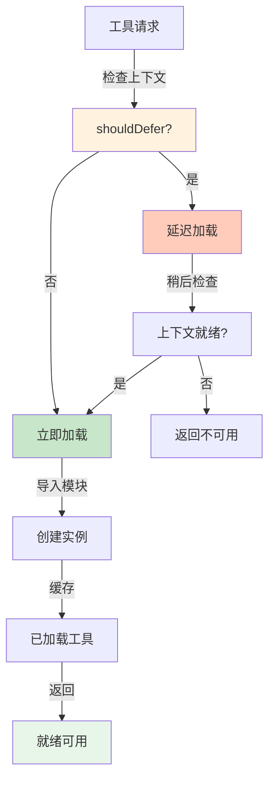

## 5.4 动态发现与加载

### 5.4.1 动态加载的必要性

静态工具列表的问题：

- 无法适应运行时变化
- 新工具需要重新部署
- 无法根据上下文选择性加载

### 5.4.2 Claude Code 的 shouldDefer 机制

shouldDefer机制决定了工具是否需要延迟加载。下面的流程图展示了动态工具加载的完整流程：



图5-3：shouldDefer延迟加载机制

核心实现如下：
```python
class ToolLoader:
    """延迟加载机制"""

    def __init__(self):
        self.loaded_tools = {}
        self.tool_metadata = {}

    def should_defer_loading(self, tool_name: str,
                            context: Dict) -> bool:
        """判断是否延迟加载工具"""
        # 示例：某些工具只在特定上下文才加载
        if tool_name == "database_query":
            return context.get("user_role") != "admin"
        return False

    async def load_tool_on_demand(self, tool_name: str,
                                 context: Dict) -> Optional[Tool]:
        """按需加载工具"""
        if tool_name in self.loaded_tools:
            return self.loaded_tools[tool_name]

        if self.should_defer_loading(tool_name, context):
            return None

        # 动态导入和加载
        try:
            spec = self.tool_metadata.get(tool_name)
            if not spec:
                return None

            module = await self._async_import(spec["module"])
            tool_class = getattr(module, spec["class"])
            tool = tool_class(**spec.get("args", {}))

            self.loaded_tools[tool_name] = tool
            return tool

        except Exception as e:
            print(f"Failed to load tool '{tool_name}': {e}")
            return None

    async def _async_import(self, module_path: str):
        """异步导入模块"""
        import importlib
        return importlib.import_module(module_path)
```

### 5.4.3 OpenClaw 的 6 级技能加载优先级

实现的代码结构：
```python
class SkillPriority(Enum):
    """技能加载优先级"""
    SYSTEM = 1          # 固定系统技能
    SESSION = 2         # 会话上下文技能
    USER = 3           # 用户自定义
    DOMAIN = 4         # 领域专业技能
    BUILTIN = 5        # 通用工具
    DISCOVERY = 6      # 动态发现

class SkillLoader:
    """6 级优先级技能加载器"""

    def __init__(self, storage):
        self.storage = storage
        self.loaded_skills = {}

    async def load_skills_for_session(self, session_id: str):
        """为会话加载所有技能"""
        skills = []

        # 1. 系统技能
        skills.extend(await self._load_system_skills())

        # 2. 会话上下文技能
        skills.extend(await self._load_session_skills(session_id))

        # 3. 用户自定义技能
        skills.extend(await self._load_user_skills(session_id))

        # 4. 领域技能
        domain = await self._detect_domain(session_id)
        skills.extend(await self._load_domain_skills(domain))

        # 5. 内置工具
        skills.extend(await self._load_builtin_tools())

        # 6. 动态发现技能
        skills.extend(await self._discover_skills_dynamically(session_id))

        return skills

    async def _load_system_skills(self):
        """加载系统技能（始终可用）"""
        return await self.storage.get_system_skills()

    async def _load_session_skills(self, session_id: str):
        """加载会话特定的技能"""
        return await self.storage.get_session_skills(session_id)

    async def _load_user_skills(self, session_id: str):
        """加载用户定义的技能"""
        user_id = await self.storage.get_user_for_session(session_id)
        return await self.storage.get_user_skills(user_id)

    async def _load_domain_skills(self, domain: str):
        """加载特定领域的技能"""
        if not domain:
            return []
        return await self.storage.get_domain_skills(domain)

    async def _load_builtin_tools(self):
        """加载内置工具"""
        return [
            BashTool(),
            FileReadTool(),
            FileWriteTool(),
            # ... 其他内置工具
        ]

    async def _discover_skills_dynamically(self, session_id: str):
        """动态发现技能"""
        # 扫描技能目录或 MCP
        discovered = await self.storage.discover_available_skills()
        return discovered

    async def _detect_domain(self, session_id: str) -> str:
        """根据会话内容检测领域"""
        recent_messages = await self.storage.get_recent_messages(session_id, limit=5)
        # 使用 NLP 检测领域
        text = " ".join(m.get_text() for m in recent_messages)
        return self._classify_domain(text)

    def _classify_domain(self, text: str) -> str:
        """简单的领域分类"""
        keywords = {
            "data": ["sql", "database", "query", "table"],
            "web": ["html", "css", "javascript", "react"],
            "system": ["bash", "shell", "linux", "windows"],
            "code": ["python", "java", "javascript"]
        }

        text_lower = text.lower()
        for domain, kws in keywords.items():
            if any(kw in text_lower for kw in kws):
                return domain
        return "general"
```

### 5.4.4 JSON Schema 缓存

具体的缓存实现：
```python
class SchemaCache:
    """工具 Schema 缓存"""

    def __init__(self, max_age: int = 3600):
        self.cache = {}
        self.max_age = max_age
        self.timestamps = {}

    def get_schema(self, tool_name: str) -> Optional[Dict]:
        """获取缓存的 Schema"""
        if tool_name in self.cache:
            age = time.time() - self.timestamps[tool_name]
            if age < self.max_age:
                return self.cache[tool_name]
            else:
                del self.cache[tool_name]
                del self.timestamps[tool_name]
        return None

    def set_schema(self, tool_name: str, schema: Dict):
        """缓存 Schema"""
        self.cache[tool_name] = schema
        self.timestamps[tool_name] = time.time()

    def build_all_schemas(self, tools: List[Tool]) -> Dict[str, Dict]:
        """批量构建 Schema 缓存"""
        schemas = {}
        for tool in tools:
            schema = {
                "name": tool.name(),
                "description": tool.description(),
                "input_schema": tool.input_schema()
            }
            self.set_schema(tool.name(), schema)
            schemas[tool.name()] = schema
        return schemas
```

### 5.4.5 MCP 动态注册

MCP（Model Context Protocol）支持动态工具注册：
```python
class MCPToolRegistry:
    """MCP 协议的工具注册"""

    def __init__(self):
        self.mcp_servers = {}
        self.available_tools = {}

    async def discover_mcp_tools(self, server_url: str):
        """发现 MCP 服务器的工具"""
        try:
            # 连接到 MCP 服务器
            async with aiohttp.ClientSession() as session:
                async with session.get(f"{server_url}/tools") as resp:
                    tools = await resp.json()
                    return tools
        except Exception as e:
            print(f"Failed to discover MCP tools: {e}")
            return []

    def register_mcp_tool(self, server_url: str,
                        tool_name: str,
                        tool_spec: Dict):
        """注册来自 MCP 的工具"""
        if server_url not in self.mcp_servers:
            self.mcp_servers[server_url] = {}

        self.mcp_servers[server_url][tool_name] = tool_spec
        self.available_tools[tool_name] = {
            "source": "mcp",
            "server": server_url,
            "spec": tool_spec
        }

    async def execute_mcp_tool(self, tool_name: str,
                              input_data: Dict) -> Any:
        """执行 MCP 工具"""
        tool_info = self.available_tools.get(tool_name)
        if not tool_info:
            raise ValueError(f"Tool not found: {tool_name}")

        server_url = tool_info["server"]

        async with aiohttp.ClientSession() as session:
            async with session.post(
                f"{server_url}/tools/call",
                json={"name": tool_name, "arguments": input_data}
            ) as resp:
                return await resp.json()
```

### 5.4.6 FileStateCache 上下文缓存

实现如下：
```python
class FileStateCache:
    """文件状态缓存：减少重复工具调用"""

    def __init__(self, ttl: int = 60):  # 缓存时间（秒）
        self.cache = {}
        self.timestamps = {}
        self.ttl = ttl

    def get(self, key: str) -> Optional[Dict]:
        """获取缓存"""
        if key in self.cache:
            age = time.time() - self.timestamps[key]
            if age < self.ttl:
                return self.cache[key]
            else:
                del self.cache[key]
                del self.timestamps[key]
        return None

    def set(self, key: str, value: Dict):
        """设置缓存"""
        self.cache[key] = value
        self.timestamps[key] = time.time()

    def invalidate(self, pattern: str):
        """失效匹配模式的缓存"""
        import re
        regex = re.compile(pattern)
        to_delete = [k for k in self.cache.keys() if regex.match(k)]
        for key in to_delete:
            del self.cache[key]
            del self.timestamps[key]

# 使用：缓存文件列表结果
cache = FileStateCache()

async def file_list_with_cache(directory: str) -> List[str]:
    """带缓存的文件列表"""
    cache_key = f"file_list:{directory}"

    # 检查缓存
    cached = cache.get(cache_key)
    if cached:
        return cached["files"]

    # 执行工具
    files = await bash_exec(f"ls -la {directory}")

    # 缓存结果
    cache.set(cache_key, {"files": files})

    return files
```

### 5.4.7 本节小结

动态工具加载是现代智能体系统的必需能力：

1. **shouldDefer 延迟加载**：基于上下文决定是否加载工具
2. **6 级优先级加载**：系统 → 会话 → 用户 → 领域 → 内置 → 发现
3. **Schema 缓存**：减少重复构建 Schema 的开销
4. **MCP 动态注册**：支持第三方工具的即插即用
5. **FileStateCache**：减少重复工具调用，提高性能

这些机制共同构成了一个灵活、高效、可扩展的工具加载系统。
