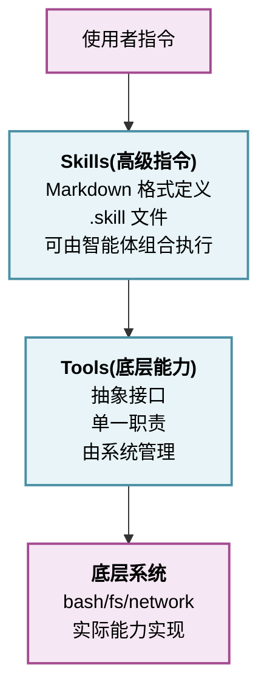

# 第五章：工具层设计

## 章引言

工具(Tools)是智能体与外部世界交互的手段。每一个工具调用都是一次对外部系统的改造、查询或决策。设计良好的工具层决定了智能体系统的能力边界、安全性、可维护性和可扩展性。

如果说智能体循环是“如何思考和行动”，那么工具层就是“用什么工具去行动”。

## 工具层的三个核心问题

1. **工具抽象**：如何定义一个统一的工具接口，使得各种异构的外部能力（Bash、文件系统、网络请求、数据库、API）都能被智能体调用？

2. **工具执行**：如何安全地执行工具调用，处理超时、权限、错误，并向智能体反馈结果？

3. **工具发现**：如何让智能体知道存在哪些工具、如何使用？在静态工具列表和动态工具发现之间如何平衡？

## 两个参考系统的工具哲学

### Claude Code 的设计

- **内置工具与扩展工具**：深度集成，每个工具为特定场景优化
- **工具类型多样**：8 个执行工具、3 个网络工具、8 个 Agent 工具、5+内置专用工具
- **Tool<Input,Output,Progress> 泛型接口**：类型安全，支持进度报告
- **buildTool() 工厂函数**：动态构造工具
- **shouldDefer 延迟加载**：条件决定是否加载工具
- **FileStateCache 上下文缓存**：工具执行结果的智能缓存
- **异步执行**：StreamingToolExecutor 并发调用多个工具

### OpenClaw 的设计

- **Tools + Skills 双层架构**：
  - **Tools**：底层能力（Bash、文件、搜索）
  - **Skills**：Markdown 指令格式的高级操作
- **6 级技能加载优先级**：
  1. 固定系统技能
  2. 会话上下文技能
  3. 用户自定义技能
  4. 领域专业技能
  5. 通用工具
  6. 动态发现技能
- **工具策略**：允许/拒绝/分层权限模型
- **单线程顺序执行**：每个工具一个一个执行，但可序列化结果

## 本章结构

- 5.1：工具抽象接口设计
- 5.2：工具执行流水线
- 5.3：工具类型体系
- 5.4：动态发现与加载
- 5.5：实战——MiniHarness 工具层
- 本章小结

## 学习要点

通过本章的学习，你将理解：

1. 如何定义工具的统一接口，支持异步、进度报告、权限检查
2. 工具执行流水线的完整过程：发现 → 验证 → 执行 → 缓存
3. 不同工具类型的实现特点和权衡
4. 动态工具发现的必要性和实现方式
5. 如何在 Python 中实现一个可扩展的工具系统

## 工具与技能的关系

工具和技能的关系可以用以下层级模型表示：

## 设计决策速查

| 决策点 | Claude Code | OpenClaw | MiniHarness |
|--------|-------------|---------|------------|
| 工具接口 | Tool<I,O,P> | Tool Protocol | Async Protocol |
| 执行模式 | 并发 | 顺序 | 顺序（可扩展） |
| 错误处理 | 异常捕获 | 错误即观察 | 两者结合 |
| 权限管理 | check_permissions() | 工具策略 | 基础实现 |
| 缓存 | FileStateCache | 会话记忆 | 简单缓存 |
| 发现机制 | 预定义 | 6 级优先级 | 注册表 |

本章将深入这些设计细节，为你建立完整的工具系统设计能力。
