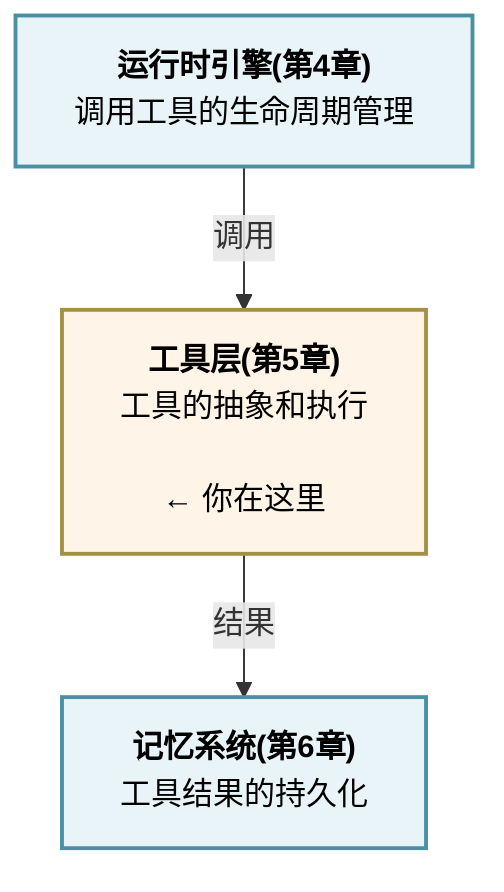

## 本章小结

本章深入探讨了工具层的设计原则和实现模式，以下是主要内容的总结。

### 工具层设计的核心原则

#### 1. 统一抽象

无论工具类型如何（文件、网络、计算、数据库），都应该通过统一的接口暴露能力。Claude Code 的 Tool<I,O,P> 泛型设计实现了强类型检查，OpenClaw 的 Tool Protocol 提供了灵活的抽象。

#### 2. 权限隔离

工具调用前必须进行权限检查，防止未授权的操作。不同的工具有不同的权限要求：

- 系统工具(Bash)：只有管理员可用
- 数据库工具：需要认证
- 文件工具：需要文件访问权限

#### 3. 错误恢复

工具执行失败是常态，系统必须：

- 捕获所有异常（执行错误、超时、权限拒绝）
- 将错误转化为 ToolResultBlock 反馈给 Agent
- 支持重试策略（指数退避）

#### 4. 性能优化

- **并发执行**：多个工具可以并行执行
- **结果缓存**：避免重复调用相同工具
- **Schema 缓存**：减少构建工具信息的开销

### 工具类型体系速览

| 类型 | 特点 | 示例 |
|------|------|------|
| 执行工具 | 直接改变系统状态 | Bash、Python、文件操作 |
| 网络工具 | 远程调用，有延迟和限制 | HTTP、API、搜索 |
| 智能体工具 | 委托给其他智能体 | SubAgent、并行执行 |
| 专用工具 | 特定领域的深度功能 | 数据库、图像处理 |

### 执行流水线的 6 个阶段

流程如下：

每个阶段都有明确的职责和错误处理机制，确保整个流程的可靠性。

### 工具扩展的三种模式

1. **装饰器模式**：为工具添加超时、重试等通用能力
2. **复合工具**：组合多个工具形成工具链
3. **条件工具**：根据条件选择执行的工具

### 动态加载的必要性

- **shouldDefer 延迟加载**：根据上下文决定是否加载工具，节省内存
- **6 级优先级加载**：OpenClaw 的分层加载策略，支持灵活的工具组织
- **MCP 动态注册**：支持第三方工具的即插即用
- **Schema 缓存**：减少重复构建的开销

### Claude Code vs OpenClaw 的工具设计对比

| 方面 | Claude Code | OpenClaw |
|------|------------|---------|
| 工具数量 | 内置工具 + 扩展工具 | 通用工具 + 技能 |
| 执行模式 | 并发 | 顺序 |
| 接口设计 | Tool<I,O,P> 泛型 | Tool Protocol |
| 权限模型 | check_permissions() | 工具策略和访问级别 |
| 加载策略 | shouldDefer | 6 级优先级 |
| 缓存 | FileStateCache | 会话记忆 |

### MiniHarness 的实现启示

通过从零实现工具层，我们学到：

1. **工具抽象** 需要平衡通用性和类型安全
2. **执行流水线** 需要完整的生命周期管理
3. **工具注册表** 是工具系统的中枢
4. **错误处理** 必须穷尽所有可能的失败模式
5. **可扩展性** 通过接口和工厂模式实现

### 与其他章节的联系

关系图如下：

运行时引擎调用工具层执行具体操作，工具执行的结果保存到记忆系统。

### 设计决策速查

1. **工具接口**：选择类型安全(Tool<I,O,P>)还是灵活的协议(Tool Protocol)
2. **执行模式**：并发执行还是顺序执行，取决于工具依赖关系
3. **权限模型**：简单的 boolean 检查还是复杂的策略模型
4. **加载策略**：预加载所有工具还是按需加载
5. **缓存策略**：缓存结果、Schema 还是执行历史

### 学习建议

1. **理解工具抽象**：为什么需要统一接口，不同的设计如何影响系统
2. **掌握执行流水线**：6 个阶段的职责分工和错误处理
3. **学习扩展模式**：如何优雅地扩展工具系统，支持新的工具类型
4. **实践动态加载**：实现工具的延迟加载和按需发现
5. **优化性能**：通过缓存、并发、Schema 预加载提高性能

### 常见陷阱

1. **权限检查遗漏**：在执行前必须检查权限，防止安全漏洞
2. **错误处理不完整**：必须捕获所有可能的异常（超时、权限、格式错误等）
3. **缺乏超时保护**：没有超时的工具调用可能导致系统挂起
4. **Schema 过时**：工具更新后忘记更新 Schema，导致参数错误
5. **缓存不失效**：缓存的数据如果不及时失效，可能导致数据不一致

### 进阶话题

1. **工具的分布式执行**：在多个节点执行工具
2. **工具的版本管理**：支持多个版本的同一工具
3. **工具的性能优化**：对慢工具的优化策略
4. **工具的自动化测试**：确保工具的正确性
5. **工具的文档生成**：从 Schema 自动生成文档

### 第五章完成

本章深入讲解了工具层的设计与实现，涵盖了工具抽象、执行流水线、工具类型体系、动态加载等关键主题。通过 MiniHarness 的实现，我们展示了这些概念如何落地成可运行的代码。

下一章将深入 **记忆与上下文子系统**，研究如何有效地存储、检索和利用过去的交互信息来提高智能体的能力。
