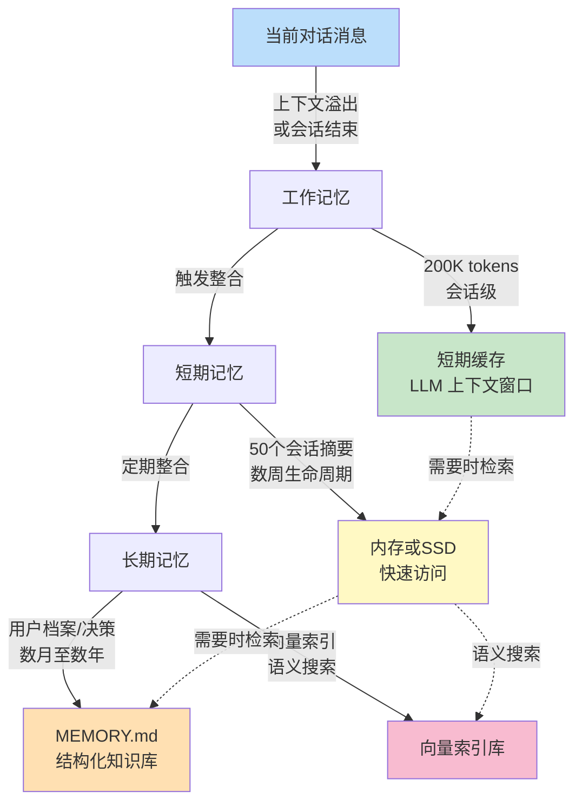

## 6.1 多层记忆体系的工程设计

记忆系统是智能体长期学习和适应的基础。本节介绍三层记忆架构（工作、短期和长期），对比Claude Code和OpenClaw的实现模式，并提出Harness推荐的自适应架构。

### 6.1.1 三层记忆架构概述

Agent 的记忆系统可分为三个独立层次，各层承载不同类型的信息，管理不同的生命周期：

**工作记忆（Working Memory）**：当前会话的上下文窗口，包含最近的用户消息、Agent 回复和即时执行状态。特点是快速访问、容量受限（通常由 LLM 上下文窗口限制，如 Claude 200K tokens）、自动丢弃（会话结束或上下文溢出）。

**短期记忆（Session Memory）**：跨越多个相邻会话但未达到长期存储标准的信息。包括单个会话的摘要、用户在当前项目中的偏好、最近的执行结果。生命周期从几小时到几周，存储在内存或简单文件系统中，有明确的过期机制。

**长期记忆（Episodic Memory）**：持久化的知识库，涵盖用户档案、学习的模式、系统级策略。生命周期可达数月至数年，需要版本控制、强一致性保证、高效的检索机制（如向量索引或关键词搜索）。

这三层记忆在智能体架构中形成递进关系，下面的图表展示了多层记忆体系的数据流转：



图6-1：多层记忆体系的数据流转

### 6.1.2 Claude Code 的三层模型

Claude Code 采用 **完整的三层架构**，显式分离不同生命周期的记忆：

**对话历史**（工作记忆）：

- 原生的 Claude API 消息列表，包含所有user/assistant消息
- 与 LLM 上下文窗口直接绑定
- 支持滚动窗口或完整保存

**CLAUDE.md**（短期 + 长期混合）：

- 结构化的项目记忆文档（通常 5-50KB）
- 关键部分：
  - **user profiles**：用户偏好、反馈历史
  - **project context**：当前工作的代码、架构、进度
  - **references**：可复用的代码片段、文档链接
  - **learning**：从交互中学到的最佳实践

**autoDream 系统**（自动整合）：

- **三门触发**：24小时时间门槛、5个连续会话、显式触发锁
- **四阶段管道**：
  1.**Orient**：分析当前会话目标
  2.**Gather**：从对话历史中提取关键信息
  3.**Consolidate**：合并到 CLAUDE.md，避免冗余
  4.**Prune**：删除过期或低价值的信息

autoDream 的核心设计是 **记忆类型分类**：
```bash
CLAUDE.md 结构示例：

# User Profile
- 技能等级：高级
- 偏好语言：Python
- 工作模式：快速迭代

# Project Context
- 项目名：WebApp v2.0
- 当前任务：API 集成
- 最后修改：2024-01-15
- 已完成：认证模块、数据库设计

# References
- 关键文件：/src/api/auth.py
- 常用命令：pytest, npm run dev
- 代码模式：Factory 模式用于 DAO

# Learning
- 发现：该项目需要异步处理
- 改进：使用 asyncio 而非线程
```

### 6.1.3 OpenClaw 的双层模型

OpenClaw 采用 **简化的双层设计**，将工作记忆与短期记忆合并处理：

**MEMORY.md**（长期记忆）：

- 结构化文档，记录关键事实、学习成果、系统决策
- 前缀为元数据（last_updated, version），主体按类别组织
- 大小限制通常为 5-20KB，关键信息密集
- 通过版本控制跟踪演进

**Daily Log**（会话日志）：

- 纯文本或 Markdown 格式，记录当日所有对话和执行
- 按时间戳索引，便于快速定位
- 每天清晨触发「日志整合」，将关键事项推送到 MEMORY.md

**memory_search 检索**：

- 混合搜索：关键词匹配 + 向量相似度
- 对日志执行语义搜索，找出相关历史记录
- 返回向量相似度最高的 Top-K 条目和精确关键词匹配

**自动刷写机制**：

- 当上下文占用达到 70% 时，触发记忆整合
- 将当前会话的关键信息压缩并追加到 MEMORY.md
- 清空日志以释放空间，进行新一轮对话

OpenClaw 的优势在于 **实现简单**（无需复杂的分布式系统）和 **快速反馈**（日志记录即时），但牺牲了中间层的灵活性——会话摘要被迫二选一：要么详细保留在日志中占用空间，要么压缩后丢失细节。

### 6.1.4 两种模型的对比

| 维度 | Claude Code（三层） | OpenClaw（双层） |
|------|------------------|----------------|
|**架构**| 对话历史 + CLAUDE.md | MEMORY.md + Daily Log |
|**中间层**| CLAUDE.md 承载 | 无显式中间层 |
|**整合触发**| 主动（定时 + 会话计数） | 被动（70% 上下文） |
|**实现复杂度**| 中等 | 低 |
|**内存灵活性**| 高（分类存储） | 低（两状态：详或简） |
|**检索能力**| 基于格式的提取 | 混合搜索（关键词+向量） |
|**适用场景**| 项目驱动型应用 | 对话型应用 |

Claude Code 更适合 **项目型工作**（如开发、研究），三层架构支持多维度的记忆组织；OpenClaw 更适合 **纯对话场景**（如客服、心理咨询），其简洁的双层设计减少复杂度。

### 6.1.5 Harness 推荐架构

综合两种方案的优点，Harness 建议采用 **自适应三层架构**：

1. **工作记忆**：完全委托给 LLM 上下文管理
2. **短期记忆**：轻量化会话缓存，存储过去 10 个会话的摘要（JSON 格式）
3. **长期记忆**：组合式存储

   - 结构化部分（MEMORY.md）：用户档案、学习、决策
   - 可检索部分（embedding_index）：完整对话历史的向量索引
   - 日志部分（session_logs/）：按日期分片的对话日志

这种设计支持：

- **即时响应**：工作记忆 0 延迟
- **快速上下文恢复**：短期缓存秒级访问
- **知识积累**：长期记忆支持向量搜索
- **灵活扩展**：支持添加新的记忆源（如外部知识库）

下一节将探讨如何使智能体不仅能读取记忆，还能主动创建和更新记忆。
