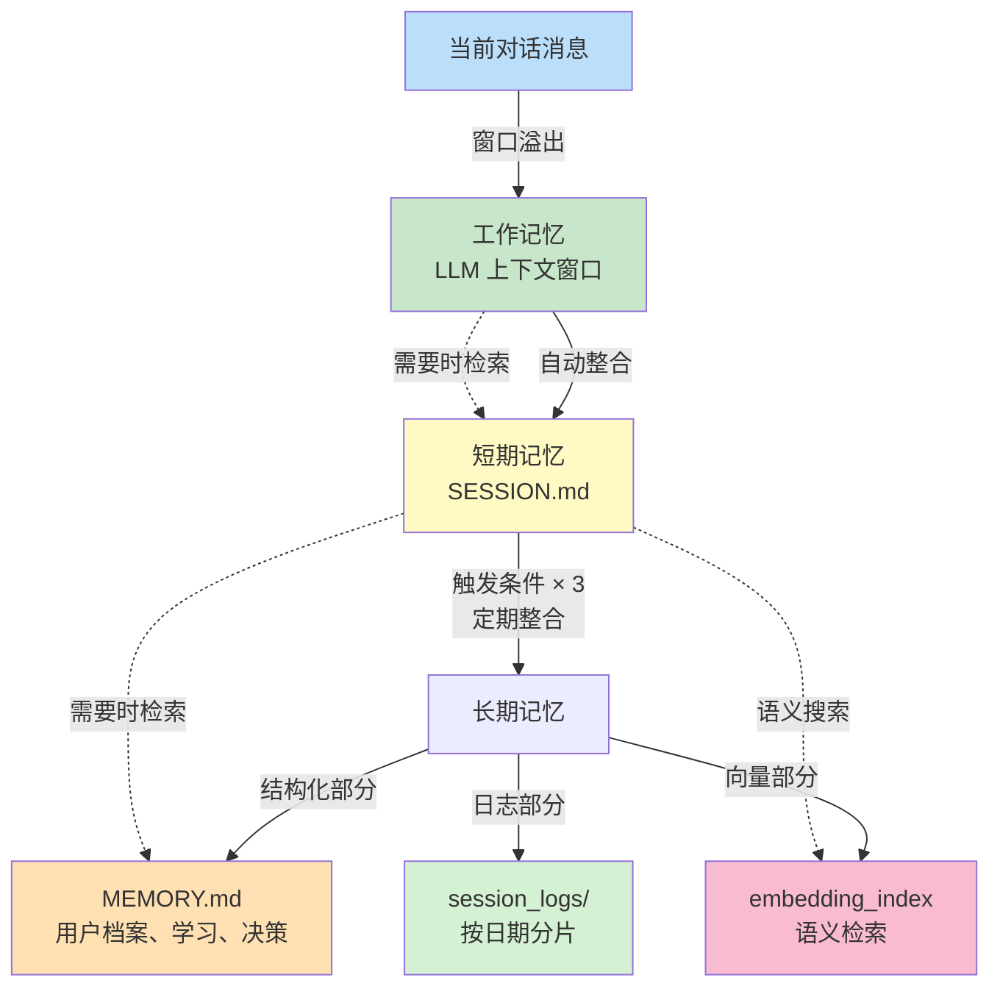

## 6.1 Harness中的记忆系统工程设计

记忆系统是智能体长期学习和适应的基础。关于记忆的认知模型、三层架构理论（工作、短期和长期记忆），以及非参数记忆与参数记忆的根本区别，请参阅《智能体 AI 权威指南》第三章。同时，更多关于记忆系统在上下文工程中的应用，请参阅《上下文工程权威指南》第四章。

> 💡 **理论参考**：
> - 《智能体 AI 权威指南》第三章（3.1-3.3）介绍了多层记忆的认知模型和工程映射
> - 《上下文工程权威指南》第四章讨论了上下文管理与记忆的关系

本节重点讨论 **Harness 框架中的记忆实现**，特别是 **autoDream 系统**和**记忆整合管道**的工程细节。

### 6.1.1 Harness记忆架构概览

Harness采用了一个经过验证的三层架构，但针对多任务、多工作流的场景做了特殊优化：



**各层特性**：

1. **工作记忆**：完全委托给LLM上下文管理，Harness无需干预
2. **短期记忆**：轻量化的会话缓存（JSON格式），存储过去10个会话的摘要
3. **长期记忆**：组合式存储，分为三个子系统

### 6.1.2 autoDream系统：记忆整合管道

autoDream是Harness的自动记忆整合系统，负责将会话数据定期整合到长期记忆。它的设计借鉴了Claude Code的思想，但针对多工作流、多用户的场景进行了扩展。

#### 整合触发的三门机制

autoDream不是持续运行，而是在满足**至少一个**触发条件时才激活：

```python
class MemoryConsolidationTrigger:
    """记忆整合触发器"""

    def __init__(self, config):
        self.time_threshold = config.get("time_threshold", 86400)  # 24小时
        self.session_threshold = config.get("session_threshold", 5)  # 5个会话
        self.last_consolidation_time = time.time()
        self.session_count_since_consolidation = 0

    def should_consolidate(self) -> bool:
        """检查是否应该触发整合"""
        # 触发条件1：时间门槛
        if time.time() - self.last_consolidation_time > self.time_threshold:
            return True

        # 触发条件2：会话计数门槛
        if self.session_count_since_consolidation >= self.session_threshold:
            return True

        # 触发条件3：显式锁定（用户或系统主动触发）
        # 这通过外部API调用实现：POST /consolidate

        return False

    def on_session_end(self):
        """会话结束时调用"""
        self.session_count_since_consolidation += 1
```

#### 四阶段整合管道

一旦触发，autoDream执行标准化的四阶段流程：

```python
class MemoryConsolidationPipeline:
    """记忆整合管道"""

    async def consolidate(self, workflow_id: str, session_history: List[Message]):
        """执行完整的整合流程"""

        # 阶段1：Orient - 分析会话目标和上下文
        orientation = await self.orient_phase(workflow_id, session_history)
        # 结果：{goals, context, decisions, new_patterns}

        # 阶段2：Gather - 从对话历史提取关键信息
        gathered = await self.gather_phase(session_history, orientation)
        # 结果：{facts, preferences, outcomes, patterns}

        # 阶段3：Consolidate - 合并到长期记忆，避免冗余
        consolidated = await self.consolidate_phase(workflow_id, gathered)
        # 结果：更新了MEMORY.md, embedding_index, session_logs

        # 阶段4：Prune - 删除过期或低价值的信息
        pruned = await self.prune_phase(workflow_id, consolidated)
        # 结果：清理过时的会话摘要

        return {
            "orientation": orientation,
            "gathered": gathered,
            "consolidated": consolidated,
            "pruned": pruned
        }

    async def orient_phase(self, workflow_id: str, session_history: List[Message]):
        """阶段1：Orient - 理解会话的核心目标和决策点"""
        prompt = f"""
分析这个工作流的会话记录，提供：
1. 会话的核心目标（1-3个）
2. 关键的决策点和选择（2-3个）
3. 发现的系统级模式或约束（2-3个）
4. 用户展现的新的偏好或工作风格（如有）

会话记录：
{self._format_session_history(session_history)}
"""
        # 调用LLM进行分析
        return await self.llm.analyze(prompt)

    async def gather_phase(self, session_history: List[Message], orientation: dict):
        """阶段2：Gather - 提取结构化事实"""
        facts = {
            "user_preferences": [],
            "task_outcomes": [],
            "technical_discoveries": [],
            "system_constraints": []
        }

        for message in session_history:
            if message.role == "user":
                # 从用户消息提取偏好
                pref = self._extract_preference(message.content)
                if pref:
                    facts["user_preferences"].append(pref)

            elif message.role == "assistant":
                # 从助手消息提取成果
                outcome = self._extract_outcome(message.content)
                if outcome:
                    facts["task_outcomes"].append(outcome)

        return facts

    async def consolidate_phase(self, workflow_id: str, gathered: dict):
        """阶段3：Consolidate - 合并到长期记忆，避免冗余"""

        # 读取现有MEMORY.md
        memory = await self._load_memory_file(workflow_id)

        # 去重：与现有内容比较，只添加新信息
        new_facts = await self._deduplicate(gathered["user_preferences"], memory.get("user_preferences", []))

        # 更新MEMORY.md
        memory["user_preferences"].extend(new_facts)
        memory["last_updated"] = time.time()

        # 更新向量索引（用于语义搜索）
        embeddings = await self._embed_facts(gathered)
        await self._upsert_to_vector_index(workflow_id, embeddings)

        # 追加到日志
        await self._append_to_session_log(workflow_id, gathered)

        return {"updated_memory": memory, "updated_embeddings": embeddings}

    async def prune_phase(self, workflow_id: str, consolidated: dict):
        """阶段4：Prune - 删除过期或低价值的信息"""

        memory = consolidated["updated_memory"]

        # 策略1：删除超过6个月的会话摘要
        cutoff_time = time.time() - 180 * 24 * 3600
        memory["session_summaries"] = [
            s for s in memory.get("session_summaries", [])
            if s.get("timestamp", 0) > cutoff_time
        ]

        # 策略2：删除重复或相似的用户偏好
        memory["user_preferences"] = await self._deduplicate_with_similarity(
            memory["user_preferences"],
            similarity_threshold=0.95
        )

        # 策略3：删除与当前工作无关的信息
        relevant_prefs = await self._filter_by_relevance(
            memory["user_preferences"],
            workflow_id,
            relevance_threshold=0.6
        )
        memory["user_preferences"] = relevant_prefs

        # 保存回磁盘
        await self._save_memory_file(workflow_id, memory)

        return {"pruned_memory": memory}
```

### 6.1.3 短期记忆与缓存策略

短期记忆的目的是快速恢复最近会话的上下文，无需每次都从长期记忆检索。

```python
class SessionMemoryCache:
    """会话记忆缓存（JSON格式）"""

    def __init__(self, max_sessions: int = 10):
        self.max_sessions = max_sessions
        self.cache_file = "~/.harness/session_cache.jsonl"

    async def record_session_summary(self, workflow_id: str, session_data: dict):
        """记录一个会话的摘要"""
        summary = {
            "workflow_id": workflow_id,
            "timestamp": time.time(),
            "user_input": session_data.get("user_input", ""),
            "key_outputs": session_data.get("key_outputs", []),
            "decisions_made": session_data.get("decisions", []),
            "errors_encountered": session_data.get("errors", []),
        }

        # 追加到缓存
        with open(self.cache_file, "a") as f:
            f.write(json.dumps(summary) + "\n")

        # 如果超过max_sessions，删除最旧的
        await self._prune_old_sessions()

    async def get_recent_sessions(self, workflow_id: str, count: int = 5) -> List[dict]:
        """快速获取最近的几个会话"""
        sessions = []
        with open(self.cache_file, "r") as f:
            for line in f:
                session = json.loads(line)
                if session["workflow_id"] == workflow_id:
                    sessions.append(session)

        return sessions[-count:]  # 返回最近的count个
```

### 6.1.4 向量索引与语义检索

对于大规模的长期记忆，必须使用向量索引来支持高效的语义搜索。

```python
class MemoryVectorIndex:
    """向量索引用于语义搜索"""

    def __init__(self, index_path: str):
        # 使用轻量级的向量库（如Hnswlib或Faiss）
        self.index = hnswlib.Index(space='cosine', dim=1536)
        self.index.load_index(index_path)
        self.metadata = {}  # 存储向量到原始数据的映射

    async def search_memory(self, query: str, top_k: int = 5) -> List[dict]:
        """语义搜索记忆"""
        # 将查询嵌入
        query_embedding = await self._embed(query)

        # 搜索最相似的向量
        labels, distances = self.index.knn_query(query_embedding, k=top_k)

        # 返回元数据
        results = [
            {
                "similarity_score": 1 - distances[0][i],  # 归一化
                "memory_content": self.metadata[label],
            }
            for i, label in enumerate(labels[0])
        ]

        return results
```

### 6.1.5 本小节小结

Harness的记忆系统通过以下机制支持长期学习：

1. **三门触发机制**：通过时间、会话计数或显式触发来激活整合
2. **四阶段管道**：Orient→Gather→Consolidate→Prune的标准化流程
3. **去重与去噪**：自动清理冗余和过期信息
4. **多模态存储**：结构化（MEMORY.md）、向量（embedding_index）、日志（session_logs）
5. **快速检索**：向量索引支持语义搜索，JSON缓存支持秒级访问

关于记忆的认知基础和理论模型，请参阅《智能体 AI 权威指南》和《上下文工程权威指南》。
