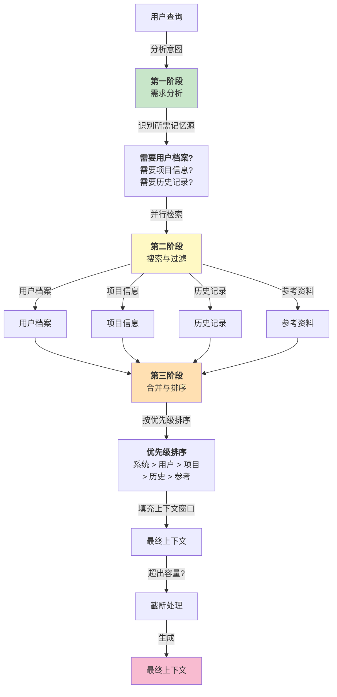

## 6.3 上下文组装引擎与缓存策略

上下文的质量直接决定智能体的推理能力，但来自多个源的信息如何高效组装成最优上下文是一个复杂问题。本节介绍静态与动态上下文的分离、三阶段组装流程、Claude Code 的动态边界机制、OpenClaw 的插件化架构，以及通过缓存策略提升性能的方法。

### 6.3.1 上下文组装的挑战

智能体的推理质量高度依赖于上下文的质量和完整性。但是，一个实时的智能体系统通常要从多个不同的来源拼凑上下文：

- **对话历史**：当前和过去会话的消息
- **用户档案**：用户的偏好、背景、技能
- **项目信息**：当前任务的背景、进度、关键决策
- **参考资料**：可用的代码、文档、最佳实践
- **系统状态**：Agent 本身的能力、当前限制、已知问题

这些来源有不同的更新频率、大小、重要性。简单地将所有内容连接会导致：

1. **上下文膨胀**：超出 LLM 的有效处理能力
2. **噪音淹没信号**：重要信息被海量细节隐埋
3. **冷启动问题**：新会话如何快速获得关键背景

上下文组装引擎的目标是 **动态选择和排序** 这些来源的内容，在容量约束下最大化信息密度。

一个经常被低估的事实是：**表观的模型质量，本质上是上下文质量**。Sebastian Raschka 在分析 Coding Agent 架构时指出，同一个模型在精心设计的 Harness 中表现出的能力，远超在普通聊天界面中的表现。这种差异并非来自模型本身，而是来自 Harness 为模型提供的上下文质量——包括相关的项目信息、精确的工具描述、恰当的历史记录。从这个视角看，上下文组装引擎不仅是一个技术组件，而是决定整个智能体“智商”的关键因素。

### 6.3.2 静态上下文 vs 动态上下文

上下文可分为两类：

**静态上下文** (Static Context)：

- 在会话期间基本不变的信息
- 示例：用户档案、系统能力说明、工具定义
- 特点：高复用性，可缓存

**动态上下文** (Dynamic Context)：

- 因用户当前目标而变化的信息
- 示例：相关的历史记录、当前项目进度、最近的执行结果
- 特点：低复用性，需要实时生成

高效的上下文管理应该：

1. **缓存静态部分**，避免每次重复计算
2. **按需选择动态部分**，避免无关内容
3. **优先级排序**，确保关键信息不被截断

### 6.3.3 上下文组装的三阶段流程

上下文组装过程分为三个关键阶段，下面的流程图展示了完整的上下文组装管道：



图 6-2：上下文组装的三阶段流程

**需求分析阶段**：

使用轻量级分类器识别查询的类型，决定需要哪些记忆源：

```python
class ContextRequirement:
    """上下文需求规范"""
    needs_user_profile: bool = False  # 需要用户档案
    needs_project_context: bool = False  # 需要项目信息
    needs_recent_history: bool = False  # 需要最近历史
    needs_references: bool = False  # 需要参考资料
    needs_feedback: bool = False  # 需要反馈记录

def analyze_query(user_message: str) -> ContextRequirement:
    """分析查询内容,确定上下文需求"""
    query_lower = user_message.lower()

    req = ContextRequirement()

    # 启发式规则
    if any(word in query_lower for word in
           ["prefer", "style", "like", "habit"]):
        req.needs_user_profile = True

    if any(word in query_lower for word in
           ["project", "task", "status", "progress"]):
        req.needs_project_context = True

    if any(word in query_lower for word in
           ["previous", "before", "last time", "remember"]):
        req.needs_recent_history = True

    if any(word in query_lower for word in
           ["example", "sample", "pattern", "how to"]):
        req.needs_references = True

    return req
```

**搜索与过滤阶段**：

根据需求，从各记忆源并行检索：

```python
async def search_memory_sources(requirement: ContextRequirement,
                                query: str,
                                memory_manager) -> MemorySearchResult:
    """并行搜索多个记忆源"""
    tasks = []

    if requirement.needs_user_profile:
        tasks.append(memory_manager.search_user_profile(query))

    if requirement.needs_project_context:
        tasks.append(memory_manager.search_project_context(query))

    if requirement.needs_recent_history:
        tasks.append(memory_manager.search_recent_history(query))

    if requirement.needs_references:
        tasks.append(memory_manager.search_references(query))

    results = await asyncio.gather(*tasks, return_exceptions=True)
    return MemorySearchResult(results)
```

**合并与排序阶段**：

将检索结果合并，按相关性和优先级排序，然后填充上下文直到达到容量限制：

```python
def assemble_context(user_message: str,
                     search_result: MemorySearchResult,
                     system_prompt: str,
                     token_budget: int = 50000) -> str:
    """组装最终的上下文"""

    # 优先级:系统提示 > 用户档案 > 项目信息 > 历史 > 参考
    prioritized_items = [
        ("system", system_prompt, 100),
        ("user_profile", search_result.user_profile, 90),
        ("project", search_result.project_context, 80),
        ("history", search_result.recent_history, 70),
        ("references", search_result.references, 60),
    ]

    # 按优先级排序
    prioritized_items.sort(key=lambda x: x[2], reverse=True)

    assembled = []
    current_tokens = 0

    for section_name, content, _ in prioritized_items:
        if not content:
            continue

        content_tokens = estimate_tokens(content)

        if current_tokens + content_tokens <= token_budget:
            assembled.append(f"## {section_name}\n{content}")
            current_tokens += content_tokens
        else:
            # 容量不足,尝试截断
            remaining = token_budget - current_tokens
            if remaining > 100:  # 最少保留 100 tokens
                truncated = truncate_to_tokens(content, remaining)
                assembled.append(f"## {section_name} (truncated)\n{truncated}")
            break

    return '\n\n'.join(assembled)
```

### 6.3.4 Claude Code 的 SYSTEM_PROMPT_DYNAMIC_BOUNDARY

Claude Code 采用了一个聪明的策略来管理上下文大小的不确定性—— **动态边界机制**：

定义一个 **保护区** (Protected Boundary)，其内包含：

- 系统提示
- 当前会话的关键信息
- 用户最新的 1-2 条消息

这个保护区的大小是固定的（约 10-15% 的上下文窗口），不会被其他内容侵占。剩余的空间（约 85-90%）用于动态上下文：

| 区域 | 内容 | 占比 |
|------|------|------|
| **保护区(Protected)** | System Prompt | ~2% |
| | Current User Messages | ~5% |
| **动态区(Dynamic Context Space)** | User Profile | 按需 |
| | Project Context | 按需 |
| | Recent History | 按需 |
| | References | 按需 |
| | Free Space (buffer) | 剩余 |
| **合计** | Total Context Window | 200K tokens |

这样做的好处是：

1. **可预测性**：系统提示和关键信息永不被截断
2. **灵活性**：动态内容可以从几 KB 扩展到几百 KB
3. **简单性**：不需要复杂的优先级算法，只要在约束内填充

### 6.3.5 OpenClaw 的 ContextEngine 插件架构

OpenClaw 采用了 **插件化的上下文生成**，每个记忆源对应一个插件：

```python
class ContextPlugin:
    """上下文插件的基类"""

    async def generate(self, query: str, token_budget: int) -> str:
        """生成该插件贡献的上下文部分"""
        raise NotImplementedError

    @property
    def priority(self) -> int:
        """该插件的优先级(0-100)"""
        raise NotImplementedError

    @property
    def name(self) -> str:
        """插件名称"""
        raise NotImplementedError
```

具体实现示例：

```python
class UserProfilePlugin(ContextPlugin):
    """用户档案插件"""

    @property
    def name(self) -> str:
        return "user_profile"

    @property
    def priority(self) -> int:
        return 90

    async def generate(self, query: str, token_budget: int) -> str:
        profile = await self.memory_manager.get_user_profile()
        return self._format_profile(profile, token_budget)

class ProjectContextPlugin(ContextPlugin):
    """项目上下文插件"""

    @property
    def name(self) -> str:
        return "project"

    @property
    def priority(self) -> int:
        return 80

    async def generate(self, query: str, token_budget: int) -> str:
        # 搜索相关项目信息
        relevant_info = await self.search_project_db(query)
        return self._format_project_info(relevant_info, token_budget)
```

ContextEngine 协调这些插件的执行：

```python
class ContextEngine:
    """上下文生成引擎"""

    def __init__(self):
        self.plugins: Dict[str, ContextPlugin] = {}

    def register_plugin(self, plugin: ContextPlugin):
        """注册上下文插件"""
        self.plugins[plugin.name] = plugin

    async def assemble(self, query: str,
                       token_budget: int = 100000) -> str:
        """根据查询组装上下文"""
        # 按优先级排序插件
        sorted_plugins = sorted(
            self.plugins.values(),
            key=lambda p: p.priority,
            reverse=True
        )

        assembled = []
        remaining_tokens = token_budget

        for plugin in sorted_plugins:
            if remaining_tokens < 500:  # 最小阈值
                break

            try:
                content = await plugin.generate(query, remaining_tokens)
                if content:
                    assembled.append(content)
                    remaining_tokens -= estimate_tokens(content)
            except Exception as e:
                logger.warning(f"Plugin {plugin.name} failed: {e}")

        return '\n\n'.join(assembled)
```

这种插件化架构的优势：

- **模块化**：新的上下文源无需修改核心引擎
- **容错性**：单个插件失败不影响整体
- **可观测性**：易于追踪每个插件的贡献
- **可测试性**：可以独立测试每个插件

### 6.3.6 缓存策略

上下文组装的性能瓶颈往往在于重复的搜索和格式化。有效的缓存可以加速 10-100 倍：

```python
class ContextCache:
    """上下文缓存,支持失效管理"""

    def __init__(self, ttl_seconds: int = 300):
        self.cache: Dict[str, CacheEntry] = {}
        self.ttl = ttl_seconds

    def get(self, key: str) -> Optional[str]:
        """获取缓存"""
        if key in self.cache:
            entry = self.cache[key]
            if time.time() - entry.timestamp < self.ttl:
                return entry.value
            else:
                del self.cache[key]
        return None

    def set(self, key: str, value: str, tags: List[str] = None):
        """设置缓存,关联标签用于批量失效"""
        self.cache[key] = CacheEntry(value, time.time(), tags or [])

    def invalidate_by_tag(self, tag: str):
        """按标签批量失效缓存"""
        to_delete = [k for k, v in self.cache.items()
                     if tag in (v.tags or [])]
        for k in to_delete:
            del self.cache[k]
```

缓存失效时机：

- **用户档案变更**：失效所有包含 user_profile 标签的缓存
- **项目信息更新**：失效 project 标签的缓存
- **时间过期**：使用 TTL 自动清理

下一节将深入探讨如何在长对话中自动触发记忆整合，防止上下文溢出。
