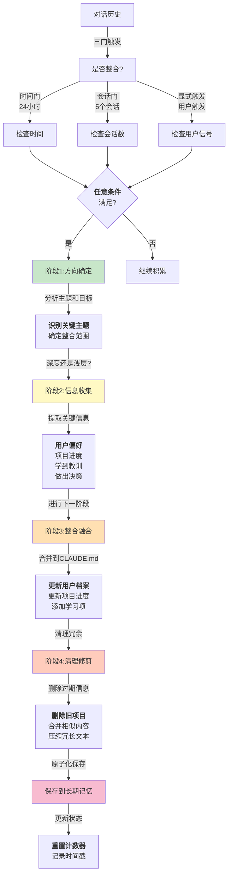

## 6.4 记忆整合与自动化维护

长对话中的记忆不断膨胀会导致检索低效和成本飙升，需要定期的整合与清理。本节探讨记忆整合的必要性、Claude Code 的 autoDream 三门触发和四阶段流程、OpenClaw 的被动式刷写机制、索引维护策略以及监控和调优方法。

### 6.4.1 记忆整合的必要性

在长对话或多轮会话中，Agent 系统会积累大量的上下文。纯粹地保留所有历史会导致：

1. **上下文膨胀**：LLM 上下文窗口被填满，新的对话空间受限
2. **检索低效**：搜索需要扫描巨量信息，延迟增加
3. **成本上升**：对于按 token 计费的 API，成本线性增长

**记忆整合** (Memory Consolidation)是解决方案：定期将分散的、细粒度的信息压缩、融合成更高层次的摘要，同时保留关键细节，形成稳定的长期记忆。

记忆整合的目标：

- **无损压缩**：重要信息不丢失
- **语义保留**：摘要捕捉原始内容的核心含义
- **可追溯**：保留原始记录供验证
- **增量更新**：仅处理新增内容，避免重复计算

### 6.4.2 Claude Code 的 autoDream 系统详解

Claude Code 实现了一个成熟的自动记忆整合系统，称为 **autoDream**。其核心是三门触发 + 四阶段流程。

#### 三门触发机制

autoDream 通过三个独立的触发条件来决定是否启动整合：

**1. 时间门(Time Gate)**：

```python
from datetime import datetime

def check_time_gate(last_consolidation: datetime) -> bool:
    """检查距离上次整合是否超过 24 小时"""
    elapsed = datetime.now() - last_consolidation
    return elapsed.total_seconds() > 86400  # 24 hours
```

**2. 会话门(Session Gate)**：

```python
def check_session_gate(session_count_since_consolidation: int) -> bool:
    """检查是否已完成 5 个新会话"""
    return session_count_since_consolidation >= 5
```

**3. 显式锁(Explicit Lock)**：

```python
def check_explicit_lock(user_signal: str) -> bool:
    """用户明确触发整合(如"保存进度")"""
    return "consolidate" in user_signal.lower() or \
           "save progress" in user_signal.lower()
```

三个条件采用 **或逻辑**：只要任意一个满足，就启动整合：

```python
def should_consolidate(state: ConsolidationState) -> bool:
    """判断是否应该触发 autoDream"""
    time_gate = check_time_gate(state.last_consolidation)
    session_gate = check_session_gate(state.sessions_since_consolidation)
    explicit_lock = check_explicit_lock(state.latest_user_message)

    return time_gate or session_gate or explicit_lock
```

这种设计的好处在于 **灵活性**——用户可以显式触发，系统也会自动触发，确保记忆不会无限膨胀。

#### 四阶段整合流程

一旦触发整合，autoDream 执行四个阶段：

**阶段 1：Orient（方向确定）**

分析最近对话的主题和目标，确定整合的范围和重点：

```python
async def orient_phase(recent_conversations: List[Message],
                       current_project: str) -> OrientResult:
    """确定整合的方向和范围"""

    # 提取最近对话的摘要
    summary = await extract_summary(recent_conversations)

    # 识别关键主题
    topics = await identify_topics(summary)

    # 确定与项目的相关性
    project_relevance = await assess_relevance(summary, current_project)

    return OrientResult(
        summary=summary,
        topics=topics,
        project_relevance=project_relevance,
        scope="deep" if project_relevance > 0.7 else "shallow"
    )
```

**阶段 2：Gather（信息收集）**

从对话历史中提取关键信息，按类型分类：

```python
async def gather_phase(conversations: List[Message],
                       orient_result: OrientResult) -> GatherResult:
    """收集需要记忆的关键信息"""

    gathered = {
        'user_preferences': [],  # 用户偏好
        'project_updates': [],   # 项目进度
        'learned_lessons': [],   # 学到的教训
        'decisions': [],         # 做出的决策
        'errors': []            # 发现的错误
    }

    for msg in conversations:
        if orient_result.scope == "deep":
            # 深度收集:细粒度提取
            gathered['user_preferences'].extend(
                extract_user_preferences(msg)
            )
            gathered['project_updates'].extend(
                extract_project_updates(msg)
            )
        else:
            # 浅层收集:仅提取顶级要点
            gathered['decisions'].extend(
                extract_top_level_decisions(msg)
            )

    return GatherResult(gathered=gathered)
```

**阶段 3：Consolidate（整合融合）**

将收集的信息融合到 CLAUDE.md，检测并解决冲突：

```python
async def consolidate_phase(gather_result: GatherResult,
                            claude_md: dict) -> ConsolidateResult:
    """融合新信息到长期记忆"""

    updated_claude_md = copy.deepcopy(claude_md)

    # 更新用户档案
    for pref in gather_result.gathered['user_preferences']:
        existing = find_existing(pref, updated_claude_md['user_profile'])
        if existing:
            # 冲突解决:新信息覆盖(可配置)
            updated_claude_md['user_profile'][existing['key']] = pref
        else:
            updated_claude_md['user_profile'].append(pref)

    # 更新项目进度
    for update in gather_result.gathered['project_updates']:
        category = update['category']
        updated_claude_md['project_context'][category].extend(
            update['items']
        )

    # 添加教训和决策到参考资料
    for lesson in gather_result.gathered['learned_lessons']:
        updated_claude_md['learning'].append({
            'date': datetime.now(),
            'content': lesson,
            'confidence': 0.8
        })

    return ConsolidateResult(updated=updated_claude_md)
```

**阶段 4：Prune（清理修剪）**

删除冗余、过期或低价值的信息，保持记忆库的精炼：

```python
async def prune_phase(consolidated: dict,
                      config: PruneConfig) -> dict:
    """清理过期或冗余信息"""

    pruned = copy.deepcopy(consolidated)

    # 删除过期的项目信息
    cutoff_date = datetime.now() - timedelta(days=config.expiry_days)
    pruned['project_context'] = [
        item for item in pruned['project_context']
        if item.get('date', datetime.now()) > cutoff_date
    ]

    # 删除置信度过低的学习项
    pruned['learning'] = [
        item for item in pruned['learning']
        if item.get('confidence', 1.0) > config.confidence_threshold
    ]

    # 合并相似的信息
    pruned['user_profile'] = deduplicate_profiles(
        pruned['user_profile']
    )

    # 压缩冗长的文本
    pruned['references'] = compress_references(
        pruned['references'],
        max_lines=config.max_reference_lines
    )

    return pruned
```

#### autoDream 的完整工作流

autoDream采用四阶段整合流程，将分散的对话信息浓缩为高质量的长期记忆。下面的流程图展示了完整的工作流：



图 6-3：autoDream四阶段整合流程

以下是autoDream四阶段整合流程的完整实现：

```python
async def autoDream_consolidation(state: ConsolidationState) -> bool:
    """autoDream 整合的完整流程(WAL-风格回滚)"""

    if not should_consolidate(state):
        return False

    # [WAL] 保存原始状态用于故障回滚
    original_claude_md = copy.deepcopy(state.claude_md)
    original_state = {
        "last_consolidation": state.last_consolidation,
        "sessions_since_consolidation": state.sessions_since_consolidation
    }

    try:
        # Phase 1: Orient
        orient_result = await orient_phase(
            state.recent_conversations,
            state.current_project
        )

        # Phase 2: Gather
        gather_result = await gather_phase(
            state.conversations,
            orient_result
        )

        # Phase 3: Consolidate
        consolidate_result = await consolidate_phase(
            gather_result,
            state.claude_md
        )

        # Phase 4: Prune
        pruned_result = await prune_phase(
            consolidate_result.updated,
            config=state.prune_config
        )

        # [WAL] 原子化保存：先写临时文件，再原子重命名
        await save_claude_md_atomic(pruned_result)

        # 状态更新(仅在持久化成功后)
        state.last_consolidation = datetime.now()
        state.sessions_since_consolidation = 0
        state.claude_md = pruned_result
        state.consolidation_failed_count = 0  # 重置失败计数

        logger.info("autoDream consolidation completed successfully")
        return True

    except Exception as e:
        logger.error(f"autoDream consolidation failed: {e}")
        
        # [WAL] 失败回滚：恢复到上次已知的好状态
        try:
            # 1. 放弃本次持久化,不修改磁盘上的 CLAUDE.md
            # 2. 恢复内存中的状态
            state.claude_md = original_claude_md
            state.last_consolidation = original_state["last_consolidation"]
            state.sessions_since_consolidation = original_state["sessions_since_consolidation"]
            
            # 3. 记录故障，允许下次重试
            state.consolidation_failed_count += 1
            if state.consolidation_failed_count > 3:
                logger.warning(
                    f"Multiple consolidation failures ({state.consolidation_failed_count}) detected. "
                    "Consider manual review of CLAUDE.md integrity."
                )
        except Exception as rollback_error:
            logger.critical(f"Rollback failed: {rollback_error}. Manual intervention required.")
        
        return False
```

### 6.4.3 OpenClaw 的自动刷写机制

OpenClaw 采用了更简单但高效的 **被动式刷写** 模式：

**触发条件**：

```python
def check_memory_flush_trigger(context_utilization: float) -> bool:
    """当上下文占用达到 70% 时触发刷写"""
    return context_utilization >= 0.7
```

**刷写流程**：

1. **生成日志摘要**：总结当前会话的关键事项
2. **提取可学习部分**：从日志中找出值得记忆的信息
3. **合并到 MEMORY.md**：追加新学习到长期记忆
4. **清空日志**：释放对话历史空间

```python
async def flush_memory_to_permanent(daily_log: str,
                                    memory_md: str) -> str:
    """自动刷写:将日志转换为长期记忆"""

    # 步骤 1:提取日志摘要
    summary = await summarize_log(daily_log, max_lines=10)

    # 步骤 2:从摘要中提取学习
    learnings = await extract_learnings(summary)

    # 步骤 3:合并到 MEMORY.md
    updated_memory = memory_md + "\n\n## Recent Learnings\n"
    for learning in learnings:
        updated_memory += f"- {learning}\n"

    # 步骤 4:版本控制
    updated_memory = add_metadata(
        updated_memory,
        last_updated=datetime.now(),
        version=increment_version(memory_md)
    )

    return updated_memory
```

这种方式的优势：

- **简洁高效**：单一触发条件，实现简单
- **确定性**：70% 阈值提供清晰的触发点
- **成本低**：不需要复杂的阶段处理

但劣势是缺乏灵活性——无法按不同的优先级处理信息。

### 6.4.4 记忆索引维护

无论采用哪种整合策略，维护记忆的 **可搜索性** 至关重要。

**向量索引维护**：

```python
class EmbeddingIndex:
    """记忆的向量索引"""

    async def add_entry(self, memory_id: str, content: str):
        """添加新的记忆条目到索引"""
        embedding = await embed_text(content)
        self.index[memory_id] = {
            'embedding': embedding,
            'content': content,
            'timestamp': datetime.now()
        }

    async def search(self, query: str, top_k: int = 5) -> List[str]:
        """向量相似度搜索"""
        query_embedding = await embed_text(query)
        scores = []

        for mid, entry in self.index.items():
            similarity = cosine_similarity(
                query_embedding,
                entry['embedding']
            )
            scores.append((mid, similarity, entry['content']))

        # 按相似度排序,返回 Top-K
        return [content for _, _, content in
                sorted(scores, key=lambda x: x[1], reverse=True)[:top_k]]

    async def rebuild_incremental(self, new_entries: List[dict]):
        """增量更新索引"""
        for entry in new_entries:
            await self.add_entry(entry['id'], entry['content'])
```

**关键词索引维护**：

```python
class KeywordIndex:
    """基于关键词的反向索引"""

    def __init__(self):
        self.index: Dict[str, List[str]] = {}  # keyword -> memory_ids

    def add_entry(self, memory_id: str, content: str):
        """提取关键词并建立索引"""
        keywords = extract_keywords(content)  # 使用 TF-IDF 或更简单的方法

        for keyword in keywords:
            if keyword not in self.index:
                self.index[keyword] = []
            self.index[keyword].append(memory_id)

    def search(self, query: str) -> Set[str]:
        """关键词搜索返回所有匹配的记忆ID"""
        query_keywords = extract_keywords(query)
        matching_ids = set()

        for keyword in query_keywords:
            matching_ids.update(self.index.get(keyword, []))

        return matching_ids
```

**垃圾清理**：

```python
async def cleanup_old_memories(memory_store,
                              retention_days: int = 90):
    """定期清理过期记忆"""
    cutoff = datetime.now() - timedelta(days=retention_days)

    for memory_id in memory_store.list_all():
        metadata = memory_store.get_metadata(memory_id)

        if metadata['last_accessed'] < cutoff:
            logger.info(f"Removing unused memory: {memory_id}")
            memory_store.delete(memory_id)

        # 同步更新索引
        await embedding_index.remove(memory_id)
        keyword_index.remove(memory_id)
```

### 6.4.5 记忆整合的监控和调优

为了持续改进整合策略，应该监控关键指标：

```python
class ConsolidationMetrics:
    """记忆整合的性能指标"""

    def __init__(self):
        self.consolidation_latency = []  # 整合耗时
        self.context_compression_ratio = []  # 压缩率
        self.memory_size_growth = []  # 记忆库增长
        self.search_latency = []  # 搜索响应时间
        self.false_negatives = []  # 搜索未命中率

    async def record_consolidation(self,
                                   before_size: int,
                                   after_size: int,
                                   duration_ms: float):
        """记录整合操作"""
        ratio = after_size / before_size if before_size > 0 else 1.0
        self.consolidation_latency.append(duration_ms)
        self.context_compression_ratio.append(ratio)

    async def analyze(self) -> ConsolidationReport:
        """生成整合性能报告"""
        return ConsolidationReport(
            avg_latency=statistics.mean(self.consolidation_latency),
            avg_compression=statistics.mean(self.context_compression_ratio),
            p95_latency=statistics.quantiles(
                self.consolidation_latency,
                n=20
            )[18],  # 95th percentile
        )
```

通过监控这些指标，可以动态调整触发条件和清理策略，保持整个系统的最优性能。

下一节将通过实战代码，演示如何实现完整的 MiniHarness 记忆子系统。
