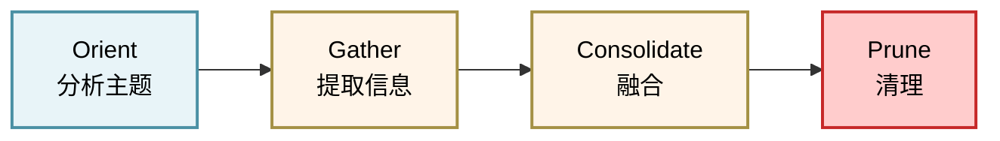

## 本章小结

### 核心概念回顾

第六章深入探讨了智能体系统最复杂也最关键的子系统——记忆与上下文管理。核心认识包括：

#### 多层记忆架构的必要性

任何实用的智能体系统都需要三个独立的记忆层：

1. **工作记忆**：当前会话的实时上下文，驻留在 LLM 的上下文窗口中
2. **短期记忆**：跨会话但有时限的信息，存储在内存或快速存储中
3. **长期记忆**：持久化的知识库，支持高效的检索和版本控制

这三层形成递进的关系：工作记忆溢出时流入短期，短期积累到阈值时压缩进长期。Claude Code 实现完整的三层模型，而 OpenClaw 采用简化的双层模型（直接从工作跳到长期）。Harness 建议采用 **自适应三层**，在灵活性和复杂度之间取得平衡。

#### 可写入式记忆的重要性

传统的智能体记忆往往是单向的——Agent 只读取预设的记忆。强大的系统应该支持 Agent**主动创建和更新记忆**。这要求：

- **原子性保证**：避免并发修改导致的数据不一致
- **版本控制**：每次更新都可回溯
- **Frontmatter 结构**：分离元数据和内容，支持快速索引

Claude Code 提出的 **记忆类型分类**（user/feedback/project/reference）简化了这个问题——不同类型的记忆有不同的更新策略和检索方式。

#### 上下文组装是智能体性能的关键

不是所有的记忆都应该在每次请求时加载。高效的上下文组装需要：

- **需求分析**：识别查询需要哪些记忆源
- **并行检索**：从多个源并发获取内容
- **智能排序**：按优先级和相关性排列，优先加载关键信息
- **容量管理**：在 token 预算内最大化信息密度

Claude Code 的 **动态边界机制**（保护系统提示和关键信息，其余空间动态分配）是一个优雅的解决方案。

#### 记忆整合是长期对话的保证

在长对话中，如果不进行整合，上下文会无限膨胀。Claude Code 的 **autoDream** 系统提供了成熟的范式：

- **三门触发**：时间门（24h）、会话门（5 次）、显式锁，降低整合的频率同时保证灵活性
- **四阶段流程**：Orient → Gather → Consolidate → Prune，分离关注点
- **增量更新**：仅处理新信息，避免重复计算

相比 OpenClaw 的被动式刷写（70% 上下文触发），autoDream 更加主动和可控。

### 两个参考系统的对比与权衡

| 特征 | Claude Code | OpenClaw | Harness 建议 |
|------|------------|----------|-----------|
| 架构复杂度 | 中（三层） | 低（双层） | 中（自适应三层） |
| 整合策略 | 主动（定时+计数） | 被动（阈值触发） | 主动+被动混合 |
| 记忆类型 | 分类（4 类） | 统一 | 分类（5+ 类） |
| 检索方式 | 格式化提取 | 混合搜索（关键词+向量） | 混合+向量 |
| 实现难度 | 中等 | 易 | 中等 |
| 适用场景 | 项目驱动应用 | 对话型应用 | 通用应用 |

**选型建议**：

- 代码助手、研究工具 → 参考 Claude Code 的细粒度记忆
- 对话机器人、客服系统 → 参考 OpenClaw 的简洁性
- 通用智能体系统 → 采用 Harness 的自适应方案

### 实现要点

#### 1. 存储抽象必须支持

- **Markdown Frontmatter**：元数据 + 内容分离，便于索引和版本控制
- **文件系统组织**：按类型分目录，支持快速列表和搜索
- **版本备份**：每次写入前备份，支持回滚

#### 2. 上下文组装的三阶段模型

模型流程如下：

```python
需求分析 → 并行搜索 → 优先级排序 + 容量管理
```

轻量级分类器识别查询需要哪些记忆，并行从各源检索，最后按优先级填充。

#### 3. 整合的四阶段流程

流程如下：



每个阶段都有明确的责任，支持监控和调试。

#### 4. 索引维护的必要性

- **向量索引**：语义搜索，捕捉语义相似的记忆
- **关键词索引**：精确搜索，捕捉精确的事实
- **过期清理**：定期删除低价值的旧项

### 常见陷阱与解决方案

#### 陷阱 1：记忆无限增长

**症状**：随着对话轮数增加，系统响应变慢，记忆库无限膨胀

**解决**：

- 设置明确的整合触发条件（时间或会话计数）
- 定期运行清理任务，删除过期项
- 监控记忆库大小，当超过阈值时强制整合

#### 陷阱 2：整合丢失关键信息

**症状**：某些重要上下文被压缩或删除，导致智能体犯重复错误

**解决**：

- 使用多级重要性评分，标记关键项
- 保留原始记录供审计，不直接删除
- 使用置信度字段，低置信度项保留更久

#### 陷阱 3：上下文装配不当导致无关信息泛滥

**症状**：组装的上下文包含大量不相关信息，noise 淹没 signal

**解决**：

- 实现需求分析模块，精准选择记忆源
- 为每个记忆源设置相关性阈值
- 支持显式查询语言，用户可以指定需要的记忆类型

#### 陷阱 4：并发修改导致数据不一致

**症状**：多个智能体实例同时修改同一记忆，导致不可预测的结果

**解决**：

- 使用版本号或时间戳，实现乐观锁
- 提供 3-way merge 算法处理冲突
- 对关键记忆使用悲观锁（数据库事务）

### 性能优化要点

#### 1. 缓存策略

- 静态上下文（系统提示、用户档案）可缓存 5-10 分钟
- 动态上下文（最近历史、项目进度）缓存 30 秒
- 使用 tag-based 失效，支持精细控制

#### 2. 索引优化

- 使用倒排索引加速关键词搜索（O(1) lookup）
- 使用向量量化或产品量化加速向量搜索
- 定期重建索引，删除已删除项的索引条目

#### 3. 异步处理

- 整合操作在后台执行，不阻塞主线程
- 索引更新异步进行
- 批量删除和清理操作优化为批量操作

### 监控和可观测性

为了保持系统健康，应该监控以下指标：
```python
class MemoryMetrics:
    memory_size_bytes: int        # 记忆库总大小
    consolidation_latency_ms: float  # 整合耗时
    context_assembly_latency_ms: float  # 上下文组装耗时
    search_hit_rate: float        # 搜索命中率
    cache_hit_rate: float         # 缓存命中率
    average_confidence: float     # 记忆平均置信度
    expired_entries_per_day: int  # 每日过期项数
```

通过这些指标，可以及时发现问题（如：缓存命中率下降 → 可能需要调整 TTL；搜索命中率下降 → 可能索引过时）。

### 下一步方向

#### 1. 分布式记忆系统

本章的实现都是单机的。对于多智能体并发场景，需要考虑：

- 中央记忆服务器（如 Redis 或 PostgreSQL）
- 分布式一致性协议（Raft、Paxos）
- 记忆同步和冲突解决

#### 2. 高级检索技术

- 混合检索：结合关键词和向量，提高召回率
- 知识图谱：将记忆组织成图结构，支持关联查询
- 多模态记忆：支持图像、音频等非文本形式

#### 3. 个性化和学习

- 智能体从用户反馈中主动调整记忆策略
- 动态调整整合触发条件，平衡成本和准确性
- 学习用户的查询模式，优化上下文组装

### 关键收获

1. **记忆是智能体的”第二大脑”**，良好的记忆系统是智能体能力的倍增器
2. **三层架构是标准范式**，工作 → 短期 → 长期的递进关系
3. **可写入性很关键**，Agent 应主动创建和更新记忆
4. **上下文装配不是简单连接**，需要需求分析、并行搜索、智能排序
5. **自动化整合不可避免**，但需要谨慎设计触发条件和流程

记忆系统的设计直接影响智能体的长期能力。投入时间建立坚实的记忆基础，会在后续的复杂应用中获得巨大收益。
