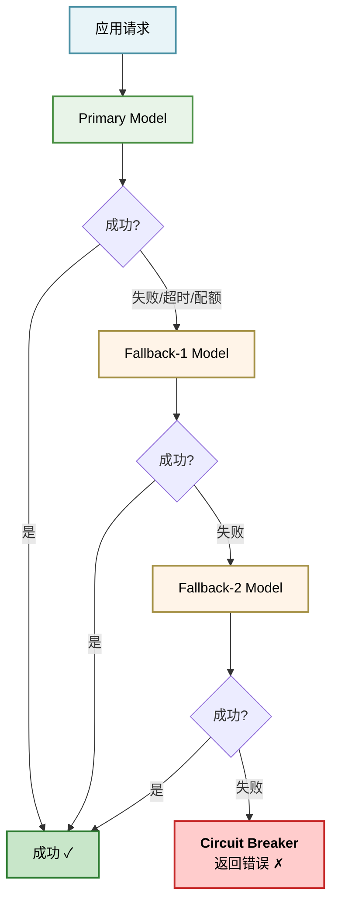
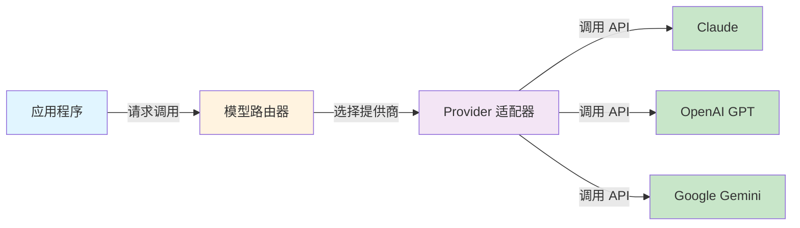

## 7.1 模型抽象层设计

模型抽象层连接智能体应用与具体LLM API，支持灵活的多模型或单模型策略。本节介绍配置管理系统、故障转移链路、Provider接口设计和模型选择引擎。

### 7.1.1 核心概念

模型抽象层是连接智能体应用与具体 LLM API 的中间层。其目标是：

1. **统一接口**：提供一致的 API，支持 Claude、GPT、DeepSeek、Gemini 等多种模型
2. **灵活切换**：动态选择或回退模型，无需修改业务逻辑
3. **配置驱动**：通过配置文件管理模型选择、默认值、故障转移策略
4. **错误隔离**：单个模型的故障不影响整个系统

### 7.1.2 设计权衡：多模型 vs 单模型绑定

**Claude Code 方案（单模型绑定）**

- 绑定 Claude 模型家族(Opus/Sonnet/Haiku)
- 专注于版本管理与推理预算调优
- 深度集成 Extended Thinking 等 Claude 特性
- 场景：需要最佳性能、深度功能集成、模型特性充分利用

**OpenClaw 方案（多模型支持）**

- 支持多供应商切换(Claude/GPT/DeepSeek/Gemini/Ollama)
- 供应商认证与接入配置(openclaw.json)
- 模型故障转移链路(fallback mechanism)
- 场景：需要成本优化、供应商多元化、灰度迁移

选择建议：

- 小团队初期选择单模型绑定降低复杂度
- 成熟产品需要多模型以应对供应商依赖和成本波动

### 7.1.3 配置管理系统

**模型选择策略**

模型选择的实现方式如下：

```python
from enum import Enum
from dataclasses import dataclass
from typing import Optional, List

class ModelProviderType(Enum):
    CLAUDE = "claude"
    OPENAI = "openai"
    DEEPSEEK = "deepseek"
    GEMINI = "gemini"
    OLLAMA = "ollama"

@dataclass
class ModelConfig:
    """模型配置对象"""
    provider: ModelProviderType
    model_id: str
    api_key: Optional[str] = None
    api_endpoint: Optional[str] = None
    timeout: int = 30
    max_tokens: int = 4096
    temperature: float = 0.7

@dataclass
class ModelSelectionPolicy:
    """模型选择策略"""
    primary: ModelConfig
    fallback_chain: List[ModelConfig] = None
    cost_threshold: float = None  # 成本上限,超过则切换
    latency_threshold: int = None  # 延迟上限,超过则切换
```

#### 故障转移链路

故障转移链路定义了模型失败时的替代方案：



实现示例：

```python
import time

class CircuitBreaker:
    """熔断器,跟踪模型健康状态"""
    def __init__(self, failure_threshold: int = 5, reset_timeout: int = 60):
        self.failure_count = 0
        self.failure_threshold = failure_threshold
        self.reset_timeout = reset_timeout
        self.state = "closed"  # closed, open, half-open
        self.last_failure_time = None

    def record_success(self):
        self.failure_count = 0
        self.state = "closed"

    def record_failure(self):
        self.failure_count += 1
        if self.failure_count >= self.failure_threshold:
            self.state = "open"
            self.last_failure_time = time.time()

    def is_available(self) -> bool:
        if self.state == "closed":
            return True
        if self.state == "open":
            if time.time() - self.last_failure_time > self.reset_timeout:
                self.state = "half-open"
                return True
            return False
        return True  # half-open 允许尝试
```

#### Provider 接口设计

Provider 接口定义了模型的核心操作。使用 Python Protocol 提供灵活的鸭子类型：

```python
from typing import Protocol, List, Any, Optional

class Message:
    def __init__(self, role: str, content: str):
        self.role = role  # "user", "assistant"
        self.content = content

class ProviderResponse:
    def __init__(self, content: str, tokens_used: int, model: str):
        self.content = content
        self.tokens_used = tokens_used
        self.model = model

class ModelProvider(Protocol):
    """LLM 供应商的统一接口"""

    def complete(
        self,
        messages: List[Message],
        temperature: float = 0.7,
        max_tokens: int = 4096,
    ) -> ProviderResponse:
        """完整的模型调用(无流式)"""
        ...

    def stream(
        self,
        messages: List[Message],
        temperature: float = 0.7,
        max_tokens: int = 4096,
    ):
        """流式模型调用,逐块返回"""
        ...

    def estimate_tokens(self, text: str) -> int:
        """估算文本的 token 数"""
        ...

    def validate_config(self) -> bool:
        """验证配置有效性(API 密钥等)"""
        ...
```

#### 具体实现：Claude Provider

Claude Provider的具体实现如下：

```python
import anthropic
from typing import Generator

class ClaudeProvider:
    def __init__(self, config: ModelConfig):
        self.config = config
        self.client = anthropic.Anthropic(api_key=config.api_key)

    def complete(
        self,
        messages: List[Message],
        temperature: float = 0.7,
        max_tokens: int = 4096,
    ) -> ProviderResponse:
        """Claude 完整调用"""
        api_messages = [
            {"role": msg.role, "content": msg.content}
            for msg in messages
        ]
        response = self.client.messages.create(
            model=self.config.model_id,
            max_tokens=max_tokens,
            temperature=temperature,
            messages=api_messages,
        )
        return ProviderResponse(
            content=response.content[0].text,
            tokens_used=response.usage.output_tokens
            + response.usage.input_tokens,
            model=self.config.model_id,
        )

    def stream(
        self,
        messages: List[Message],
        temperature: float = 0.7,
        max_tokens: int = 4096,
    ) -> Generator[str, None, None]:
        """Claude 流式调用"""
        api_messages = [
            {"role": msg.role, "content": msg.content}
            for msg in messages
        ]
        with self.client.messages.stream(
            model=self.config.model_id,
            max_tokens=max_tokens,
            temperature=temperature,
            messages=api_messages,
        ) as stream:
            for text in stream.text_stream:
                yield text

    def estimate_tokens(self, text: str) -> int:
        """Claude token 计数"""
        response = self.client.messages.count_tokens(messages=[
            {"role": "user", "content": text}
        ])
        return response.input_tokens

    def validate_config(self) -> bool:
        try:
            self.estimate_tokens("test")
            return True
        except:
            return False
```

#### 模型选择引擎

模型选择引擎的实现方式如下：

```python
class ModelSelectionEngine:
    def __init__(self, policy: ModelSelectionPolicy):
        self.policy = policy
        self.breakers = {}
        self._init_breakers()

    def _init_breakers(self):
        for config in [self.policy.primary] + (
            self.policy.fallback_chain or []
        ):
            self.breakers[config.model_id] = CircuitBreaker()

    def select_model(self) -> ModelProvider:
        """根据健康状态选择可用模型"""
        candidates = [self.policy.primary] + (
            self.policy.fallback_chain or []
        )
        for config in candidates:
            breaker = self.breakers[config.model_id]
            if breaker.is_available():
                return self._create_provider(config)
        raise Exception("所有模型不可用")

    def mark_failure(self, model_id: str):
        """记录模型故障"""
        if model_id in self.breakers:
            self.breakers[model_id].record_failure()

    def mark_success(self, model_id: str):
        """记录模型成功"""
        if model_id in self.breakers:
            self.breakers[model_id].record_success()

    def _create_provider(self, config: ModelConfig):
        if config.provider == ModelProviderType.CLAUDE:
            return ClaudeProvider(config)
        # ... 其他 provider 实现
```

#### 配置文件管理

配置文件的结构示例如下：

```json
{
  "model_selection": {
    "primary": {
      "provider": "claude",
      "model_id": "claude-sonnet-4-6",
      "timeout": 30,
      "max_tokens": 4096
    },
    "fallback_chain": [
      {
        "provider": "openai",
        "model_id": "gpt-4o",
        "timeout": 30,
        "max_tokens": 4096
      },
      {
        "provider": "deepseek",
        "model_id": "deepseek-chat",
        "timeout": 30,
        "max_tokens": 4096
      }
    ],
    "cost_threshold": 0.05,
    "latency_threshold": 5000
  }
}
```

#### 模型抽象层架构图

模型抽象层的整体架构如下所示：



图 7-1：模型抽象层架构 —— 应用通过统一的路由器访问多个模型提供商

#### 总结

模型抽象层通过 Provider 接口、配置驱动的选择策略和故障转移机制，实现了：

- 灵活的多模型支持或单模型绑定
- 透明的故障切换，对上层应用无感
- 可观测的模型健康度和选择决策
- 成本与性能的可控权衡

这为后续的输出解析、质量门控奠定了基础。
