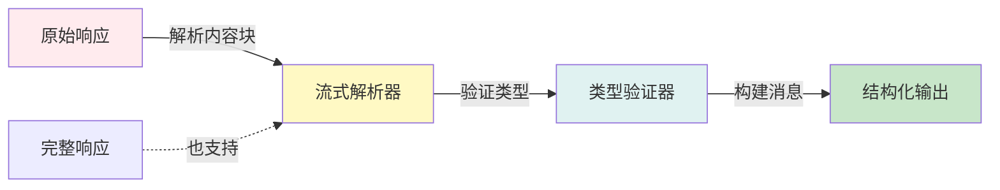

## 7.2 结构化输出解析与校验

模型输出需要被转换为类型安全的结构化形式才能可靠地驱动后续操作。本节介绍 Claude 的消息类型系统、非流式与流式响应的解析方法、Pydantic 参数验证以及完整的解析管道设计。

### 7.2.1 核心问题

原始 API 响应是无类型的字符串或弱类型的 JSON。要将其安全地转换为类型安全的结构化表示，需要解决：

1. **类型识别**：区分文本、工具调用、思考块等不同内容类型
2. **增量解析**：处理流式响应的片段化更新
3. **结构校验**：验证解析结果的完整性与合法性
4. **向后兼容**：支持不同 API 版本和模型的差异

### 7.2.2 Claude 的消息类型系统

Claude API 返回的消息(Message)由多个内容块(ContentBlock)组成，每个块有不同的类型：

```python
from dataclasses import dataclass
from enum import Enum
from typing import Optional, List, Any

class ContentBlockType(Enum):
    TEXT = "text"
    TOOL_USE = "tool_use"
    THINKING = "thinking"

@dataclass
class TextBlock:
    """文本内容块"""
    type: str = "text"
    text: str = ""

@dataclass
class ToolUseBlock:
    """工具调用块"""
    type: str = "tool_use"
    id: str = ""
    name: str = ""
    input: dict = None  # JSON 输入参数

@dataclass
class ThinkingBlock:
    """思考过程块(Extended Thinking)"""
    type: str = "thinking"
    thinking: str = ""

ContentBlock = TextBlock | ToolUseBlock | ThinkingBlock

@dataclass
class ParsedMessage:
    """解析后的完整消息"""
    content_blocks: List[ContentBlock]
    stop_reason: str  # "end_turn", "tool_use", "max_tokens"
    tokens_used: int

    def text_content(self) -> str:
        """提取所有文本内容"""
        texts = [
            block.text for block in self.content_blocks
            if isinstance(block, TextBlock)
        ]
        return "".join(texts)

    def tool_calls(self) -> List[ToolUseBlock]:
        """提取所有工具调用"""
        return [
            block for block in self.content_blocks
            if isinstance(block, ToolUseBlock)
        ]

    def thinking_content(self) -> Optional[str]:
        """提取思考过程"""
        for block in self.content_blocks:
            if isinstance(block, ThinkingBlock):
                return block.thinking
        return None
```

#### 非流式解析

完整响应的解析实现方式如下：

```python
import json
from typing import Dict, Any

class ResponseParser:
    """API 响应解析器"""

    @staticmethod
    def parse_response(raw_response: Dict[str, Any]) -> ParsedMessage:
        """解析完整的 API 响应"""
        content_blocks = []

        # 遍历响应的 content 数组
        for block in raw_response.get("content", []):
            block_type = block.get("type")

            if block_type == "text":
                content_blocks.append(TextBlock(
                    type="text",
                    text=block.get("text", "")
                ))

            elif block_type == "tool_use":
                # 工具调用：需要解析 JSON 输入
                input_data = block.get("input", {})
                if isinstance(input_data, str):
                    try:
                        input_data = json.loads(input_data)
                    except json.JSONDecodeError:
                        input_data = {}

                content_blocks.append(ToolUseBlock(
                    type="tool_use",
                    id=block.get("id", ""),
                    name=block.get("name", ""),
                    input=input_data
                ))

            elif block_type == "thinking":
                content_blocks.append(ThinkingBlock(
                    type="thinking",
                    thinking=block.get("thinking", "")
                ))

        return ParsedMessage(
            content_blocks=content_blocks,
            stop_reason=raw_response.get("stop_reason", "end_turn"),
            tokens_used=(
                raw_response.get("usage", {}).get("input_tokens", 0) +
                raw_response.get("usage", {}).get("output_tokens", 0)
            )
        )
```

#### 流式解析

流式响应分块到达，需要增量构建完整消息。关键是跟踪当前正在构建的块状态：

```python
import json
from enum import Enum
from typing import Dict, Any, Optional

class StreamEventType(Enum):
    MESSAGE_START = "message_start"
    CONTENT_BLOCK_START = "content_block_start"
    CONTENT_BLOCK_DELTA = "content_block_delta"
    CONTENT_BLOCK_STOP = "content_block_stop"
    MESSAGE_DELTA = "message_delta"
    MESSAGE_STOP = "message_stop"

class StreamingParser:
    """流式响应解析器"""

    def __init__(self):
        self.content_blocks = []
        self.current_block = None
        self.block_index = 0
        self.stop_reason = "end_turn"
        self.tokens_used = 0

    def process_event(self, event: Dict[str, Any]) -> Optional[ParsedMessage]:
        """处理单个流式事件"""
        event_type = event.get("type")

        if event_type == "message_start":
            # 消息开始，重置状态
            self.content_blocks = []
            self.current_block = None
            self.block_index = 0
            usage = event.get("message", {}).get("usage", {})
            self.tokens_used = usage.get("input_tokens", 0)

        elif event_type == "content_block_start":
            # 新块开始
            self.block_index = event.get("index", 0)
            block_info = event.get("content_block", {})
            block_type = block_info.get("type")

            if block_type == "text":
                self.current_block = TextBlock(type="text", text="")
            elif block_type == "tool_use":
                self.current_block = ToolUseBlock(
                    type="tool_use",
                    id=block_info.get("id", ""),
                    name=block_info.get("name", ""),
                    input={}
                )
            elif block_type == "thinking":
                self.current_block = ThinkingBlock(type="thinking", thinking="")

            # 确保数组足够长
            while len(self.content_blocks) <= self.block_index:
                self.content_blocks.append(None)

        elif event_type == "content_block_delta":
            # 块内容增量更新
            delta = event.get("delta", {})
            delta_type = delta.get("type")

            if delta_type == "text_delta":
                if isinstance(self.current_block, TextBlock):
                    self.current_block.text += delta.get("text", "")

            elif delta_type == "input_json_delta":
                # 工具调用的 JSON 增量
                if isinstance(self.current_block, ToolUseBlock):
                    json_str = delta.get("partial_json", "")
                    try:
                        self.current_block.input = json.loads(json_str)
                    except json.JSONDecodeError:
                        pass

            elif delta_type == "thinking_delta":
                if isinstance(self.current_block, ThinkingBlock):
                    self.current_block.thinking += delta.get("thinking", "")

        elif event_type == "content_block_stop":
            # 块完成，保存到数组
            if self.current_block is not None:
                self.content_blocks[self.block_index] = self.current_block
                self.current_block = None

        elif event_type == "message_stop":
            # 消息完成
            self.stop_reason = event.get("message", {}).get("stop_reason",
                                                              "end_turn")
            usage = event.get("message", {}).get("usage", {})
            self.tokens_used += usage.get("output_tokens", 0)

            # 返回完整的解析结果
            return ParsedMessage(
                content_blocks=[b for b in self.content_blocks if b],
                stop_reason=self.stop_reason,
                tokens_used=self.tokens_used
            )

        return None  # 消息未完成
```

#### 使用流式解析器

流式解析器的具体使用方式如下：

```python
import json

class StreamIterator:
    """流式迭代器，隐藏解析复杂性"""

    def __init__(self, api_stream):
        self.api_stream = api_stream
        self.parser = StreamingParser()

    def __iter__(self):
        for event_data in self.api_stream:
            event = json.loads(event_data)
            result = self.parser.process_event(event)
            if result is not None:
                yield result

# 使用示例
with client.messages.stream(...) as stream:
    for parsed_message in StreamIterator(stream):
        print(f"接收到消息: {parsed_message.text_content()}")
        for tool_call in parsed_message.tool_calls():
            print(f"  工具调用: {tool_call.name}({tool_call.input})")
```

#### Pydantic 校验

使用 Pydantic 定义预期的工具参数结构，并在解析后进行验证：

```python
from pydantic import BaseModel, ValidationError, field_validator
from typing import Optional

class SearchToolInput(BaseModel):
    """搜索工具的输入参数"""
    query: str
    max_results: int = 10
    language: str = "en"

    @field_validator("max_results")
    @classmethod
    def validate_max_results(cls, v):
        if v < 1 or v > 100:
            raise ValueError("max_results 必须在 1-100 之间")
        return v

class ToolCallValidator:
    """工具调用参数验证"""

    TOOL_SCHEMAS = {
        "search": SearchToolInput,
        "database_query": "DatabaseQueryInput",
        # ... 其他工具
    }

    @staticmethod
    def validate_tool_call(tool_call: ToolUseBlock) -> bool:
        """验证工具调用的合法性"""
        tool_name = tool_call.name
        if tool_name not in ToolCallValidator.TOOL_SCHEMAS:
            raise ValueError(f"未知的工具: {tool_name}")

        schema = ToolCallValidator.TOOL_SCHEMAS[tool_name]
        try:
            schema(**tool_call.input)
            return True
        except ValidationError as e:
            raise ValueError(f"工具参数验证失败: {e}")

# 使用
tool_call = ToolUseBlock(
    id="call_123",
    name="search",
    input={"query": "Python async", "max_results": 10}
)
try:
    if ToolCallValidator.validate_tool_call(tool_call):
        print("工具调用有效")
except ValueError as e:
    print(f"验证失败: {e}")
```

#### 解析管道

完整的解析管道实现如下：

```python
class ParsingPipeline:
    """完整的解析管道"""

    def __init__(self):
        self.parser = ResponseParser()
        self.validator = ToolCallValidator()

    def parse_and_validate(
        self, raw_response: Dict[str, Any]
    ) -> ParsedMessage:
        """解析并验证响应"""
        # 步骤 1：解析
        parsed = self.parser.parse_response(raw_response)

        # 步骤 2：验证工具调用
        for tool_call in parsed.tool_calls():
            self.validator.validate_tool_call(tool_call)

        # 步骤 3：检查完整性
        if parsed.stop_reason == "max_tokens":
            raise ValueError("响应因 token 限制被截断")

        return parsed
```

#### 输出解析管道架构

结构化输出的解析流程如下所示：



图 7-2：输出解析管道 —— 从原始响应逐步转换为类型安全的结构化数据

#### 总结

结构化输出解析通过：

- **类型系统**(TextBlock/ToolUseBlock/ThinkingBlock)提供类型安全
- **非流式与流式双路径** 支持不同使用场景
- **增量解析** 实现高效的流式处理
- **Pydantic 校验** 确保参数合法性

这是构建可靠智能体的基础，为下一步的质量门控做准备。
