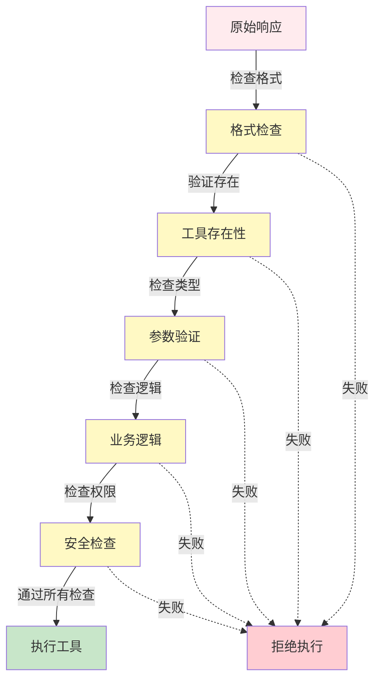

## 7.3 输出质量门控与过滤

### 7.3.1 问题定义

工具调用前的最后防线是质量门控（Quality Gate）。未经验证的输出可能导致：

- **参数错误**：工具接收非法数据导致执行失败
- **资源泄露**：过度调用导致费用飙升或系统宕机
- **格式异常**：API 调用失败导致 智能体循环重试
- **安全漏洞**：注入攻击、不合理的权限操作

质量门控在 **执行之前** 进行多层验证，确保只有安全、合法的调用才能通过。

### 7.3.2 门控层次结构

质量门控按以下六个层次依次进行验证：



图 7-3：质量门控多层验证流程 —— 工具执行前的六层递进式防护

#### 1. 基础格式检查

验证解析结果的完整性和一致性：

```python
from dataclasses import dataclass
from enum import Enum
from typing import Optional, List

class ValidationResult(Enum):
    PASS = "pass"
    FAIL = "fail"
    WARN = "warn"

@dataclass
class ValidationReport:
    result: ValidationResult
    errors: List[str]
    warnings: List[str]
    suggestion: Optional[str] = None

class FormatValidator:
    """基础格式验证"""

    @staticmethod
    def validate_tool_use_block(tool_use) -> ValidationReport:
        """验证工具调用块的结构完整性"""
        errors = []
        warnings = []

        # 检查必填字段
        if not tool_use.id:
            errors.append("tool_use.id 不能为空")
        if not tool_use.name:
            errors.append("tool_use.name 不能为空")
        if tool_use.input is None:
            errors.append("tool_use.input 不能为空")

        # 检查 ID 格式（Claude 的 tool_use.id 以 "toolu_" 开头）
        if tool_use.id and not tool_use.id.startswith("toolu_"):
            warnings.append(
                f"非标准 tool_use.id: {tool_use.id}"
            )

        # 检查名称格式（应为 snake_case）
        if tool_use.name and not FormatValidator._is_valid_name(tool_use.name):
            warnings.append(
                f"工具名格式非标准: {tool_use.name}"
            )

        if errors:
            return ValidationReport(
                result=ValidationResult.FAIL,
                errors=errors,
                warnings=warnings,
                suggestion="检查 API 响应是否正确解析"
            )

        if warnings:
            return ValidationReport(
                result=ValidationResult.WARN,
                errors=[],
                warnings=warnings
            )

        return ValidationReport(
            result=ValidationResult.PASS,
            errors=[],
            warnings=[]
        )

    @staticmethod
    def _is_valid_name(name: str) -> bool:
        """检查工具名是否符合 snake_case"""
        return name.islower() and name.replace("_", "").isalnum()
```

#### 2. 工具存在性检查

验证工具是否已注册：

```python
class ToolRegistry:
    """工具注册表与存在性检查"""

    def __init__(self):
        self.tools = {}

    def register(self, name: str, handler, schema):
        """注册工具"""
        self.tools[name] = {
            "handler": handler,
            "schema": schema,
            "enabled": True
        }

    def is_tool_available(self, name: str) -> bool:
        """检查工具是否可用"""
        if name not in self.tools:
            return False
        return self.tools[name]["enabled"]

    def get_tool_schema(self, name: str):
        """获取工具的参数 schema"""
        if name not in self.tools:
            return None
        return self.tools[name]["schema"]

class ExistenceValidator:
    """工具存在性验证"""

    def __init__(self, registry: ToolRegistry):
        self.registry = registry

    def validate(self, tool_name: str) -> ValidationReport:
        """检查工具是否存在且可用"""
        errors = []
        suggestions = []

        if tool_name not in self.registry.tools:
            errors.append(f"工具 '{tool_name}' 未注册")
            # 生成相似工具建议
            similar = self._find_similar_tools(tool_name)
            if similar:
                suggestions.append(
                    f"您是想用 '{similar[0]}' 吗?"
                )

        elif not self.registry.is_tool_available(tool_name):
            errors.append(f"工具 '{tool_name}' 已禁用")

        if errors:
            return ValidationReport(
                result=ValidationResult.FAIL,
                errors=errors,
                warnings=[],
                suggestion=suggestions[0] if suggestions else None
            )

        return ValidationReport(
            result=ValidationResult.PASS,
            errors=[],
            warnings=[]
        )

    def _find_similar_tools(self, name: str) -> List[str]:
        """使用编辑距离找相似工具名"""
        from difflib import get_close_matches
        available = [n for n in self.registry.tools.keys()
                     if self.registry.is_tool_available(n)]
        return get_close_matches(name, available, n=1, cutoff=0.6)
```

#### 3. 参数类型和范围检查

使用Pydantic进行参数类型和范围验证的实现如下：

```python
from pydantic import BaseModel, ValidationError, field_validator
from typing import Optional, Any

class FileReadInput(BaseModel):
    """文件读取工具的输入"""
    file_path: str
    encoding: str = "utf-8"
    max_lines: Optional[int] = None

    @field_validator("file_path")
    @classmethod
    def validate_file_path(cls, v):
        if not isinstance(v, str) or len(v) == 0:
            raise ValueError("file_path 必须是非空字符串")
        return v

    @field_validator("max_lines")
    @classmethod
    def validate_max_lines(cls, v):
        if v is not None and (v < 1 or v > 100000):
            raise ValueError("max_lines 必须在 1-100000 之间")
        return v

class ParameterValidator:
    """参数验证器"""

    def __init__(self, registry: ToolRegistry):
        self.registry = registry

    def validate(self, tool_name: str, parameters: dict) -> ValidationReport:
        """验证工具参数"""
        schema = self.registry.get_tool_schema(tool_name)
        if schema is None:
            return ValidationReport(
                result=ValidationResult.FAIL,
                errors=[f"无法找到工具 {tool_name} 的 schema"],
                warnings=[]
            )

        errors = []
        warnings = []

        try:
            # 使用 Pydantic 验证参数
            validated = schema(**parameters)
            return ValidationReport(
                result=ValidationResult.PASS,
                errors=[],
                warnings=[]
            )
        except ValidationError as e:
            for error in e.errors():
                field = ".".join(str(x) for x in error["loc"])
                msg = error["msg"]
                errors.append(f"参数 {field}: {msg}")

        if errors:
            return ValidationReport(
                result=ValidationResult.FAIL,
                errors=errors,
                warnings=warnings,
                suggestion="请检查工具的参数定义"
            )

        return ValidationReport(
            result=ValidationResult.PASS,
            errors=[],
            warnings=warnings
        )
```

#### 4. 业务逻辑检查

某些检查超越类型系统，涉及业务规则：

```python
class BusinessLogicValidator:
    """业务逻辑验证"""

    def __init__(self):
        self.config = {
            "max_api_calls_per_minute": 100,
            "max_file_size_mb": 10,
            "allowed_domains": ["example.com", "api.service.com"],
        }

    def validate_api_call_frequency(self, tool_name: str,
                                    call_history: List[float]) -> ValidationReport:
        """检查 API 调用频率是否超过限制"""
        import time
        now = time.time()
        # 计算最近 1 分钟的调用数
        recent_calls = [t for t in call_history if now - t < 60]

        limit = self.config["max_api_calls_per_minute"]
        if len(recent_calls) >= limit:
            return ValidationReport(
                result=ValidationResult.FAIL,
                errors=[f"工具 {tool_name} 在 1 分钟内调用已达 {limit} 次限制"],
                warnings=[],
                suggestion="请稍后再试"
            )

        return ValidationReport(
            result=ValidationResult.PASS,
            errors=[],
            warnings=[]
        )

    def validate_file_access(self, file_path: str) -> ValidationReport:
        """检查文件访问权限和大小"""
        import os
        errors = []

        # 检查文件存在性
        if not os.path.exists(file_path):
            return ValidationReport(
                result=ValidationResult.FAIL,
                errors=[f"文件不存在: {file_path}"],
                warnings=[]
            )

        # 检查文件大小
        file_size_mb = os.path.getsize(file_path) / (1024 * 1024)
        max_size = self.config["max_file_size_mb"]
        if file_size_mb > max_size:
            return ValidationReport(
                result=ValidationResult.FAIL,
                errors=[f"文件大小 {file_size_mb:.2f}MB 超过限制 {max_size}MB"],
                warnings=[]
            )

        return ValidationReport(
            result=ValidationResult.PASS,
            errors=[],
            warnings=[]
        )

    def validate_http_request(self, url: str) -> ValidationReport:
        """检查 HTTP 请求的目标合法性"""
        from urllib.parse import urlparse
        parsed = urlparse(url)
        domain = parsed.netloc

        if domain not in self.config["allowed_domains"]:
            return ValidationReport(
                result=ValidationResult.FAIL,
                errors=[f"不允许访问域名: {domain}"],
                warnings=[],
                suggestion=f"允许的域名: {self.config['allowed_domains']}"
            )

        return ValidationReport(
            result=ValidationResult.PASS,
            errors=[],
            warnings=[]
        )
```

#### 5. 安全与权限检查

安全与权限检查的实现方式如下：

```python
from enum import Enum

class Permission(Enum):
    READ = "read"
    WRITE = "write"
    DELETE = "delete"
    EXECUTE = "execute"

class SecurityValidator:
    """安全与权限检查"""

    def __init__(self, user_permissions: set):
        self.user_permissions = user_permissions

    def validate_tool_permission(self, tool_name: str) -> ValidationReport:
        """检查用户是否有权调用该工具"""
        # 定义工具所需权限
        tool_permissions = {
            "read_file": {Permission.READ},
            "write_file": {Permission.WRITE},
            "delete_file": {Permission.DELETE},
            "execute_command": {Permission.EXECUTE},
        }

        if tool_name not in tool_permissions:
            return ValidationReport(
                result=ValidationResult.FAIL,
                errors=[f"未知工具: {tool_name}"],
                warnings=[]
            )

        required = tool_permissions[tool_name]
        if not required.issubset(self.user_permissions):
            missing = required - self.user_permissions
            return ValidationReport(
                result=ValidationResult.FAIL,
                errors=[f"缺少权限: {', '.join(p.value for p in missing)}"],
                warnings=[]
            )

        return ValidationReport(
            result=ValidationResult.PASS,
            errors=[],
            warnings=[]
        )

    def validate_parameter_injection(self, parameters: dict) -> ValidationReport:
        """检查参数是否包含注入攻击"""
        dangerous_patterns = [
            "rm -rf",
            "DROP TABLE",
            "<script>",
            "${jndi:",
        ]

        for key, value in parameters.items():
            if isinstance(value, str):
                for pattern in dangerous_patterns:
                    if pattern in value:
                        return ValidationReport(
                            result=ValidationResult.FAIL,
                            errors=[f"参数 {key} 包含危险模式: {pattern}"],
                            warnings=[],
                            suggestion="检查参数是否被恶意注入"
                        )

        return ValidationReport(
            result=ValidationResult.PASS,
            errors=[],
            warnings=[]
        )
```

#### 6. 完整的质量门控引擎

整合六层验证逻辑的完整质量门控引擎如下：

```python
class QualityGate:
    """完整的质量门控引擎"""

    def __init__(self, registry: ToolRegistry, user_permissions: set):
        self.format_validator = FormatValidator()
        self.existence_validator = ExistenceValidator(registry)
        self.parameter_validator = ParameterValidator(registry)
        self.business_validator = BusinessLogicValidator()
        self.security_validator = SecurityValidator(user_permissions)

    def validate_tool_call(self, tool_call, call_history: List[float] = None):
        """执行完整的质量门控"""
        results = []

        # 门控 1: 格式检查
        r1 = self.format_validator.validate_tool_use_block(tool_call)
        results.append(("格式检查", r1))
        if r1.result == ValidationResult.FAIL:
            return self._report_failure(results)

        # 门控 2: 工具存在性
        r2 = self.existence_validator.validate(tool_call.name)
        results.append(("工具存在性", r2))
        if r2.result == ValidationResult.FAIL:
            return self._report_failure(results)

        # 门控 3: 参数验证
        r3 = self.parameter_validator.validate(
            tool_call.name, tool_call.input
        )
        results.append(("参数验证", r3))
        if r3.result == ValidationResult.FAIL:
            return self._report_failure(results)

        # 门控 4: 业务逻辑
        r4 = self.business_validator.validate_file_access("")
        results.append(("业务逻辑", r4))

        # 门控 5: 权限检查
        r5 = self.security_validator.validate_tool_permission(tool_call.name)
        results.append(("权限检查", r5))
        if r5.result == ValidationResult.FAIL:
            return self._report_failure(results)

        return {
            "passed": True,
            "details": results
        }

    def _report_failure(self, results):
        return {
            "passed": False,
            "details": results
        }
```

#### 总结

质量门控通过多层验证机制：

- **格式检查**：确保结构完整
- **存在性检查**：验证工具已注册
- **参数检查**：类型和范围验证
- **业务逻辑**：应用特定规则
- **安全检查**：防止权限和注入攻击

有效降低执行失败、资源泄露和安全风险，是智能体可靠性的关键保障。
