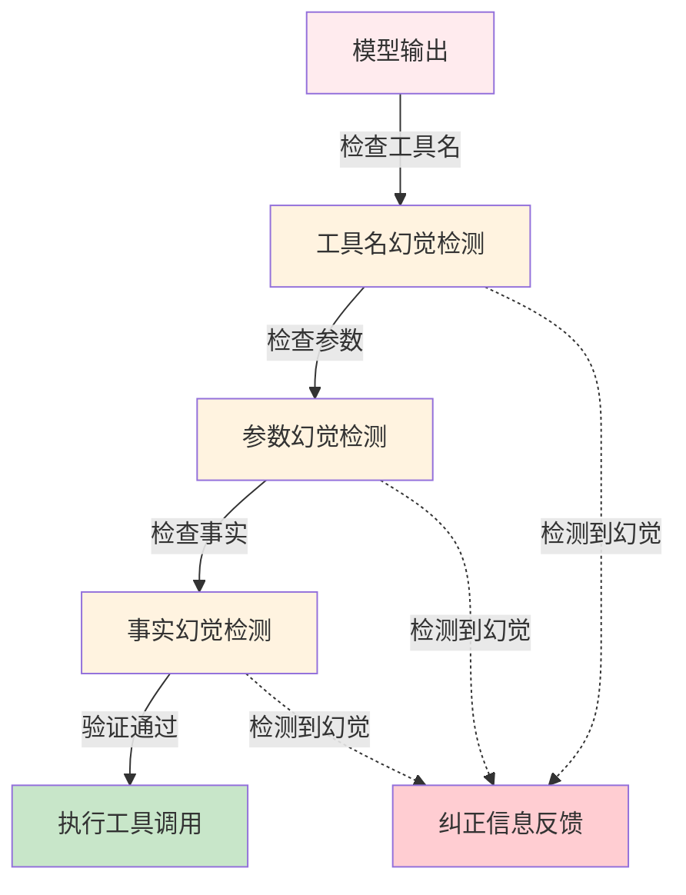

## 7.4 幻觉检测与工具调用验证

### 7.4.1 智能体场景中的幻觉危害

幻觉(Hallucination)在智能体中危害极大，因为输出直接转化为行动：

| 幻觉类型 | 示例 | 后果 |
|---------|------|------|
|**工具幻觉**| 调用不存在的 `send_email_to_ceo()` | 调用失败，错误消息反复重试 |
|**参数幻觉**| `file_path="/root/.ssh/id_rsa"` | 访问敏感文件或注入攻击 |
|**事实幻觉**| “API 端点是 example.com/api/v2” (实际是 v1) | 请求错误，数据丢失 |
|**能力幻觉**| 声称可以执行“删除数据库”操作（无权限） | 执行失败，暴露权限漏洞 |

关键特点：

- **不可撤销性**：工具执行后难以回滚（删除、转账等）
- **级联失败**：单个幻觉引发智能体反复重试，消耗 token
- **安全漏洞**：幻觉可能绕过权限检查

### 7.4.2 幻觉检测的三层防线

幻觉检测包括三层递进式的防线机制：



图 7-4：幻觉检测三层防线 —— 从工具调用验证到事实核实的多层防护

#### 层 1: 工具名幻觉检测

直接检查工具是否在注册表中存在：

```python
from typing import List, Optional
from dataclasses import dataclass

@dataclass
class HallucinationDetectionResult:
    is_hallucination: bool
    confidence: float  # 0.0-1.0
    hallucination_type: str  # "tool_name", "parameter", "fact"
    evidence: str
    correction: Optional[str] = None

class ToolNameHallucinationDetector:
    """工具名幻觉检测"""

    def __init__(self, registry):
        self.registry = registry

    def detect(self, tool_name: str) -> HallucinationDetectionResult:
        """检测工具名是否存在"""
        # 精确匹配
        if self.registry.is_tool_available(tool_name):
            return HallucinationDetectionResult(
                is_hallucination=False,
                confidence=1.0,
                hallucination_type="none",
                evidence=""
            )

        # 不存在，可能是：
        # 1. 完全幻觉
        # 2. 拼写错误(需纠正)

        # 使用编辑距离查找最相似的工具
        from difflib import SequenceMatcher

        available_tools = self.registry.get_available_tools()
        matches = [
            (tool, SequenceMatcher(None, tool_name, tool).ratio())
            for tool in available_tools
        ]
        matches.sort(key=lambda x: x[1], reverse=True)

        if matches and matches[0][1] > 0.6:
            # 可能是拼写错误
            corrected = matches[0][0]
            return HallucinationDetectionResult(
                is_hallucination=True,
                confidence=0.9,
                hallucination_type="tool_name",
                evidence=f"工具 '{tool_name}' 不存在",
                correction=f"您可能想调用 '{corrected}'"
            )
        else:
            # 完全幻觉
            return HallucinationDetectionResult(
                is_hallucination=True,
                confidence=0.95,
                hallucination_type="tool_name",
                evidence=f"工具 '{tool_name}' 完全不存在",
                correction=f"可用工具: {', '.join(available_tools[:5])}"
            )
```

#### 层 2: 参数幻觉检测

参数可能虽然合法但不合理（例如超过实际限制）：

```python
class ParameterHallucinationDetector:
    """参数幻觉检测"""

    def __init__(self, registry):
        self.registry = registry

    def detect(self, tool_name: str, parameters: dict) -> List[HallucinationDetectionResult]:
        """检测参数是否存在幻觉"""
        results = []
        schema = self.registry.get_tool_schema(tool_name)

        if schema is None:
            return results

        # 检查每个参数
        for param_name, param_value in parameters.items():
            # 未定义的参数
            if param_name not in schema.get("properties", {}):
                results.append(HallucinationDetectionResult(
                    is_hallucination=True,
                    confidence=0.8,
                    hallucination_type="parameter",
                    evidence=f"参数 '{param_name}' 未在工具定义中",
                    correction=f"允许的参数: {list(schema['properties'].keys())}"
                ))
                continue

            # 参数值范围检查
            prop_def = schema["properties"][param_name]

            # 数值范围
            if "minimum" in prop_def or "maximum" in prop_def:
                if isinstance(param_value, (int, float)):
                    min_val = prop_def.get("minimum")
                    max_val = prop_def.get("maximum")

                    if min_val is not None and param_value < min_val:
                        results.append(HallucinationDetectionResult(
                            is_hallucination=True,
                            confidence=0.9,
                            hallucination_type="parameter",
                            evidence=f"参数 '{param_name}' 值 {param_value} 小于最小值 {min_val}",
                            correction=f"请使用不小于 {min_val} 的值"
                        ))

                    if max_val is not None and param_value > max_val:
                        results.append(HallucinationDetectionResult(
                            is_hallucination=True,
                            confidence=0.9,
                            hallucination_type="parameter",
                            evidence=f"参数 '{param_name}' 值 {param_value} 大于最大值 {max_val}",
                            correction=f"请使用不大于 {max_val} 的值"
                        ))

            # 枚举值检查
            if "enum" in prop_def:
                if param_value not in prop_def["enum"]:
                    results.append(HallucinationDetectionResult(
                        is_hallucination=True,
                        confidence=0.95,
                        hallucination_type="parameter",
                        evidence=f"参数 '{param_name}' 值 '{param_value}' 不在允许列表中",
                        correction=f"允许的值: {prop_def['enum']}"
                    ))

        return results
```

#### 层 3: 事实幻觉检测

检查输出中的事实陈述是否与已知知识库一致：

```python
from abc import ABC, abstractmethod

class FactChecker(ABC):
    """事实检查器基类"""

    @abstractmethod
    def check(self, statement: str) -> bool:
        """检查陈述是否为真"""
        pass

class APIEndpointChecker(FactChecker):
    """检查 API 端点的真实性"""

    def __init__(self, known_endpoints: dict):
        self.known_endpoints = known_endpoints

    def check(self, endpoint: str) -> bool:
        """检查端点是否确实存在"""
        return endpoint in self.known_endpoints.values()

class PermissionChecker(FactChecker):
    """检查权限声明的真实性"""

    def __init__(self, user_id: str, permission_store):
        self.user_id = user_id
        self.permission_store = permission_store

    def check(self, statement: str) -> bool:
        """检查权限声明是否准确"""
        # 例如：检查 "我有权删除数据库" 是否为真
        from re import findall
        perms = findall(r"delete.*database", statement, flags=2)
        if not perms:
            return True  # 无权限声明，跳过

        actual_perms = self.permission_store.get_user_permissions(self.user_id)
        return "delete:database" in actual_perms

class FactHallucinationDetector:
    """事实幻觉检测"""

    def __init__(self, fact_checkers: dict):
        self.checkers = fact_checkers

    def detect(self, tool_name: str, parameters: dict) -> List[HallucinationDetectionResult]:
        """检测参数中的事实幻觉"""
        results = []

        # 针对特定工具的事实检查
        if tool_name == "api_call" and "endpoint" in parameters:
            checker = self.checkers.get("endpoint")
            if checker:
                endpoint = parameters["endpoint"]
                if not checker.check(endpoint):
                    results.append(HallucinationDetectionResult(
                        is_hallucination=True,
                        confidence=0.85,
                        hallucination_type="fact",
                        evidence=f"API 端点 '{endpoint}' 在知识库中不存在",
                        correction="请使用已知的 API 端点"
                    ))

        if tool_name == "delete_database":
            checker = self.checkers.get("permission")
            if checker:
                stmt = f"删除数据库 {parameters.get('database', '')}"
                if not checker.check(stmt):
                    results.append(HallucinationDetectionResult(
                        is_hallucination=True,
                        confidence=0.9,
                        hallucination_type="fact",
                        evidence="用户权限不足",
                        correction="无法执行删除操作"
                    ))

        return results
```

#### 完整的幻觉检测引擎

整合三层防线的完整幻觉检测引擎实现如下：

```python
class HallucinationDetectionEngine:
    """完整的幻觉检测引擎"""

    def __init__(self, registry, fact_checkers: dict = None):
        self.tool_detector = ToolNameHallucinationDetector(registry)
        self.param_detector = ParameterHallucinationDetector(registry)
        self.fact_detector = FactHallucinationDetector(
            fact_checkers or {}
        )

    def detect_all(self, tool_call) -> List[HallucinationDetectionResult]:
        """执行完整的幻觉检测"""
        results = []

        # 层 1: 工具名
        r1 = self.tool_detector.detect(tool_call.name)
        if r1.is_hallucination:
            results.append(r1)
            return results  # 工具不存在，无需继续检查

        # 层 2: 参数
        r2s = self.param_detector.detect(tool_call.name, tool_call.input)
        results.extend(r2s)

        # 层 3: 事实
        r3s = self.fact_detector.detect(tool_call.name, tool_call.input)
        results.extend(r3s)

        return results
```

#### 自修正机制

当检测到幻觉时，系统不是直接失败，而是将纠正信息反馈给模型，让其自我修正：

```python
class SelfCorrectionHandler:
    """幻觉自修正处理器"""

    def __init__(self, model_provider):
        self.model = model_provider

    def attempt_correction(
        self,
        original_tool_call,
        hallucination_results: List[HallucinationDetectionResult],
        conversation_history: list
    ) -> Optional[dict]:
        """尝试让模型自我修正幻觉"""

        # 构建纠正提示
        correction_message = self._build_correction_prompt(
            original_tool_call,
            hallucination_results
        )

        # 添加到对话历史
        conversation_history.append({
            "role": "user",
            "content": correction_message
        })

        # 请求模型重新生成
        try:
            response = self.model.complete(conversation_history)
            return {
                "corrected": True,
                "original": original_tool_call,
                "suggestion": response.content,
                "attempts": 1
            }
        except Exception as e:
            return {
                "corrected": False,
                "error": str(e)
            }

    def _build_correction_prompt(
        self,
        tool_call,
        results: List[HallucinationDetectionResult]
    ) -> str:
        """构建纠正提示信息"""
        prompt = "我发现您上一条消息中存在以下问题，请重新尝试:\n\n"

        for result in results:
            prompt += f"- {result.evidence}\n"
            if result.correction:
                prompt += f"  建议: {result.correction}\n"

        prompt += "\n请重新调用正确的工具。"
        return prompt
```

#### 流程示例

完整的幻觉检测使用流程示例如下：

```python
# 使用完整幻觉检测
engine = HallucinationDetectionEngine(registry, fact_checkers)
tool_call = ToolUseBlock(
    id="call_123",
    name="send_email_to_ceo",  # 幻觉的工具
    input={"message": "Hello"}
)

hallucinations = engine.detect_all(tool_call)

if hallucinations:
    handler = SelfCorrectionHandler(model_provider)
    correction = handler.attempt_correction(
        tool_call,
        hallucinations,
        conversation_history
    )

    if correction["corrected"]:
        print(f"模型建议: {correction['suggestion']}")
        # 等待用户确认或重新执行
    else:
        print(f"无法自动纠正: {correction['error']}")
        # 返回错误给用户
else:
    print("工具调用通过验证，可以执行")
    execute_tool(tool_call)
```

#### 总结

幻觉检测的三层防线：

- **工具名检查**：高置信度检测，支持纠正建议
- **参数检查**：类型和范围验证
- **事实检查**：知识库对照核实

配合自修正机制，能有效提升智能体的可靠性，减少幻觉导致的级联失败。
