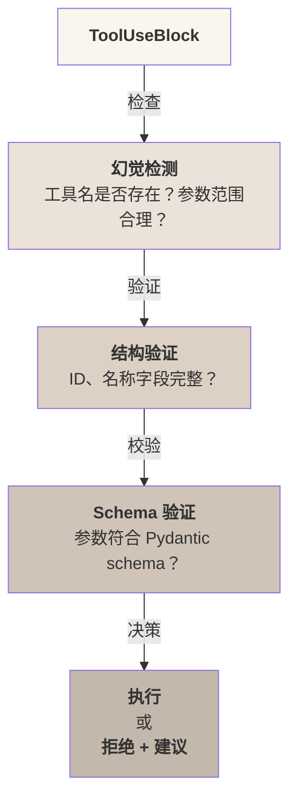

## 7.6 实战：实现 MiniHarness 输出治理层

### 7.6.1 设计目标

构建生产级的 MiniHarness 系统，整合模型抽象、输出解析、质量门控和幻觉检测。完整代码位于 `lab/mini_harness/models/`。

### 7.6.2 系统架构

User Request → [模型抽象层] → [LLM API] → [响应解析] → [幻觉检测] → [质量门控] → [工具执行] → Response

### 7.6.3 模型抽象设计

**核心思想**：“接口统一、实现可插”，支持多个 LLM 提供者。

关键设计点：

1. **BaseProvider 抽象**：定义统一接口 `complete()`、`stream()`、`complete_with_tools()`
2. **多Provider 支持**：Claude(Anthropic SDK)、OpenAI 兼容(DeepSeek、Qwen、Ollama 等)
3. **工具转换层**：自动将 MiniHarness 工具格式转换为各 Provider 的 API 格式
4. **熔断器三态**：closed（正常）→ open（故障）→ half-open（恢复测试）

```python
class BaseProvider(ABC):
    def complete(self, messages: List[Message],
                 tools: Optional[List[Dict]] = None) -> ProviderResponse:
        pass

    def stream(self, messages: List[Message],
               tools: Optional[List[Dict]] = None) -> Generator[str, None, None]:
        pass

class ClaudeProvider(BaseProvider):
    def complete(self, messages, tools=None):
        # 直接使用 Anthropic SDK，tool_use 是一等内容块
        response = self.client.messages.create(...)
        return ProviderResponse(content=..., tool_calls=[...])

class OpenAIProvider(BaseProvider):
    def complete(self, messages, tools=None):
        # 转换工具格式：MiniHarness → OpenAI function calling
        openai_tools = self._convert_tools(tools)
        response = self.client.chat.completions.create(...)
        return ProviderResponse(content=..., tool_calls=[...])
```

**熔断器实现**（半开状态需要多次成功才关闭）：

```python
class CircuitBreaker:
    def is_available(self) -> bool:
        if self.state == "closed":
            return True
        if self.state == "open":
            if time.time() - self.last_failure_time > self.reset_timeout:
                self.state = "half-open"
                return True
        return self.state == "half-open"
```

**故障转移**：

```python
class ModelSelectionEngine:
    def select_model(self) -> BaseProvider:
        for config in [self.primary] + self.fallback_chain:
            if self.breakers[config.model_id].is_available():
                return create_provider(config)
        raise Exception("所有模型不可用")
```

完整代码见：`lab/mini_harness/models/provider.py`

### 7.6.4 响应解析设计

**核心思想**：“结构化输出”，统一处理多种内容块类型。

设计要点：

1. **内容块类型**：`TextBlock`（文本）、`ToolUseBlock`（工具调用）、`ThinkingBlock`（思考过程）
2. **类型安全**：使用 dataclass 和 Union 类型标注
3. **便利方法**：`text_content()` 合并所有文本、`tool_calls()` 提取工具调用

```python
@dataclass
class TextBlock:
    type: str = "text"
    text: str = ""

@dataclass
class ToolUseBlock:
    type: str = "tool_use"
    id: str = ""
    name: str = ""
    input: dict = None

@dataclass
class ParsedMessage:
    content_blocks: List[ContentBlock]
    stop_reason: str
    tokens_used: int

    def tool_calls(self) -> List[ToolUseBlock]:
        return [b for b in self.content_blocks
                if isinstance(b, ToolUseBlock)]
```

解析逻辑：遍历原始响应块，按类型创建相应对象，JSON 字符串自动反序列化为 dict。

完整代码见：`lab/mini_harness/models/parser.py`

### 7.6.5 质量门控设计

**核心思想**：“执行前验证”，三层防线防止异常工具调用。

质量门控层次：



关键类：

```python
class QualityToolRegistry:
    def register(self, name: str, handler, schema):
        self.tools[name] = {"handler": handler, "schema": schema, "enabled": True}

    def is_tool_available(self, name: str) -> bool:
        return name in self.tools and self.tools[name]["enabled"]

class QualityGate:
    def validate_tool_call(self, tool_call: ToolUseBlock) -> ValidationReport:
        # 1. 检查 ID、名称
        # 2. 检查工具存在性 + 可用性
        # 3. 使用 pydantic 验证参数
        # 返回：PASS 或 FAIL + errors + suggestion
```

幻觉检测（模糊匹配建议）：

```python
class HallucinationDetector:
    def detect(self, tool_call: ToolUseBlock) -> List[HallucinationResult]:
        if not self.registry.is_tool_available(tool_call.name):
            suggestions = get_close_matches(
                tool_call.name, available_tools, n=1, cutoff=0.6)
            return [HallucinationResult(
                is_hallucination=True,
                confidence=0.9,
                suggestion=f"您想要 '{suggestions[0]}' 吗?"
            )]
```

完整代码见：`lab/mini_harness/models/quality.py`

### 7.6.6 集成示例

以下示例展示了如何将模型提供者、质量门控和工具注册表组合使用，完成一次带有输出校验的模型调用流程。

```python
from mini_harness.models.provider import ModelConfig, ModelProviderType
from mini_harness.models.quality import QualityToolRegistry, QualityGate

# 配置模型
config = ModelConfig(
    provider=ModelProviderType.CLAUDE,
    model_id="claude-opus-4-6",
    api_key="your-api-key"
)

# 创建工具注册表
registry = QualityToolRegistry()

class SearchInput(BaseModel):
    query: str
    max_results: int = 10

def search_handler(query: str, max_results: int = 10):
    return {"results": [...]}

registry.register("search", search_handler, SearchInput)

# 调用流程
provider = create_provider(config)
response = provider.complete(messages, tools=[...])
parsed = ResponseParser.parse_response(response)

for tool_call in parsed.tool_calls():
    validation = QualityGate(registry).validate_tool_call(tool_call)
    if validation.result == ValidationResult.PASS:
        handler = registry.tools[tool_call.name]["handler"]
        result = handler(**tool_call.input)
```

### 7.6.7 关键特性总结

| 功能 | 设计模式 | 益处 |
|------|---------|------|
| 模型抽象 | 策略模式 + 工厂模式 | 支持多 LLM，轻松切换 |
| 工具转换 | 适配器模式 | 屏蔽 API 差异 |
| 熔断器 | 状态机 | 自动故障转移 |
| 响应解析 | dataclass + Union | 类型安全、易于扩展 |
| 质量门控 | 装饰器链 | 分层验证，关注点分离 |
| 幻觉检测 | 相似度 + 范围检查 | 多角度识别模型错误 |

完整实现和更多示例见 `lab/mini_harness/` 目录。
