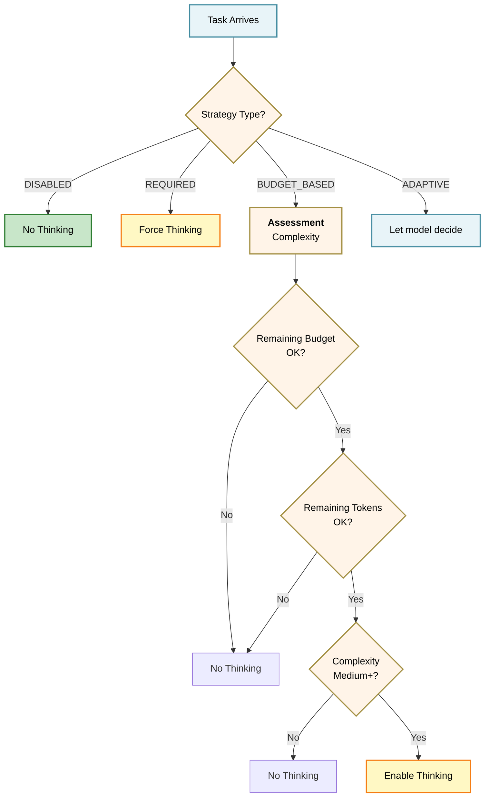
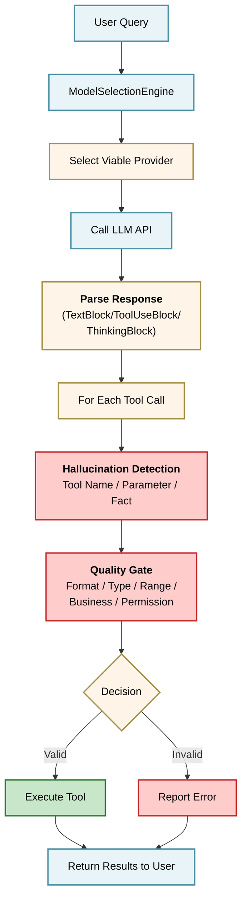

## 本章小结

**核心议题**

模型集成是智能体系统与 LLM 能力之间的关键桥梁。本章系统地探讨了如何构建一个健壮、灵活、高效的模型集成与输出治理层，使智能体能够安全地调用 LLM，并可靠地执行工具调用。

### 7.1 模型抽象层设计

**关键成果**：

1. **Provider 接口**：定义了统一的模型调用接口(complete、stream、estimate_tokens、validate_config)
2. **多模型 vs 单模型权衡**：

   - OpenClaw（多模型）：适合成本优化、供应商多元化
   - Claude Code（单模型绑定）：适合深度优化和特性集成
3. **故障转移机制**：熔断器 + 备用链路，透明切换，无感于上层应用

**架构图**(同图 7-1)：

详见第 7.1 节的模型抽象层架构设计。

### 7.2 结构化输出解析与校验

**关键成果**：

1. **类型系统**：TextBlock / ToolUseBlock / ThinkingBlock，提供类型安全的消息表示
2. **双路径解析**：

   - 非流式：一次性处理完整响应
   - 流式：增量解析，事件驱动，支持实时反馈
3. **Pydantic 校验**：在解析后立即进行参数验证

**解析管道流程**(同图 7-2)：

输出解析的关键步骤包括：解析原始API响应、构建类型安全的消息对象、验证工具调用参数。完整流程请参考第 7.2 节。

### 7.3 输出质量门控与过滤

**关键成果**：

1. **多层门控**(6 层)：

   - 格式检查：结构完整性
   - 工具存在性：注册表匹配
   - 参数类型与范围：Pydantic 校验
   - 业务规则：API 频率、文件大小等
   - 权限检查：用户授权、敏感操作
   - 注入防护：危险模式检测

2. **一票否决制**：任何一层失败即阻止执行

**门控流程图**(同图 7-3)：

详见第 7.3 节的质量门控多层验证流程设计。

### 7.4 幻觉检测与工具调用验证

**关键成果**：

1. **三层幻觉防线**：

   - Layer 1：工具名幻觉（高置信度，可纠正）
   - Layer 2：参数幻觉（范围和格式）
   - Layer 3：事实幻觉（知识库对照）

2. **自修正机制**：不是简单拒绝，而是生成纠正建议，让模型重新尝试

3. **危害量化**：

   - 工具幻觉 → 执行失败 + token 浪费
   - 参数幻觉 → 安全风险 + 数据泄露
   - 事实幻觉 → 级联失败 + 用户困惑

**检测流程图**(同图 7-4)：

详见第 7.4 节的幻觉检测三层防线设计。

### 7.5 推理预算与思考过程管理

**关键成果**：

1. **四种思考策略**：

   - DISABLED：成本最低，简单任务
   - ADAPTIVE：模型自主决策
   - BUDGET_BASED：动态权衡成本与质量
   - REQUIRED：强制深思考（关键任务）

2. **成本模型**：思考 token 与输出 token 同价（按输出价计费），大量思考仍会显著增加成本，需精细化管理

3. **质量分析**：

   - 思考比例(thinking_ratio)
   - 思考深度(shallow/moderate/deep)
   - 成本效率(quality/cost)
   - 质量指标（考虑替代方案、边界情况、约束识别）

**预算决策树**：

### 7.6 实战：MiniHarness 输出治理层

**关键成果**：

1. **完整集成**：从模型选择 → 响应解析 → 幻觉检测 → 质量门控 → 工具执行
2. **关键类**：

   - ModelSelectionEngine：故障转移
   - ResponseParser / StreamingParser：响应解析
   - HallucinationDetector：三层检测
   - QualityGate：多层验证
   - MiniHarness：主协调类

3. **可扩展性**：

   - 支持新模型接入(实现 Provider 接口)
   - 支持新工具注册(ToolRegistry)
   - 支持自定义验证规则(继承 Validator)

**完整流程图**：

#### 核心原则总结

| 原则 | 含义 | 实现 |
|------|------|------|
|**防御深度**| 多层防护，缺一不可 | 6层门控 + 3层幻觉检测 |
|**故障隔离**| 一个失败不影响全局 | 熔断器 + 备用链路 |
|**成本意识**| 推理有成本，需预算管理 | 复杂度评估 + 预算跟踪 |
|**用户友好**| 失败时提供纠正建议 | 自修正机制，不是简单拒绝 |
|**可观测性**| 完整的数据流跟踪 | token计数、幻觉日志、门控报告 |
|**灵活性**| 支持多模型和多策略 | 抽象接口、可配置规则 |

#### 与参考系统的对比

**OpenClaw**（开源智能体框架）：

- 优势：多模型支持、生态丰富
- 劣势：通用性强，某些功能定制困难
- 本章学习：模型选择、故障转移的模式

**Claude Code**（官方智能体工具）：

- 优势：Claude 特性深度集成(Extended Thinking)、高效的工具调用
- 劣势：受限于单一模型
- 本章学习：推理预算、消息规范化的最佳实践

**MiniHarness**（本章实现）：

- 目标：综合两者优势，提供教学性的、完整的参考实现
- 特点：模块化、可扩展、注重治理

#### 实战要点

1. **从模型抽象开始**：不要硬编码 API 调用，使用 Provider 接口
2. **解析要完整**：支持流式和非流式，处理所有内容块类型
3. **验证要严格**：多层检查，宁可拒绝可疑调用，也不要执行失败操作
4. **幻觉要检测**：工具名、参数、事实三层都要覆盖
5. **预算要跟踪**：定期检查 token 使用和成本，防止失控

#### 进阶方向

1. **更细的复杂度评估**：基于任务描述、参数数量、历史成功率等
2. **动态调整门控严格度**：根据用户权限等级调整
3. **跨轮对话优化**：在多轮智能体循环中智能管理上下文和推理
4. **幻觉频率监控**：识别特定任务类型中的高幻觉率，主动提升思考预算
5. **工具执行结果反馈**：让模型从工具执行失败中学习，改进提示

#### 建议的阅读路径

初学者：7.1 → 7.2 → 7.3 → 7.6 (快速上手)

系统开发者：7.1 → 7.3 → 7.4 → 7.5 → 7.6 (全流程理解)

性能优化者：7.4 → 7.5 (幻觉和成本)

架构师：7.1 + 7.3 (抽象和门控)

#### 章总结语

模型集成与输出治理是智能体系统的 **可靠性基石**。通过合理的抽象、严格的验证、智能的幻觉检测和成本预算管理，我们可以将 LLM 这种强大但不确定的工具，转化为稳定、可控的智能体能力。

本章的设计和代码示例可直接应用于生产系统，也为后续章节（多智能体协调、长期规划、学习与记忆）奠定了坚实的基础。
