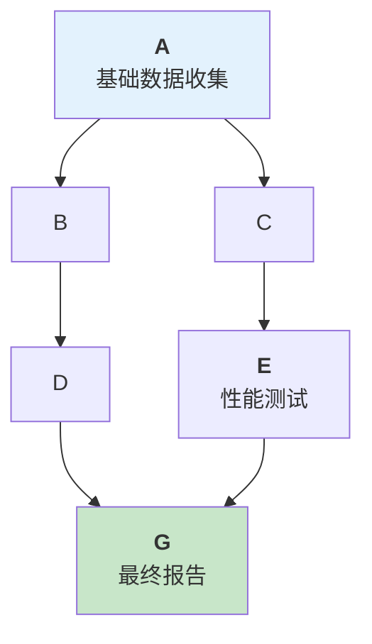
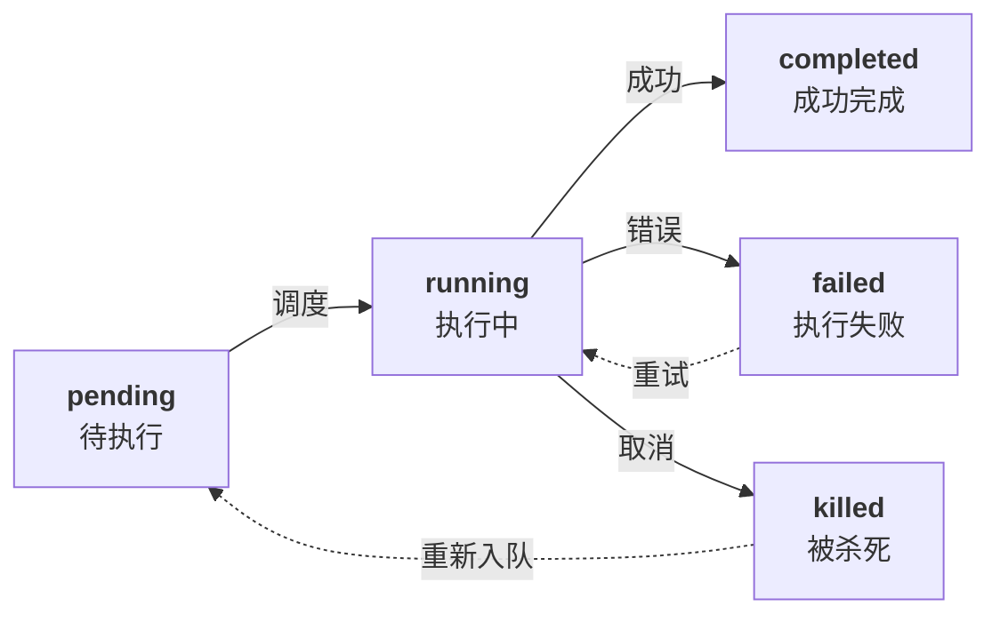
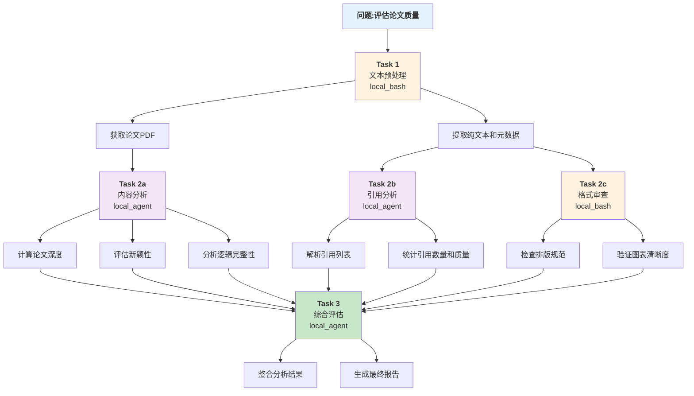

## 8.1 复杂任务分解与依赖建模

任务分解是处理复杂问题的关键能力，通过DAG模型实现任务间的依赖管理和并行执行。本节介绍Claude Code的七种Task类型、任务生命周期、依赖建模方法和粒度选择策略。

### 8.1.1 核心概念：DAG与任务图

任务分解的根本目标是将不可原子的大问题拆分为可独立执行的小任务，这些任务形成一个 **有向无环图(Directed Acyclic Graph, DAG)**。图中的节点代表任务，边代表任务间的依赖关系。



图 8-1：任务分解的DAG模型

依赖关系：A 必须在 B、C 前完成；B 必须在 D 前完成；C 必须在 E 前完成；G 必须在 D、E 都完成后执行。

DAG模型有三个关键性质：

1. **无环性**：不允许循环依赖，保证任务最终会终止
2. **拓扑排序**：存在一个执行顺序，使所有依赖都被满足
3. **并行潜力**：无直接依赖的任务可以并行执行

### 8.1.2 Claude Code的Task类型系统

Claude Code为任务分解提供了 **7种Task类型**，每种类型用于不同的执行环境和场景。其中MiniHarness框架实现了核心的四种类型，其余三种作为扩展留给读者自行实现。

#### Task类型总览

| Task类型 | 执行环境 | 适用场景 | 智能体隔离 |
|---------|--------|--------|---------|
| local_bash | 本地shell | 系统命令、文件操作 | 否 |
| local_agent | 本地Agent | 代码分析、生成 | 是 |
| remote_agent | 远程Harness | 分布式计算 | 是 |
| in_process_teammate | 内存中子Agent | 轻量级分工 | 是 |
| workflow | Lobster引擎 | 复杂工作流 | 部分 |
| monitor_mcp | MCP监听 | 长期监控任务 | 是 |
| dream | 后台异步任务 | 并发非关键路径 | 是 |

**实现状态说明**：

- **MiniHarness已实现**：`local_bash`、`local_agent`、`in_process_teammate`、`workflow` 四种类型提供了完整的本地和工作流支持
- **概念性设计/扩展**：`remote_agent`（分布式计算）、`monitor_mcp`（长期监控）、`dream`（异步后台任务）作为架构设计展示，具体实现留给读者根据需求自行实现

#### Task ID格式规范

每个Task都有一个全局唯一的ID，格式为：

```json
{parent_id}#{task_type}#{sequence}
```

例如：

- `root#local_agent#0`：根Agent下的第一个local_agent任务
- `root#local_agent#0#in_process_teammate#0`：嵌套的第一个teammate任务
- `root#workflow#2`：根Agent下的第三个workflow任务

### 8.1.3 任务生命周期

任务从创建到完成经历五个状态：



图 8-2：任务生命周期状态机

各状态含义：

1. **pending（待执行）**：任务已定义，但其依赖任务未全部完成
2. **running（执行中）**：依赖满足，任务开始执行
3. **completed（成功完成）**：任务执行成功，输出可用
4. **failed（执行失败）**：任务执行出错，决策者需决定是否重试
5. **killed（被杀死）**：人工中止或超时导致的任务终止

理解这些状态后，我们需要将复杂问题转化为可执行的任务依赖图。以下介绍如何进行系统的依赖建模，从而为并行执行和任务调度奠定基础。

### 8.1.4 依赖建模：从问题到DAG

#### 问题分析框架

给定一个复杂问题，分解为DAG的流程：

1. **识别关键决策点**：问题的哪些部分可以并行处理？
2. **提取基础任务**：能否进一步分解某个任务？
3. **定义依赖关系**：哪些任务必须在其他任务之前执行？
4. **分配Task类型**：每个任务应该用何种方式执行？

#### 实例：论文质量评估系统

假设要构建一个系统来评估学术论文的质量，需要执行以下分析：



图 8-3：论文质量评估系统的任务分解示例

#### 依赖图的编程表示

以下是任务DAG的完整Python实现：

```python
from typing import Dict, List, Set, Optional
from dataclasses import dataclass, field
from enum import Enum
import json

class TaskType(Enum):
    """7种Task类型"""
    LOCAL_BASH = "local_bash"
    LOCAL_AGENT = "local_agent"
    REMOTE_AGENT = "remote_agent"
    IN_PROCESS_TEAMMATE = "in_process_teammate"
    WORKFLOW = "workflow"
    MONITOR_MCP = "monitor_mcp"
    DREAM = "dream"

class TaskState(Enum):
    """任务生命周期状态"""
    PENDING = "pending"
    RUNNING = "running"
    COMPLETED = "completed"
    FAILED = "failed"
    KILLED = "killed"

@dataclass
class TaskDefinition:
    """任务定义"""
    task_id: str
    task_type: TaskType
    description: str
    dependencies: List[str] = field(default_factory=list)
    timeout_seconds: int = 300
    max_retries: int = 1
    execution_config: Dict = field(default_factory=dict)

    def add_dependency(self, task_id: str) -> None:
        """添加任务依赖"""
        if task_id not in self.dependencies:
            self.dependencies.append(task_id)

    def to_dict(self) -> dict:
        return {
            "task_id": self.task_id,
            "task_type": self.task_type.value,
            "description": self.description,
            "dependencies": self.dependencies,
            "timeout_seconds": self.timeout_seconds,
            "max_retries": self.max_retries,
            "execution_config": self.execution_config,
        }

class TaskDAG:
    """任务依赖图"""

    def __init__(self):
        self.tasks: Dict[str, TaskDefinition] = {}
        self.execution_order: List[str] = []

    def add_task(self, task_def: TaskDefinition) -> None:
        """添加任务定义"""
        self.tasks[task_def.task_id] = task_def

    def validate(self) -> bool:
        """验证DAG的合法性"""
        # 1. 检查所有依赖都存在
        for task_id, task in self.tasks.items():
            for dep_id in task.dependencies:
                if dep_id not in self.tasks:
                    raise ValueError(f"任务{task_id}依赖的任务{dep_id}不存在")

        # 2. 检查是否存在循环依赖
        if self._has_cycle():
            raise ValueError("检测到循环依赖")

        return True

    def _has_cycle(self) -> bool:
        """DFS检测循环依赖"""
        visited = set()
        rec_stack = set()

        def dfs(node: str) -> bool:
            visited.add(node)
            rec_stack.add(node)

            for neighbor in self.tasks[node].dependencies:
                if neighbor not in visited:
                    if dfs(neighbor):
                        return True
                elif neighbor in rec_stack:
                    return True

            rec_stack.remove(node)
            return False

        for task_id in self.tasks:
            if task_id not in visited:
                if dfs(task_id):
                    return True
        return False

    def topological_sort(self) -> List[str]:
        """拓扑排序,生成执行顺序"""
        self.validate()

        # 入度表
        in_degree = {task_id: 0 for task_id in self.tasks}
        for task in self.tasks.values():
            for dep_id in task.dependencies:
                in_degree[task.task_id] += 1

        # Kahn算法
        queue = [task_id for task_id in self.tasks if in_degree[task_id] == 0]
        order = []

        while queue:
            node = queue.pop(0)
            order.append(node)

            # 找到依赖于这个节点的所有任务
            for task_id, task in self.tasks.items():
                if node in task.dependencies:
                    in_degree[task_id] -= 1
                    if in_degree[task_id] == 0:
                        queue.append(task_id)

        self.execution_order = order
        return order

    def get_parallelizable_groups(self) -> List[List[str]]:
        """获取可并行执行的任务组"""
        # 断言:DAG必须已验证(无循环、无孤立节点)
        assert self.validate(), "DAG验证失败:存在循环或缺失依赖"
        
        self.topological_sort()
        groups = []
        completed = set()

        for task_id in self.execution_order:
            task = self.tasks[task_id]
            # 检查所有依赖是否已完成
            if all(dep in completed for dep in task.dependencies):
                # 找到可以和这个任务并行的任务
                current_group = [task_id]
                completed.add(task_id)

                for other_id in self.execution_order[len(completed):]:
                    other = self.tasks[other_id]
                    if all(dep in completed for dep in other.dependencies):
                        current_group.append(other_id)
                        completed.add(other_id)

                if current_group:
                    groups.append(current_group)
        
        # 断言:所有任务都应被分配到某个组(无孤立节点)
        total_assigned = sum(len(g) for g in groups)
        assert total_assigned == len(self.tasks), \
            f"孤立节点:已分配{total_assigned}/{len(self.tasks)}个任务"

        return groups

    def visualize(self) -> str:
        """生成Mermaid图表代码"""
        lines = ["graph TD"]

        # 添加节点
        for task_id, task in self.tasks.items():
            label = f"{task.task_id}<br/>({task.task_type.value})"
            lines.append(f'    {task_id.replace("#", "_")}["{label}"]')

        # 添加边
        for task_id, task in self.tasks.items():
            for dep_id in task.dependencies:
                lines.append(f"    {dep_id.replace('#', '_')} --> {task_id.replace('#', '_')}")

        return "\n".join(lines)

# 使用示例
if __name__ == "__main__":
    dag = TaskDAG()

    # 添加任务
    dag.add_task(TaskDefinition(
        task_id="task_0",
        task_type=TaskType.LOCAL_BASH,
        description="获取论文数据"
    ))

    dag.add_task(TaskDefinition(
        task_id="task_1",
        task_type=TaskType.LOCAL_AGENT,
        description="内容分析",
        dependencies=["task_0"]
    ))

    dag.add_task(TaskDefinition(
        task_id="task_2",
        task_type=TaskType.LOCAL_AGENT,
        description="引用分析",
        dependencies=["task_0"]
    ))

    dag.add_task(TaskDefinition(
        task_id="task_3",
        task_type=TaskType.LOCAL_AGENT,
        description="综合评估",
        dependencies=["task_1", "task_2"]
    ))

    # 验证和排序
    order = dag.topological_sort()
    print("执行顺序:", order)

    # 获取并行组
    groups = dag.get_parallelizable_groups()
    print("并行组:", groups)

    # 生成可视化
    print(dag.visualize())
```

DAG的构建和可视化为我们提供了清晰的任务执行流程。然而，在实际应用中还有多个关键的设计决策需要做出，这些决策直接影响系统的效率和可维护性。

### 8.1.5 关键设计决策

#### 1. 粒度选择

任务粒度太粗导致无法充分并行化，太细导致调度开销大。一般规则：

- **建议粒度**：单个Task的预期执行时间在10秒到10分钟间
- **太粗**：当某个任务的部分可以与其他任务并行时
- **太细**：当多个Task的总执行时间小于调度开销时

#### 2. 依赖vs控制流

明确区分：

- **数据依赖**：后续任务需要前序任务的输出
- **控制流依赖**：后续任务需要前序任务完成但不需要其输出

这影响任务间的通信设计。

#### 3. 容错策略

为每个Task定义：

- **max_retries**：最多重试次数（默认1）
- **timeout_seconds**：超时时间（默认300秒）
- **on_failure**：失败策略(fail-fast vs continue)

### 8.1.6 本小节小结

任务分解的核心是建立DAG模型，利用Claude Code的7种Task类型适配不同执行环境。通过拓扑排序和并行组分析，我们能够同时实现任务的顺序性保证和并行效率。下一节将讨论如何用状态机实现更复杂的工作流逻辑。
