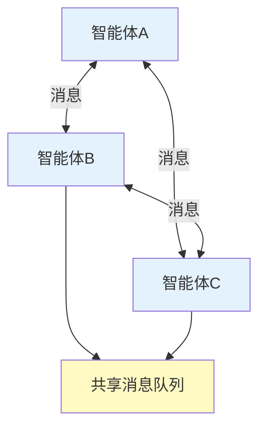
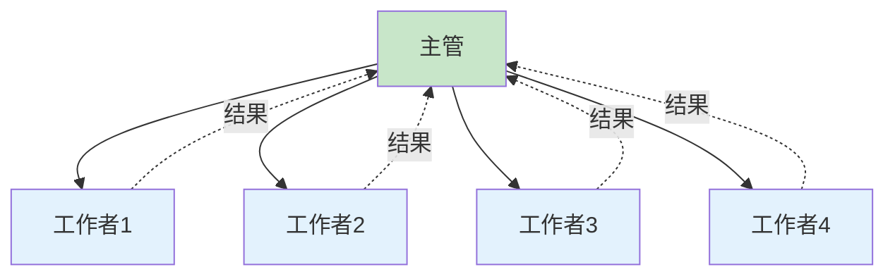
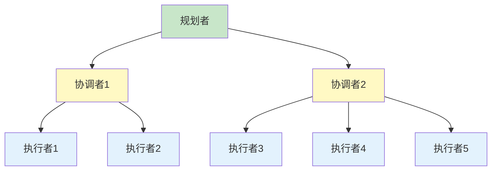
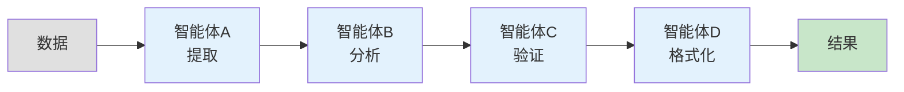
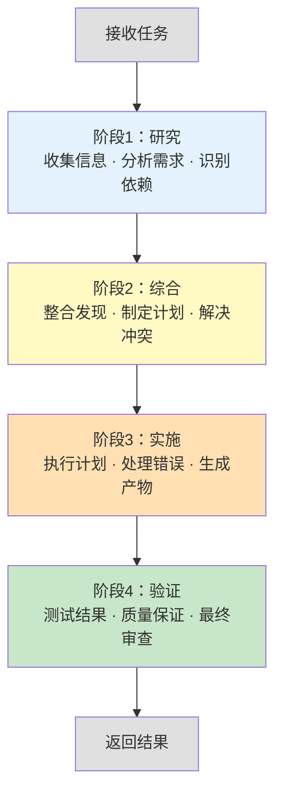

## 8.3 多智能体编排架构

**多智能体协调的四种模式**

当单个智能体的能力不足以完成复杂任务时，需要多个智能体协同工作。根据智能体间的组织关系和通信方式，可以分为四种主要模式。

### 8.3.1 网络模式

各智能体平等地进行点对点通信，每个智能体可以直接与其他智能体通信。



图8-3：网络模式的多智能体架构

**特点**：

- 优点：高度自治，无单点故障
- 缺点：复杂的通信协议，难以维护全局一致性

**适用场景**：

- 多个独立的专家智能体进行学术讨论
- 去中心化的决策系统
- 点对点的协作任务

### 8.3.2 主管模式

一个主管智能体负责任务分配和结果汇总，其他智能体执行具体任务。


图8-4：主管模式的多智能体架构

**特点**：

- 优点：集中控制，易于维护一致性，清晰的任务分配
- 缺点：主管成为瓶颈，不够灵活

**适用场景**：

- 明确的任务分工
- 需要严格质量控制
- 存在依赖任务

### 8.3.3 层级模式

多层级的智能体组织，上层负责规划，逐层向下分解和执行。


图8-5：层级模式的多智能体架构

**特点**：

- 优点：支持复杂的任务分解，可扩展性强
- 缺点：通信延迟大，实现复杂

**适用场景**：

- 大规模任务（多于5个Worker）
- 明确的任务结构
- 需要逐层优化

### 8.3.4 并行模式

多个智能体按流水线方式处理数据，每个智能体负责一个处理阶段。


图8-6：并行模式（Pipeline）的多智能体架构

**特点**：

- 优点：高吞吐量，易于扩展
- 缺点：严格的执行顺序，难以回溯

**适用场景**：

- 流式数据处理
- ETL（抽取-转换-加载）管道
- 多步骤的验证流程

### 8.3.5 Claude Code的Coordinator模式详解

Claude Code实现了一种特殊的多智能体协调方式：**Coordinator模式**，这是主管模式的一个优化变体，特别适合知识工作者型任务。

#### Coordinator的四阶段结构

Coordinator使用标准化的四阶段处理流程：


图8-7：Claude Code Coordinator 四阶段执行流程

#### 各阶段详解

**Stage 1: Research（研究）**

- 目标：充分理解问题
- 操作：
  - 调用信息检索工具
  - 分析问题约束和假设
  - 列举可能的解决方案
  - 识别关键决策点
```python
# Research阶段的示例工作流
research_prompt = """
分析这个问题，提供：
1. 问题的三个关键方面
2. 所需的五个信息片段
3. 两个主要的技术约束
4. 推荐的三种可能方案
"""
```

**Stage 2: Synthesis（综合）**

- 目标：整合Research的结果，制定执行计划
- 操作：
  - 评估各方案的权衡
  - 选择最优方案
  - 分解成具体步骤
  - 预测潜在风险
```python
# Synthesis阶段：方案选择和规划
synthesis_prompt = """
根据Research结果，请：
1. 比较各方案的优缺点
2. 选择最优方案并说明理由
3. 制定详细的执行计划（包括5个关键步骤）
4. 标识潜在的3个风险点和应对策略
"""
```

**Stage 3: Implementation（实现）**

- 目标：按计划执行
- 操作：
  - 调用工具执行计划中的操作
  - 处理执行中的异常
  - 记录关键决策点
  - 动态调整计划（如有需要）
```python
# Implementation阶段：实际执行
implementation_prompt = """
按照Synthesis阶段的计划执行：
1. 执行第一个步骤（具体说明）
2. 检查结果是否符合预期
3. 如果有偏差，调整后续步骤
4. 继续执行，直到完成
"""
```

**Stage 4: Verification（验证）**

- 目标：确保结果符合要求
- 操作：
  - 测试结果的正确性
  - 对比初始需求
  - 进行质量检查
  - 生成最终报告
```python
# Verification阶段：结果验证
verification_prompt = """
验证Implementation的结果：
1. 检查是否满足初始需求的5个条件
2. 运行质量检查清单（至少3项）
3. 对比任何已知的标准答案
4. 提供最终评分和改进建议
"""
```

#### 上下文隔离：AsyncLocalStorage

多个智能体之间需要上下文隔离，避免污染。Claude Code使用 **AsyncLocalStorage** 机制：
```python
from typing import Dict, Any, Optional
import asyncio
from contextvars import ContextVar

# 创建上下文变量
_agent_context: ContextVar[Optional[Dict[str, Any]]] = ContextVar(
    'agent_context',
    default=None
)

class AgentContext:
    """智能体执行上下文"""

    def __init__(self, agent_id: str, parent_context: Optional[Dict[str, Any]] = None):
        self.agent_id = agent_id
        self.variables: Dict[str, Any] = {}
        self.execution_log: list = []

        # 继承部分父上下文（只读）
        if parent_context:
            self.parent_context = parent_context.copy()
        else:
            self.parent_context = {}

    def get(self, key: str, default: Any = None) -> Any:
        """获取变量，先查本地再查父上下文"""
        if key in self.variables:
            return self.variables[key]
        return self.parent_context.get(key, default)

    def set(self, key: str, value: Any) -> None:
        """设置变量（仅在本地）"""
        self.variables[key] = value

    def log(self, message: str, level: str = "info") -> None:
        """记录日志"""
        self.execution_log.append({
            "timestamp": asyncio.get_event_loop().time(),
            "level": level,
            "message": message,
        })

    def __enter__(self):
        """进入上下文"""
        self.token = _agent_context.set(self)
        return self

    def __exit__(self, exc_type, exc_val, exc_tb):
        """退出上下文"""
        _agent_context.reset(self.token)


class SubAgent:
    """子智能体"""

    def __init__(self, agent_id: str, coordinator: 'Coordinator'):
        self.agent_id = agent_id
        self.coordinator = coordinator

    async def execute(self, task: str) -> Dict[str, Any]:
        """执行任务，在隔离的上下文中运行"""
        parent_ctx = _agent_context.get()

        # 创建子智能体的隔离上下文
        with AgentContext(self.agent_id, parent_ctx.variables if parent_ctx else None) as ctx:
            ctx.log(f"开始执行: {task}")

            # 执行具体工作
            result = await self._do_work(task)

            ctx.log(f"完成执行: {result}")
            return {
                "agent_id": self.agent_id,
                "result": result,
                "logs": ctx.execution_log,
            }

    async def _do_work(self, task: str) -> Any:
        """具体工作实现"""
        # 这里应该调用LLM或其他服务
        await asyncio.sleep(0.1)  # 模拟异步操作
        return {"status": "completed", "task": task}


class Coordinator:
    """协调器"""

    def __init__(self):
        self.stages = ["research", "synthesis", "implementation", "verification"]
        self.agents: Dict[str, SubAgent] = {}

    async def coordinate(self, task: str) -> Dict[str, Any]:
        """协调多个智能体完成任务"""
        with AgentContext("coordinator", {}) as ctx:
            results = {}

            for stage in self.stages:
                ctx.log(f"进入阶段: {stage}")

                # 为每个阶段创建或获取智能体
                agent = self._get_agent_for_stage(stage)

                # 执行阶段任务
                stage_task = f"{stage}: {task}"
                stage_result = await agent.execute(stage_task)

                results[stage] = stage_result
                ctx.log(f"完成阶段: {stage}")

            return {
                "coordinator_logs": ctx.execution_log,
                "stage_results": results,
            }

    def _get_agent_for_stage(self, stage: str) -> SubAgent:
        """获取特定阶段的智能体"""
        if stage not in self.agents:
            self.agents[stage] = SubAgent(f"agent_{stage}", self)
        return self.agents[stage]


# 使用示例
async def main():
    coordinator = Coordinator()
    result = await coordinator.coordinate(
        "设计一个推荐系统的架构"
    )
    print(f"最终结果: {result}")

# asyncio.run(main())
```

**多智能体系统的通信最佳实践**

**消息传递vs共享内存**

**消息传递（推荐）**：

- 优点：解耦，易于分布式
- 缺点：延迟高

**共享内存**：

- 优点：低延迟
- 缺点：需要同步机制，难以分布式

一般选择消息传递作为智能体间的通信方式。

### 8.3.6 OpenClaw的子智能体与广播组

OpenClaw支持创建子智能体和广播组进行复杂的多智能体协调：
```yaml
## OpenClaw中的多智能体定义
agents:
  research_agent:
    type: subagent
    max_concurrent: 3

  expert_group:
    type: broadcast_group
    agents:
      - expert_legal
      - expert_technical
      - expert_business
    aggregation: consensus

## 调用子智能体
transitions:
  - from: state_a
    to: state_b
    action: spawn_subagent
    agent: research_agent
    data: "{{ context.research_data }}"
    timeout: 300

## 广播到专家组
transitions:
  - from: state_b
    to: state_c
    action: broadcast
    group: expert_group
    message: "{{ context.proposal }}"
    aggregation_method: majority_vote
```

### 8.3.7 本小节小结

多智能体编排的选择取决于具体场景。Claude Code的Coordinator模式特别适合知识密集型任务，通过Research→Synthesis→Implementation→Verification四阶段实现系统化的问题解决。AsyncLocalStorage机制确保了上下文隔离，避免智能体间的干扰。下一节将讨论智能体间的通信协议设计。
