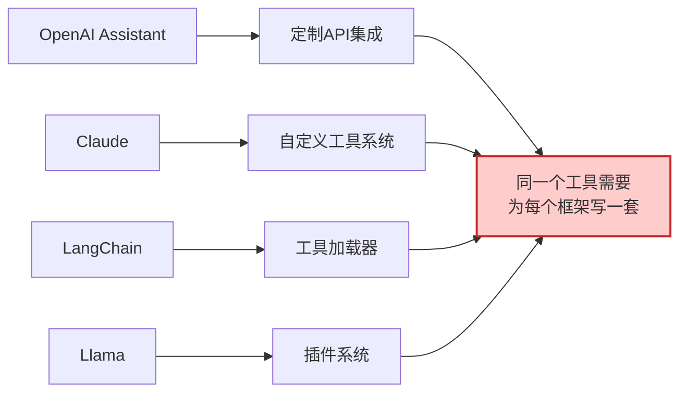
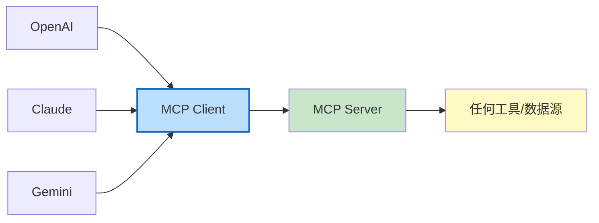
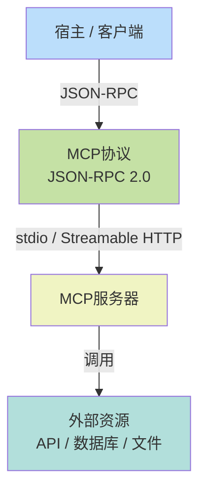
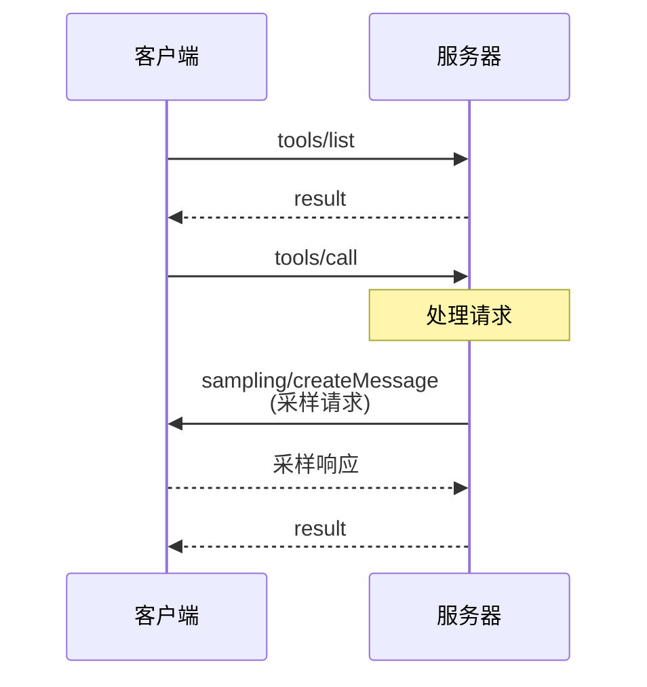

## 9.1 MCP协议架构与设计哲学

MCP（Model Context Protocol）已成为行业标准，定义了智能体与工具/数据服务的通信方式。本节介绍MCP的核心架构、三种原语（Tools、Resources、Prompts）、双向通信机制和设计哲学。

### 9.1.1 MCP是什么

**Model Context Protocol（MCP）** 是一个开放标准，定义了AI Agent（客户端）与工具/数据服务器之间的通信方式。其核心思想是：

> 通过统一的协议，让任何智能体框架都能访问任何符合MCP标准的工具和数据源，无需特殊集成。

### 9.1.2 为什么MCP成为行业标准

#### 1. 解决了碎片化问题

**MCP前的情况**：


**MCP后的情况**：


#### 2. 降低了集成成本

对于工具开发者：

- 写一次MCP Server实现，所有框架都能用
- 利用开源MCP SDK加速开发

对于框架使用者：

- 统一的工具发现机制
- 统一的权限和审计日志
- 更容易的版本管理

#### 3. 支持分布式架构

MCP支持本地和远程两种部署：

- **本地**：MCP Server和智能体在同一机器，通过stdio通信
- **远程**：MCP Server在不同机器，通过Streamable HTTP通信

这支持了从个人PC到企业级云部署的全场景。

#### MCP的核心架构

**Client/Server模型**


图 9-1：MCP 协议架构 —— Host 通过 JSON-RPC 与 MCP Server 通信访问外部资源

**关键特性**：

1. **异步双向通信**：Client和Server都可以主动发起请求
2. **JSON-RPC 2.0**：所有消息基于JSON-RPC 2.0标准
3. **灵活的传输**：支持多种传输方式
4. **版本协商**：Protocol version和实现版本独立

#### 三种原语

MCP定义了三类主要的交互原语，满足99%的应用场景。

##### 1. Tools

Tool是可调用的函数，类似于函数调用或API endpoint。

**定义格式**（JSON Schema）：
```json
{
  "name": "fetch_weather",
  "description": "Get current weather for a location",
  "inputSchema": {
    "type": "object",
    "properties": {
      "location": {
        "type": "string",
        "description": "City name or coordinate"
      },
      "unit": {
        "type": "string",
        "enum": ["celsius", "fahrenheit"],
        "description": "Temperature unit"
      }
    },
    "required": ["location"]
  }
}
```

**调用方式**：
```python
# Client 请求
{
  "jsonrpc": "2.0",
  "id": 1,
  "method": "tools/call",
  "params": {
    "name": "fetch_weather",
    "arguments": {
      "location": "Beijing",
      "unit": "celsius"
    }
  }
}

# Server 响应
{
  "jsonrpc": "2.0",
  "id": 1,
  "result": {
    "content": [
      {
        "type": "text",
        "text": "Current weather in Beijing: 15°C, Partly cloudy"
      }
    ]
  }
}
```

**适用场景**：

- 数据检索（weather、search、database query）
- 数据修改（create、update、delete）
- 业务流程（send email、create task、approve request）
- 计算密集（math computation、format conversion）

##### 2. Resources

Resource代表可以读取的数据或内容。不同于Tools的是，Resources通常是数据而非操作。

**定义格式**：
```json
{
  "uri": "file:///documents/report.md",
  "name": "Q1 Sales Report",
  "description": "Quarterly sales performance report",
  "mimeType": "text/markdown"
}
```

**查询方式**：
```python
# Client 请求列出资源
{
  "jsonrpc": "2.0",
  "id": 2,
  "method": "resources/list",
  "params": {}
}

# Server 响应
{
  "jsonrpc": "2.0",
  "id": 2,
  "result": {
    "resources": [
      {
        "uri": "file:///docs/readme.md",
        "name": "README",
        "mimeType": "text/markdown"
      }
    ]
  }
}

# Client 请求资源内容
{
  "jsonrpc": "2.0",
  "id": 3,
  "method": "resources/read",
  "params": {
    "uri": "file:///docs/readme.md"
  }
}

# Server 响应
{
  "jsonrpc": "2.0",
  "id": 3,
  "result": {
    "contents": [
      {
        "uri": "file:///docs/readme.md",
        "mimeType": "text/markdown",
        "text": "# README\n..."
      }
    ]
  }
}
```

**适用场景**：

- 文件系统（目录、文档、代码）
- 数据库内容（表、行、schema）
- 配置文件（参数、密钥、规则）
- 知识库（文章、手册、文档）
- Web内容（网页、API响应）

**Resource URI规范**：

- `file:///path/to/file` - 本地文件
- `db://database_name/table_name/row_id` - 数据库记录
- `http://example.com/api/resource` - Web资源
- 自定义scheme - `notion://page_id`, `slack://channel_id`等

##### 3. Prompts

Prompt是预定义的提示词模板，可以参数化。

**定义格式**：
```json
{
  "name": "code_review_template",
  "description": "Template for reviewing code changes",
  "arguments": [
    {
      "name": "language",
      "description": "Programming language",
      "required": true
    },
    {
      "name": "focus_areas",
      "description": "Areas to focus on in review",
      "required": false
    }
  ]
}
```

**查询和使用**：
```python
# Client 请求Prompt列表
{
  "jsonrpc": "2.0",
  "id": 4,
  "method": "prompts/list",
  "params": {}
}

# Server 响应
{
  "jsonrpc": "2.0",
  "id": 4,
  "result": {
    "prompts": [
      {
        "name": "code_review_template",
        "description": "Template for reviewing code changes",
        "arguments": [
          {"name": "language", "required": true},
          {"name": "focus_areas", "required": false}
        ]
      }
    ]
  }
}

# Client 请求特定Prompt的内容
{
  "jsonrpc": "2.0",
  "id": 5,
  "method": "prompts/get",
  "params": {
    "name": "code_review_template",
    "arguments": {
      "language": "Python",
      "focus_areas": "security,performance"
    }
  }
}

# Server 响应
{
  "jsonrpc": "2.0",
  "id": 5,
  "result": {
    "messages": [
      {
        "role": "user",
        "content": {
          "type": "text",
          "text": "Please review this Python code for security and performance issues:\n..."
        }
      }
    ]
  }
}
```

**适用场景**：

- 专业领域的标准提示词（代码审查、文档生成、翻译）
- 参数化的工作流提示（带有用户输入）
- 多轮对话的上下文模板
- 最佳实践提示词库

#### MCP协议的双向性

MCP不仅支持Client主动请求，Server也可以向Client发起请求。


图 9-2：MCP 双向通信 —— 支持 Client 请求和 Server 反向请求

**双向请求的用途**：

1. **Sampling**：Server需要LLM进行推理或决策
   ```json
   {
     "jsonrpc": "2.0",
     "id": 10,
     "method": "sampling/createMessage",
     "params": {
       "messages": [{"role": "user", "content": "Should we approve this request?"}],
       "model": "claude-opus",
       "maxTokens": 100
     }
   }
   ```

2. **Logging/Notifications**：Server向Client汇报状态
   ```json
   {
     "jsonrpc": "2.0",
     "id": 11,
     "method": "logging/message",
     "params": {
       "level": "info",
       "logger": "tool_execution",
       "message": "Tool executed successfully"
     }
   }
   ```

#### 协议的设计哲学

##### 1. 极简主义

MCP只定义了三个原语，这三个原语能覆盖99%的用例。不追求完全的功能集，而是关注最常见的场景。

**权衡**：

- 优点：易学易用，快速集成
- 缺点：某些特殊场景可能需要创意性的使用

##### 2. Schema为中心

所有Tool、Resource、Prompt都通过JSON Schema定义。这使得：

- Client无需特殊代码就能调用新工具
- Schema可以被缓存以优化性能
- 支持运行时发现

##### 3. 无强约束

MCP定义了基本协议，但在具体实现上给了很大自由度：

- 传输方式可选（stdio、Streamable HTTP等）
- 认证方式由Server决定
- 数据格式灵活

##### 4. 流式能力

支持大型数据的流式传输：
```python
# 文件内容可以流式返回
{
  "jsonrpc": "2.0",
  "id": 20,
  "result": {
    "contents": [
      {
        "uri": "file:///large_file.bin",
        "mimeType": "application/octet-stream",
        "blob": "..." # 或流式返回多个块
      }
    ]
  }
}
```

#### 对比其他工具标准

##### MCP vs 传统API

| 特性 | MCP | 传统API |
|------|-----|--------|
| Schema定义 | JSON Schema，自动发现 | Swagger/OpenAPI，需手写 |
| 集成难度 | 低，通用Client | 高，逐个集成 |
| Tools发现 | 运行时动态发现 | 需要事先了解 |
| 传输灵活性 | stdio/Streamable HTTP都支持 | 通常只支持HTTP |
| 双向通信 | 原生支持 | 需要长连接或WebSocket |

##### MCP vs LangChain工具

| 特性 | MCP | LangChain |
|------|-----|----------|
| 标准化 | 行业标准 | 框架专属 |
| 互操作性 | 跨框架 | LangChain内部 |
| 学习曲线 | 平缓 | 陡峭 |
| 社区生态 | 快速成长 | 成熟 |

#### MCP 2026年路线图

根据Anthropic发布的规划：

1. **Streamable HTTP**（已标准化，2025年3月）

   - 替代HTTP+SSE的新标准传输方式
   - 支持大型文件和流式数据
   - 双向流和改进的错误恢复

2. **智能体间通信标准**（Q2 2026）

   - 智能体可以相互调用（目前智能体间无标准）
   - 支持工作流编排

3. **企业治理**（Q3 2026）

   - 审计日志标准化
   - SSO（单点登录）集成指南
   - 网关代理最佳实践

4. **动态权限**（Q4 2026）

   - Server可以请求更多权限
   - Client可以撤销权限
   - 基于使用历史的权限建议

#### MCP 生态现状与演进方向

MCP 已从协议提案发展为行业事实标准。MCP SDK（Python + TypeScript）月下载量已达 **9700 万次**，生态系统涵盖数千个预构建 Server。

2026 年路线图聚焦四个方向：

1. **传输层演进**：Streamable HTTP 已替代 SSE 成为推荐的 HTTP 传输方式（详见 9.2 节），支持双向通信和更灵活的连接管理
2. **A2A 通信**：与 Google 的 Agent-to-Agent 协议对接，支持跨智能体的工具共享和任务委派
3. **治理成熟化**：MCP 已移交至 Linux 基金会下的 AAIF（Agentic AI Foundation）统一治理，确保协议的中立性和开放性
4. **企业就绪**：增强认证、授权、审计能力，满足企业级部署需求

正在推进的关键特性包括：Tasks 原语（SEP-1686）的重试和过期策略、多媒体内容支持（图片、视频、音频），以及更完善的 Server 发现与注册机制。

#### 本小节小结

MCP通过极简的设计（三个原语）、灵活的传输、强大的Schema支持，解决了Agent工具集成的碎片化问题。其Client/Server的双向通信模型和基于JSON-RPC的实现，使其成为了自然而然的行业标准。

在后续章节中，我们将深入探讨传输层的选择、Server的实现、以及Harness框架中的集成模式。
