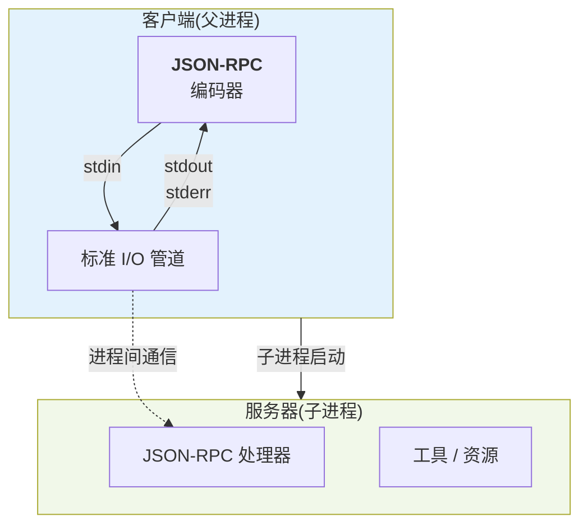
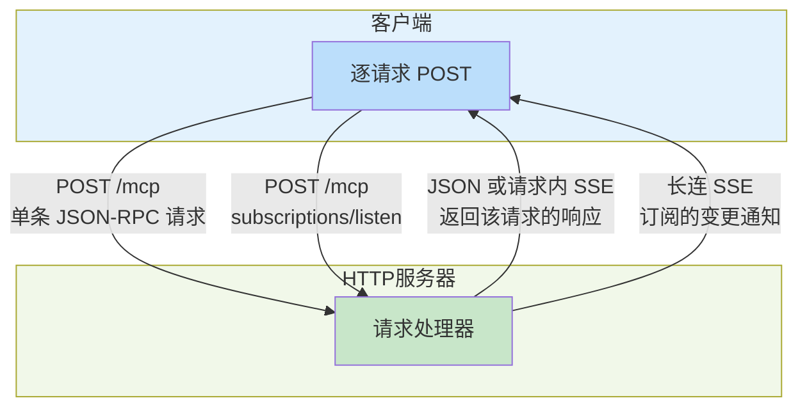

## 9.2 传输层：stdio 与 Streamable HTTP

MCP是协议层的规范，但消息需要通过某种传输方式在Client和Server间流通。传输层的选择影响性能、可靠性和部署方式。

当前 MCP 规范定义的标准传输是 **stdio** 与 **Streamable HTTP**。旧版 HTTP+SSE 属于历史兼容路径，不应再作为与 Streamable HTTP 并列的第三种标准传输来介绍。

### 9.2.1 stdio - 本地进程间通信

**工作原理**：

- Client启动Server进程作为子进程
- 通过stdin向Server发送JSON-RPC消息（每行一个）
- 通过stdout从Server读取JSON-RPC消息（每行一个）
- 通过stderr接收Server的日志和错误



图 9-1：stdio 传输架构 —— 通过标准 I/O 进行本地进程间通信

**特点**：

| 特性 | 说明 |
|------|------|
| 架构 | 本地进程间通信 |
| 延迟 | 最低(<1ms) |
| 实现 | 最简单 |
| 部署 | 仅支持本地 |
| 扩展性 | 单Client单Server |
| 容错 | Server崩溃需要重启Client |

**stdio 不等于会话**：进程一直开着，并不意味着 Server 可以把上一次请求的状态带到下一次。2026-07-28 修订版要求 Server 不得从同一连接上的历史请求推断状态；需要跨请求保留的状态，必须表达为一个显式标识符，由 Client 每次显式传入。下面的 stdio 客户端示例按当前修订版 **2026-07-28** 编写：没有握手，协议版本与客户端能力随每个请求的 `_meta` 传入，并可用 `server/discover` 一次性发现对端能力——在 stdio 上它同时是判断对端讲新版还是旧版的探针。

**实现示例**：

```python
import json
import subprocess
from typing import Any, Callable, Dict, Optional

PROTOCOL_VERSION = "2026-07-28"
META_VERSION = "io.modelcontextprotocol/protocolVersion"
META_CAPABILITIES = "io.modelcontextprotocol/clientCapabilities"
META_CLIENT_INFO = "io.modelcontextprotocol/clientInfo"
META_LOG_LEVEL = "io.modelcontextprotocol/logLevel"
META_SERVER_INFO = "io.modelcontextprotocol/serverInfo"


class StdioMCPClient:
    """基于stdio的MCP客户端（2026-07-28 无状态模型）

    没有 initialize 握手，每个请求自带完整信封。子进程可以活很久，
    但它不是会话：Server 不得从同一管道上的历史请求推断任何状态。
    """

    def __init__(self, server_path: str, server_args: list = None):
        """启动MCP Server进程"""
        self.server_path = server_path
        self.server_args = server_args or []
        self.process: Optional[subprocess.Popen] = None
        self.request_id = 0
        # 仅客户端侧的本地缓存，属于优化，不构成协议状态
        self.server_info: Optional[Dict[str, Any]] = None

    def start(self) -> None:
        """启动Server进程。stderr 不重定向，Server 日志直接透传到父进程，
        免得管道写满后把子进程堵死"""
        self.process = subprocess.Popen(
            [self.server_path] + self.server_args,
            stdin=subprocess.PIPE,
            stdout=subprocess.PIPE,
            text=True,
            bufsize=1,  # 行缓冲
        )

    def _envelope(self, log_level: Optional[str] = None) -> Dict[str, Any]:
        """构造无状态请求信封。前两个键是必需的，逐请求重复携带是设计而非冗余；
        stdio 上没有 HTTP 头可用，信封只能落在 params._meta 里"""
        meta: Dict[str, Any] = {
            META_VERSION: PROTOCOL_VERSION,
            META_CAPABILITIES: {},
            META_CLIENT_INFO: {"name": "stdio-example", "version": "0.1.0"},
        }
        if log_level:
            # 日志级别也逐请求携带，取代已移除的 logging/setLevel
            meta[META_LOG_LEVEL] = log_level
        return meta

    def send_request(
        self,
        method: str,
        params: Dict[str, Any] = None,
        log_level: str = None,
        on_notification: Callable[[Dict[str, Any]], None] = None,
    ) -> Dict[str, Any]:
        """发送JSON-RPC请求并等待响应"""
        if not self.process:
            raise RuntimeError("Server not started")

        self.request_id += 1
        request_id = self.request_id

        # 每个请求都要注入信封；调用方自带的 _meta（如 progressToken）优先保留
        payload = dict(params or {})
        payload["_meta"] = {**self._envelope(log_level), **payload.get("_meta", {})}
        request = {
            "jsonrpc": "2.0",
            "id": request_id,
            "method": method,
            "params": payload,
        }

        # 写入请求
        self.process.stdin.write(json.dumps(request) + "\n")
        self.process.stdin.flush()

        # 读取响应：stdout 上会混进属于本请求的通知（进度、日志），
        # 必须读到同 id 的那条响应才算收工
        while True:
            response_line = self.process.stdout.readline()
            if not response_line:
                raise RuntimeError("Server closed connection")
            message = json.loads(response_line)
            if message.get("id") == request_id:
                # Server 在每个结果的 _meta 里回带 serverInfo，取代握手时的一次性自述
                meta = (message.get("result") or {}).get("_meta") or {}
                if META_SERVER_INFO in meta:
                    self.server_info = meta[META_SERVER_INFO]
                return message
            if "method" in message and "id" not in message:
                if on_notification:
                    on_notification(message)
                continue
            # 既不是本请求的响应，也不是通知。2026-07-28 的 Server 不会在这里反向
            # 发起请求：要客户端补输入时改走 MRTR，即在响应里返回 input_required
            raise RuntimeError(f"Unexpected message: {message}")

    def send_notification(self, method: str, params: Dict[str, Any] = None) -> None:
        """发送JSON-RPC通知，不等待响应"""
        if not self.process:
            raise RuntimeError("Server not started")
        notification = {"jsonrpc": "2.0", "method": method}
        if params:
            notification["params"] = params
        self.process.stdin.write(json.dumps(notification) + "\n")
        self.process.stdin.flush()

    def cancel(self, request_id: int, reason: str = "") -> None:
        """取消在途请求。HTTP 上关掉 SSE 流就是取消信号，
        stdio 上没有流可关，只能显式发 notifications/cancelled"""
        self.send_notification(
            "notifications/cancelled",
            {"requestId": request_id, "reason": reason},
        )

    def _unwrap(self, response: Dict[str, Any]) -> Dict[str, Any]:
        """取出 result，JSON-RPC 错误直接抛出"""
        if "error" in response:
            error = response["error"]
            raise RuntimeError(f"JSON-RPC error {error['code']}: {error['message']}")
        return response["result"]

    def discover(self) -> Optional[Dict[str, Any]]:
        """探测Server，一次拿到 supportedVersions 与 capabilities

        stdio 上它同时是判断对端新旧的探针：只讲握手协议的 Server 不认识这个方法，
        会回 -32601，此时返回 None，由调用方决定是否退回 2025-11-25 兼容路径。
        """
        response = self.send_request("server/discover")
        error = response.get("error")
        if error:
            if error.get("code") == -32601:
                return None
            raise RuntimeError(f"discover failed: {error}")
        return response["result"]

    def list_tools(self) -> Dict[str, Any]:
        """列出工具。结果自带 cacheScope/ttlMs，缓存放在客户端，Server 依然无状态"""
        return self._unwrap(self.send_request("tools/list"))

    def call_tool(
        self,
        tool_name: str,
        arguments: Dict[str, Any],
        progress_token: str = None,
        log_level: str = None,
        on_notification: Callable[[Dict[str, Any]], None] = None,
    ) -> Dict[str, Any]:
        """调用工具"""
        params: Dict[str, Any] = {
            "name": tool_name,
            "arguments": arguments,
        }
        if progress_token:
            # 进度这类请求内通知只走本请求的往返，不需要常驻订阅
            params["_meta"] = {"progressToken": progress_token}
        return self._unwrap(
            self.send_request(
                "tools/call",
                params,
                log_level=log_level,
                on_notification=on_notification,
            )
        )

    def close(self) -> None:
        """关闭连接"""
        if self.process:
            self.process.terminate()
            self.process.wait()

    def __enter__(self):
        self.start()
        return self

    def __exit__(self, exc_type, exc_val, exc_tb):
        self.close()

# stdio传输使用示例
if __name__ == "__main__":
    with StdioMCPClient("/path/to/mcp_server") as client:
        # 先探测：拿到能力清单，同时确认对端讲的是无状态版本
        info = client.discover()
        if info is None:
            raise SystemExit("对端仍在握手时代，需退回 2025-11-25 兼容路径")
        print("supportedVersions:", info["supportedVersions"])
        print("serverInfo:", client.server_info)

        # 列出可用工具：每个请求各自完备，不依赖上一次请求留下的痕迹
        listed = client.list_tools()
        print("tools:", [tool["name"] for tool in listed["tools"]])
        print("cache:", listed.get("cacheScope"), listed.get("ttlMs"))

        # 调用工具，顺带接收只属于这个请求的进度通知
        result = client.call_tool(
            "add",
            {"a": 2, "b": 3},
            progress_token="call-1",
            log_level="info",
            on_notification=lambda n: print("  notify:", n["method"], n["params"]),
        )
        print("resultType:", result["resultType"], "content:", result["content"])
```

**何时使用**：

- 本地开发和测试
- 单机应用
- 工具的快速原型
- 性能最优的场景（<100ms延迟要求）

**限制**：

- 只能本地部署
- Server崩溃需要重启Client
- 不支持多Client访问同一Server
- 网络分区完全不适用

### 9.2.2 Streamable HTTP - 双向HTTP流传输

**工作原理**：

- Server 是一个 HTTP 服务器，只暴露单一 MCP 端点，且只接受 POST；每条 JSON-RPC 消息都是一次独立的 POST
- Client 的 `Accept` 必须同时列出 `application/json` 与 `text/event-stream`
- 每个请求必须带 `MCP-Protocol-Version`（其值必须与 `params._meta` 中的协议版本一致，否则返回 `-32020` HeaderMismatch 与 HTTP 400）和 `Mcp-Method`（等于 method）；`tools/call`、`resources/read`、`prompts/get` 还必须带 `Mcp-Name`（等于 `params.name` 或 `params.uri`）
- Server 对一个请求的响应，要么是 `application/json` 单个对象，要么是仅作用于该请求的 `text/event-stream` 流：流上先送该请求相关的通知，最后送响应。Server 不得在这条流上发送独立的 JSON-RPC 请求
- 长期的变更通知不再靠常驻连接推送，而是由 Client POST `subscriptions/listen`，其响应本身就是一条长连 SSE，只承载客户端订阅的通知类型；进度、日志一类请求内通知不走这条流
- 关闭 SSE 响应流，就是 HTTP 上的取消信号
- 2026-07-28 版删除了 GET 流端点、协议级会话（`Mcp-Session-Id` 及其 DELETE 终止）与基于 `Last-Event-ID` 的断点续传
- 与旧版本共存：现实中大量服务器仍只说 2025-11-25，GET 流端点、`Mcp-Session-Id` 会话与 `Last-Event-ID` 续传在那一版仍然有效。Client 应先按新版发一个请求做探测：若收到 HTTP 400，就检查响应体——是可识别的新版 JSON-RPC 错误，说明对方是新版服务器，按错误修正后重试；响应体为空或无法识别，则退回 `initialize` 握手走旧版。反过来，只支持 2026-07-28 的服务器对该端点上的 GET/DELETE 应返回 `405 Method Not Allowed`，并忽略 `Mcp-Session-Id` 与 `Last-Event-ID`



图 9-2：Streamable HTTP 传输架构 —— 单一 POST 端点，响应可为 JSON 或请求内 SSE

**特点**：

| 特性 | 说明 |
|------|------|
| 架构 | 单一 POST 端点，响应可为 JSON 或 SSE |
| 延迟 | 低(<100ms) |
| 实现 | 中等复杂度 |
| 部署 | 网络部署 |
| 扩展性 | 单Server多Client |
| 容错 | 请求无状态，失败可直接重发 |

**实现示例**：

```python
import aiohttp
import json
import asyncio
from typing import Dict, Any, List, Optional, AsyncIterator

PROTOCOL_VERSION = "2026-07-28"

# 无状态请求信封的保留键，全部放在 params._meta 里
PROTOCOL_VERSION_KEY = "io.modelcontextprotocol/protocolVersion"
CLIENT_CAPABILITIES_KEY = "io.modelcontextprotocol/clientCapabilities"
CLIENT_INFO_KEY = "io.modelcontextprotocol/clientInfo"
SERVER_INFO_KEY = "io.modelcontextprotocol/serverInfo"
SUBSCRIPTION_ID_KEY = "io.modelcontextprotocol/subscriptionId"

# 需要额外携带 Mcp-Name 头的方法 → 该值所在的参数名
NAME_BEARING_METHODS = {
    "tools/call": "name",
    "prompts/get": "name",
    "resources/read": "uri",
}

PARSE_ERROR = -32700
INVALID_REQUEST = -32600
METHOD_NOT_FOUND = -32601
INVALID_PARAMS = -32602
HEADER_MISMATCH = -32020
UNSUPPORTED_PROTOCOL_VERSION = -32022

# JSON-RPC错误码到HTTP状态的映射表，两端读同一张表
ERROR_HTTP_STATUS = {
    PARSE_ERROR: 400,
    INVALID_REQUEST: 400,
    INVALID_PARAMS: 400,
    HEADER_MISMATCH: 400,
    UNSUPPORTED_PROTOCOL_VERSION: 400,
    METHOD_NOT_FOUND: 404,
}


class MCPRequestError(RuntimeError):
    """服务端返回的JSON-RPC错误"""

    def __init__(self, code: int, message: str, data: Any = None):
        super().__init__(f"[{code}] {message}")
        self.code = code
        self.message = message
        self.data = data


class StreamableHttpMCPClient:
    """基于Streamable HTTP的MCP客户端"""

    def __init__(self, server_url: str):
        self.server_url = server_url.rstrip('/')
        self.request_id = 0
        self.session: Optional[aiohttp.ClientSession] = None
        self.client_info = {"name": "streamable-http-example", "version": "0.1.0"}
        self.client_capabilities: Dict[str, Any] = {}

    def _envelope(self, params: Optional[Dict[str, Any]]) -> Dict[str, Any]:
        """把请求信封写进 params._meta。没有握手，所以每个请求都要自带版本与能力。"""
        params = dict(params or {})
        meta = dict(params.get("_meta") or {})
        meta[PROTOCOL_VERSION_KEY] = PROTOCOL_VERSION
        meta[CLIENT_CAPABILITIES_KEY] = self.client_capabilities
        # clientInfo 是可选键，规范建议带上，服务端只当作展示信息
        meta[CLIENT_INFO_KEY] = self.client_info
        params["_meta"] = meta
        return params

    def _headers(self, method: str, params: Dict[str, Any]) -> Dict[str, str]:
        """Accept必须同时列出两种类型；三个MCP头让中间层无需解析body就能路由。"""
        headers = {
            "Accept": "application/json, text/event-stream",
            "Content-Type": "application/json",
            # 这个头的值必须与 _meta 里的协议版本完全一致
            "MCP-Protocol-Version": PROTOCOL_VERSION,
            "Mcp-Method": method,
        }
        name_key = NAME_BEARING_METHODS.get(method)
        if name_key is not None and isinstance(params.get(name_key), str):
            headers["Mcp-Name"] = params[name_key]
        return headers

    async def connect(self) -> None:
        """只准备HTTP连接池；没有initialize，第一个请求就是正常业务请求。"""
        self.session = aiohttp.ClientSession()

    def _build_request(self, method: str, params: Optional[Dict[str, Any]]) -> Dict[str, Any]:
        """构造一条带信封的JSON-RPC请求"""
        self.request_id += 1
        return {
            "jsonrpc": "2.0",
            "id": self.request_id,
            "method": method,
            "params": self._envelope(params),
        }

    @staticmethod
    def _unwrap(message: Dict[str, Any]) -> Dict[str, Any]:
        """取出result；错误响应连同HTTP 4xx一起抛成MCPRequestError。"""
        if "error" in message:
            error = message["error"]
            raise MCPRequestError(error.get("code"), error.get("message", ""), error.get("data"))
        return message.get("result", {})

    @staticmethod
    async def _iter_sse(resp: aiohttp.ClientResponse) -> AsyncIterator[Dict[str, Any]]:
        """把SSE流切成JSON-RPC消息；以冒号开头的注释行是保活心跳，直接丢弃。"""
        data_lines: List[str] = []
        async for raw_line in resp.content:
            line = raw_line.decode("utf-8").rstrip("\r\n")
            if not line:
                if data_lines:
                    yield json.loads("\n".join(data_lines))
                    data_lines = []
                continue
            if line.startswith(":"):
                continue
            field, _, value = line.partition(":")
            if field == "data":
                data_lines.append(value.removeprefix(" "))

    async def send_request(
        self, method: str, params: Dict[str, Any] = None, timeout: float = 30
    ) -> Dict[str, Any]:
        """一条JSON-RPC请求就是一次独立POST，请求之间不共享任何服务端状态。"""
        request = self._build_request(method, params)
        async with self.session.post(
            f"{self.server_url}/mcp",
            json=request,
            headers=self._headers(method, request["params"]),
            timeout=aiohttp.ClientTimeout(total=timeout),
        ) as resp:
            if resp.content_type == "text/event-stream":
                # 请求内SSE：流上先送本请求的进度、日志通知，最后一帧才是响应。
                # 这条流只服务这一个请求，提前关闭它就是取消信号。
                async for message in self._iter_sse(resp):
                    if message.get("id") == request["id"]:
                        return self._unwrap(message)
                    self.on_notification(message)
                raise MCPRequestError(INVALID_REQUEST, f"{method} 的响应流提前结束")
            if resp.content_type != "application/json":
                # 响应体无法识别成JSON-RPC，才是回落到旧版initialize握手的信号
                raise MCPRequestError(
                    INVALID_REQUEST, f"HTTP {resp.status}: {(await resp.text())[:120]}"
                )
            # 4xx的body同样是JSON-RPC错误对象：缺信封400/-32602、
            # 版本不支持400/-32022、未知方法404/-32601
            return self._unwrap(await resp.json())

    def on_notification(self, message: Dict[str, Any]) -> None:
        """请求内通知的处理钩子，子类覆盖它即可"""
        print(f"Notification: {message.get('method')}")

    async def listen(
        self,
        tools_list_changed: bool = False,
        prompts_list_changed: bool = False,
        resources_list_changed: bool = False,
        resource_subscriptions: Optional[List[str]] = None,
    ) -> AsyncIterator[Dict[str, Any]]:
        """订阅长期变更通知：POST subscriptions/listen，它的响应本身就是一条长连SSE。

        流上第一帧是确认，之后是订阅到的变更通知，服务端优雅关闭时以本请求的响应收尾。
        没有退订方法，跳出循环让流关闭就是退订。
        """
        notifications: Dict[str, Any] = {}
        if tools_list_changed:
            notifications["toolsListChanged"] = True
        if prompts_list_changed:
            notifications["promptsListChanged"] = True
        if resources_list_changed:
            notifications["resourcesListChanged"] = True
        if resource_subscriptions:
            notifications["resourceSubscriptions"] = list(resource_subscriptions)

        request = self._build_request("subscriptions/listen", {"notifications": notifications})
        async with self.session.post(
            f"{self.server_url}/mcp",
            json=request,
            headers=self._headers("subscriptions/listen", request["params"]),
            # 长连流不能设总超时，否则订阅会被客户端自己掐断
            timeout=aiohttp.ClientTimeout(total=None, sock_read=None),
        ) as resp:
            if resp.content_type != "text/event-stream":
                self._unwrap(await resp.json())
                raise MCPRequestError(INVALID_REQUEST, "subscriptions/listen 的响应不是SSE流")
            async for message in self._iter_sse(resp):
                if message.get("id") == request["id"]:
                    return  # 服务端优雅关闭
                yield message

    async def call_tool(self, tool_name: str, arguments: Dict[str, Any]) -> Dict[str, Any]:
        """调用工具"""
        return await self.send_request(
            "tools/call",
            {"name": tool_name, "arguments": arguments}
        )

    async def close(self) -> None:
        """关闭连接"""
        if self.session:
            await self.session.close()

    async def __aenter__(self):
        await self.connect()
        return self

    async def __aexit__(self, exc_type, exc_val, exc_tb):
        await self.close()

# Server端实现示例
from aiohttp import web
import asyncio

class StreamableHttpMCPServer:
    """基于Streamable HTTP的MCP服务器"""

    SUPPORTED_VERSIONS = [PROTOCOL_VERSION]

    # 变更通知方法 → 订阅过滤器里的开关名
    FILTER_KEYS = {
        "notifications/tools/list_changed": "toolsListChanged",
        "notifications/prompts/list_changed": "promptsListChanged",
        "notifications/resources/list_changed": "resourcesListChanged",
    }

    def __init__(
        self,
        host: str = "127.0.0.1",
        port: int = 8000,
        bearer_token: Optional[str] = None,
        allowed_origins: Optional[set] = None,
    ):
        self.host = host
        self.port = port
        self.bearer_token = bearer_token
        self.allowed_origins = allowed_origins or {"http://localhost:8000"}
        self.subscribers: List[Dict[str, Any]] = []  # 打开着的listen流
        self.tools = {}
        self.server_info = {"name": "streamable-http-example-server", "version": "0.1.0"}

    def register_tool(self, name: str, handler, description: str = "", input_schema: Dict = None):
        """注册工具"""
        self.tools[name] = {
            "handler": handler,
            "description": description,
            "inputSchema": input_schema or {"type": "object", "properties": {}},
        }

    def _check_security(self, request) -> Optional[web.Response]:
        """校验Origin和认证；本地开发也不应默认暴露到0.0.0.0。"""
        origin = request.headers.get("Origin")
        if origin and origin not in self.allowed_origins:
            return web.Response(status=403, text="Origin not allowed")
        if self.bearer_token:
            expected = f"Bearer {self.bearer_token}"
            if request.headers.get("Authorization") != expected:
                return web.Response(status=401, text="Unauthorized")
        return None

    def _stamp(self, result: Dict[str, Any]) -> Dict[str, Any]:
        """在每个结果的 _meta 里回serverInfo：没有握手，身份只能靠它带回去。"""
        meta = dict(result.get("_meta") or {})
        meta.setdefault(SERVER_INFO_KEY, self.server_info)
        return {**result, "_meta": meta}

    def _error_response(
        self, request_id: Any, code: int, message: str, data: Any = None
    ) -> web.Response:
        """错误码决定HTTP状态，body仍是完整的JSON-RPC错误对象"""
        error: Dict[str, Any] = {"code": code, "message": message}
        if data is not None:
            error["data"] = data
        return web.json_response(
            {"jsonrpc": "2.0", "id": request_id, "error": error},
            status=ERROR_HTTP_STATUS.get(code, 200),
        )

    def _classify(self, method: str, params: Any, headers) -> Optional[tuple]:
        """信封与三个MCP头的校验阶梯，第一个不通过的就是结论。"""
        meta = params.get("_meta") if isinstance(params, dict) else None
        if not isinstance(meta, dict):
            return (
                INVALID_PARAMS,
                "params._meta must be an object carrying the required "
                f"{PROTOCOL_VERSION_KEY!r} and {CLIENT_CAPABILITIES_KEY!r} envelope keys",
                None,
            )
        missing = [k for k in (PROTOCOL_VERSION_KEY, CLIENT_CAPABILITIES_KEY) if k not in meta]
        if missing:
            return (
                INVALID_PARAMS,
                "params._meta is missing the required envelope key(s): " + ", ".join(missing),
                None,
            )
        version = meta[PROTOCOL_VERSION_KEY]
        # 头里的版本先决定走哪个时代的传输路径，所以它必须与信封里的版本一致
        if headers.get("MCP-Protocol-Version") != version:
            return (
                HEADER_MISMATCH,
                "MCP-Protocol-Version header does not match the envelope's protocol version",
                None,
            )
        if headers.get("Mcp-Method") != method:
            return (HEADER_MISMATCH, "Mcp-Method header does not match the body's method", None)
        name_key = NAME_BEARING_METHODS.get(method)
        if name_key is not None:
            body_value = params.get(name_key)
            if body_value is not None and headers.get("Mcp-Name") != body_value:
                return (
                    HEADER_MISMATCH,
                    f"Mcp-Name header does not match the body's {name_key!r} parameter",
                    None,
                )
        if version not in self.SUPPORTED_VERSIONS:
            return (
                UNSUPPORTED_PROTOCOL_VERSION,
                "Unsupported protocol version",
                {"supported": list(self.SUPPORTED_VERSIONS), "requested": version},
            )
        return None

    async def handle_mcp(self, request):
        """单端点只收POST；Mcp-Session-Id与Last-Event-ID一律忽略，本版已无会话与续传。"""
        if request.method != "POST":
            # GET流端点与DELETE终会话都已删除；规范建议回405并带上Allow
            return web.Response(status=405, headers={"Allow": "POST"})

        security_error = self._check_security(request)
        if security_error:
            return security_error

        accept = request.headers.get("Accept", "")
        if "application/json" not in accept or "text/event-stream" not in accept:
            return web.Response(status=406, text="Accept must include JSON and SSE")

        try:
            data = await request.json()
        except Exception:
            return self._error_response(None, PARSE_ERROR, "Parse error")

        # 本版HTTP传输上没有客户端到服务端的通知（取消靠关闭响应流），只收单个请求对象
        if not isinstance(data, dict) or data.get("id") is None or not isinstance(data.get("method"), str):
            return self._error_response(
                None, INVALID_REQUEST, "Body must be a single JSON-RPC request object"
            )

        request_id = data["id"]
        method = data["method"]
        params = data.get("params")
        rejection = self._classify(method, params, request.headers)
        if rejection is not None:
            return self._error_response(request_id, *rejection)

        if method == "subscriptions/listen":
            return await self._handle_listen(request, request_id, params)

        try:
            result = await self._process_request(method, params)
        except MCPRequestError as exc:
            return self._error_response(request_id, exc.code, exc.message, exc.data)
        return web.json_response(
            {"jsonrpc": "2.0", "id": request_id, "result": self._stamp(result)}
        )

    @staticmethod
    async def _write_event(resp: web.StreamResponse, message: Dict[str, Any]) -> None:
        """写一帧SSE"""
        body = json.dumps(message, ensure_ascii=False)
        await resp.write(f"event: message\r\ndata: {body}\r\n\r\n".encode())

    def _matches(self, subscriber: Dict[str, Any], method: str, params: Dict[str, Any]) -> bool:
        """只投递客户端确实订阅过的通知类型"""
        key = self.FILTER_KEYS.get(method)
        if key is not None:
            return subscriber["honored"].get(key) is True
        if method == "notifications/resources/updated":
            return (params or {}).get("uri") in subscriber["uris"]
        return False

    async def publish(self, method: str, params: Dict[str, Any] = None) -> None:
        """把一条变更通知投递给所有订阅了它的listen流"""
        for subscriber in list(self.subscribers):
            if self._matches(subscriber, method, params):
                subscriber["queue"].put_nowait(
                    {"jsonrpc": "2.0", "method": method, "params": dict(params or {})}
                )

    def close_subscriptions(self) -> None:
        """优雅关闭所有listen流，让客户端知道流是主动结束而不是掉线"""
        for subscriber in list(self.subscribers):
            subscriber["queue"].put_nowait(None)

    async def _handle_listen(self, request, request_id: Any, params: Dict[str, Any]):
        """subscriptions/listen的响应就是那条长连SSE，取代了已删除的GET流端点。"""
        requested = params.get("notifications") or {}
        honored = {key: True for key in self.FILTER_KEYS.values() if requested.get(key)}
        uris = list(requested.get("resourceSubscriptions") or [])
        if uris:
            honored["resourceSubscriptions"] = uris
        stream_meta = {SUBSCRIPTION_ID_KEY: request_id}

        resp = web.StreamResponse(
            status=200,
            headers={
                "Content-Type": "text/event-stream",
                "Cache-Control": "no-cache, no-transform",
                "X-Accel-Buffering": "no",
            },
        )
        await resp.prepare(request)

        subscriber = {"honored": honored, "uris": uris, "queue": asyncio.Queue()}
        self.subscribers.append(subscriber)
        try:
            # 确认帧必须是流上的第一帧，它回报服务端实际认下的订阅子集
            await self._write_event(resp, {
                "jsonrpc": "2.0",
                "method": "notifications/subscriptions/acknowledged",
                "params": {"notifications": honored, "_meta": stream_meta},
            })
            while True:
                try:
                    event = await asyncio.wait_for(subscriber["queue"].get(), timeout=15)
                except asyncio.TimeoutError:
                    await resp.write(b": ping\r\n\r\n")  # 保活，绕开代理的空闲超时
                    continue
                if event is None:
                    break
                event["params"] = {**event.get("params", {}), "_meta": stream_meta}
                await self._write_event(resp, event)
            # 优雅关闭：最后一帧是本请求的响应
            await self._write_event(resp, {
                "jsonrpc": "2.0",
                "id": request_id,
                "result": self._stamp({"resultType": "complete"}),
            })
        except ConnectionResetError:
            pass  # 客户端关掉了响应流，这就是取消信号，不必重连也不必补发
        finally:
            self.subscribers.remove(subscriber)
        return resp

    async def _process_request(self, method: str, params: Dict) -> Dict[str, Any]:
        """处理请求（具体业务逻辑）"""
        if method == "server/discover":
            # 取代initialize的能力探测：只读、可缓存、可被任意请求先行发起
            return {
                "resultType": "complete",
                "supportedVersions": list(self.SUPPORTED_VERSIONS),
                "capabilities": {"tools": {"listChanged": True}},
                "ttlMs": 60000,
                "cacheScope": "public",
            }
        elif method == "tools/list":
            return {
                "resultType": "complete",
                "ttlMs": 60000,
                "cacheScope": "public",
                "tools": [
                    {
                        "name": name,
                        "description": metadata["description"],
                        "inputSchema": metadata["inputSchema"],
                    }
                    for name, metadata in self.tools.items()
                ]
            }
        elif method == "tools/call":
            tool_name = params.get("name")
            arguments = params.get("arguments") or {}
            if tool_name not in self.tools:
                raise MCPRequestError(INVALID_PARAMS, f"Unknown tool: {tool_name}")
            result = await self.tools[tool_name]["handler"](arguments)
            return {"resultType": "complete", **result}
        # 未知方法是404，不是400：客户端据此判断对方根本没有这个能力
        raise MCPRequestError(METHOD_NOT_FOUND, f"Method not found: {method}")

    async def start(self):
        """启动服务器"""
        app = web.Application()
        # 单一端点，且只有POST是合法方法
        app.router.add_route("*", "/mcp", self.handle_mcp)

        runner = web.AppRunner(app)
        await runner.setup()
        site = web.TCPSite(runner, self.host, self.port)
        await site.start()
        print(f"Streamable HTTP MCP Server started at http://{self.host}:{self.port}/mcp")
        return runner

# Streamable HTTP传输使用示例
async def main():
    async with StreamableHttpMCPClient("http://127.0.0.1:8000") as client:
        # 没有握手，第一个请求就是探测：确认对方支持哪些协议版本
        discovered = await client.send_request("server/discover")
        print("Supported versions:", discovered["supportedVersions"])
        listing = await client.send_request("tools/list")
        print("Tools:", [tool["name"] for tool in listing["tools"]])
        print("Result:", await client.call_tool("add", {"a": 1, "b": 2}))
```

**何时使用**：

- 网络部署（Client和Server在不同机器）
- 多Client访问同一Server
- Server需要高可用（可以前置负载均衡器）
- 支持跨机房部署
- 大文件和流式数据传输

**优点**：

- 灵活的部署架构
- 请求无状态，天然适配多副本部署与负载均衡
- 统一的端点，简化配置
- 支持大型文件流式传输
- 标准HTTP，易于代理和监控

**缺点**：

- 实现复杂度中等
- 每个请求都要重复携带元数据

#### 向后兼容：与仍在使用 initialize 握手的旧版 Server 互通

无状态模型是 2026-07-28 版才引入的，而线上大量 Server 仍然只会说 2025-11-25：先发 `initialize` 请求、再发 `notifications/initialized` 通知，随后用 `Mcp-Session-Id` 维持会话。规范本身给出了互通规则，客户端需要同时能走这两条路。

**HTTP 上的探测顺序**：先按新版发一个正常请求；如果返回 HTTP 400，就检查响应体——能识别出现代 JSON-RPC 错误码（如 `-32020`、`-32022`、`-32602`）说明对方就是新版 Server，按错误纠正后重试；只有响应体为空或无法识别时，才回落到 `initialize` 握手，按旧版流程继续。

**stdio 上的探测**：把 `server/discover` 当作探针，能正常返回就按无状态模型继续，否则回落到 `initialize`。

**只支持新版的 Server 面对旧流量**：端点上的 GET 与 DELETE 应返回 `405 Method Not Allowed`，忽略请求里的 `Mcp-Session-Id`，忽略 `Last-Event-ID`。

**旧 HTTP+SSE 传输（2024-11-05）已进入废弃期，但不是被删除**：规范承诺至少 12 个月的过渡窗口，这期间它仍然可用。新实现一律用 Streamable HTTP，存量实现按窗口期迁移即可，不必紧急下线。

不同的传输方式各有其优缺点，选择合适的传输协议对系统的整体性能和部署成本有重大影响。本节介绍了如何根据具体的网络部署场景做出传输层决策，以及连接管理的最佳实践。

### 9.2.3 传输层选择决策与连接管理

#### 传输方式的选择决策

传输方式的选择决策过程如下：


图 9-3：传输方式选择决策树 —— 根据部署需求选择合适的传输方式

#### 连接管理与池化

无论采用哪种传输方式，都需要考虑连接的管理和复用。

**stdio情况下的连接管理：**

stdio传输方式的连接管理实现如下：

```python
class StdioConnectionPool:
    """stdio连接池"""

    def __init__(self, max_connections: int = 10):
        self.max_connections = max_connections
        self.connections = {}
        self.lock = asyncio.Lock()

    async def get_connection(self, server_path: str) -> StdioMCPClient:
        """获取连接(如果没有则创建)"""
        async with self.lock:
            if server_path not in self.connections:
                if len(self.connections) >= self.max_connections:
                    # 关闭最少使用的连接
                    oldest = min(
                        self.connections.items(),
                        key=lambda x: x[1]['last_used']
                    )
                    oldest[1]['client'].close()
                    del self.connections[oldest[0]]

                client = StdioMCPClient(server_path)
                client.start()
                self.connections[server_path] = {
                    'client': client,
                    'last_used': asyncio.get_running_loop().time(),
                }

            return self.connections[server_path]['client']

    async def release_connection(self, server_path: str) -> None:
        """释放连接(更新使用时间)"""
        async with self.lock:
            if server_path in self.connections:
                self.connections[server_path]['last_used'] = asyncio.get_running_loop().time()
```

**HTTP情况下的连接管理：** HTTP传输方式的连接管理实现如下：

```python
class HttpConnectionPool:
    """HTTP连接池(使用aiohttp的连接池)"""

    def __init__(self, max_connections: int = 100):
        self.connector = aiohttp.TCPConnector(
            limit=max_connections,
            limit_per_host=10,
        )
        self.session = aiohttp.ClientSession(connector=self.connector)

    async def get_client(self, server_url: str) -> StreamableHttpMCPClient:
        """获取HTTP客户端"""
        return StreamableHttpMCPClient(server_url)

    async def close(self) -> None:
        """关闭所有连接"""
        await self.session.close()
```

**OAuth认证流程：** 在 HTTP 传输中，现代 MCP Server 不应假设固定的 `/oauth/authorize` / `/oauth/token` 路径。客户端应先处理 Server 返回的 `401` 与 `WWW-Authenticate` 挑战，读取 OAuth Protected Resource Metadata，再发现授权服务器元数据，并在令牌请求中带上 `resource` 参数。另外，在 2026-07-28 修订版中，OAuth 2.0 动态客户端注册（DCR）进入至少 12 个月的弃用期（仍然可用，但新实现不建议采用），官方建议改用 Client ID Metadata Documents 标识客户端。

```python
class OAuthMCPClient:
    """按 MCP 授权规范发现端点的 HTTP MCP 客户端骨架"""

    def __init__(self, server_url: str, client_id: str):
        self.server_url = server_url
        self.client_id = client_id
        self.access_token = None
        self.session = None

    async def discover_authorization(self) -> dict:
        """从 401 challenge / protected-resource metadata 发现授权服务器"""
        challenge = await self.fetch_www_authenticate_challenge()
        resource_metadata = await self.fetch_protected_resource_metadata(challenge)
        return await self.fetch_authorization_server_metadata(resource_metadata)

    async def authenticate(self, requested_scopes: Optional[list[str]] = None) -> None:
        """执行 OAuth 授权码 + PKCE 流程(默认按资源元数据公布的scope申请)"""
        metadata = await self.discover_authorization()
        if requested_scopes is None:
            requested_scopes = metadata.get("scopes_supported", [])
        resource = self.server_url

        auth_params = {
            "client_id": self.client_id,
            "response_type": "code",
            "redirect_uri": "http://localhost:8080/callback",
            "scope": " ".join(requested_scopes),
            "resource": resource,
            "code_challenge": "...",
            "code_challenge_method": "S256",
        }

        # 浏览器跳转到 metadata["authorization_endpoint"]，拿到授权码后换 token
        token_data = {
            "grant_type": "authorization_code",
            "code": "...",
            "client_id": self.client_id,
            "code_verifier": "...",
            "resource": resource,
        }

        async with aiohttp.ClientSession() as session:
            async with session.post(metadata["token_endpoint"], data=token_data) as resp:
                token_response = await resp.json()
                self.access_token = token_response["access_token"]

        self.session = aiohttp.ClientSession(
            headers={"Authorization": f"Bearer {self.access_token}"}
        )

    async def send_request(self, method: str, params: Dict[str, Any]) -> Dict[str, Any]:
        """发送认证的请求"""
        if not self.access_token:
            await self.authenticate()

        request = {
            "jsonrpc": "2.0",
            "id": 1,
            "method": method,
            "params": params,
        }

        async with self.session.post(
            f"{self.server_url}/mcp",
            json=request,
        ) as resp:
            return await resp.json()
```

### 9.2.4 本小节小结

传输层的选择是设计MCP集成架构的关键决策。stdio提供最高性能但不支持网络部署，Streamable HTTP是网络部署的推荐方案：单一端点、逐请求 POST，响应可以是 JSON，也可以是该请求专属的 SSE 流。

关键要点：

- 本地/单机 → stdio
- 网络/多Client → Streamable HTTP
- 两种传输都已没有握手：协议版本与客户端能力随每个请求放在 `params._meta` 里
- Streamable HTTP 只接受 POST，请求必带 `MCP-Protocol-Version` 与 `Mcp-Method`，`tools/call`、`resources/read`、`prompts/get` 还要带 `Mcp-Name`
- 长期变更通知走 `subscriptions/listen`；`Mcp-Session-Id` 与 `Last-Event-ID` 已被删除
- SSE 是 Streamable HTTP 的流式响应格式之一；旧 HTTP+SSE 传输处于废弃期，仍可用但不应新采用
- 总是考虑连接池复用
- HTTP环境中实现OAuth认证

下一节将深入MCP Server的实现。
