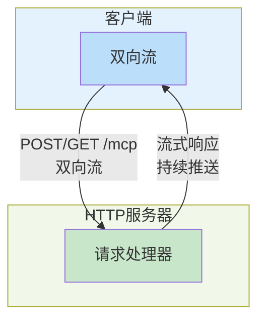
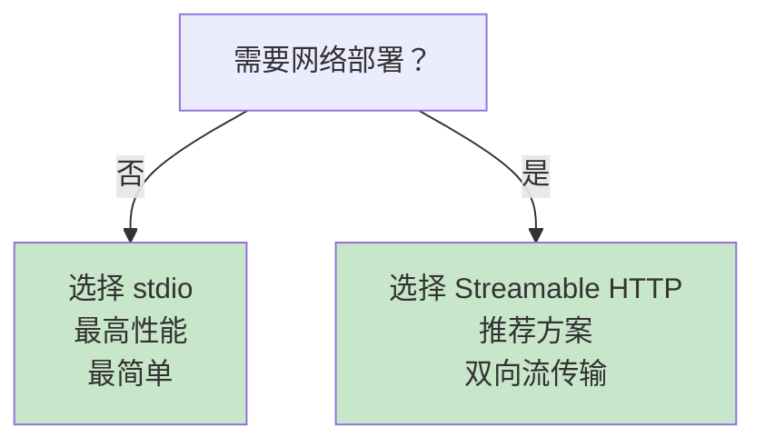

## 9.2 传输层：stdio、HTTP与Streamable HTTP

MCP是协议层的规范，但消息需要通过某种传输方式在Client和Server间流通。传输层的选择影响性能、可靠性和部署方式。

**三种传输方式对比**

### 9.2.1 stdio

**工作原理**：

- Client启动Server进程作为子进程
- 通过stdin向Server发送JSON-RPC消息（每行一个）
- 通过stdout从Server读取JSON-RPC消息（每行一个）
- 通过stderr接收Server的日志和错误

```mermaid
graph TB
    subgraph Client["客户端（父进程）"]
        direction LR
        A["JSON-RPC<br/>编码器"]
        A -->|stdin| PIPES[""]
        PIPES -->|stdout<br/>stderr| A
    end

    subgraph Server["服务器（子进程）"]
        direction LR
        B["JSON-RPC 处理器"]
        C["工具 / 资源"]
    end

    Client -->|子进程启动| Server
    PIPES -.->|进程间通信| B

    style Client fill:#e3f2fd
    style Server fill:#f1f8e9
```

图 9-3：stdio 传输架构 —— 通过标准 I/O 进行本地进程间通信

**特点**：

| 特性 | 说明 |
|------|------|
| 架构 | 本地进程间通信 |
| 延迟 | 最低（<1ms） |
| 实现 | 最简单 |
| 部署 | 仅支持本地 |
| 扩展性 | 单Client单Server |
| 容错 | Server崩溃需要重启Client |

**实现示例**：
```python
import subprocess
import json
import sys
from typing import Dict, Any, Optional

class StdioMCPClient:
    """基于stdio的MCP客户端"""

    def __init__(self, server_path: str, server_args: list = None):
        """启动MCP Server进程"""
        self.server_path = server_path
        self.server_args = server_args or []
        self.process: Optional[subprocess.Popen] = None
        self.request_id = 0

    def start(self) -> None:
        """启动Server进程"""
        self.process = subprocess.Popen(
            [self.server_path] + self.server_args,
            stdin=subprocess.PIPE,
            stdout=subprocess.PIPE,
            stderr=subprocess.PIPE,
            text=True,
            bufsize=1,  # 行缓冲
        )

    def send_request(
        self, method: str, params: Dict[str, Any] = None
    ) -> Dict[str, Any]:
        """发送JSON-RPC请求并等待响应"""
        if not self.process:
            raise RuntimeError("Server not started")

        self.request_id += 1
        request = {
            "jsonrpc": "2.0",
            "id": self.request_id,
            "method": method,
        }

        if params:
            request["params"] = params

        # 写入请求
        json_line = json.dumps(request)
        self.process.stdin.write(json_line + "\n")
        self.process.stdin.flush()

        # 读取响应（同步阻塞）
        response_line = self.process.stdout.readline()
        if not response_line:
            raise RuntimeError("Server closed connection")

        response = json.loads(response_line)
        return response

    def call_tool(self, tool_name: str, arguments: Dict[str, Any]) -> Dict[str, Any]:
        """调用工具"""
        return self.send_request(
            "tools/call",
            {
                "name": tool_name,
                "arguments": arguments,
            }
        )

    def close(self) -> None:
        """关闭连接"""
        if self.process:
            self.process.terminate()
            self.process.wait()

    def __enter__(self):
        self.start()
        return self

    def __exit__(self, exc_type, exc_val, exc_tb):
        self.close()


# 使用示例
if __name__ == "__main__":
    with StdioMCPClient("/path/to/mcp_server") as client:
        # 列出可用工具
        result = client.send_request("tools/list")
        print("Available tools:", result)

        # 调用工具
        result = client.call_tool("fetch_weather", {"location": "Beijing"})
        print("Weather:", result)
```

**何时使用**：

- 本地开发和测试
- 单机应用
- 工具的快速原型
- 性能最优的场景（<100ms延迟要求）

**限制**：

- 只能本地部署
- Server崩溃需要重启Client
- 不支持多Client访问同一Server
- 网络分区完全不适用

### 9.2.2 Streamable HTTP

**工作原理**：

- Server是一个HTTP服务器，暴露单一端点：
  - POST/GET `/mcp` - 双向HTTP流传输
- 支持请求/响应流式交互，取代了旧的HTTP+SSE方案
- Server-Sent Events (SSE) 仅作为向后兼容的可选方案



图 9-4：Streamable HTTP 传输架构 —— 统一的双向HTTP流传输

**特点**：

| 特性 | 说明 |
|------|------|
| 架构 | 双向HTTP流 |
| 延迟 | 低（<100ms） |
| 实现 | 中等复杂度 |
| 部署 | 网络部署 |
| 扩展性 | 单Server多Client |
| 容错 | Server重启Client可重连 |

**实现示例**：
```python
import aiohttp
import json
import asyncio
from typing import Dict, Any, Callable, Optional

class StreamableHttpMCPClient:
    """基于Streamable HTTP的MCP客户端"""

    def __init__(self, server_url: str):
        self.server_url = server_url.rstrip('/')
        self.request_id = 0
        self.session: Optional[aiohttp.ClientSession] = None
        self.pending_responses: Dict[int, asyncio.Future] = {}

    async def connect(self) -> None:
        """建立连接"""
        self.session = aiohttp.ClientSession()
        # 启动后台任务监听流
        asyncio.create_task(self._listen_stream())

    async def _listen_stream(self) -> None:
        """监听双向HTTP流"""
        try:
            # Streamable HTTP使用单一端点进行双向通信
            async with self.session.get(f"{self.server_url}/mcp") as resp:
                async for line in resp.content:
                    if not line:
                        continue

                    line = line.decode().strip()
                    if line:
                        try:
                            data = json.loads(line)
                            request_id = data.get("id")
                            if request_id in self.pending_responses:
                                future = self.pending_responses.pop(request_id)
                                future.set_result(data)
                        except json.JSONDecodeError:
                            pass
        except Exception as e:
            print(f"Stream listener error: {e}")

    async def send_request(
        self, method: str, params: Dict[str, Any] = None
    ) -> Dict[str, Any]:
        """发送请求并等待响应"""
        self.request_id += 1
        request = {
            "jsonrpc": "2.0",
            "id": self.request_id,
            "method": method,
        }
        if params:
            request["params"] = params

        # 创建Future等待响应
        future: asyncio.Future = asyncio.Future()
        self.pending_responses[self.request_id] = future

        # 通过双向流发送请求
        async with self.session.post(
            f"{self.server_url}/mcp",
            json=request,
        ) as resp:
            if resp.status != 200:
                raise RuntimeError(f"HTTP {resp.status}")

        # 等待响应（带超时）
        try:
            response = await asyncio.wait_for(future, timeout=30)
            return response
        except asyncio.TimeoutError:
            self.pending_responses.pop(self.request_id, None)
            raise RuntimeError(f"Request {self.request_id} timeout")

    async def call_tool(self, tool_name: str, arguments: Dict[str, Any]) -> Dict[str, Any]:
        """调用工具"""
        return await self.send_request(
            "tools/call",
            {"name": tool_name, "arguments": arguments}
        )

    async def close(self) -> None:
        """关闭连接"""
        if self.session:
            await self.session.close()

    async def __aenter__(self):
        await self.connect()
        return self

    async def __aexit__(self, exc_type, exc_val, exc_tb):
        await self.close()


# Server端实现示例
from aiohttp import web
import asyncio

class StreamableHttpMCPServer:
    """基于Streamable HTTP的MCP服务器"""

    def __init__(self, host: str = "0.0.0.0", port: int = 8000):
        self.host = host
        self.port = port
        self.clients = {}  # 保存流连接
        self.tools = {}

    def register_tool(self, name: str, handler):
        """注册工具"""
        self.tools[name] = handler

    async def handle_mcp(self, request):
        """处理MCP的双向流通信"""
        # 检查是否是GET请求（接收流）还是POST请求（发送数据）
        if request.method == "POST":
            data = await request.json()
            method = data.get("method")
            request_id = data.get("id")

            result = await self._process_request(method, data.get("params", {}))

            response = {
                "jsonrpc": "2.0",
                "id": request_id,
                "result": result,
            }

            return web.json_response(response)

        elif request.method == "GET":
            # 建立流连接
            response = web.StreamResponse()
            response.content_type = "application/x-ndjson"
            response.headers["Cache-Control"] = "no-cache"
            await response.prepare(request)

            client_id = id(request)
            self.clients[client_id] = response

            try:
                # 保持连接开放
                while True:
                    await asyncio.sleep(1)
            finally:
                del self.clients[client_id]

            return response

    async def broadcast_message(self, message: Dict[str, Any]) -> None:
        """广播消息给所有客户端"""
        for response in self.clients.values():
            try:
                await response.write(
                    (json.dumps(message) + "\n").encode()
                )
            except Exception:
                pass

    async def _process_request(self, method: str, params: Dict) -> Dict[str, Any]:
        """处理请求（具体业务逻辑）"""
        if method == "tools/list":
            return {"tools": list(self.tools.keys())}
        elif method == "tools/call":
            tool_name = params.get("name")
            arguments = params.get("arguments", {})
            if tool_name in self.tools:
                return await self.tools[tool_name](arguments)
            return {"error": f"Tool {tool_name} not found"}
        return {}

    async def start(self):
        """启动服务器"""
        app = web.Application()
        # Streamable HTTP使用单一端点
        app.router.add_post("/mcp", self.handle_mcp)
        app.router.add_get("/mcp", self.handle_mcp)

        runner = web.AppRunner(app)
        await runner.setup()
        site = web.TCPSite(runner, self.host, self.port)
        await site.start()
        print(f"Streamable HTTP MCP Server started at http://{self.host}:{self.port}")


# 使用示例
async def main():
    async with StreamableHttpMCPClient("http://localhost:8000") as client:
        result = await client.send_request("tools/list")
        print("Tools:", result)
```

**何时使用**：

- 网络部署（Client和Server在不同机器）
- 多Client访问同一Server
- Server需要高可用（可以前置负载均衡器）
- 支持跨机房部署
- 大文件和流式数据传输

**优点**：

- 灵活的部署架构
- 双向流支持，比HTTP+SSE更高效
- 统一的端点，简化配置
- 支持大型文件流式传输
- 内置流量控制和背压机制
- 标准HTTP，易于代理和监控

**缺点**：

- 实现复杂度中等
- 需要HTTP server维护连接

**向后兼容性**：
Server-Sent Events (SSE) 仍被保留作为可选的向后兼容方案，但不再是推荐的主流传输方式。新的MCP实现应优先采用Streamable HTTP。

### 9.2.3 传输层的选择决策

传输方式的选择决策过程如下：


图 9-5：传输方式选择决策树 —— 根据部署需求选择合适的传输方式

### 9.2.4 连接管理与池化

无论采用哪种传输方式，都需要考虑连接的管理和复用。

#### stdio情况下的连接管理

stdio传输方式的连接管理实现如下：
```python
class StdioConnectionPool:
    """stdio连接池"""

    def __init__(self, max_connections: int = 10):
        self.max_connections = max_connections
        self.connections = {}
        self.lock = asyncio.Lock()

    async def get_connection(self, server_path: str) -> StdioMCPClient:
        """获取连接（如果没有则创建）"""
        async with self.lock:
            if server_path not in self.connections:
                if len(self.connections) >= self.max_connections:
                    # 关闭最少使用的连接
                    oldest = min(
                        self.connections.items(),
                        key=lambda x: x[1]['last_used']
                    )
                    oldest[1]['client'].close()
                    del self.connections[oldest[0]]

                client = StdioMCPClient(server_path)
                client.start()
                self.connections[server_path] = {
                    'client': client,
                    'last_used': asyncio.get_event_loop().time(),
                }

            return self.connections[server_path]['client']

    async def release_connection(self, server_path: str) -> None:
        """释放连接（更新使用时间）"""
        async with self.lock:
            if server_path in self.connections:
                self.connections[server_path]['last_used'] = asyncio.get_event_loop().time()
```

#### HTTP情况下的连接管理

HTTP传输方式的连接管理实现如下：
```python
class HttpConnectionPool:
    """HTTP连接池（使用aiohttp的连接池）"""

    def __init__(self, max_connections: int = 100):
        self.connector = aiohttp.TCPConnector(
            limit=max_connections,
            limit_per_host=10,
        )
        self.session = aiohttp.ClientSession(connector=self.connector)

    async def get_client(self, server_url: str) -> HttpMCPClient:
        """获取HTTP客户端"""
        return HttpMCPClient(server_url)

    async def close(self) -> None:
        """关闭所有连接"""
        await self.session.close()
```

**OAuth认证流程**

在HTTP传输中，通常需要认证来验证Client和Server的身份。
```python
class OAuthMCPClient:
    """支持OAuth的HTTP MCP客户端"""

    def __init__(self, server_url: str, client_id: str, client_secret: str):
        self.server_url = server_url
        self.client_id = client_id
        self.client_secret = client_secret
        self.access_token = None
        self.session = None

    async def authenticate(self) -> None:
        """执行OAuth流程"""
        # 1. 请求授权码
        auth_url = f"{self.server_url}/oauth/authorize"
        params = {
            "client_id": self.client_id,
            "response_type": "code",
            "redirect_uri": "http://localhost:8080/callback",
            "scope": "tools resources prompts",
        }

        # 2. 交换授权码获取token
        token_url = f"{self.server_url}/oauth/token"
        token_data = {
            "grant_type": "authorization_code",
            "code": "...",  # 从step 1获得
            "client_id": self.client_id,
            "client_secret": self.client_secret,
        }

        async with aiohttp.ClientSession() as session:
            async with session.post(token_url, json=token_data) as resp:
                token_response = await resp.json()
                self.access_token = token_response["access_token"]

        # 3. 使用token调用API
        self.session = aiohttp.ClientSession(
            headers={"Authorization": f"Bearer {self.access_token}"}
        )

    async def send_request(self, method: str, params: Dict[str, Any]) -> Dict[str, Any]:
        """发送认证的请求"""
        if not self.access_token:
            await self.authenticate()

        request = {
            "jsonrpc": "2.0",
            "id": 1,
            "method": method,
            "params": params,
        }

        async with self.session.post(
            f"{self.server_url}/mcp",
            json=request,
        ) as resp:
            return await resp.json()
```

### 9.2.5 本小节小结

传输层的选择是设计MCP集成架构的关键决策。stdio提供最高性能但不支持网络部署，Streamable HTTP（2025年3月标准）是网络部署的推荐方案，支持双向流传输和大文件处理。

关键要点：

- 本地/单机 → stdio
- 网络/多Client → Streamable HTTP（2025年标准）
- Streamable HTTP提供双向流、流量控制、高效的资源利用
- Server-Sent Events (SSE) 仅作为向后兼容的可选方案
- 总是考虑连接池复用
- HTTP环境中实现OAuth认证

下一节将深入MCP Server的实现。
