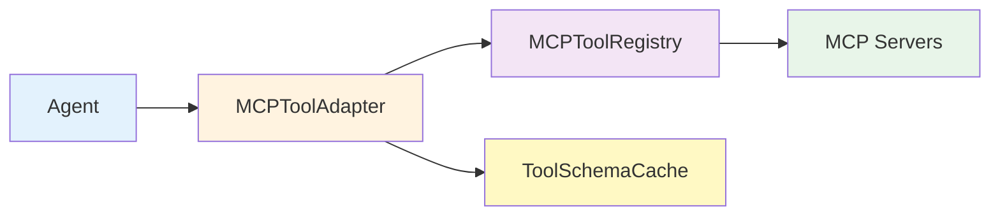

## 本章小结

本章介绍了MCP协议的架构、设计原理和工程实践，以下是核心知识点的总结。

### 核心知识点回顾

#### 9.1 Harness中的MCP集成设计

（MCP 协议基础已移交《Claude 技术指南》第四章，本节仅回顾理解集成设计所需的要点。）

**MCP的核心定义**：

- Host/Client/Server模型：Agent/LLM 运行在 Host 内；MCP Client 是 Host 管理的协议组件，并与单个 Server 建立隔离连接
- JSON-RPC 2.0：所有消息基于标准JSON-RPC
- 三种原语：Tools、Resources、Prompts

**为什么MCP成为行业标准**：

1. 解决工具集成的碎片化（一个工具一套集成）
2. 降低成本：工具开发者写一次，所有框架都能用
3. 支持分布式：localhost和远程都支持
4. 双向通信：Server可以向Client采样(sampling)

**三种原语详解**：

| 原语 | 用途 | 示例 |
|------|------|------|
| Tools | 可调用的函数/服务 | fetch_weather, send_email, query_db |
| Resources | 可读取的数据 | 文件、数据库记录、网页 |
| Prompts | 提示词模板 | code_review_template, translation_template |

**设计哲学**：

- 极简主义：只有三个原语，覆盖99%的用例
- Schema为中心：所有定义都是JSON Schema
- 标准边界：stdio 与 Streamable HTTP 是规范化传输；HTTP 授权按 MCP 授权规范，stdio 凭据由宿主进程/环境提供
- 流式能力：支持大型数据的分块传输

#### 9.2 传输层：stdio 与 Streamable HTTP

**标准传输方式对比**：

| 特性 | stdio | Streamable HTTP |
|------|-------|-----------------|
| 架构 | 本地进程 | 双向HTTP流 |
| 延迟 | <1ms | <100ms |
| 部署 | 本地 | 网络 |
| 扩展性 | 单C单S | 单S多C |
| 复杂度 | 最低 | 中等 |

**选择决策**：

- 本地开发/单机 → **stdio**
- 网络部署/多Client → **Streamable HTTP** （标准MCP传输方式）

**连接管理**：

- stdio：使用进程池避免重复启动
- HTTP：使用aiohttp的连接池和限制
- HTTP授权：按 MCP 授权规范使用 OAuth 2.1、受保护资源元数据、PKCE 等机制；stdio 传输从宿主环境获取凭据

**关键代码**：

```python
# stdio客户端
client = StdioMCPClient("/path/to/server")
client.start()
client.initialize()
response = client.send_request("tools/list")

# Streamable HTTP客户端
client = StreamableHttpMCPClient("http://localhost:8000")
await client.connect()
await client.initialize()
response = await client.send_request("tools/list")
```

#### 9.3 MCP服务端开发

**开发步骤**：

1. 定义工具(Tools)
2. 定义资源(Resources)
3. 定义提示词(Prompts)
4. 实现处理器
5. 选择传输方式启动

**关键代码框架**：

```text
class MCPServerBase:
    def register_tool(name, description, input_schema, handler)
    def register_resource(uri, name, description, mime_type, reader)
    def register_prompt(name, description, arguments, generator)
    async def handle_request(request)
```

**工具定义的最佳实践**：

- inputSchema必须是完整的JSON Schema
- description应该清晰且可被LLM理解
- 支持可选参数提高灵活性

**资源定义的最佳实践**：

- URI应该结构化：`scheme://path/to/resource`
- 支持列表和读取操作
- 大文件应该支持流式传输

**错误处理**：

- 所有错误都应该返回JSON-RPC 2.0错误格式
- 提供有意义的错误消息
- 记录Server端的错误日志

#### 9.4 Harness中的MCP集成模式

**系统级集成的五大问题**：

1. **动态发现**：MCPToolRegistry

   - 自动发现所有Server的工具
   - 构建tool → servers的映射
   - 支持定期重新发现

2. **Schema缓存**：多层缓存

   - L1：内存缓存（热工具）
   - L2：磁盘缓存（所有工具）
   - L3：远程缓存(Redis)
   - 可减少重复工具描述带来的Token消耗

3. **权限隔离**：PermissionGateway

   - 为Agent注册权限
   - 检查Tool调用权限
   - 高风险操作需要人工审批

4. **审计追踪**：完整的调用日志

   - 记录所有Tool调用
   - 包含Agent ID、参数、结果
   - 支持导出用于合规性

5. **错误降级**：FallbackHandler

   - Server故障时使用备选方案
   - 灰度发布和AB测试
   - 金丝雀部署支持

**关键代码**：

```python
# 注册Server
registry = MCPToolRegistry()
await registry.register_server(MCPServerConfig(...))

# 发现工具
tools_by_server = await registry.discover_tools()

# 调用工具
success, result = await registry.call_tool(
    tool_name, arguments, agent_id
)
```

#### 9.5 MiniHarness的MCP集成实现

**架构设计**：



**核心组件**：

1. **ToolSchemaCache**：管理Schema的缓存

   - 支持内存和磁盘存储
   - TTL自动过期
   - 缓存命中率统计

2. **MCPToolRegistry**：工具注册和发现

   - 维护Server配置和Client
   - 映射tool → servers
   - 路由工具调用

3. **MCPToolAdapter**：LLM适配层

   - 将MCP工具转换为LLM格式
   - 处理输入解析
   - 错误处理

4. **MiniHarnessWithMCP**：集成入口

   - 初始化所有组件
   - 提供统一的API
   - 统计和监控

**关键方法**：

```python
harness = MiniHarnessWithMCP()
await harness.initialize()

# 获取工具
tools = await harness.get_tools_for_agent()

# 调用工具
result = await harness.process_tool_call(
    tool_name, tool_input, agent_id
)
```

### 本章在Harness中的地位

#### 架构地位

结构如下：

```yaml
L1: 协议 (MCP规范)
  ↓
L2: 传输 (stdio / Streamable HTTP)
  ↓
L3: Server (工具/资源/提示词实现)
  ↓
L4: 集成 (Registry / Cache / Permission)
  ↓
L5: 应用 (MiniHarness / Agent)
```

#### 与其他章节的关联

- **←第8章**：任务编排为MCP工具提供执行框架
- **第9章**：MCP提供工具生态
- **→第10章**：Schema缓存、权限等是生产级需求
- **→第11章**：MCP故障时的容错和降级

### 重要数据指标

#### 性能指标

（以下为示意量级的设计目标，实际数值取决于工具数量、Schema 大小与缓存命中率，见 9.4/9.5 的讨论。）

| 指标 | 示例量级 | 备注 |
|------|-----|------|
| Schema缓存命中率 | 95%+ | 热工具快速发现 |
| 工具发现延迟（缓存） | <5ms | vs 无缓存 200-500ms |
| Token节省 | 取决于负载 | Schema缓存减少重复发送 |
| 连接复用率 | 90%+ | 减少TCP握手 |

#### 可靠性指标

| 指标 | 目标 | 说明 |
|------|------|------|
| Tool调用成功率 | 99.9% | 第一次成功 |
| 降级成功率 | 98%+ | Server故障时 |
| 审计日志覆盖 | 100% | 所有调用都被记录 |
| 权限检查覆盖 | 100% | 无权限调用被拦截 |

### 常见问题与最佳实践

#### Q1: Schema缓存多久失效？

**答**：建议设置为3600秒（1小时），可以根据工具变更频率调整。如果工具频繁更新，可以缩短到600秒，如果很少更新可以延长到86400秒（1天）。

#### Q2: 如何处理MCP Server的认证？

**答**：

1. **API Key**：在HTTP头中传递 `Authorization: Bearer <key>`
2. **OAuth**：HTTP Server 应按 MCP 授权规范暴露 Protected Resource Metadata；客户端从 `WWW-Authenticate` challenge 发现授权服务器，并在 token 请求中带 `resource`
3. **mTLS**：在HTTP Client中配置证书
4. **Custom**：Server可以定义任何认证方式

#### Q3: 如何优化Schema缓存的命中率？

**答**：

1. 预热热工具Schema（应用启动时）
2. 根据访问频率调整TTL
3. 使用多层缓存（内存→磁盘→远程）
4. 定期分析缓存统计并优化

#### Q4: 权限如何与SSO系统集成？

**答**：

```python
# 从SSO获取Agent的权限
async def load_permissions_from_sso(agent_id: str):
    sso_response = await sso_client.get_user_permissions(agent_id)
    gateway.register_permission(agent_id, sso_response['tools'])
```

#### Q5: 如何处理Server版本升级时的兼容性？

**答**：

1. 缓存Schema的哈希值，检测变更
2. 版本变更时重新发现工具
3. 支持多版本Server并行运行
4. 提供Schema迁移工具

### 关键代码片段速查

#### 添加MCP Server

示例如下：

```python
await registry.add_server(MCPServerConfig(
    server_id="my_server",
    server_name="My Tool Server",
    transport_type="streamable_http",
    endpoint="http://localhost:8000",
))
```

#### 发现和获取工具

代码片段如下：

```python
await registry.discover_tools()
schema = await registry.get_tool_schema("my_tool")
tools = await adapter.get_available_tools()
```

#### 调用工具

具体实现如下：

```python
success, result, error = await registry.call_tool(
    "my_tool", {"param": "value"}, agent_id="agent1"
)
```

#### 检查缓存统计

代码如下：

```python
stats = harness.get_stats()
print(f"Cache hit rate: {stats['schema_cache']}")
```

### 扩展方向

#### 短期优化

1. 实现工具优先级和限流
2. 添加工具使用统计
3. 支持工具分组和命名空间
4. 实现工具版本管理

#### 长期规划

1. 分布式Schema缓存(Redis)
2. 智能体间工具共享
3. 工具市场和推荐系统
4. 自动工具优化（基于使用模式）
5. 多语言MCP SDK

### 本章总结

第九章系统地介绍了MCP生态的设计、实现和集成。从协议的设计哲学（三个原语）到不同的传输方式选择，从Server的实现到Harness级别的集成模式，再到MiniHarness中的完整代码实现，形成了一套完整的工具生态管理体系。

**关键成果**：

- 理解MCP为什么成为行业标准
- 掌握三种原语的设计和使用
- 学会选择合适的传输方式
- 实现完整的MCP Server
- 在Harness中集成多个Server
- Schema缓存可以显著提升性能
- 权限和审计确保企业级安全

这些知识为后续章节的性能优化（第10章）和可靠性保障（第11章）奠定了坚实的基础。MCP的标准化特性使得智能体系统能够轻松扩展和集成来自任何供应商的工具。
