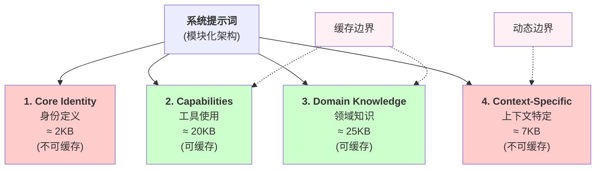

## 10.1 系统提示词工程

本节深入讲解系统提示词的设计原理、模块化架构、提示词前缀缓存机制、实现方法和最佳实践。系统提示词是智能体的核心DNA，合理的模块化设计不仅能降低Token消耗，还能提高系统的可维护性和一致性。

### 10.1.1 为什么系统提示词很重要

系统提示词(System Prompt)是智能体行为的DNA。它定义了：

- 智能体的身份和角色
- 它应该如何思考
- 它能和不能做什么
- 它如何与用户交互

在生产环境中，系统提示词还影响：

- **Token消耗**：提示词本身就是Token
- **缓存效率**：重复的提示词可以被缓存
- **一致性**：确保行为可预测
- **可维护性**：修改提示词vs修改代码

### 10.1.2 模块化系统提示词架构

Claude Code（和类似的智能体框架）通常会采用模块化系统提示词架构。具体规模和缓存边界会随产品版本、模型上下文窗口和运行界面变化，因此工程设计上不应把某个字节数硬编码为最佳实践，而应关注静态模块、动态上下文和缓存边界的分层。

#### 架构原理

模块化系统提示词的架构原理如下：



图 10-1：模块化系统提示词架构

#### 模块详解

**Module 1: Core Identity（核心身份，必须包含）**

```text
你是一个AI Assistant,能够:
1. 理解并执行复杂任务
2. 使用提供的工具来完成工作
3. 提供清晰的推理和解释

你的原则:
- 始终以用户最佳利益为出发点
- 对不确定的地方明确说明
- 拒绝可能有害的请求

```

**Module 2: Capabilities（能力说明，约20KB）**

这个模块详细说明智能体可以做什么：

```yaml
### Tool Usage

你可以使用以下工具:

1. web_search - 搜索网络信息
   使用格式:
   {
     "type": "web_search",
     "query": "search query"
   }
   返回:搜索结果列表

2. code_execution - 执行代码
   支持语言:Python, JavaScript, etc.
   限制:最多10秒执行时间
   ...

### Thinking Process

遵循以下思维步骤:
1. 理解任务
2. 分解成子问题
3. 为每个子问题制定策略
4. 按顺序执行
5. 验证结果

```

**Module 3: Domain Knowledge（领域知识，约25KB）**

包含Agent应该知道的背景信息：

```text
### Software Engineering Best Practices

1. Code Quality
   - 遵循PEP8标准(Python)
   - 包含错误处理
   - 添加必要的文档

2. Testing
   - 编写单元测试
   - 测试覆盖率 >80%

3. Performance
   - 考虑时间复杂度
   - 缓存重复计算

### Common Patterns

常见的代码模式和反模式...
```

**Module 4: Context-Specific（上下文特定，约7KB）**

每次请求动态生成的部分：

```text
### Current Task

用户任务:{{ task_description }}

用户提供的背景:
{{ user_context }}

特定约束:
{{ constraints }}
```

#### 提示词前缀缓存

模块化系统提示词的一个核心工程收益是 **提示词前缀缓存** (Prompt Prefix Caching)。这一机制利用了 LLM 推理过程中的 KV 缓存(Key-Value Cache)特性：当多次请求共享相同的提示词前缀时，模型可以直接复用已计算的注意力键值对，跳过重复的前向传播计算。

Sebastian Raschka 在对 Coding Agent 架构的分析中精辟地指出：成熟的 Harness 维护一个“稳定的提示词前缀”(stable prompt prefix)，其中包含不变的元素（指令、工具描述、工作区摘要），而只更新动态部分（记忆、对话记录、用户请求）。这种设计的效果显著—— **在典型的多轮对话场景中，前缀缓存可节省 50-90% 的输入Token计算成本**。

前缀缓存的工程要点：

- **前缀稳定性**：可缓存的前缀必须按字节完全一致。即使一个空格的差异也会导致缓存失效。因此，模块 1-3（身份、能力、领域知识）应该在会话期间保持完全不变
- **缓存边界设计**：将稳定的系统规则、工具说明和工作流指令放在可缓存区域，将用户当前输入、最近状态和高波动上下文放在动态区域。具体边界应由模型上下文窗口、供应商缓存能力和实际命中率决定。
- **缓存感知的提示词排列**：将高频变化的内容（如当前任务描述、最近的执行结果）放在提示词的末尾，将稳定内容（身份、工具定义、领域知识）放在前缀。顺序决定缓存命中率
- **缓存预热**：首次请求时没有缓存，需要完整计算。后续请求如果前缀匹配，延迟和成本都会大幅下降。对于需要快速响应的场景，可以在会话开始时发送一个预热请求

```python
class PrefixCacheAwarePrompt:
    """缓存感知的提示词组装"""

    def __init__(self, static_modules: list, cache_boundary_tokens: int = 47000):
        self.static_prefix = "\n\n".join(static_modules)
        self.cache_boundary = cache_boundary_tokens

    def assemble(self, dynamic_context: str) -> dict:
        """组装提示词,标记缓存边界"""
        return {
            "system": [
                {
                    "type": "text",
                    "text": self.static_prefix,
                    "cache_control": {"type": "ephemeral"}  # 标记可缓存
                },
                {
                    "type": "text",
                    "text": dynamic_context  # 动态部分不缓存
                }
            ]
        }
```

前缀缓存与应用层缓存（如 Schema 缓存、结果缓存）是不同层次的优化：前者发生在 LLM 推理引擎内部，后者发生在 Harness 应用层。两者结合可以实现最大化的成本和延迟优化。

### 10.1.3 实现模块化系统提示词

模块化系统提示词的实现涉及四个主要部分：数据结构定义、提示词构建逻辑、Token预算优化、和使用示例。

#### 第一部分：数据结构与初始化

定义提示词模块、段落的数据结构，以及管理器的初始化：

```python
from typing import Dict, Any, List
from dataclasses import dataclass
from enum import Enum
import hashlib

class PromptModule(Enum):
    """提示词模块类型"""
    CORE_IDENTITY = "core_identity"
    CAPABILITIES = "capabilities"
    DOMAIN_KNOWLEDGE = "domain_knowledge"
    CONTEXT_SPECIFIC = "context_specific"

@dataclass
class PromptSection:
    """提示词段落"""
    module: PromptModule
    content: str
    cacheable: bool
    priority: int

class ModularSystemPrompt:
    """模块化系统提示词管理器"""

    MAX_TOKENS = 54000
    CACHE_BOUNDARY = 47000

    def __init__(self):
        self.sections: Dict[PromptModule, List[PromptSection]] = {
            module: [] for module in PromptModule
        }
        self.cache_metadata: Dict[str, str] = {}

    def add_section(
        self,
        module: PromptModule,
        content: str,
        cacheable: bool = True,
        priority: int = 0,
    ) -> None:
        """添加提示词段落"""
        section = PromptSection(
            module=module,
            content=content,
            cacheable=cacheable,
            priority=priority,
        )
        self.sections[module].append(section)

        if cacheable:
            content_hash = hashlib.sha256(content.encode()).hexdigest()
            self.cache_metadata[content_hash] = content
```

**设计说明**：分离静态信息（身份、能力、知识）和动态信息（上下文特定）的结构，使前缀缓存能够有效工作。模块枚举类型确保只有四种预定义的模块类型。

#### 第二部分：提示词构建与组装逻辑

这部分展示如何将多个段落组织成最终的系统提示词，并管理缓存：

```python
    def build_prompt(
        self,
        context_variables: Dict[str, str] = None,
        max_tokens: int = MAX_TOKENS,
    ) -> tuple[str, Dict[str, Any]]:
        """构建最终系统提示词"""
        context_variables = context_variables or {}

        ordered_modules = [
            PromptModule.CORE_IDENTITY,
            PromptModule.CAPABILITIES,
            PromptModule.DOMAIN_KNOWLEDGE,
            PromptModule.CONTEXT_SPECIFIC,
        ]

        cacheable_content = []
        non_cacheable_content = []
        metadata = {
            "static_tokens": 0,
            "dynamic_tokens": 0,
            "caching_enabled": False,
            "module_breakdown": {},
        }

        for module in ordered_modules:
            sections = self.sections.get(module, [])
            sections.sort(key=lambda s: s.priority, reverse=True)

            for section in sections:
                token_estimate = len(section.content) * 0.4

                content = section.content
                if module == PromptModule.CONTEXT_SPECIFIC:
                    for var_name, var_value in context_variables.items():
                        content = content.replace(f"{{{{{var_name}}}}}", var_value)

                if section.cacheable:
                    cacheable_content.append(content)
                    metadata["static_tokens"] += int(token_estimate)
                else:
                    non_cacheable_content.append(content)
                    metadata["dynamic_tokens"] += int(token_estimate)

                metadata["module_breakdown"][module.value] = {
                    "sections": len(sections),
                    "tokens": int(token_estimate),
                }

        static_part = "\n\n".join(cacheable_content)
        dynamic_part = "\n\n".join(non_cacheable_content)
        total_tokens = metadata["static_tokens"] + metadata["dynamic_tokens"]

        if total_tokens > max_tokens:
            print(f"[Warning] Prompt exceeds {max_tokens} tokens")

        metadata["caching_enabled"] = len(static_part) > 1024

        if metadata["caching_enabled"]:
            static_hash = hashlib.sha256(static_part.encode()).hexdigest()
            metadata["cache_key"] = static_hash
            metadata["cache_boundary"] = len(static_part)

        final_prompt = static_part + "\n\n" + dynamic_part

        return final_prompt, metadata
```

**设计说明**：`build_prompt` 方法按照指定的模块顺序构建提示词，确保缓存边界的稳定性。动态上下文变量只在context_specific模块中替换，保持其他部分字节一致。

#### 第三部分：Token预算优化

在Token限制下优化提示词内容，以及获取缓存统计信息：

```python
    def optimize_for_token_budget(
        self,
        token_budget: int,
        context_variables: Dict[str, str] = None,
    ) -> str:
        """在Token预算限制下优化提示词"""
        sections_by_priority = []

        for module in PromptModule:
            for section in self.sections.get(module, []):
                token_estimate = len(section.content) * 0.4
                sections_by_priority.append((section, token_estimate, module))

        sections_by_priority.sort(
            key=lambda x: (x[2].value, x[0].priority),
            reverse=True
        )

        selected_sections = []
        total_tokens = 0

        for section, tokens, module in sections_by_priority:
            if total_tokens + tokens <= token_budget:
                selected_sections.append(section)
                total_tokens += tokens
            elif section.priority >= 10:
                selected_sections.append(section)
                total_tokens += tokens

        content = "\n\n".join(s.content for s in selected_sections)
        return content

    def get_cache_stats(self) -> Dict[str, Any]:
        """获取缓存统计信息"""
        total_cacheable = sum(
            len(s.content)
            for module_sections in self.sections.values()
            for s in module_sections
            if s.cacheable
        )

        total_non_cacheable = sum(
            len(s.content)
            for module_sections in self.sections.values()
            for s in module_sections
            if not s.cacheable
        )

        return {
            "total_modules": len(self.sections),
            "total_sections": sum(len(sections) for sections in self.sections.values()),
            "cacheable_tokens": int(total_cacheable * 0.4),
            "non_cacheable_tokens": int(total_non_cacheable * 0.4),
            "cache_potential_savings": int(total_cacheable * 0.4 * 0.35),
        }
```

**设计说明**：`optimize_for_token_budget` 实现了一个贪心算法，优先保留高优先级的内容。当总Token超过预算时，较低优先级的内容会被删除，但高优先级内容(priority >= 10)永远保留。

#### 第四部分：使用示例与主函数

最后展示如何创建和使用模块化系统提示词：

```python
def create_default_system_prompt() -> ModularSystemPrompt:
    """创建默认的系统提示词"""
    prompt = ModularSystemPrompt()

    # Core Identity
    prompt.add_section(
        PromptModule.CORE_IDENTITY,
        """你是Claude,一个由Anthropic创建的AI助手。

你的核心职责是:
1. 准确、有帮助地回答用户问题
2. 承认你的限制和不确定性
3. 拒绝可能有害的请求
4. 遵循所有安全指南""",
        cacheable=False,
        priority=100,
    )

    # Capabilities
    prompt.add_section(
        PromptModule.CAPABILITIES,
        """## 工具使用指南

你可以使用以下工具:
1. web_search - 搜索网络信息
2. code_execution - 执行代码
3. file_operations - 文件操作

### 思维过程
遵循以下思维框架:
1. 分解问题
2. 制定策略
3. 执行步骤
4. 验证结果""",
        cacheable=True,
        priority=50,
    )

    # Domain Knowledge
    prompt.add_section(
        PromptModule.DOMAIN_KNOWLEDGE,
        """## 编程最佳实践

1. 代码质量
   - 遵循编码标准
   - 包含错误处理
   - 添加文档

2. 性能
   - 考虑复杂度
   - 缓存计算结果

### 常见算法
...""",
        cacheable=True,
        priority=40,
    )

    # Context-Specific
    prompt.add_section(
        PromptModule.CONTEXT_SPECIFIC,
        """## 当前任务信息

用户任务:{{task}}

背景信息:
{{context}}

特定约束:
{{constraints}}""",
        cacheable=False,
        priority=30,
    )

    return prompt

if __name__ == "__main__":
    # 创建系统提示词
    system_prompt = create_default_system_prompt()

    # 构建提示词
    context = {
        "task": "写一个Python排序算法",
        "context": "学生练习项目",
        "constraints": "不使用内置排序函数",
    }

    final_prompt, metadata = system_prompt.build_prompt(context)

    print("=== 最终提示词 ===")
    print(final_prompt[:500] + "...\n")

    print("=== 元数据 ===")
    print(f"静态Token: {metadata['static_tokens']}")
    print(f"动态Token: {metadata['dynamic_tokens']}")
    print(f"缓存启用: {metadata['caching_enabled']}")

    print("\n=== 缓存统计 ===")
    stats = system_prompt.get_cache_stats()
    print(f"可缓存Token: {stats['cacheable_tokens']}")
    print(f"潜在节省: {stats['cache_potential_savings']}Token")
```

**使用说明**：这个示例展示了完整的工作流：(1) 创建ModularSystemPrompt实例；(2) 添加四个模块的段落；(3) 调用build_prompt构建最终提示词；(4) 查看缓存统计信息。实际应用中，可以针对不同的场景（如代码生成、内容创作等）预定义不同的ModularSystemPrompt配置。

### 10.1.4 系统提示词的最佳实践

1. **模块化**：按功能分解而不是按规模
2. **优先级**：高优先级内容永不删除
3. **可缓存性**：区分静态和动态内容
4. **版本控制**：提示词变更应该被跟踪
5. **测试**：评估提示词变更的影响

### 10.1.5 OpenClaw的系统提示词组装

OpenClaw采用类似但更复杂的方式：

```yaml
system_prompt:
  template: "base_template.jinja2"
  modules:
    - name: "identity"
      source: "modules/identity.txt"
      cacheable: false
      priority: 100

    - name: "tools"
      source: "modules/tools_{{ tools_version }}.txt"
      cacheable: true
      priority: 80
      variables:
        tools_version: "{{ environment.tools_api_version }}"

    - name: "skills"
      source: "modules/skills.txt"
      cacheable: true
      dynamic_loading: true  # 根据注册的skills动态包含

    - name: "context"
      source: "inline"
      content: "{{ task_context }}"
      cacheable: false
      priority: 50

assembly:
  method: "priority_based"
  token_limit: 54000
  cache_boundary: 47000
  compression: "none"
```

### 10.1.6 本小节小结

系统提示词是智能体的核心，应该：

1. 模块化以便维护和复用
2. 明确区分可缓存和不可缓存部分
3. 在Token效率和功能丰富间找平衡
4. 定期审视和优化

在生产环境中，这种模块化的方法可以：

- 显著减少Token消耗（通过缓存）
- 提高系统的一致性和可维护性
- 支持快速的A/B测试和灰度发布

#### 开源社区实践参考

GitHub 开源项目中的 CLAUDE.md 和 AGENTS.md 模式提供了具体的参考实现。例如，[claude-code-system-prompts](https://github.com/Piebald-AI/claude-code-system-prompts) 展示了模块化系统提示词的完整架构，包括 core identity、capabilities、domain knowledge 等模块的分离与组织；[claude-code-action](https://github.com/anthropics/claude-code-action) 中的 CLAUDE.md 示例展示了如何在实际项目中文档化系统的能力和约束。这些实践为 Harness 框架中的模块化设计提供了验证。

下一节将讨论如何通过插件系统实现功能扩展。
