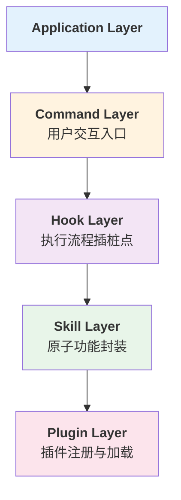
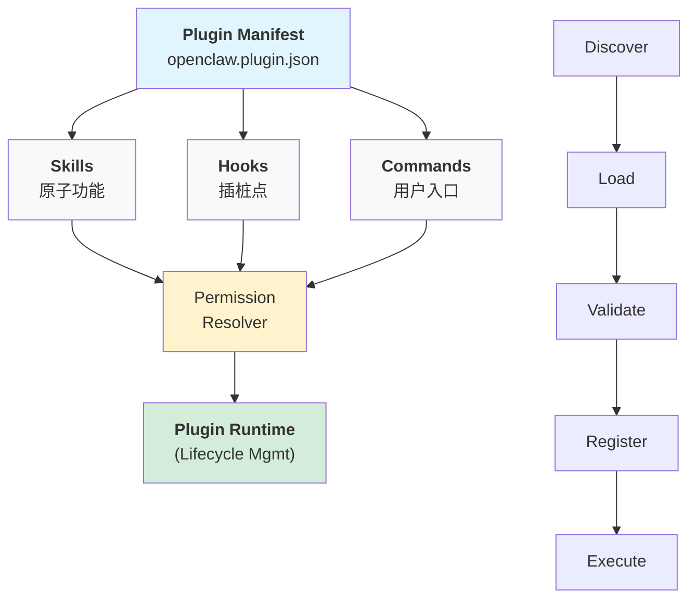

## 10.2 插件与扩展体系设计

灵活的扩展机制是支持多样化应用场景的关键。本节介绍四层扩展架构（Plugin、Skill、Hook、Command），对比Claude Code和OpenClaw的实现模式，并提供完整的插件系统实现和最佳实践。

### 10.2.1 概述

AI Agent Harness 需要灵活的扩展机制来支持不同的应用场景和第三方集成。本节介绍四层扩展架构：Plugin（插件）、Skill（技能）、Hook（钩子）、Command（命令），以及两大参考系统（Claude Code 和 OpenClaw）的实现模式。

**四层扩展架构**



### 10.2.2 基础概念

#### Plugin

插件是独立的模块包，包含一个或多个 Skill、Hook 和 Command。

**特点：**

- 自描述元数据（openclaw.plugin.json）
- 独立的版本管理
- 权限声明与隔离
- 可动态加载卸载

#### Skill

技能是原子级的功能单位，对应一个具体的 Agent 能力。

**分类：**

- SkillTool：工具调用技能（含参数 schema、返回类型）
- SkillQuery：查询技能（检索增强）
- SkillTransform：转换技能（数据处理）

#### Hook

Hook 是执行流程中的插桩点，允许插件在关键时刻介入。

**OpenClaw 7 种钩子类型：**

| 钩子类型 | 触发时机 | 用例 |
|---------|--------|------|
| `command:new` | 新命令注册 | 验证命令参数 schema |
| `gateway:startup` | 系统启动 | 初始化外部连接 |
| `tool_result_persist` | 工具结果保存 | 审计日志记录 |
| `before_model_resolve` | 模型解析前 | 注入系统提示词 |
| `before_prompt_build` | 提示词构建前 | 上下文增强 |
| `before_tool_call` | 工具调用前 | 参数验证/转换 |
| `agent_end` | Agent 结束 | 清理资源/回调 |

#### Command

命令是用户交互的直接入口，映射到一个 Skill 或流程。

### 10.2.3 Claude Code 参考系统

#### 三种扩展机制

**1. SkillTool（工具扩展）**
```python
from claude_code import SkillTool

class DatabaseQueryTool(SkillTool):
    """数据库查询工具"""

    name = "database_query"
    description = "Execute SQL queries safely"

    def get_schema(self):
        return {
            "type": "object",
            "properties": {
                "query": {
                    "type": "string",
                    "description": "SQL query"
                },
                "timeout": {
                    "type": "integer",
                    "default": 30,
                    "description": "Query timeout in seconds"
                }
            },
            "required": ["query"]
        }

    async def execute(self, query: str, timeout: int = 30) -> dict:
        # 工具实现
        pass
```

**2. Commands（命令扩展）**
```python
from claude_code import Command

class SearchCommand(Command):
    """搜索命令"""

    name = "search"
    aliases = ["/search", "搜索"]
    description = "Perform semantic search"

    def parse_args(self, raw_input: str):
        # 参数解析
        return {"query": raw_input.strip()}

    async def execute(self, args: dict):
        # 命令逻辑
        pass
```

**3. Hooks（流程钩子）**
```python
from datetime import datetime
from claude_code import Hook, HookType

class AuditHook(Hook):
    """审计日志钩子"""

    hook_type = HookType.BEFORE_TOOL_CALL
    priority = 100  # 优先级

    async def execute(self, context):
        # 记录工具调用
        await self.log_audit(
            user_id=context.user_id,
            tool_id=context.tool_id,
            params=context.params,
            timestamp=datetime.now()
        )
```

#### 编译时与运行时 Feature Gates

Feature Gates的实现方式如下：
```python
# 编译时 gates（Bun feature() 死代码消除）
from claude_code import feature

@feature("advanced_search")
def advanced_search_handler(query: str):
    """仅在启用 advanced_search 时编译"""
    return perform_semantic_search(query)

# 运行时 gates（GrowthBook，tengu_* 前缀）
from claude_code import get_feature_flag

class RecommendationEngine:
    def __init__(self):
        # 从 GrowthBook 获取配置
        self.enable_ml_ranking = get_feature_flag("tengu_ml_ranking")

    def rank_results(self, results):
        if self.enable_ml_ranking:
            return self.ml_rank(results)
        else:
            return self.simple_rank(results)
```

### 10.2.4 OpenClaw 参考系统

#### openclaw.plugin.json 规范

openclaw.plugin.json规范的结构示例如下：
```json
{
  "name": "custom-search",
  "version": "1.0.0",
  "description": "Custom search plugin with ranking",
  "main": "dist/index.js",
  "permissions": [
    {
      "resource": "tool:search",
      "action": "call",
      "level": "Ask-first"
    },
    {
      "resource": "file:read",
      "action": "access",
      "level": "Approve-once"
    }
  ],
  "skills": [
    {
      "id": "custom-search",
      "name": "Custom Search",
      "type": "SkillTool",
      "params": {
        "type": "object",
        "properties": {
          "query": { "type": "string", "description": "Search query" },
          "limit": { "type": "integer", "minimum": 1, "maximum": 100 }
        },
        "required": ["query"]
      }
    }
  ],
  "hooks": [
    {
      "type": "before_tool_call",
      "handler": "validateSearchParams"
    },
    {
      "type": "tool_result_persist",
      "handler": "logSearchResult"
    }
  ],
  "commands": [
    {
      "name": "search",
      "alias": ["/search", "搜索"],
      "skill": "custom-search",
      "level": "Free"
    }
  ]
}
```

#### 权限三级模型

权限三级模型的实现如下：
```python
class PermissionLevel(Enum):
    FREE = "Free"              # 无需审批
    ASK_FIRST = "Ask-first"    # 单次授权
    APPROVE_ONCE = "Approve-once"  # 每次确认
```

**应用场景：**

- `Free`：查询类操作、读取非敏感数据
- `Ask-first`：修改操作、外部 API 调用
- `Approve-once`：删除操作、敏感数据访问

#### TypeScript 插件示例

TypeScript插件的实现示例如下：
```typescript
// plugins/custom-search.ts
import { Plugin, Hook, Skill, Command } from '@openclaw/core';

export default class CustomSearchPlugin extends Plugin {
  async initialize() {
    // 注册 Skill
    this.registerSkill('custom-search', {
      handler: this.performSearch.bind(this),
      schema: {
        type: 'object',
        properties: {
          query: { type: 'string' },
          limit: { type: 'integer', default: 10 }
        }
      }
    });

    // 注册 Hook
    this.registerHook('before_tool_call', async (context) => {
      const { skillId, params } = context;
      if (skillId === 'custom-search') {
        // 验证查询长度
        if (params.query.length > 500) {
          throw new Error('Query too long');
        }
      }
    });

    // 注册 Command
    this.registerCommand({
      name: 'search',
      aliases: ['/search', '搜索'],
      skill: 'custom-search',
      level: 'Ask-first'
    });
  }

  async performSearch(params: { query: string; limit: number }) {
    // 实际搜索逻辑
    return {
      results: [],
      total: 0,
      timestamp: Date.now()
    };
  }
}
```

#### ClawHub 技能生态

ClawHub 是 OpenClaw 的技能市场，目前注册 13000+ 技能。
```python
class ClawHubRegistry:
    """ClawHub 技能注册与发现"""

    def search_skills(self, query: str, category: str = None):
        """搜索 ClawHub 技能"""
        # 查询：query="数据分析", category="data"
        # 返回匹配的技能列表

    def install_skill(self, skill_id: str, version: str = "latest"):
        """从 ClawHub 安装技能"""

    def publish_skill(self, plugin_config: dict, code: str):
        """发布技能到 ClawHub"""
```

#### “错误作为观察”模式

OpenClaw 独特的错误处理哲学：系统不抛出异常打断流程，而是将错误信息注入观察流。
```python
from datetime import datetime

class ErrorAsObservation:
    """错误作为观察的实现"""

    async def handle_tool_error(self, skill_id: str, error: Exception, context):
        # 不中断，转化为观察
        observation = {
            "type": "tool_error",
            "skill": skill_id,
            "error_code": error.__class__.__name__,
            "message": str(error),
            "timestamp": datetime.now().isoformat(),
            "recoverable": self.is_recoverable(error),
            "suggested_action": self.suggest_recovery(error)
        }

        # 注入到 Agent 观察流
        await self.inject_observation(observation)

        # 如果可恢复，Agent 可选择重试或替代方案
        # 如果不可恢复，Agent 报告给用户
```

### 10.2.5 实战：可扩展插件架构设计

#### 架构设计图

插件系统的完整架构设计如下：


图10-2：插件系统生命周期

#### 完整代码实现

可扩展插件架构的完整实现代码如下：
```python
# core/plugin_manager.py
import json
import importlib
from typing import Dict, Any, List
from dataclasses import dataclass
from enum import Enum

class PermissionLevel(Enum):
    FREE = "Free"
    ASK_FIRST = "Ask-first"
    APPROVE_ONCE = "Approve-once"

@dataclass
class PluginManifest:
    name: str
    version: str
    main: str
    skills: List[Dict[str, Any]]
    hooks: List[Dict[str, str]]
    commands: List[Dict[str, Any]]
    permissions: List[Dict[str, Any]]

class PluginManager:
    def __init__(self):
        self.plugins: Dict[str, Any] = {}
        self.skills: Dict[str, Any] = {}
        self.hooks: Dict[str, List[callable]] = {}
        self.commands: Dict[str, Any] = {}

    def load_plugin(self, plugin_dir: str):
        """加载插件"""
        manifest_path = f"{plugin_dir}/openclaw.plugin.json"

        with open(manifest_path, 'r') as f:
            manifest_data = json.load(f)

        manifest = PluginManifest(**manifest_data)
        plugin_id = manifest.name

        # 动态导入插件模块
        spec = importlib.util.spec_from_file_location(
            plugin_id,
            f"{plugin_dir}/{manifest.main}"
        )
        module = importlib.util.module_from_spec(spec)
        spec.loader.exec_module(module)

        # 初始化插件类
        plugin_class = module.default
        plugin_instance = plugin_class()

        # 注册 Skills
        for skill_config in manifest.skills:
            self.register_skill(
                skill_config['id'],
                plugin_instance,
                skill_config
            )

        # 注册 Hooks
        for hook_config in manifest.hooks:
            self.register_hook(
                hook_config['type'],
                getattr(plugin_instance, hook_config['handler'])
            )

        # 注册 Commands
        for cmd_config in manifest.commands:
            self.register_command(cmd_config, plugin_id)

        self.plugins[plugin_id] = {
            'manifest': manifest,
            'instance': plugin_instance
        }

        return manifest

    def register_skill(self, skill_id: str, plugin, config: dict):
        """注册技能"""
        self.skills[skill_id] = {
            'plugin': plugin,
            'config': config,
            'handler': getattr(plugin, f'skill_{skill_id}', None)
        }

    def register_hook(self, hook_type: str, handler: callable):
        """注册钩子"""
        if hook_type not in self.hooks:
            self.hooks[hook_type] = []
        self.hooks[hook_type].append(handler)

    def register_command(self, cmd_config: dict, plugin_id: str):
        """注册命令"""
        cmd_id = cmd_config['name']
        self.commands[cmd_id] = {
            'plugin': plugin_id,
            'skill': cmd_config['skill'],
            'level': PermissionLevel[cmd_config['level'].upper().replace('-', '_')],
            'aliases': cmd_config.get('aliases', [])
        }

    async def execute_hooks(self, hook_type: str, context: dict):
        """执行钩子链"""
        if hook_type in self.hooks:
            for handler in self.hooks[hook_type]:
                await handler(context)

    async def call_skill(self, skill_id: str, params: dict) -> Any:
        """调用技能"""
        skill = self.skills.get(skill_id)
        if not skill:
            raise ValueError(f"Skill {skill_id} not found")

        # 执行 before_tool_call 钩子
        await self.execute_hooks('before_tool_call', {
            'skillId': skill_id,
            'params': params
        })

        # 调用技能处理器
        result = await skill['handler'](**params)

        # 执行 tool_result_persist 钩子
        await self.execute_hooks('tool_result_persist', {
            'skillId': skill_id,
            'result': result
        })

        return result

    def list_plugins(self) -> List[str]:
        """列出已加载的插件"""
        return list(self.plugins.keys())

    def get_plugin_info(self, plugin_id: str) -> Dict[str, Any]:
        """获取插件信息"""
        if plugin_id not in self.plugins:
            return None

        plugin = self.plugins[plugin_id]
        return {
            'name': plugin['manifest'].name,
            'version': plugin['manifest'].version,
            'skills': [s['id'] for s in plugin['manifest'].skills],
            'commands': [c['name'] for c in plugin['manifest'].commands]
        }

# 使用示例
if __name__ == "__main__":
    import asyncio

    manager = PluginManager()

    # 加载插件
    manager.load_plugin("./plugins/custom-search")

    # 调用技能
    result = asyncio.run(manager.call_skill(
        'custom-search',
        {'query': 'AI Agent', 'limit': 10}
    ))

    print(f"Search results: {result}")
```

### 10.2.6 最佳实践

#### 1. 插件隔离

插件隔离的实现方式如下：
```python
class IsolatedPluginContext:
    """插件隔离上下文"""

    def __init__(self, plugin_id: str):
        self.plugin_id = plugin_id
        self.env_vars = {}
        self.file_access = set()
        self.api_quota = {}

    def grant_permission(self, resource: str, action: str):
        """授予权限"""
        pass

    def check_permission(self, resource: str, action: str) -> bool:
        """检查权限"""
        pass
```

#### 2. 版本兼容性

版本兼容性的处理方式如下：
```python
class VersionResolver:
    """解决插件版本冲突"""

    def check_compatibility(self, plugin_a: str, plugin_b: str) -> bool:
        """检查两个插件是否兼容"""
        # 比较依赖声明
        pass

    def resolve_dependency(self, plugins: List[str]) -> List[str]:
        """解决依赖冲突，返回正确的加载顺序"""
        # 拓扑排序
        pass
```

#### 3. 热加载与卸载

热加载与卸载的实现方式如下：
```python
class HotReloadManager:
    """支持热加载/卸载插件"""

    async def reload_plugin(self, plugin_id: str):
        """重新加载插件（不中断服务）"""
        old_plugin = self.plugins[plugin_id]
        new_manifest = self.load_plugin(...)

        # 验证兼容性
        if not self.check_backward_compatibility(old_plugin, new_manifest):
            raise IncompatiblePluginError()

        # 平滑切换
        await self.pause_plugin(plugin_id)
        await self.unload_plugin(plugin_id)
        await self.load_plugin(plugin_id)
        await self.resume_plugin(plugin_id)

    async def unload_plugin(self, plugin_id: str):
        """卸载插件并清理资源"""
        plugin = self.plugins[plugin_id]
        await plugin['instance'].cleanup()
        del self.plugins[plugin_id]
```

### 10.2.7 总结

插件与扩展体系是 Harness 的核心竞争力，通过分层的 Plugin-Skill-Hook-Command 架构，实现了：

1. **高内聚**：每个插件独立，职责清晰
2. **低耦合**：通过 Hook 和 Permission 解耦
3. **可扩展**：支持热加载、版本管理、隔离执行
4. **安全**：三级权限模型、LLM 权限解释器
5. **生态**：ClawHub 13000+ 技能市场

下一节将介绍如何在这个扩展体系上进行性能优化和成本控制。
