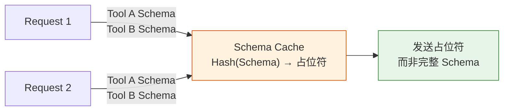

## 10.3 性能优化与成本控制

### 10.3.1 概述

在生产环境中，AI Agent 系统的性能（延迟、吞吐量）和成本（API 调用费用、计算资源）是关键指标。本节介绍令牌效率优化、延迟优化和成本控制的工程实践。

### 10.3.2 令牌效率优化

#### Schema 缓存

Schema 是工具参数的 JSON Schema 定义。在每次工具调用前，模型需要理解 Schema 来生成正确的参数。

**问题：** 相同的 Schema 在多个请求中重复发送，造成令牌浪费。

**解决方案：**Schema 缓存机制

图10-3-1 Schema 缓存流程



```python
# core/schema_cache.py
import hashlib
import json
from typing import Dict, Any
from functools import lru_cache

class SchemaCache:
    """Schema 哈希与缓存管理"""

    def __init__(self, max_schemas: int = 1000):
        self.cache: Dict[str, str] = {}
        self.max_schemas = max_schemas

    @staticmethod
    def schema_hash(schema: dict) -> str:
        """计算 Schema 哈希值"""
        schema_json = json.dumps(schema, sort_keys=True)
        return hashlib.sha256(schema_json.encode()).hexdigest()[:16]

    def get_schema_ref(self, schema: dict) -> str:
        """
        获取 Schema 引用（哈希值或占位符）

        Returns:
            对于新 Schema，返回完整定义
            对于缓存的 Schema，返回占位符
        """
        schema_hash = self.schema_hash(schema)

        if schema_hash in self.cache:
            # 返回占位符，模型理解 <SCHEMA_1a2b3c4d...>
            return f"<SCHEMA_{schema_hash}>"

        # 新 Schema，存入缓存并返回定义
        self.cache[schema_hash] = json.dumps(schema)
        return json.dumps({
            "hash": schema_hash,
            "schema": schema
        })

    def get_full_schema(self, schema_ref: str) -> dict:
        """恢复完整的 Schema 定义"""
        if schema_ref.startswith("<SCHEMA_"):
            schema_hash = schema_ref.replace("<SCHEMA_", "").rstrip(">")
            return json.loads(self.cache[schema_hash])
        else:
            return json.loads(schema_ref)

    def get_cache_stats(self) -> dict:
        """获取缓存统计"""
        return {
            'cached_schemas': len(self.cache),
            'cache_size_kb': sum(
                len(v.encode()) for v in self.cache.values()
            ) / 1024
        }

class TokenEfficientPromptBuilder:
    """令牌高效的提示词构建器"""

    def __init__(self, schema_cache: SchemaCache):
        self.schema_cache = schema_cache

    def build_tools_section(self, tools: list[dict]) -> str:
        """构建工具描述，使用 Schema 缓存"""
        tools_desc = []

        for tool in tools:
            schema_ref = self.schema_cache.get_schema_ref(tool['schema'])

            tool_desc = f"""
Tool: {tool['name']}
Description: {tool['description']}
Parameters: {schema_ref}
"""
            tools_desc.append(tool_desc)

        return "\n".join(tools_desc)

    def estimate_token_savings(
        self,
        tools: list[dict],
        num_requests: int
    ) -> dict:
        """估算 Schema 缓存的节省"""
        # 使用近似估算：1 个英文 token ≈ 4 字符，1 个中文字符 ≈ 1.3 token
        # 生产环境推荐使用 Anthropic 的 messages.count_tokens() API
        full_section = self.build_tools_section(tools)
        full_tokens = int(len(full_section) * 0.4)

        # 使用缓存后的令牌数（估算）
        # 假设占位符比完整 Schema 小 50-70%，节省 30-50%
        cached_tokens = full_tokens * 0.5

        total_savings = (full_tokens - cached_tokens) * num_requests

        return {
            'tokens_per_request_without_cache': full_tokens,
            'tokens_per_request_with_cache': cached_tokens,
            'estimated_total_savings': int(total_savings),
            'estimated_cost_savings_usd': total_savings * 0.003 / 1000  # $3/MTok
        }
```

#### 提示词前缀缓存

除了应用层的 Schema 缓存，LLM 推理层面还有一种更底层的优化——**提示词前缀缓存**（Prompt Prefix Caching）。当多次请求共享相同的提示词前缀时，LLM 可以复用已计算的 KV 缓存，跳过重复的前向传播。

| 缓存层次 | 作用域 | 命中条件 | 典型收益 |
|---------|--------|---------|---------|
| Schema 缓存 | 应用层 | 工具定义哈希匹配 | 减少重复令牌发送 |
| 提示词前缀缓存 | LLM 推理层 | 提示词前缀按字节一致 | 50-90% 输入令牌计算成本 |
| 结果缓存 | 应用层 | 请求内容完全匹配 | 避免重复 API 调用 |

前缀缓存要求提示词的前缀部分（通常是系统提示词中的静态模块）在多轮对话中保持完全稳定。详细的缓存边界设计和实现方法参见 10.1.3 节。

#### 提示词压缩

提示词压缩的实现方式如下：
```python
class PromptCompressor:
    """提示词压缩技术"""

    def __init__(self):
        self.compression_techniques = {
            'abbreviate_examples': self.abbreviate_examples,
            'remove_redundant_context': self.remove_redundant_context,
            'use_bullet_points': self.use_bullet_points,
            'inline_related_concepts': self.inline_related_concepts
        }

    def compress(self, prompt: str, target_reduction: float = 0.3) -> str:
        """
        压缩提示词，目标降低指定百分比的令牌数

        Args:
            prompt: 原始提示词
            target_reduction: 目标压缩比例（0.3 = 压缩 30%）
        """
        # 近似估算 token 数（生产环境建议用 Anthropic count_tokens API）
        original_tokens = int(len(prompt) * 0.4)
        target_tokens = int(original_tokens * (1 - target_reduction))

        compressed = prompt
        for technique in self.compression_techniques.values():
            compressed = technique(compressed)
            current_tokens = int(len(compressed) * 0.4)
            if current_tokens <= target_tokens:
                break

        return compressed

    def abbreviate_examples(self, text: str) -> str:
        """缩减示例代码"""
        # 将多行示例替换为简短说明
        return text.replace(
            "Example:\n```python\n...\n```",
            "Example: [see docs]"
        )

    def remove_redundant_context(self, text: str) -> str:
        """移除冗余上下文"""
        lines = text.split('\n')
        # 移除连续空行
        return '\n'.join(
            line for i, line in enumerate(lines)
            if not (i > 0 and lines[i-1].strip() == '' and line.strip() == '')
        )

    def use_bullet_points(self, text: str) -> str:
        """转换为要点格式"""
        return text.replace("The system supports:", "Supports:\n• ")

    def inline_related_concepts(self, text: str) -> str:
        """内联相关概念"""
        return text.replace(
            "See the Advanced Concepts section",
            "[advanced:...]"
        )
```

### 10.3.3 延迟优化

#### 流式响应

流式响应的实现方式如下：
```python
# core/streaming.py
import asyncio
from typing import AsyncIterator, Any

class StreamingResponseHandler:
    """流式响应处理"""

    async def stream_completion(
        self,
        client,
        prompt: str,
        system: str = None,
        model: str = "claude-sonnet-4-6"
    ) -> AsyncIterator[str]:
        """
        流式获取完成结果，降低首字节延迟
        """
        with client.messages.stream(
            model=model,
            max_tokens=2048,
            system=system,
            messages=[{"role": "user", "content": prompt}]
        ) as stream:
            for text in stream.text_stream:
                yield text
                # 允许其他任务在 I/O 等待时执行
                await asyncio.sleep(0)

    async def process_stream_with_backpressure(
        self,
        stream: AsyncIterator[str],
        processor: callable,
        buffer_size: int = 10
    ) -> AsyncIterator[str]:
        """
        带背压的流处理，避免内存溢出
        """
        buffer = []

        async for chunk in stream:
            buffer.append(chunk)

            if len(buffer) >= buffer_size:
                # 处理缓冲区
                result = await processor("".join(buffer))
                yield result
                buffer.clear()

        # 处理剩余数据
        if buffer:
            result = await processor("".join(buffer))
            yield result
```

#### 并发工具调用

并发工具调用的实现方式如下：
```python
class ConcurrentToolExecutor:
    """并发执行多个工具调用"""

    async def execute_parallel(
        self,
        tools: list[dict],
        timeout: int = 30
    ) -> list[Any]:
        """
        并发执行工具，利用 Python 异步特性

        Example:
            tools = [
                {'id': 'search_web', 'params': {'query': '...'}},
                {'id': 'fetch_docs', 'params': {'url': '...'}},
                {'id': 'analyze_sentiment', 'params': {'text': '...'}}
            ]
            results = await executor.execute_parallel(tools, timeout=10)
        """
        tasks = []

        for tool in tools:
            task = asyncio.create_task(
                self.execute_with_timeout(
                    tool['id'],
                    tool['params'],
                    timeout
                )
            )
            tasks.append(task)

        results = await asyncio.gather(*tasks, return_exceptions=True)

        # 分离成功和失败结果
        return [
            {'status': 'success', 'result': r}
            if not isinstance(r, Exception)
            else {'status': 'error', 'error': str(r)}
            for r in results
        ]

    async def execute_with_timeout(
        self,
        tool_id: str,
        params: dict,
        timeout: int
    ) -> Any:
        """执行单个工具，带超时"""
        try:
            return await asyncio.wait_for(
                self.call_tool(tool_id, params),
                timeout=timeout
            )
        except asyncio.TimeoutError:
            raise TimeoutError(f"Tool {tool_id} exceeded {timeout}s timeout")

    async def call_tool(self, tool_id: str, params: dict) -> Any:
        """实际的工具调用"""
        # 调用对应的工具实现
        pass
```

#### 缓存层

多级缓存的实现方式如下：
```python
# core/cache.py
import hashlib
import json
from datetime import datetime, timedelta
from typing import Any, Optional

class MultiLevelCache:
    """多级缓存：内存 → Redis → 数据库"""

    def __init__(self, redis_client=None):
        self.memory_cache = {}  # L1：内存缓存
        self.redis_client = redis_client  # L2：Redis 缓存
        self.ttl_map = {}  # 缓存过期时间

    def get_cache_key(self, tool_id: str, params: dict) -> str:
        """生成缓存 Key"""
        params_json = json.dumps(params, sort_keys=True)
        params_hash = hashlib.md5(params_json.encode()).hexdigest()
        return f"tool_result:{tool_id}:{params_hash}"

    async def get(self, tool_id: str, params: dict) -> Optional[Any]:
        """获取缓存结果"""
        key = self.get_cache_key(tool_id, params)

        # L1：检查内存缓存
        if key in self.memory_cache:
            cached_item = self.memory_cache[key]
            if self.is_valid(key):
                return cached_item['value']
            else:
                del self.memory_cache[key]

        # L2：检查 Redis（如果可用）
        if self.redis_client:
            try:
                cached_value = self.redis_client.get(key)
                if cached_value:
                    result = json.loads(cached_value)
                    # 回写到内存缓存
                    self.memory_cache[key] = {
                        'value': result,
                        'timestamp': datetime.now()
                    }
                    return result
            except Exception:
                pass  # Redis 不可用，继续

        return None

    async def set(
        self,
        tool_id: str,
        params: dict,
        result: Any,
        ttl_seconds: int = 3600
    ):
        """缓存结果"""
        key = self.get_cache_key(tool_id, params)

        # L1：写入内存缓存
        self.memory_cache[key] = {
            'value': result,
            'timestamp': datetime.now()
        }
        self.ttl_map[key] = datetime.now() + timedelta(seconds=ttl_seconds)

        # L2：写入 Redis
        if self.redis_client:
            try:
                self.redis_client.setex(
                    key,
                    ttl_seconds,
                    json.dumps(result)
                )
            except Exception:
                pass  # Redis 写入失败，继续

    def is_valid(self, key: str) -> bool:
        """检查缓存是否仍有效"""
        if key not in self.ttl_map:
            return False
        return datetime.now() < self.ttl_map[key]

    def get_stats(self) -> dict:
        """获取缓存统计"""
        return {
            'memory_items': len(self.memory_cache),
            'valid_items': sum(1 for k in self.memory_cache if self.is_valid(k)),
            'memory_size_mb': sum(
                len(json.dumps(v['value']).encode())
                for v in self.memory_cache.values()
            ) / 1024 / 1024
        }
```

### 10.3.4 成本控制

#### 多模型路由

2026 年的成本优化实践已发展出更成熟的模式。核心思路是：**并非所有调用都需要最强（也最贵）的模型**。

多模型路由（Multi-Model Routing）按任务复杂度将请求路由到不同模型：

```python
class MultiModelRouter:
    """按任务复杂度路由到不同模型"""

    def __init__(self):
        self.models = {
            "simple": ModelConfig("haiku", cost_per_mtok=0.25),
            "moderate": ModelConfig("sonnet", cost_per_mtok=3.0),
            "complex": ModelConfig("opus", cost_per_mtok=15.0),
        }

    def route(self, task: str, context_length: int) -> str:
        """根据任务特征选择模型"""
        if self._is_simple_task(task):
            return "simple"    # 简单格式化、分类、提取
        elif context_length > 100_000 or self._needs_deep_reasoning(task):
            return "complex"   # 复杂推理、长上下文分析
        else:
            return "moderate"  # 大多数常规任务
```

结合提示词前缀缓存（参见 10.1.3 节）和三级预算管控（per-request → per-task → per-day/month，在 50%/80% 阈值触发告警），综合优化可达 **60-80% 的成本降低**。

#### 模型选择与降级

模型选择与降级的实现方式如下：
```python
from datetime import datetime

class ModelSelector:
    """根据任务复杂度选择成本最优的模型"""

    # 模型成本映射（USD per 1M tokens）
    MODEL_COSTS = {
        'claude-haiku-4-5': {'input': 1.00, 'output': 5.00},
        'claude-sonnet-4-6': {'input': 3.00, 'output': 15.00},
        'claude-opus-4-6': {'input': 5.00, 'output': 25.00},
    }

    # 模型能力评级
    MODEL_CAPABILITIES = {
        'claude-haiku-4-5': 2,      # 基础任务
        'claude-sonnet-4-6': 3,     # 中等复杂
        'claude-opus-4-6': 4,       # 复杂推理
    }

    def select_model(
        self,
        task_complexity: int,
        budget_per_request: float = 0.10
    ) -> str:
        """
        选择合适的模型

        Args:
            task_complexity: 1-4，任务复杂度
            budget_per_request: 每个请求的成本预算（USD）
        """
        candidates = []

        for model, capabilities in self.MODEL_CAPABILITIES.items():
            # 能力充分
            if capabilities >= task_complexity:
                cost = self.estimate_cost(model, avg_tokens=500)
                if cost <= budget_per_request:
                    candidates.append({
                        'model': model,
                        'cost': cost,
                        'capability_margin': capabilities - task_complexity
                    })

        if not candidates:
            # 没有符合预算的模型
            return None

        # 选择成本最低但能力充分的模型
        return min(candidates, key=lambda x: x['cost'])['model']

    def estimate_cost(
        self,
        model: str,
        input_tokens: int = 1000,
        output_tokens: int = 500
    ) -> float:
        """估算请求成本"""
        costs = self.MODEL_COSTS[model]
        return (
            input_tokens * costs['input'] +
            output_tokens * costs['output']
        ) / 1_000_000

class CostMonitor:
    """成本监控与告警"""

    def __init__(self, daily_budget_usd: float):
        self.daily_budget = daily_budget_usd
        self.daily_cost = 0.0
        self.request_costs = []

    def log_request(self, model: str, input_tokens: int, output_tokens: int):
        """记录请求成本"""
        from core.model_selector import ModelSelector

        selector = ModelSelector()
        cost = selector.estimate_cost(model, input_tokens, output_tokens)
        self.daily_cost += cost
        self.request_costs.append({
            'model': model,
            'cost': cost,
            'input_tokens': input_tokens,
            'output_tokens': output_tokens,
            'timestamp': datetime.now()
        })

    def check_budget(self) -> dict:
        """检查预算状态"""
        remaining = self.daily_budget - self.daily_cost
        usage_pct = (self.daily_cost / self.daily_budget) * 100

        return {
            'budget': self.daily_budget,
            'spent': self.daily_cost,
            'remaining': remaining,
            'usage_percent': usage_pct,
            'status': 'ok' if usage_pct < 80 else 'warning' if usage_pct < 95 else 'critical'
        }

    def get_cost_by_model(self) -> dict:
        """按模型统计成本"""
        costs_by_model = {}

        for request in self.request_costs:
            model = request['model']
            if model not in costs_by_model:
                costs_by_model[model] = {'count': 0, 'cost': 0.0}

            costs_by_model[model]['count'] += 1
            costs_by_model[model]['cost'] += request['cost']

        return costs_by_model
```

#### Multi-Model Routing 与 Prompt 缓存

**多模型路由** 是 2026 年业界标准的成本优化实践。核心原则是：**并非所有请求都需要最强模型**。按任务复杂度智能路由可节省 40-60% 成本。

```python
class RoutingStrategy:
    """任务复杂度路由策略"""

    def __init__(self):
        self.complexity_thresholds = {
            'simple': ['分类', '格式化', '提取', '总结'],      # Haiku
            'moderate': ['编辑', '改写', '分析'],              # Sonnet
            'complex': ['推理', '规划', '多步骤', '创意']     # Opus
        }

    def classify_task(self, task_description: str) -> str:
        """分类任务复杂度"""
        task_lower = task_description.lower()

        for level, keywords in self.complexity_thresholds.items():
            if any(kw in task_lower for kw in keywords):
                return level
        return 'moderate'

    def route(self, task: str) -> str:
        """根据复杂度路由到模型"""
        level = self.classify_task(task)
        models = {
            'simple': 'claude-haiku-4-5',      # $0.25/MTok
            'moderate': 'claude-sonnet-4-6',   # $3.0/MTok
            'complex': 'claude-opus-4-6'       # $15.0/MTok
        }
        return models[level]
```

**提示词缓存** 通过 Anthropic 的 90% 折扣大幅降低成本。长系统提示（Agent 系统常见）可单独节省 20-30% 账单。缓存预热策略：预先加载常见系统提示变体。

| 预算级别 | 范围 | 告警阈值 | 示例 |
|---------|------|---------|------|
| Level 1 | 单个请求 | max_tokens 限制 | per-request: $0.10 |
| Level 2 | 单个任务 | 多个 LLM 调用聚合 | per-task: $0.50 |
| Level 3 | 日/月 | 50% 和 80% 告警 | daily: $100 |

路由 + 缓存通常可实现 **60-80% 总体成本降低**。上下文管理占总支出 60-70%，关键在于仅包含相关上下文，避免冗余数据。

#### 缓存命中率优化

缓存命中率优化的实现方式如下：
```python
import hashlib
import json
from datetime import datetime

class CacheHitAnalyzer:
    """分析与优化缓存命中率"""

    def __init__(self):
        self.cache_accesses = []

    def log_access(
        self,
        tool_id: str,
        params: dict,
        hit: bool,
        response_time_ms: float
    ):
        """记录缓存访问"""
        self.cache_accesses.append({
            'tool_id': tool_id,
            'params_hash': hashlib.md5(
                json.dumps(params, sort_keys=True).encode()
            ).hexdigest(),
            'hit': hit,
            'response_time_ms': response_time_ms,
            'timestamp': datetime.now()
        })

    def get_hit_rate(self) -> float:
        """计算缓存命中率"""
        if not self.cache_accesses:
            return 0.0

        hits = sum(1 for a in self.cache_accesses if a['hit'])
        return hits / len(self.cache_accesses)

    def analyze_by_tool(self) -> dict:
        """按工具统计命中率"""
        by_tool = {}

        for access in self.cache_accesses:
            tool_id = access['tool_id']
            if tool_id not in by_tool:
                by_tool[tool_id] = {'hits': 0, 'misses': 0, 'avg_response_ms': 0}

            if access['hit']:
                by_tool[tool_id]['hits'] += 1
            else:
                by_tool[tool_id]['misses'] += 1

        # 计算平均响应时间
        for tool_id in by_tool:
            tool_accesses = [
                a for a in self.cache_accesses
                if a['tool_id'] == tool_id
            ]
            avg_response = sum(
                a['response_time_ms'] for a in tool_accesses
            ) / len(tool_accesses)
            by_tool[tool_id]['avg_response_ms'] = avg_response
            by_tool[tool_id]['hit_rate'] = (
                by_tool[tool_id]['hits'] /
                (by_tool[tool_id]['hits'] + by_tool[tool_id]['misses'])
            )

        return by_tool

    def recommend_cache_ttl(self, tool_id: str) -> int:
        """根据访问模式推荐缓存 TTL"""
        tool_accesses = [
            a for a in self.cache_accesses
            if a['tool_id'] == tool_id
        ]

        if not tool_accesses:
            return 3600  # 默认 1 小时

        # 简单启发式：高命中率工具使用更长的 TTL
        hit_rate = sum(1 for a in tool_accesses if a['hit']) / len(tool_accesses)

        if hit_rate > 0.7:
            return 86400  # 24 小时
        elif hit_rate > 0.4:
            return 3600   # 1 小时
        else:
            return 600    # 10 分钟
```

### 10.3.5 实战：性能基准测试

性能基准测试的实现代码如下：
```python
# benchmarks/performance_benchmark.py
import asyncio
import time
from typing import Callable

class PerformanceBenchmark:
    """性能基准测试框架"""

    def __init__(self, name: str):
        self.name = name
        self.results = []

    async def run_test(
        self,
        test_fn: Callable,
        iterations: int = 100,
        warmup: int = 10
    ) -> dict:
        """运行性能测试"""
        # 预热
        for _ in range(warmup):
            await test_fn()

        # 实际测试
        latencies = []
        start_time = time.time()

        for _ in range(iterations):
            iter_start = time.time()
            await test_fn()
            latencies.append((time.time() - iter_start) * 1000)  # 毫秒

        total_time = time.time() - start_time

        results = {
            'test_name': self.name,
            'iterations': iterations,
            'total_time_s': total_time,
            'throughput_per_sec': iterations / total_time,
            'p50_latency_ms': sorted(latencies)[len(latencies) // 2],
            'p99_latency_ms': sorted(latencies)[int(len(latencies) * 0.99)],
            'avg_latency_ms': sum(latencies) / len(latencies),
            'max_latency_ms': max(latencies),
            'min_latency_ms': min(latencies)
        }

        self.results.append(results)
        return results

    def print_report(self):
        """打印测试报告"""
        print(f"\n{'Performance Benchmark Report':^60}")
        print("=" * 60)

        for result in self.results:
            print(f"\nTest: {result['test_name']}")
            print(f"  Iterations: {result['iterations']}")
            print(f"  Throughput: {result['throughput_per_sec']:.2f} req/s")
            print(f"  P50 Latency: {result['p50_latency_ms']:.2f} ms")
            print(f"  P99 Latency: {result['p99_latency_ms']:.2f} ms")
            print(f"  Avg Latency: {result['avg_latency_ms']:.2f} ms")
```

### 10.3.6 总结

性能优化与成本控制的关键策略：

| 维度 | 优化方向 | 预期收益 |
|-----|--------|--------|
| 令牌效率 | Schema 缓存、提示词压缩 | 30-40% 令牌削减 |
| 延迟 | 流式处理、并发执行、缓存 | P99 延迟 <500ms |
| 成本 | 模型选择、缓存命中率 | 40-50% 成本降低 |

下一节将介绍配置管理与特性门控，实现灰度发布和 A/B 测试。
