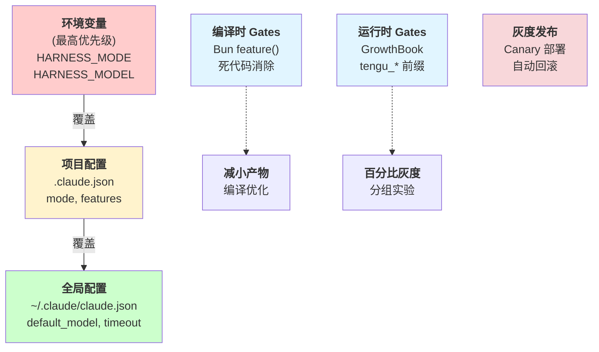

## 10.4 配置管理与特性门控

本节讲解生产环境的配置管理系统和特性门控机制，包括三层配置架构（环境变量、项目配置、全局配置）、编译时与运行时特性门控、金丝雀灰度部署策略，以及完整的配置与灰度系统实现。这些机制支持多环境部署、灰度发布和 A/B 测试，确保新功能的安全推出。

首先介绍配置的三层架构和加载优先级，然后讨论编译时与运行时的特性门控机制，最后介绍灰度发布策略及其完整实现。

### 10.4.1 概述

生产环境中，系统配置需要支持多个环境（开发、测试、预发布、正式）、多个地域（区域）和多个用户群体。特性门控(Feature Gates)提供在运行时控制功能开关的能力，支持灰度发布、A/B 测试和快速回滚。

### 10.4.2 配置层级架构

#### 三层配置系统

三层配置系统的架构如下：



图 10-5：配置层级架构 & 特性门控流程

#### 配置文件规范

配置文件的规范实现如下：

```python
# core/config.py
import os
import json
from pathlib import Path
from typing import Any, Dict, Optional
from dataclasses import dataclass
from enum import Enum
from typing import Optional

class Environment(Enum):
    """运行环境"""
    DEVELOPMENT = "development"
    TESTING = "testing"
    STAGING = "staging"
    PRODUCTION = "production"

@dataclass
class ModelConfig:
    """模型配置"""
    name: str
    max_tokens: int = 2048
    temperature: Optional[float] = None  # None 表示不发送采样参数
    top_p: Optional[float] = None

@dataclass
class HarnessConfig:
    """Harness 全局配置"""
    environment: Environment
    model: ModelConfig
    timeout: int = 30
    max_retries: int = 3
    cache_enabled: bool = True
    log_level: str = "INFO"

class ConfigLoader:
    """配置加载器：环境变量 → 项目配置 → 全局配置"""

    def __init__(self):
        self.config = None

    def load(self) -> HarnessConfig:
        """加载配置(三层优先级)"""
        # 步骤 1:加载全局配置
        global_config = self._load_global_config()

        # 步骤 2:加载项目配置(覆盖全局)
        project_config = self._load_project_config()
        global_config.update(project_config)

        # 步骤 3:加载环境变量(覆盖项目)
        env_config = self._load_env_vars()
        global_config.update(env_config)

        return self._build_harness_config(global_config)

    def _load_global_config(self) -> dict:
        """加载 ~/.claude/claude.json"""
        global_path = Path.home() / '.claude' / 'claude.json'

        if global_path.exists():
            with open(global_path, 'r') as f:
                return json.load(f)
        return {}

    def _load_project_config(self) -> dict:
        """加载 .claude.json(项目根目录)"""
        project_path = Path.cwd() / '.claude.json'

        if project_path.exists():
            with open(project_path, 'r') as f:
                return json.load(f)
        return {}

    def _load_env_vars(self) -> dict:
        """加载环境变量(HARNESS_ 前缀)"""
        env_config = {}

        for key, value in os.environ.items():
            if key.startswith('HARNESS_'):
                config_key = key.replace('HARNESS_', '').lower()
                # 类型推断
                env_config[config_key] = self._parse_env_value(value)

        return env_config

    @staticmethod
    def _parse_env_value(value: str) -> Any:
        """将环境变量字符串转换为适当类型"""
        if value.lower() in ('true', 'yes', '1'):
            return True
        elif value.lower() in ('false', 'no', '0'):
            return False
        elif value.isdigit():
            return int(value)
        else:
            return value

    def _build_harness_config(self, config_dict: dict) -> HarnessConfig:
        """从字典构建 HarnessConfig 对象"""
        env_str = config_dict.get('environment', 'production').upper()
        environment = Environment[env_str]

        model_config = ModelConfig(
            name=config_dict.get('model', 'claude-sonnet-4-6'),
            max_tokens=int(config_dict.get('max_tokens', 2048)),
            temperature=(
                float(config_dict['temperature'])
                if 'temperature' in config_dict
                else None
            )
        )

        return HarnessConfig(
            environment=environment,
            model=model_config,
            timeout=int(config_dict.get('timeout', 30)),
            max_retries=int(config_dict.get('max_retries', 3)),
            cache_enabled=config_dict.get('cache_enabled', True),
            log_level=config_dict.get('log_level', 'INFO')
        )

# 全局配置实例
_config_loader = ConfigLoader()
HARNESS_CONFIG = _config_loader.load()

def get_config() -> HarnessConfig:
    """获取全局配置"""
    return HARNESS_CONFIG
```

#### 配置文件示例

配置文件的具体示例如下：

```jsonc
// ~/.claude/claude.json(全局配置)
{
  "environment": "production",
  "model": "claude-sonnet-4-6",
  "timeout": 30,
  "max_retries": 3,
  "cache_enabled": true,
  "log_level": "INFO",
  "default_region": "us-east-1"
}
```

```jsonc
// .claude.json(项目配置)
{
  "environment": "staging",
  "model": "claude-opus-4-7",
  "timeout": 60,
  "features": {
    "advanced_search": false,
    "ml_ranking": true,
    "experimental_cache": true
  },
  "rate_limits": {
    "requests_per_minute": 100,
    "tokens_per_day": 1000000
  }
}
```

### 10.4.3 特性门控系统

#### 编译时 Gates

编译时特性门控的实现方式如下：

```python
# core/compile_gates.py
"""
编译时 gates 使用 Bun 的 feature() 宏
在构建时消除不支持的代码,减小产物大小

示例:bun build --define FEATURES.advanced_search=false
"""

class CompileTimeGate:
    """编译时特性门控"""

    @staticmethod
    def feature_enabled(feature_name: str) -> bool:
        """检查编译时特性是否启用"""
        # 在编译阶段被替换为常数
        # 不启用的分支被死代码消除
        pass

# 示例使用
def create_search_engine():
    if CompileTimeGate.feature_enabled("advanced_search"):
        # 此代码仅在 FEATURES.advanced_search=true 时包含
        from engines.semantic_search import SemanticSearchEngine
        return SemanticSearchEngine()
    else:
        # 此代码在 FEATURES.advanced_search=false 时包含
        from engines.simple_search import SimpleSearchEngine
        return SimpleSearchEngine()
```

#### 运行时 Gates

运行时特性门控的实现方式如下：

```python
# core/runtime_gates.py
"""
运行时 gates 通过 GrowthBook(Feature Flag 管理服务)控制
支持百分比灰度、用户分组、多变量实验
"""

import os
import requests
from typing import Optional, Dict, Any
from enum import Enum

class FeatureFlagClient:
    """GrowthBook Feature Flag 客户端"""

    def __init__(self, growthbook_api_key: str, growthbook_host: str = "https://api.growthbook.io"):
        self.api_key = growthbook_api_key
        self.host = growthbook_host
        self.flags_cache = {}
        self._refresh_flags()

    def _refresh_flags(self):
        """定期刷新特性标志"""
        try:
            response = requests.get(
                f"{self.host}/api/v1/features",
                headers={"Authorization": f"Bearer {self.api_key}"}
            )
            response.raise_for_status()
            data = response.json()
            self.flags_cache = {f['key']: f for f in data['features']}
        except requests.RequestException as e:
            print(f"Failed to refresh feature flags: {e}")

    def is_enabled(
        self,
        feature_key: str,
        user_id: Optional[str] = None,
        attributes: Optional[Dict[str, Any]] = None
    ) -> bool:
        """
        检查特性是否启用

        Args:
            feature_key: 特性标识(tengu_* 前缀)
            user_id: 用户 ID(用于百分比灰度)
            attributes: 用户属性(用于分组)
        """
        # 必须使用 tengu_ 前缀
        if not feature_key.startswith("tengu_"):
            raise ValueError(f"Feature flag must start with 'tengu_': {feature_key}")

        if feature_key not in self.flags_cache:
            return False

        flag = self.flags_cache[feature_key]

        # 简单启用/禁用
        if not flag.get('enabled', False):
            return False

        # 百分比灰度(按用户 ID hash)
        if 'percentageValue' in flag and user_id:
            user_hash = hash(f"{user_id}:{feature_key}") % 100
            return user_hash < flag['percentageValue']

        # 用户分组
        if 'rules' in flag and attributes:
            for rule in flag['rules']:
                if self._check_rule(rule, attributes):
                    return rule.get('enabled', False)

        return True

    def _check_rule(self, rule: dict, attributes: dict) -> bool:
        """检查规则是否匹配"""
        conditions = rule.get('conditions', [])

        for condition in conditions:
            attribute = condition.get('attribute')
            operator = condition.get('operator')
            value = condition.get('value')

            if attribute not in attributes:
                return False

            attr_value = attributes[attribute]

            if operator == 'equals':
                if attr_value != value:
                    return False
            elif operator == 'in':
                if attr_value not in value:
                    return False
            elif operator == 'regex':
                import re
                if not re.match(value, str(attr_value)):
                    return False

        return True

# 全局客户端实例
_ff_client = None

def get_feature_flag_client() -> FeatureFlagClient:
    """获取全局 Feature Flag 客户端"""
    global _ff_client
    if _ff_client is None:
        from core.config import get_config
        config = get_config()
        api_key = os.environ.get('GROWTHBOOK_API_KEY')
        _ff_client = FeatureFlagClient(api_key)
    return _ff_client

def is_feature_enabled(
    feature_key: str,
    user_id: Optional[str] = None,
    attributes: Optional[Dict[str, Any]] = None
) -> bool:
    """便捷函数:检查特性是否启用"""
    client = get_feature_flag_client()
    return client.is_enabled(feature_key, user_id, attributes)

# 特性门控使用示例
class SearchService:
    def search(self, query: str, user_id: str):
        # 根据 tengu_ml_ranking 标志决定使用哪个排序算法
        if is_feature_enabled("tengu_ml_ranking", user_id=user_id):
            return self.ml_ranked_search(query)
        else:
            return self.simple_ranked_search(query)

    def ml_ranked_search(self, query: str):
        """使用 ML 排序"""
        pass

    def simple_ranked_search(self, query: str):
        """使用简单排序"""
        pass
```

### 10.4.4 灰度发布

**分阶段灰度策略**

```python
# core/canary_deployment.py
"""
金丝雀(Canary)部署:逐步增加新版本的流量比例
"""

from enum import Enum
from dataclasses import dataclass
import time

class CanaryStage(Enum):
    """灰度阶段"""
    PAUSED = 0        # 暂停
    CANARY = 10       # 10% 流量
    EARLY_ADOPTERS = 25   # 25% 流量
    WIDER_ROLLOUT = 50    # 50% 流量
    FULL_ROLLOUT = 100    # 100% 流量

@dataclass
class CanaryConfig:
    """灰度配置"""
    feature_key: str
    initial_stage: CanaryStage
    stage_duration_hours: int  # 每个阶段持续多长时间
    auto_advance: bool = True  # 是否自动推进到下一阶段
    rollback_on_error_rate: float = 0.05  # 错误率超过 5% 时自动回滚

class CanaryDeploymentManager:
    """灰度部署管理"""

    def __init__(self):
        self.deployments = {}
        self.metrics = {}

    def start_canary(self, config: CanaryConfig):
        """开始灰度部署"""
        self.deployments[config.feature_key] = {
            'config': config,
            'current_stage': config.initial_stage,
            'start_time': time.time(),
            'stage_start_time': time.time(),
            'error_count': 0,
            'total_requests': 0
        }

        self._update_feature_flag(config.feature_key, config.initial_stage.value)

    def record_metric(self, feature_key: str, success: bool):
        """记录请求指标"""
        if feature_key not in self.deployments:
            return

        deployment = self.deployments[feature_key]
        deployment['total_requests'] += 1

        if not success:
            deployment['error_count'] += 1

        # 检查是否需要自动回滚
        if self._should_rollback(deployment):
            self.rollback(feature_key)

        # 检查是否需要推进到下一阶段
        if self._should_advance_stage(deployment):
            self.advance_stage(feature_key)

    def _should_rollback(self, deployment: dict) -> bool:
        """判断是否应该回滚"""
        if deployment['total_requests'] < 100:
            return False  # 数据不足,不回滚

        error_rate = deployment['error_count'] / deployment['total_requests']
        threshold = deployment['config'].rollback_on_error_rate

        return error_rate > threshold

    def _should_advance_stage(self, deployment: dict) -> bool:
        """判断是否应该推进到下一阶段"""
        if not deployment['config'].auto_advance:
            return False

        elapsed = time.time() - deployment['stage_start_time']
        stage_duration = deployment['config'].stage_duration_hours * 3600

        return elapsed > stage_duration

    def advance_stage(self, feature_key: str):
        """推进到下一阶段"""
        deployment = self.deployments[feature_key]
        current_stage_value = deployment['current_stage'].value

        # 查找下一个阶段
        for stage in CanaryStage:
            if stage.value > current_stage_value:
                deployment['current_stage'] = stage
                deployment['stage_start_time'] = time.time()
                self._update_feature_flag(feature_key, stage.value)
                print(f"Advanced {feature_key} to {stage.name} ({stage.value}%)")
                return

    def rollback(self, feature_key: str):
        """回滚到上一版本"""
        if feature_key in self.deployments:
            del self.deployments[feature_key]
            self._update_feature_flag(feature_key, 0)
            print(f"Rolled back {feature_key}")

    def _update_feature_flag(self, feature_key: str, percentage: int):
        """更新特性标志的百分比值"""
        client = get_feature_flag_client()
        # 调用 GrowthBook API 更新
        pass

    def get_deployment_status(self, feature_key: str) -> dict:
        """获取灰度部署状态"""
        if feature_key not in self.deployments:
            return None

        deployment = self.deployments[feature_key]
        error_rate = (
            deployment['error_count'] / deployment['total_requests']
            if deployment['total_requests'] > 0
            else 0
        )

        return {
            'feature': feature_key,
            'stage': deployment['current_stage'].name,
            'percentage': deployment['current_stage'].value,
            'total_requests': deployment['total_requests'],
            'error_rate': error_rate,
            'elapsed_hours': (time.time() - deployment['start_time']) / 3600
        }
```

### 10.4.5 实战：完整的配置与灰度系统

完整的配置与灰度系统实现如下：

```python
# examples/config_and_gates_example.py
"""
完整示例:配置管理与特性门控
"""

import asyncio
from core.config import ConfigLoader, get_config
from core.runtime_gates import is_feature_enabled, CanaryDeploymentManager
from core.canary_deployment import CanaryConfig, CanaryStage

class ProdActionAgent:
    """生产环境的 Action Agent"""

    def __init__(self):
        self.config = get_config()
        self.canary_manager = CanaryDeploymentManager()

    async def execute_action(self, action_id: str, user_id: str) -> dict:
        """执行 action,支持特性门控"""

        # 根据配置调整超时
        timeout = self.config.timeout

        # 检查高级功能是否启用
        use_ml_ranking = is_feature_enabled(
            "tengu_ml_ranking",
            user_id=user_id,
            attributes={"region": "us-east-1"}
        )

        use_advanced_cache = is_feature_enabled(
            "tengu_advanced_cache",
            user_id=user_id
        )

        try:
            # 执行核心逻辑
            result = await self._execute_core(action_id, use_ml_ranking, use_advanced_cache)

            # 记录成功指标
            if use_ml_ranking:
                self.canary_manager.record_metric("tengu_ml_ranking", success=True)

            return result

        except Exception as e:
            # 记录失败指标
            if use_ml_ranking:
                self.canary_manager.record_metric("tengu_ml_ranking", success=False)

            raise

    async def _execute_core(self, action_id: str, use_ml_ranking: bool, use_cache: bool) -> dict:
        """核心执行逻辑"""
        if use_ml_ranking:
            print(f"Using ML-ranked approach for action {action_id}")
            # 使用高级算法
        else:
            print(f"Using simple approach for action {action_id}")
            # 使用简单算法

        if use_cache:
            print("Using advanced cache strategy")
        else:
            print("Using basic cache strategy")

        return {"status": "success", "action_id": action_id}

# 灰度部署使用示例
async def main():
    config = get_config()
    print(f"Running in {config.environment.value} mode")
    print(f"Using model: {config.model.name}")

    agent = ProdActionAgent()

    # 启动灰度部署
    agent.canary_manager.start_canary(CanaryConfig(
        feature_key="tengu_ml_ranking",
        initial_stage=CanaryStage.CANARY,
        stage_duration_hours=1,
        auto_advance=True
    ))

    # 执行多个请求,收集指标
    for i in range(100):
        try:
            result = await agent.execute_action(
                action_id=f"action_{i}",
                user_id=f"user_{i % 10}"
            )
            print(f"Request {i}: {result['status']}")

            # 模拟偶尔的错误
            if i % 25 == 0:
                agent.canary_manager.record_metric("tengu_ml_ranking", success=False)

        except Exception as e:
            print(f"Request {i} failed: {e}")

        await asyncio.sleep(0.1)

    # 打印灰度状态
    status = agent.canary_manager.get_deployment_status("tengu_ml_ranking")
    print(f"\nCanary Status: {status}")

if __name__ == "__main__":
    asyncio.run(main())
```

### 10.4.6 总结

配置与特性门控系统提供：

1. **灵活配置**：三层配置优先级，支持多环境部署
2. **编译时优化**：死代码消除，减小产物大小
3. **运行时灵活性**：GrowthBook 特性标志，支持百分比灰度、分组、多变量实验
4. **安全灰度**：自动错误监测、分阶段推进、快速回滚
5. **可观测性**：详细的灰度指标和部署状态

下一节将介绍 MiniHarness 的完整生产化实现。
