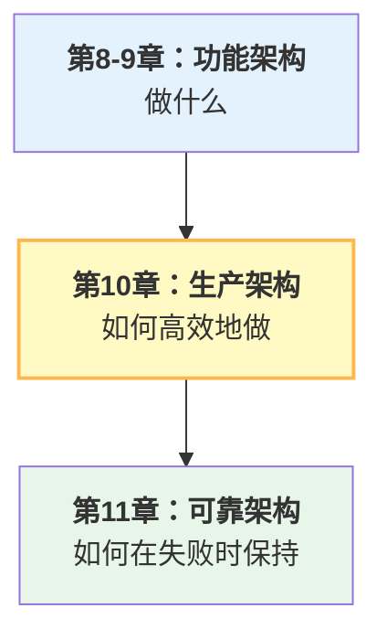

## 本章小结

### 核心知识点

#### 10.1 系统提示词工程

**模块化架构**：

- Core Identity(核心身份，不可缓存，2KB)
- Capabilities(能力说明，可缓存，20KB)
- Domain Knowledge(领域知识，可缓存，25KB)
- Context-Specific(上下文特定，不可缓存，7KB)

**关键指标**：

- 总大小：54KB(Claude模型限制)
- 缓存边界：47KB
- 缓存节省：缓存命中时可节省约90%的缓存部分输入令牌成本
- 推荐模块划分以最大化缓存命中率

#### 10.2 插件与扩展体系

**四种扩展类型**：

1. Plugin：完整功能模块
2. Skill：单一能力（工具集）
3. Hook：系统事件回调
4. Command：User-facing命令

**关键概念**：

- 插件应该是完全独立的
- Hook应该是同步且快速的
- 版本兼容性必须明确声明
- 插件市场管理和版本控制

#### 10.3 性能优化

**三个维度**：

1. **令牌效率**：缓存、压缩、精简提示词
2. **延迟优化**：并发、流式、预热缓存
3. **成本控制**：模型降级、批处理、指标监控

**关键优化**：

- Schema缓存(30-50%令牌节省)
- 系统提示词缓存(缓存命中时约90%输入成本节省)
- 并发工具调用(3倍延迟改进)
- 流式处理大型响应

#### 10.4 配置与特性门控

**配置层级**：

1. 编译时：Bun feature()死代码消除
2. 环境级：.env文件和环境变量
3. 运行时：GrowthBook特性门控
4. 用户级：个人配置和偏好

**灰度发布**：

- 百分比分组(1%, 10%, 100%)
- 用户分组(特定Agent、部门)
- 时间表（计划发布）
- 自动回滚条件

#### 10.5 MiniHarness生产化

实现了完整的生产级MiniHarness，包含：

- 模块化系统提示词
- 配置管理系统
- 简单的插件加载机制
- 运行时特性门控

### 本章在整体架构中的地位

位置如下：

### 生产化检查清单

#### 系统提示词

- [ ] 提示词按模块组织
- [ ] 静态部分尽可能多（便于缓存）
- [ ] 动态部分尽可能少
- [ ] 定期审查令牌使用

#### 配置管理

- [ ] 至少三个环境(dev、staging、prod)
- [ ] 敏感信息使用环境变量
- [ ] 配置变更不需要重新部署
- [ ] 配置版本控制和审计

#### 性能指标

- [ ] 监控平均延迟(目标<2s)
- [ ] 监控令牌使用(目标<50%基线)
- [ ] 监控错误率(目标<1%)
- [ ] 监控成本（按令牌计费）

#### 特性发布

- [ ] 新功能先在1%用户测试
- [ ] 监控特定的成功指标
- [ ] 自动回滚条件已定义
- [ ] 有调查日志记录相关信息

### 与其他章节的关联

- ← 第9章提供MCP工具支持
- → 第11章使用这里的配置来控制容错策略

### 扩展方向

#### 短期

1. 实现完整的配置热加载
2. 添加更多运行时度量
3. 支持配置版本回滚

#### 长期

1. 分布式配置中心(Consul/etcd)
2. 自动特性推荐系统
3. 提示词自动优化和调优
4. 成本预测和优化建议

### 本章总结

第十章聚焦于将Harness从可工作的系统转变为可靠、高效、可维护的生产系统。通过模块化系统提示词、灵活的配置管理和特性门控，Harness能够在不停机的情况下进行改进和发布。

**关键成果**：

- 模块化提示词架构充分利用缓存
- 灵活的配置支持多环境部署
- 特性门控支持安全的渐进式发布
- 插件系统支持功能扩展
- 完整的性能监控和优化框架

这些生产级的考量确保了Harness能够在实际业务中可靠运行，同时保持代码质量和迭代速度。
