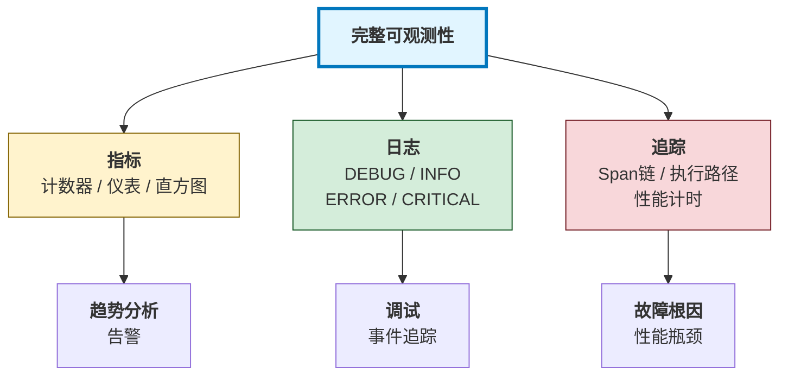

## 11.1 可观测性体系

可观测性(Observability)是现代系统工程的基础。它通过三大支柱——指标(Metrics)、日志(Logs)和追踪(Traces)——帮助我们理解系统的内部状态。

> **行业现状**
>
> LangChain《State of Agent Engineering》调研数据(1300+从业者)：
> - **89%** 的组织已部署Agent可观测性基础设施
> - **94%** 的生产阶段组织拥有完整可观测性
> - **62%** 实现了详细的步骤级追踪(step-level tracing)
> - **质量(32%)** 是生产环境的首要障碍，而非成本
>
> 这些数据表明：可观测性已成为行业共识，但从“可观测”到“可评估”再到“可优化”的闭环仍有巨大差距。

### 11.1.1 三大支柱

可观测性体系建立在指标(Metrics)、日志(Logs)和追踪(Traces)三大支柱之上，三者协同构成完整的系统观测能力。



图 11-1：可观测性三大支柱

### 11.1.2 1. Metrics

指标是关键数值的时间序列数据，用于监控系统健康状态。
指标系统分为两个核心层：**底层收集器** 和 **Agent 特定指标**。

首先是通用的指标收集器，支持计数器(counter)、仪表(gauge)和直方图(histogram)三种数据类型：

```python
# core/metrics_collector.py
from typing import Dict, Any
from datetime import datetime
from collections import defaultdict
import time

class MetricsCollector:
    """指标收集器：计数器、仪表、直方图"""

    def __init__(self):
        self.counters: Dict[str, int] = defaultdict(int)
        self.gauges: Dict[str, float] = {}
        self.histograms: Dict[str, list] = defaultdict(list)
        self.start_time = time.time()

    def increment_counter(self, name: str, value: int = 1, tags: Dict = None) -> None:
        """增加计数器"""
        key = self._make_key(name, tags)
        self.counters[key] += value

    def set_gauge(self, name: str, value: float, tags: Dict = None) -> None:
        """设置仪表值"""
        key = self._make_key(name, tags)
        self.gauges[key] = value

    def record_histogram(self, name: str, value: float, tags: Dict = None) -> None:
        """记录直方图值"""
        key = self._make_key(name, tags)
        self.histograms[key].append({
            "value": value,
            "timestamp": datetime.now().isoformat(),
        })

    def _make_key(self, name: str, tags: Dict) -> str:
        """生成带标签的指标键"""
        if not tags:
            return name
        tag_str = ",".join(f"{k}={v}" for k, v in sorted(tags.items()))
        return f"{name}{{{tag_str}}}"

    def get_percentile(self, name: str, percentile: int) -> float:
        """获取百分位数(如 P50、P99)"""
        if name not in self.histograms:
            return 0.0
        values = sorted([v["value"] for v in self.histograms[name]])
        index = int(len(values) * percentile / 100)
        return values[index] if index < len(values) else 0.0

    def get_summary(self) -> Dict[str, Any]:
        """获取指标摘要"""
        return {
            "counters": dict(self.counters),
            "gauges": dict(self.gauges),
            "histograms_summary": {
                name: {
                    "count": len(values),
                    "min": min(v["value"] for v in values),
                    "max": max(v["value"] for v in values),
                    "p50": self.get_percentile(name, 50),
                    "p99": self.get_percentile(name, 99),
                }
                for name, values in self.histograms.items()
            },
            "uptime_seconds": time.time() - self.start_time,
        }
```

Agent 特定的指标收集层记录工具调用和迭代的性能数据：

```python
# core/agent_metrics.py
class AgentMetrics:
    """Agent相关的指标"""

    def __init__(self):
        self.collector = MetricsCollector()

    def record_tool_call(
        self,
        tool_name: str,
        duration_ms: float,
        success: bool,
        tokens_used: int = 0,
    ) -> None:
        """记录单次工具调用：调用次数、延迟、令牌、成功率"""
        tags = {"tool": tool_name, "success": str(success)}
        self.collector.increment_counter("tool_calls_total", tags=tags)
        self.collector.record_histogram("tool_call_duration_ms", duration_ms, tags=tags)
        if tokens_used > 0:
            self.collector.record_histogram("tool_tokens_used", tokens_used, tags=tags)
        if success:
            self.collector.increment_counter("tool_calls_success", tags=tags)
        else:
            self.collector.increment_counter("tool_calls_failed", tags=tags)

    def record_agent_iteration(
        self,
        agent_id: str,
        duration_ms: float,
        tokens_used: int,
        tools_called: int,
    ) -> None:
        """记录 Agent 一次迭代的统计数据"""
        tags = {"agent": agent_id}
        # ... (省略辅助方法)
        self.collector.record_histogram("agent_iteration_ms", duration_ms, tags=tags)
        self.collector.record_histogram("agent_tokens_per_iteration", tokens_used, tags=tags)
        self.collector.record_histogram("agent_tools_per_iteration", tools_called, tags=tags)

    def get_dashboard_data(self) -> Dict[str, Any]:
        """获取仪表板数据"""
        summary = self.collector.get_summary()
        return {
            "total_tool_calls": summary["counters"].get("tool_calls_total", 0),
            "tool_success_rate": self._calculate_success_rate(summary),
            "avg_tool_latency_ms": self._calculate_avg_latency(summary),
            "p99_latency_ms": summary["histograms_summary"].get("tool_call_duration_ms", {}).get("p99", 0),
            "total_tokens": sum(summary["counters"].get(k, 0) for k in summary["counters"] if "tokens" in k),
        }

    def _calculate_success_rate(self, summary: Dict) -> float:
        """计算成功率百分比"""
        success = summary["counters"].get("tool_calls_success", 0)
        failed = summary["counters"].get("tool_calls_failed", 0)
        total = success + failed
        return (success / total * 100) if total > 0 else 0.0

    def _calculate_avg_latency(self, summary: Dict) -> float:
        """计算平均延迟(MIN + MAX)/ 2"""
        hist = summary["histograms_summary"].get("tool_call_duration_ms", {})
        return (hist.get("min", 0) + hist.get("max", 0)) / 2
```

### 11.1.3 2. Logs

结构化日志用于记录事件和调试信息。
结构化日志的核心是将日志事件转换为 JSON 格式，包含时间戳、日志级别、服务名和附加上下文：

```python
# core/structured_logger.py
import json
from enum import Enum
from datetime import datetime

class LogLevel(Enum):
    DEBUG = 10
    INFO = 20
    WARNING = 30
    ERROR = 40
    CRITICAL = 50

class StructuredLogger:
    """结构化日志记录器"""

    def __init__(self, service_name: str):
        self.service_name = service_name
        self.logs = []

    def log(self, level: LogLevel, message: str, **kwargs) -> None:
        """记录结构化日志为 JSON"""
        log_entry = {
            "timestamp": datetime.now().isoformat(),
            "level": level.name,
            "service": self.service_name,
            "message": message,
            **kwargs,
        }
        self.logs.append(log_entry)
        print(json.dumps(log_entry))

    # 便捷方法
    def debug(self, message: str, **kwargs) -> None:
        self.log(LogLevel.DEBUG, message, **kwargs)

    def info(self, message: str, **kwargs) -> None:
        self.log(LogLevel.INFO, message, **kwargs)

    def warning(self, message: str, **kwargs) -> None:
        self.log(LogLevel.WARNING, message, **kwargs)

    def error(self, message: str, **kwargs) -> None:
        self.log(LogLevel.ERROR, message, **kwargs)

    def critical(self, message: str, **kwargs) -> None:
        self.log(LogLevel.CRITICAL, message, **kwargs)
```

日志记录器支持特定于 Agent 的便利方法，用于记录工具调用和决策过程：

```python
# 日志记录的智能体专用方法
class StructuredLogger:
    # ... (其他方法如上)

    def log_tool_call(
        self,
        tool_name: str,
        agent_id: str,
        duration_ms: float,
        success: bool,
        error: str = None,
    ) -> None:
        """记录工具调用的性能数据"""
        self.info(
            f"Tool call: {tool_name}",
            tool_name=tool_name,
            agent_id=agent_id,
            duration_ms=duration_ms,
            success=success,
            error=error,
        )

    def log_agent_decision(
        self,
        agent_id: str,
        decision: str,
        reasoning: str,
        confidence: float,
    ) -> None:
        """记录 Agent 决策及其推理"""
        self.info(
            f"Agent decision: {decision}",
            agent_id=agent_id,
            decision=decision,
            reasoning=reasoning,
            confidence=confidence,
        )
```

### 11.1.4 3. Traces

分布式追踪用于跟踪单个请求通过系统的完整路径。
分布式追踪通过 Span（跨度）来记录操作的执行路径。每个 Span 代表一个操作，包含时间戳、标签和状态信息：

```python
# core/tracer.py
import uuid
import time
from dataclasses import dataclass
from typing import Dict, Any, List
from collections import defaultdict

@dataclass
class Span:
    """追踪跨度：表示一个操作的开始、结束和时间"""
    trace_id: str
    span_id: str
    parent_span_id: str
    operation_name: str
    start_time: float
    end_time: float = None
    duration_ms: float = None
    tags: Dict[str, Any] = None
    status: str = "ok"

    def finish(self) -> None:
        """完成 Span 的记录"""
        self.end_time = time.time()
        self.duration_ms = (self.end_time - self.start_time) * 1000

class Tracer:
    """分布式追踪记录器"""

    def __init__(self, service_name: str):
        self.service_name = service_name
        self.traces: Dict[str, list] = defaultdict(list)
        self.current_trace_id: str = None
        self.current_span_id: str = None

    def start_trace(self, request_id: str = None) -> str:
        """开始新的追踪(对应一个请求)"""
        self.current_trace_id = request_id or str(uuid.uuid4())
        self.current_span_id = None
        return self.current_trace_id

    def start_span(
        self,
        operation_name: str,
        parent_span_id: str = None,
        tags: Dict = None,
    ) -> Span:
        """开始新的 Span(子操作)"""
        span_id = str(uuid.uuid4())
        parent = parent_span_id or self.current_span_id
        span = Span(
            trace_id=self.current_trace_id,
            span_id=span_id,
            parent_span_id=parent,
            operation_name=operation_name,
            start_time=time.time(),
            tags=tags or {},
        )
        self.traces[self.current_trace_id].append(span)
        self.current_span_id = span_id
        return span

    def get_trace(self, trace_id: str) -> Dict[str, Any]:
        """获取完整的追踪数据(包括所有 Span)"""
        spans = self.traces.get(trace_id, [])
        root_spans = [s for s in spans if s.parent_span_id is None]
        total_duration = sum(s.duration_ms for s in spans if s.duration_ms)
        return {
            "trace_id": trace_id,
            "service": self.service_name,
            "spans": len(spans),
            "total_duration_ms": total_duration,
            "root_operations": [s.operation_name for s in root_spans],
        }
```

可观测性系统的集成使用示例。在执行工具时同时记录指标、日志和追踪：

```python
# 集成使用：指标 + 日志 + 追踪
logger = StructuredLogger("MiniHarness")
metrics = AgentMetrics()
tracer = Tracer("MiniHarness")

async def execute_tool_with_observability(
    tool_name: str,
    arguments: Dict,
    agent_id: str,
) -> Dict:
    """执行工具时记录完整的可观测信息"""
    trace_id = tracer.start_trace()
    span = tracer.start_span(f"tool.{tool_name}", tags={"tool": tool_name, "agent": agent_id})
    start_time = time.time()

    try:
        logger.debug(f"Calling tool: {tool_name}", tool=tool_name)
        # ... (省略实际工具调用逻辑)
        success, result, error = await registry.call_tool(tool_name, arguments, agent_id)
        duration_ms = (time.time() - start_time) * 1000

        if success:
            span.status = "ok"
            logger.info(f"Tool call succeeded", tool=tool_name, duration_ms=int(duration_ms))
            metrics.record_tool_call(tool_name, duration_ms, True)
        else:
            span.status = "error"
            logger.error(f"Tool call failed", tool=tool_name, error=error)
            metrics.record_tool_call(tool_name, duration_ms, False)

        return {"success": success, "result": result, "error": error}

    except Exception as e:
        span.status = "error"
        logger.critical(f"Tool call exception", tool=tool_name, exception=str(e))
        raise
    finally:
        span.finish()
```

### 11.1.5 监控仪表板

可观测性仪表板将指标、日志和追踪聚合到单一界面：

```python
# core/observability_dashboard.py
class ObservabilityDashboard:
    """可观测性仪表板：聚合所有可观测数据"""

    def __init__(self, metrics: AgentMetrics, logger: StructuredLogger, tracer: Tracer):
        self.metrics = metrics
        self.logger = logger
        self.tracer = tracer

    def get_dashboard(self) -> Dict[str, Any]:
        """获取完整的仪表板数据(KPI + 日志 + 追踪)"""
        return {
            "metrics": self.metrics.get_dashboard_data(),
            "recent_logs": self.logger.logs[-100:],
            "active_traces": len([l for l in self.logger.logs if "trace_id" in l]),
            "error_rate_percent": self._calculate_error_rate(),
            "health_status": self._determine_health_status(),
        }

    def _calculate_error_rate(self) -> float:
        """计算错误日志百分比"""
        total_logs = len(self.logger.logs)
        error_logs = sum(1 for l in self.logger.logs if l.get("level") in ["ERROR", "CRITICAL"])
        return (error_logs / total_logs * 100) if total_logs > 0 else 0.0

    def _determine_health_status(self) -> str:
        """根据错误率判断系统健康状态"""
        error_rate = self._calculate_error_rate()
        if error_rate > 5:
            return "critical"
        elif error_rate > 1:
            return "warning"
        else:
            return "healthy"
```

### 11.1.6 本小节小结

可观测性的三大支柱：

1. **Metrics**：关键数值指标，用于趋势分析和告警
2. **Logs**：结构化日志，用于调试和事件追踪
3. **Traces**：分布式追踪，用于理解请求的完整路径

对于智能体系统，关键指标包括：

- 工具调用的成功率和延迟
- 令牌使用量和成本
- Agent迭代的深度和广度
- 整体系统的吞吐量和可用性

实现完整的可观测性是设计容错系统的第一步。下一节将讨论如何利用这些信息来建立反馈循环。

**行业现状：可观测性与评估的落差**

LangChain 发布的《State of Agent Engineering》报告(调研 1300+ 从业者)揭示了一个值得关注的现象：**89% 的组织已部署可观测性基础设施，但评估(evals)的采用率仅为 52%**。这意味着大多数团队能够“看到”智能体在做什么，却缺乏系统化的方法来判断“做得好不好”。

报告的其他关键数据同样值得 Harness 工程师关注：

- 57% 的组织已有智能体在生产环境运行
- **质量是最大障碍**(32%)，成本反而不再是主要关切
- 57% 不做微调，依赖 base model + prompt engineering + RAG

这些数据表明：可观测性已成为共识，但从“可观测”到“可评估”再到“可优化”的闭环仍有巨大差距。第 13 章将深入讨论评估体系的构建。
