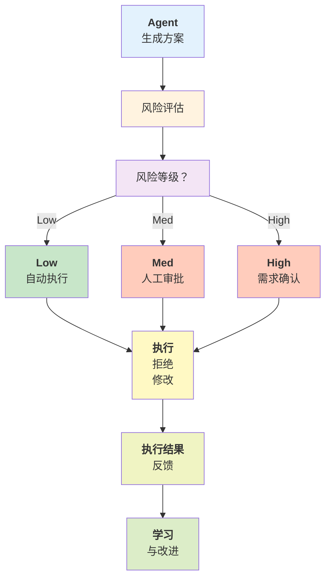

## 11.2 反馈循环与人机协同设计

AI Agent 系统的可靠性关键在于与人类的有效协作。本节介绍反馈循环设计、人在环（HITL）模式、审批工作流、权限解释机制和 Ask-First 机制，确保 Agent 的关键决策获得人类监督。

### 11.2.1 HITL 模式

#### HITL 流程图

人在环决策的核心流程如下：



图 11-2：人在环决策流程

#### 风险评估模块

风险评估模块的核心实现：
风险评估器使用加权因子模型来量化操作的风险等级。首先定义数据结构和因子权重：

```python
# core/risk_assessment.py
from enum import Enum
from dataclasses import dataclass
from typing import Any, Dict

class RiskLevel(Enum):
    """风险等级"""
    LOW = 1
    MEDIUM = 2
    HIGH = 3
    CRITICAL = 4

@dataclass
class RiskAssessment:
    """风险评估结果"""
    level: RiskLevel
    score: float  # 0-100
    factors: Dict[str, float]
    explanation: str
    recommended_action: str
    requires_approval: bool

class RiskEvaluator:
    """风险评估器：加权因子模型"""

    def __init__(self):
        self.weights = {
            'data_sensitivity': 0.3,
            'financial_impact': 0.25,
            'irreversibility': 0.2,
            'confidence': 0.15,
            'user_authorization': 0.1
        }

    def assess(
        self,
        action_type: str,
        params: Dict[str, Any],
        context: Dict[str, Any],
        model_confidence: float = 0.8
    ) -> RiskAssessment:
        """评估操作的风险等级(0-100分)"""
        factors = {}
        factors['data_sensitivity'] = self._assess_data_sensitivity(params, context)
        factors['financial_impact'] = self._assess_financial_impact(action_type, params)
        factors['irreversibility'] = self._assess_irreversibility(action_type)
        factors['confidence'] = max(0, 1.0 - model_confidence)
        factors['user_authorization'] = self._assess_authorization(context)

        # 加权求和得到风险分数
        score = sum(factors.get(f, 0) * weight for f, weight in self.weights.items()) * 100

        # 分数映射到风险等级
        if score < 20:
            level = RiskLevel.LOW
        elif score < 50:
            level = RiskLevel.MEDIUM
        elif score < 80:
            level = RiskLevel.HIGH
        else:
            level = RiskLevel.CRITICAL

        return RiskAssessment(
            level=level,
            score=score,
            factors=factors,
            explanation=self._explain_risk(level, factors),
            recommended_action=self._recommend_action(level),
            requires_approval=level in (RiskLevel.HIGH, RiskLevel.CRITICAL)
        )
```

风险评估器的内部评分方法包括敏感性、财务影响和不可逆性评估：

```python
# RiskEvaluator 的评分方法
class RiskEvaluator:
    # ... (初始化如上)

    def _assess_data_sensitivity(self, params: dict, context: dict) -> float:
        """检查参数中是否包含敏感字段(密码、令牌等)"""
        sensitivity_keywords = ['password', 'token', 'secret', 'key', 'ssn', 'credit_card']
        for key in params:
            if any(keyword in key.lower() for keyword in sensitivity_keywords):
                return 1.0
        user_level = context.get('user_permission_level', 0)
        return user_level / 10

    def _assess_financial_impact(self, action_type: str, params: dict) -> float:
        """评估财务操作的风险和金额"""
        financial_actions = {
            'transfer': 0.9, 'charge': 0.8, 'refund': 0.7, 'delete_transaction': 0.85
        }
        base_score = financial_actions.get(action_type, 0.0)
        amount = params.get('amount', 0)
        if amount > 10000:
            base_score = min(1.0, base_score + 0.2)
        return base_score

    def _assess_irreversibility(self, action_type: str) -> float:
        """评估操作是否不可逆"""
        irreversible_actions = {
            'delete': 1.0, 'archive': 0.8, 'disable': 0.6, 'publish': 0.4, 'modify': 0.3
        }
        return irreversible_actions.get(action_type, 0.2)

    def _assess_authorization(self, context: dict) -> float:
        """检查用户是否已明确授权"""
        has_explicit_consent = context.get('has_explicit_consent', False)
        return 0.0 if has_explicit_consent else 1.0

    def _explain_risk(self, level: RiskLevel, factors: dict) -> str:
        """生成人类可读的风险解释"""
        explanations = {
            RiskLevel.LOW: "Low risk: Action is safe to execute automatically.",
            RiskLevel.MEDIUM: "Medium risk: Recommend human review before execution.",
            RiskLevel.HIGH: "High risk: Requires explicit human approval.",
            RiskLevel.CRITICAL: "Critical risk: Requires manager approval and logging."
        }
        return explanations[level]

    def _recommend_action(self, level: RiskLevel) -> str:
        """根据风险等级推荐执行方式"""
        actions = {
            RiskLevel.LOW: "auto_execute",
            RiskLevel.MEDIUM: "request_approval",
            RiskLevel.HIGH: "require_approval",
            RiskLevel.CRITICAL: "escalate_to_manager"
        }
        return actions[level]
```

### 11.2.2 审批工作流

审批工作流通过状态机管理请求的生命周期。首先定义审批请求的数据结构：

```python
# core/approval_workflow.py
from enum import Enum
from dataclasses import dataclass, field
from datetime import datetime, timedelta
from typing import List, Optional, Callable
import uuid

class ApprovalStatus(Enum):
    """审批请求的状态"""
    PENDING = "pending"
    APPROVED = "approved"
    REJECTED = "rejected"
    NEEDS_CLARIFICATION = "needs_clarification"
    EXPIRED = "expired"

@dataclass
class ApprovalRequest:
    """审批请求对象"""
    id: str
    action_type: str
    action_params: dict
    requester_id: str
    request_time: datetime
    required_approvals: int
    approval_timeout_minutes: int = 60
    approvals: List[dict] = field(default_factory=list)
    rejections: List[dict] = field(default_factory=list)
    status: ApprovalStatus = ApprovalStatus.PENDING
    notes: str = ""

    def is_approved(self) -> bool:
        """检查是否已获得所有必要的批准"""
        if self.status == ApprovalStatus.APPROVED:
            return True
        if self.status in (ApprovalStatus.REJECTED, ApprovalStatus.EXPIRED):
            return False
        return len(self.approvals) >= self.required_approvals

    def is_expired(self) -> bool:
        """检查请求是否已超时"""
        expiry_time = self.request_time + timedelta(minutes=self.approval_timeout_minutes)
        return datetime.now() > expiry_time

    def get_remaining_approvals(self) -> int:
        """获取还需要的批准数"""
        return max(0, self.required_approvals - len(self.approvals))
```

审批工作流管理器提供创建、批准、拒绝和查询请求的操作：

```python
# 审批工作流管理器
class ApprovalWorkflow:
    """管理审批请求的生命周期"""

    def __init__(self):
        self.requests: dict[str, ApprovalRequest] = {}
        self.callbacks: dict[str, List[Callable]] = {}

    def create_request(
        self,
        action_type: str,
        action_params: dict,
        requester_id: str,
        required_approvals: int = 1,
        timeout_minutes: int = 60
    ) -> ApprovalRequest:
        """创建新的审批请求"""
        request_id = str(uuid.uuid4())
        request = ApprovalRequest(
            id=request_id,
            action_type=action_type,
            action_params=action_params,
            requester_id=requester_id,
            request_time=datetime.now(),
            required_approvals=required_approvals,
            approval_timeout_minutes=timeout_minutes
        )
        self.requests[request_id] = request
        self._trigger_callbacks('on_request_created', request)
        return request

    def approve(self, request_id: str, approver_id: str, comments: str = "") -> bool:
        """批准请求"""
        if request_id not in self.requests:
            return False
        request = self.requests[request_id]
        if request.is_expired():
            request.status = ApprovalStatus.EXPIRED
            self._trigger_callbacks('on_request_expired', request)
            return False
        request.approvals.append({'approver_id': approver_id, 'time': datetime.now(), 'comments': comments})
        if request.is_approved():
            request.status = ApprovalStatus.APPROVED
            self._trigger_callbacks('on_request_approved', request)
        return True

    def reject(self, request_id: str, reviewer_id: str, reason: str) -> bool:
        """拒绝请求"""
        if request_id not in self.requests:
            return False
        request = self.requests[request_id]
        request.status = ApprovalStatus.REJECTED
        request.rejections.append({'reviewer_id': reviewer_id, 'time': datetime.now(), 'reason': reason})
        self._trigger_callbacks('on_request_rejected', request)
        return True

    def request_clarification(self, request_id: str, clarifier_id: str, question: str) -> bool:
        """请求澄清"""
        if request_id not in self.requests:
            return False
        request = self.requests[request_id]
        request.status = ApprovalStatus.NEEDS_CLARIFICATION
        request.notes = question
        self._trigger_callbacks('on_clarification_requested', request)
        return True

    def get_request(self, request_id: str) -> Optional[ApprovalRequest]:
        """获取单个请求"""
        return self.requests.get(request_id)

    def get_pending_requests(self) -> List[ApprovalRequest]:
        """获取所有待审批的请求"""
        return [r for r in self.requests.values() if r.status == ApprovalStatus.PENDING and not r.is_expired()]

    def register_callback(self, event: str, callback: Callable):
        """为事件注册回调处理器"""
        if event not in self.callbacks:
            self.callbacks[event] = []
        self.callbacks[event].append(callback)

    def _trigger_callbacks(self, event: str, request: ApprovalRequest):
        """触发事件回调"""
        if event in self.callbacks:
            for callback in self.callbacks[event]:
                callback(request)
```

### 11.2.3 权限解释器

权限解释器使用 LLM 来理解用户的自然语言权限声明：

```python
# core/permission_interpreter.py
from anthropic import Anthropic
from dataclasses import dataclass
from typing import List
import json

@dataclass
class PermissionDeclaration:
    """权限声明的解释结果"""
    user_input: str
    interpreted_permissions: List[str]
    confidence: float
    explanation: str

class PermissionInterpreter:
    """自然语言权限解释器"""

    def __init__(self):
        self.client = Anthropic()

    def interpret(self, user_declaration: str) -> PermissionDeclaration:
        """将用户的自然语言声明转换为权限列表"""
        system_prompt = """You are a permission interpreter for AI agents.
Analyze the user's declaration and extract the implied permissions.
Return a JSON object with:
{
  "permissions": ["permission1", "permission2"],
  "confidence": 0.95,
  "explanation": "The user is granting permission to X because Y"
}

Common patterns: "You can X" → grant X; "Don't X" → deny X; "Ask before Y" → conditional Y
"""
        response = self.client.messages.create(
            model="claude-sonnet-4-6",
            max_tokens=500,
            system=system_prompt,
            messages=[{"role": "user", "content": f"Interpret: {user_declaration}"}]
        )
        result = json.loads(response.content[0].text)
        return PermissionDeclaration(
            user_input=user_declaration,
            interpreted_permissions=result['permissions'],
            confidence=result['confidence'],
            explanation=result['explanation']
        )

    def ask_for_clarification(self, declaration: str, context: str) -> str:
        """在权限解释不清晰时请求澄清"""
        response = self.client.messages.create(
            model="claude-sonnet-4-6",
            max_tokens=300,
            messages=[{"role": "user", "content": f"""User said: "{declaration}"\nContext: {context}\nSuggest clarifying questions."""}]
        )
        return response.content[0].text
```

使用示例展示如何解释不同的权限声明：

```python
# 权限解释器使用示例
if __name__ == "__main__":
    interpreter = PermissionInterpreter()

    # 简单授权:删除缓存文件
    decl1 = interpreter.interpret("You can delete old cache files")
    print(f"Permissions: {decl1.interpreted_permissions}")
    print(f"Confidence: {decl1.confidence}")

    # 条件授权:数据库迁移但要求在删除表前确认
    decl2 = interpreter.interpret("Go ahead with migration, but confirm before dropping tables")
    print(f"Permissions: {decl2.interpreted_permissions}")

    # 请求澄清:对于含糊的权限声明
    clarification = interpreter.ask_for_clarification(
        "You can handle my emails",
        "Agent considering: send, delete, move"
    )
    print(f"Clarification questions:\n{clarification}")
```

### 11.2.4 OpenClaw Ask-First 模式

Ask-First 权限模型实现了 6 级信任框架。权限管理器跟踪用户的决策并根据时间或上下文变化重新询问：

```python
# core/ask_first_permission.py
from enum import Enum
from typing import Optional
from datetime import datetime, timedelta

class PermissionLevel(Enum):
    """6 级信任模型"""
    MANUAL_ONLY = "Manual-only"
    APPROVE_ALWAYS = "Approve-always"
    APPROVE_ONCE = "Approve-once"
    ASK_FIRST = "Ask-first"
    AUTO_WITH_NOTIFICATION = "Auto-with-notification"
    FULL_TRUST = "Full-trust"

class AskFirstManager:
    """Ask-First 权限管理器"""

    def __init__(self):
        self.user_decisions = {}  # {user_id: {action_type: (decision, timestamp)}}

    def should_ask(
        self,
        user_id: str,
        action_type: str,
        permission_level: PermissionLevel,
        context_changed: bool = False
    ) -> bool:
        """判断是否需要询问用户"""
        if permission_level == PermissionLevel.FULL_TRUST:
            return False
        if permission_level in (PermissionLevel.MANUAL_ONLY, PermissionLevel.APPROVE_ALWAYS, PermissionLevel.APPROVE_ONCE):
            return True

        if permission_level == PermissionLevel.ASK_FIRST:
            # 检查是否已有用户决策
            if user_id in self.user_decisions:
                action_key = self._normalize_action(action_type)
                if action_key in self.user_decisions[user_id]:
                    decision, timestamp = self.user_decisions[user_id][action_key]
                    # 24 小时后或上下文变化时重新询问
                    if context_changed or (datetime.now() - timestamp > timedelta(hours=24)):
                        return True
                    return not decision
            return True  # 首次询问

        if permission_level == PermissionLevel.AUTO_WITH_NOTIFICATION:
            return False
        return False

    def record_decision(
        self,
        user_id: str,
        action_type: str,
        approved: bool,
        remember_for_hours: int = 24
    ):
        """记录用户决定以便下次记忆"""
        if user_id not in self.user_decisions:
            self.user_decisions[user_id] = {}
        action_key = self._normalize_action(action_type)
        self.user_decisions[user_id][action_key] = (approved, datetime.now())

    def clear_decisions(self, user_id: str):
        """清除用户的决定缓存"""
        if user_id in self.user_decisions:
            del self.user_decisions[user_id]

    @staticmethod
    def _normalize_action(action_type: str) -> str:
        """规范化操作类型为小写"""
        return action_type.lower().strip()
```

Ask-First 对话模块负责生成询问提示和解析用户响应：

```python
# Ask-First 对话生成和解析
class AskFirstDialog:
    """Ask-First 对话生成和响应解析"""

    @staticmethod
    def generate_prompt(action_type: str, action_description: str, impact: str) -> str:
        """生成询问用户的提示"""
        return f"""The AI agent wants to perform the following action:

Action: {action_type}
Description: {action_description}
Impact: {impact}

Should I proceed? Please reply with:
- "yes" or "approve" to allow this action
- "no" or "deny" to block this action
- "ask next time" if you want to be asked again next time
- Or provide modified parameters"""

    @staticmethod
    def parse_response(user_response: str) -> dict:
        """解析用户的响应"""
        response_lower = user_response.lower().strip()

        if response_lower in ('yes', 'approve', 'ok', 'proceed'):
            return {'approved': True, 'remember': True}
        elif response_lower in ('no', 'deny', 'block', 'cancel'):
            return {'approved': False, 'remember': True}
        elif 'ask next time' in response_lower or 'ask again' in response_lower:
            return {'approved': None, 'remember': False}
        else:
            return {'approved': None, 'modified_params': user_response}
```

### 11.2.5 用户反馈采集

反馈系统收集用户对 Agent 操作的评价，并分析改进领域。首先定义反馈数据结构：

```python
# core/user_feedback.py
from dataclasses import dataclass
from enum import Enum
from datetime import datetime
from typing import List, Optional
import uuid

class FeedbackType(Enum):
    """反馈类型"""
    POSITIVE = "positive"
    NEGATIVE = "negative"
    CORRECTION = "correction"
    PARTIAL = "partial"
    IRRELEVANT = "irrelevant"

@dataclass
class UserFeedback:
    """用户反馈对象"""
    feedback_id: str
    action_id: str
    feedback_type: FeedbackType
    rating: int  # 1-5
    comment: str
    user_id: str
    timestamp: datetime
    category: Optional[str] = None

class FeedbackCollector:
    """反馈采集器"""

    def __init__(self):
        self.feedbacks: List[UserFeedback] = []

    def collect(
        self,
        action_id: str,
        feedback_type: FeedbackType,
        rating: int,
        comment: str,
        user_id: str,
        category: str = None
    ) -> UserFeedback:
        """采集单条反馈"""
        feedback = UserFeedback(
            feedback_id=str(uuid.uuid4()),
            action_id=action_id,
            feedback_type=feedback_type,
            rating=rating,
            comment=comment,
            user_id=user_id,
            timestamp=datetime.now(),
            category=category
        )
        self.feedbacks.append(feedback)
        return feedback

    def get_action_feedback(self, action_id: str) -> List[UserFeedback]:
        """获取特定操作的所有反馈"""
        return [f for f in self.feedbacks if f.action_id == action_id]

    def get_stats(self) -> dict:
        """获取反馈的聚合统计"""
        total = len(self.feedbacks)
        if total == 0:
            return {'total': 0}

        types = {}
        for feedback in self.feedbacks:
            types[feedback.feedback_type.value] = types.get(feedback.feedback_type.value, 0) + 1

        avg_rating = sum(f.rating for f in self.feedbacks) / total

        return {
            'total': total,
            'types': types,
            'average_rating': avg_rating,
            'negative_percentage': types.get('negative', 0) / total * 100
        }

    def get_improvement_areas(self) -> List[str]:
        """识别需要改进的领域(按负面反馈频率排序)"""
        negative_feedbacks = [f for f in self.feedbacks if f.feedback_type == FeedbackType.NEGATIVE]

        categories = {}
        for feedback in negative_feedbacks:
            category = feedback.category or 'general'
            categories[category] = categories.get(category, 0) + 1

        return sorted(categories.items(), key=lambda x: x[1], reverse=True)
```

### 11.2.6 实战：完整的 HITL 系统

实现代码如下：

```python
# examples/hitl_system_example.py
"""
完整的人在环决策系统示例
"""

import asyncio
from datetime import datetime

class HITLSystem:
    """人在环决策系统"""

    def __init__(self):
        self.risk_evaluator = RiskEvaluator()
        self.approval_workflow = ApprovalWorkflow()
        self.permission_interpreter = PermissionInterpreter()
        self.feedback_collector = FeedbackCollector()
        self.ask_first_manager = AskFirstManager()

    async def execute_action(
        self,
        user_id: str,
        action_type: str,
        action_params: dict,
        agent_confidence: float = 0.8
    ) -> dict:
        """
        执行行为,带人在环审批

        流程:
        1. 风险评估
        2. 根据风险等级决定是否需要审批
        3. 创建审批请求或直接执行
        4. 收集反馈
        """

        # 步骤 1:风险评估
        context = {'user_id': user_id}
        risk_assessment = self.risk_evaluator.assess(
            action_type, action_params, context, agent_confidence
        )

        print(f"Risk Assessment: {risk_assessment.level.name}")
        print(f"Score: {risk_assessment.score:.1f}")

        # 步骤 2:确定执行方式
        if risk_assessment.level.value <= 1:  # LOW
            # 自动执行
            return await self._auto_execute(action_type, action_params)

        elif risk_assessment.level.value == 2:  # MEDIUM
            # Ask-First 模式
            should_ask = self.ask_first_manager.should_ask(
                user_id, action_type, PermissionLevel.ASK_FIRST
            )

            if should_ask:
                return await self._request_confirmation(
                    user_id, action_type, action_params
                )
            else:
                return await self._auto_execute(action_type, action_params)

        else:  # HIGH or CRITICAL
            # 创建审批请求
            return await self._request_approval(
                user_id, action_type, action_params, risk_assessment
            )

    async def _auto_execute(self, action_type: str, action_params: dict) -> dict:
        """自动执行"""
        print(f"Auto-executing {action_type}")
        # 实际执行逻辑
        return {'status': 'executed', 'action': action_type}

    async def _request_confirmation(
        self,
        user_id: str,
        action_type: str,
        action_params: dict
    ) -> dict:
        """请求确认"""
        prompt = AskFirstDialog.generate_prompt(
            action_type,
            f"Execute {action_type} with params {action_params}",
            "Medium risk operation"
        )

        print(f"\nRequesting confirmation:\n{prompt}")
        user_response = input("Your response: ")

        decision = AskFirstDialog.parse_response(user_response)

        if decision['approved']:
            self.ask_first_manager.record_decision(user_id, action_type, True)
            return await self._auto_execute(action_type, action_params)
        else:
            return {'status': 'rejected', 'reason': 'User denied'}

    async def _request_approval(
        self,
        user_id: str,
        action_type: str,
        action_params: dict,
        risk_assessment
    ) -> dict:
        """请求审批"""
        request = self.approval_workflow.create_request(
            action_type=action_type,
            action_params=action_params,
            requester_id=user_id,
            required_approvals=2 if risk_assessment.level == RiskLevel.CRITICAL else 1
        )

        print(f"\nApproval request created: {request.id}")
        print(f"Risk level: {risk_assessment.level.name}")
        print(f"Explanation: {risk_assessment.explanation}")

        # 模拟审批流程
        # 在实际系统中,这会通过通知系统发给审批人员
        return {
            'status': 'pending_approval',
            'request_id': request.id
        }

# 使用示例
async def main():
    hitl = HITLSystem()

    # 测试场景 1:低风险操作(自动执行)
    print("=" * 50)
    print("Scenario 1: Low-risk operation")
    result1 = await hitl.execute_action(
        user_id="user_123",
        action_type="read_logs",
        action_params={"hours": 24},
        agent_confidence=0.95
    )
    print(f"Result: {result1}\n")

    # 测试场景 2:中等风险(Ask-First)
    print("=" * 50)
    print("Scenario 2: Medium-risk operation")
    result2 = await hitl.execute_action(
        user_id="user_123",
        action_type="modify_settings",
        action_params={"setting": "cache_ttl", "value": 7200},
        agent_confidence=0.7
    )
    print(f"Result: {result2}\n")

    # 测试场景 3:高风险(需要审批)
    print("=" * 50)
    print("Scenario 3: High-risk operation")
    result3 = await hitl.execute_action(
        user_id="user_123",
        action_type="delete_data",
        action_params={"table": "users", "condition": "created_before_2020"},
        agent_confidence=0.6
    )
    print(f"Result: {result3}\n")

if __name__ == "__main__":
    asyncio.run(main())
```

### 11.2.7 运行时指令注入

前面讨论的反馈机制（审批、Ask-First、反馈采集）都是 **预设流程**——系统在特定节点等待用户响应。但在长时间运行的 Agent 任务中，用户需要能在 **任意时刻** 向正在执行的 Agent 发送新指令，而不必等到下一个预设检查点。

#### 指令注入的架构

运行时指令注入通过独立的 **控制通道** 实现，与 Agent 的数据通道（Think-Act-Observe 循环）并行运行：

```python
from dataclasses import dataclass, field
from enum import IntEnum
from typing import Optional
import asyncio
import time

class InstructionPriority(IntEnum):
    URGENT = 0    # 立即处理(如 "停止")
    HIGH = 1      # 下一个安全点处理(如 "换个方向")
    NORMAL = 2    # 当前步骤完成后处理(如 "顺便也看看 X")
    LOW = 3       # 空闲时处理(如 "改进输出格式")

@dataclass(order=True)
class RuntimeInstruction:
    priority: InstructionPriority
    content: str = field(compare=False)
    timestamp: float = field(default_factory=time.time, compare=False)
    source: str = field(default="user", compare=False)

class InstructionChannel:
    """Agent 运行时指令通道"""

    def __init__(self):
        self._queue: asyncio.PriorityQueue = asyncio.PriorityQueue()

    async def inject(self, instruction: RuntimeInstruction):
        """外部系统注入指令"""
        await self._queue.put(instruction)

    async def poll(self) -> Optional[RuntimeInstruction]:
        """Agent 在安全点轮询指令"""
        if self._queue.empty():
            return None
        return await self._queue.get()

    def has_urgent(self) -> bool:
        """检查是否有紧急指令(不阻塞)"""
        # 实现需根据具体 PriorityQueue 适配
        return not self._queue.empty()
```

#### 安全点与状态一致性

Agent 不能在任意时刻处理注入指令——必须在 **安全点** 处理，以保证状态一致性：

```python
class SafeCheckpoint:
    """安全检查点标记"""
    BEFORE_LLM_CALL = "before_llm"      # LLM 调用前
    AFTER_TOOL_EXEC = "after_tool"       # 工具执行后
    AT_TASK_BOUNDARY = "task_boundary"   # 任务边界
    BEFORE_STATE_UPDATE = "before_state" # 状态更新前

class AgentWithInjection:
    """支持运行时指令注入的 智能体循环"""

    def __init__(self, channel: InstructionChannel):
        self.channel = channel
        self._context_additions: list[str] = []

    async def _process_instructions(self, checkpoint: str):
        """在安全检查点处理所有待处理指令"""
        while True:
            instr = await self.channel.poll()
            if instr is None:
                break

            if instr.content.startswith("STOP"):
                raise StopIteration("User stop")
            elif instr.content.startswith("PAUSE"):
                await self._wait_for_resume()
            else:
                # 将指令追加到上下文,影响后续推理
                self._context_additions.append(
                    f"[用户指令 @ {checkpoint}]: {instr.content}"
                )

    async def run_step(self, step):
        # 安全点 1: LLM 调用前
        await self._process_instructions(SafeCheckpoint.BEFORE_LLM_CALL)

        # 执行 LLM 推理(携带注入的上下文)
        result = await self.llm_call(step, extra_context=self._context_additions)

        # 安全点 2: 工具执行后
        if result.needs_tool:
            tool_result = await self.execute_tool(result.tool_call)
            await self._process_instructions(SafeCheckpoint.AFTER_TOOL_EXEC)

        return result
```

这种设计确保注入的指令不会破坏 Agent 的中间状态，而是在下一个安全点被优雅地吸收到执行流程中。

### 11.2.8 总结

反馈循环与人机协同的关键组件：

| 组件 | 作用 | 参考系统 |
|-----|------|--------|
| 风险评估 | 量化操作风险 | 独立设计 |
| HITL 工作流 | 根据风险级别决定执行方式 | 独立设计 |
| 审批工作流 | 高风险操作的正式审批 | OpenClaw |
| 权限解释 | 自然语言权限授予 | Claude Code |
| Ask-First | 首次询问，后续记忆 | OpenClaw |
| 反馈采集 | 从用户反馈中学习 | 独立设计 |
| 运行时指令注入 | 执行中接受新指令 | 控制通道 + 安全点 |

下一节将介绍容错模式与系统级恢复。
