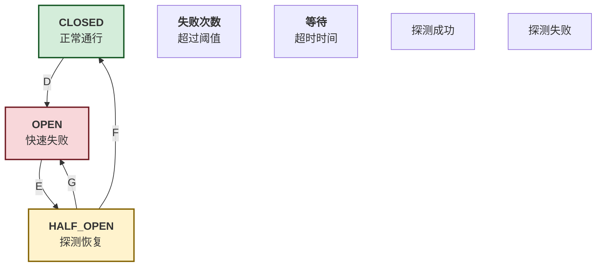
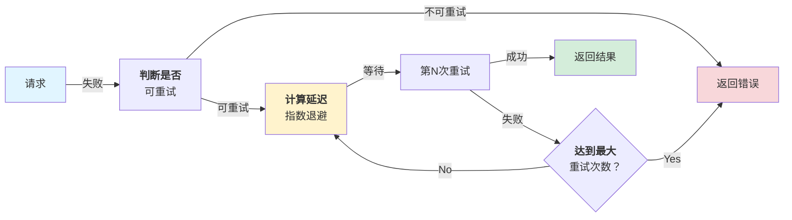
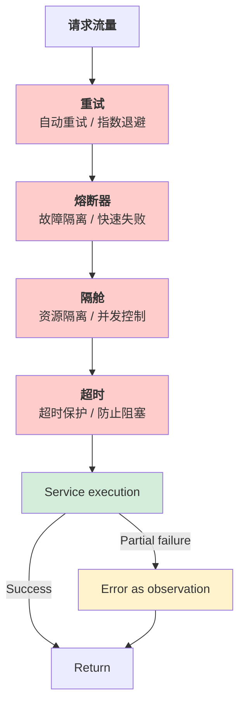
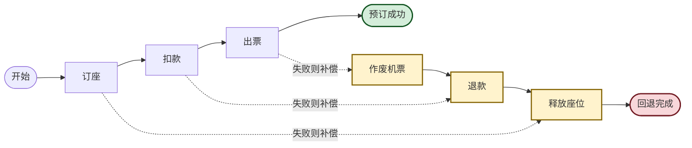

## 11.3 容错模式与系统级恢复

AI Agent 系统在生产环境中需要面对网络中断、API 超时等各种故障。本节介绍四大容错模式（熔断器、隔舱、超时、重试）、幂等性设计、检查点恢复、SAGA 补偿事务和“错误作为观察”设计模式。

### 11.3.1 四大容错模式

#### 1. 熔断器

熔断器的状态转移流程如下：



图 11-3：熔断器状态机

熔断器通过状态机实现故障隔离。首先定义状态枚举和配置：

```python
# core/circuit_breaker.py
from enum import Enum
from datetime import datetime, timedelta
import asyncio

class CircuitState(Enum):
    CLOSED = "closed"      # 正常：请求通过
    OPEN = "open"          # 故障：快速失败
    HALF_OPEN = "half_open"  # 恢复中：探测性请求

class CircuitBreakerConfig:
    """熔断器参数配置"""
    def __init__(
        self,
        failure_threshold: int = 5,
        success_threshold: int = 2,
        timeout_seconds: int = 60,
        expected_exception: type = Exception
    ):
        self.failure_threshold = failure_threshold
        self.success_threshold = success_threshold
        self.timeout_seconds = timeout_seconds
        self.expected_exception = expected_exception

class CircuitBreaker:
    """熔断器实现(CLOSED ↔ HALF_OPEN ↔ OPEN)"""

    def __init__(self, name: str, config: CircuitBreakerConfig):
        self.name = name
        self.config = config
        self.state = CircuitState.CLOSED
        self.failure_count = 0
        self.success_count = 0
        self.last_failure_time = None

    async def call(self, func, *args, **kwargs):
        """通过熔断器调用函数"""
        if self.state == CircuitState.OPEN:
            if self._should_attempt_reset():
                self.state = CircuitState.HALF_OPEN
                self.success_count = 0
                print(f"Circuit breaker {self.name} entering HALF_OPEN")
            else:
                raise Exception(f"Circuit breaker {self.name} is OPEN")

        try:
            result = await func(*args, **kwargs)
            self._on_success()
            return result
        except self.config.expected_exception as e:
            self._on_failure()
            raise

    def _on_success(self):
        """处理成功调用"""
        self.failure_count = 0
        if self.state == CircuitState.HALF_OPEN:
            self.success_count += 1
            if self.success_count >= self.config.success_threshold:
                self.state = CircuitState.CLOSED
                self.success_count = 0
                print(f"Circuit breaker {self.name} closed (recovered)")

    def _on_failure(self):
        """处理失败调用"""
        self.failure_count += 1
        self.last_failure_time = datetime.now()

        if self.state == CircuitState.CLOSED:
            if self.failure_count >= self.config.failure_threshold:
                self.state = CircuitState.OPEN
                print(f"Circuit breaker {self.name} opened")
        elif self.state == CircuitState.HALF_OPEN:
            self.state = CircuitState.OPEN
            print(f"Circuit breaker {self.name} reopened")

    def _should_attempt_reset(self) -> bool:
        """检查是否应该尝试从 OPEN 转为 HALF_OPEN"""
        if self.last_failure_time is None:
            return True
        elapsed = (datetime.now() - self.last_failure_time).total_seconds()
        return elapsed >= self.config.timeout_seconds

    def get_state(self) -> dict:
        """获取熔断器状态信息"""
        return {
            'name': self.name,
            'state': self.state.value,
            'failure_count': self.failure_count,
            'success_count': self.success_count,
            'last_failure_time': self.last_failure_time
        }
```

#### 2. 隔舱

隔舱模式的实现代码如下：

```python
# core/bulkhead.py
"""
隔舱模式：为不同的操作分配独立的资源池
防止一个故障影响其他操作
"""

import asyncio
from asyncio import Semaphore
from typing import Dict
import logging

logger = logging.getLogger(__name__)

class BulkheadConfig:
    """隔舱配置"""
    def __init__(self, max_concurrent: int = 10, timeout: int = 30):
        self.max_concurrent = max_concurrent
        self.timeout = timeout

class Bulkhead:
    """隔舱：限制并发数"""

    def __init__(self, name: str, config: BulkheadConfig):
        self.name = name
        self.config = config
        self.semaphore = Semaphore(config.max_concurrent)
        self.active_tasks = 0

    async def execute(self, func, *args, **kwargs):
        """在隔舱内执行任务"""
        async with self.semaphore:
            self.active_tasks += 1
            logger.info(
                f"Bulkhead {self.name}: "
                f"{self.active_tasks}/{self.config.max_concurrent} active"
            )

            try:
                return await asyncio.wait_for(
                    func(*args, **kwargs),
                    timeout=self.config.timeout
                )
            finally:
                self.active_tasks -= 1

class BulkheadManager:
    """隔舱管理器"""

    def __init__(self):
        self.bulkheads: Dict[str, Bulkhead] = {}

    def create_bulkhead(self, name: str, config: BulkheadConfig) -> Bulkhead:
        """创建隔舱"""
        bulkhead = Bulkhead(name, config)
        self.bulkheads[name] = bulkhead
        return bulkhead

    async def execute(self, bulkhead_name: str, func, *args, **kwargs):
        """通过指定隔舱执行任务"""
        if bulkhead_name not in self.bulkheads:
            raise ValueError(f"Bulkhead {bulkhead_name} not found")

        return await self.bulkheads[bulkhead_name].execute(func, *args, **kwargs)

    def get_stats(self) -> dict:
        """获取所有隔舱的统计"""
        return {
            name: {
                'max_concurrent': bulkhead.config.max_concurrent,
                'active_tasks': bulkhead.active_tasks
            }
            for name, bulkhead in self.bulkheads.items()
        }
```

#### 3. 超时

实现如下：

```python
# core/timeout.py
"""
超时模式：设定最长等待时间,避免无限阻塞
"""

import asyncio
from contextlib import asynccontextmanager

class TimeoutManager:
    """超时管理"""

    @staticmethod
    @asynccontextmanager
    async def timeout(seconds: int, operation_name: str = "operation"):
        """
        超时上下文管理器

        使用示例：
            async with TimeoutManager.timeout(30, "database_query") as tm:
                result = await db.query(...)
        """
        try:
            async with asyncio.timeout(seconds):
                yield
        except asyncio.TimeoutError:
            raise TimeoutError(
                f"Operation {operation_name} exceeded {seconds}s timeout"
            )

    @staticmethod
    async def with_timeout(func, timeout_seconds: int, *args, **kwargs):
        """为函数调用添加超时"""
        try:
            return await asyncio.wait_for(
                func(*args, **kwargs),
                timeout=timeout_seconds
            )
        except asyncio.TimeoutError:
            raise TimeoutError(
                f"Function {func.__name__} exceeded {timeout_seconds}s timeout"
            )

class AdaptiveTimeout:
    """自适应超时(根据历史数据调整)"""

    def __init__(self, initial_timeout: int = 30):
        self.initial_timeout = initial_timeout
        self.execution_times = []
        self.max_samples = 100

    def record(self, duration: float):
        """记录执行时间"""
        self.execution_times.append(duration)
        if len(self.execution_times) > self.max_samples:
            self.execution_times.pop(0)

    def get_timeout(self) -> int:
        """获取建议的超时时间"""
        if not self.execution_times:
            return self.initial_timeout

        # 使用 P95 作为超时时间[1]
        sorted_times = sorted(self.execution_times)
        p95_index = int(len(sorted_times) * 0.95)
        p95_time = sorted_times[p95_index]

        # 添加 20% 的缓冲
        return max(self.initial_timeout, int(p95_time * 1.2))
```

#### 4. 重试

具体实现代码如下：



图 11-4：重试机制流程（可重试判断 + 指数退避）



图 11-5：四大容错模式级联防护
重试策略通过指数退避和抖动来处理瞬时故障。首先定义重试配置和策略：

```python
# core/retry.py
import asyncio
import random
from typing import Callable
import logging

logger = logging.getLogger(__name__)

class RetryConfig:
    """重试配置参数"""
    def __init__(
        self,
        max_attempts: int = 3,
        initial_delay: float = 1.0,
        max_delay: float = 60.0,
        exponential_base: float = 2.0,
        jitter: bool = True,
        retryable_exceptions: tuple = (Exception,)
    ):
        self.max_attempts = max_attempts
        self.initial_delay = initial_delay
        self.max_delay = max_delay
        self.exponential_base = exponential_base
        self.jitter = jitter
        self.retryable_exceptions = retryable_exceptions

class RetryPolicy:
    """重试执行策略(指数退避 + 抖动)"""

    def __init__(self, config: RetryConfig):
        self.config = config
        self.attempt_count = 0

    async def execute(self, func: Callable, *args, **kwargs):
        """执行函数,失败时自动重试"""
        last_exception = None

        for attempt in range(1, self.config.max_attempts + 1):
            try:
                result = await func(*args, **kwargs)
                logger.info(f"Succeeded on attempt {attempt}")
                return result

            except self.config.retryable_exceptions as e:
                last_exception = e
                self.attempt_count = attempt

                if attempt == self.config.max_attempts:
                    logger.error(f"Failed after {attempt} attempts: {e}")
                    raise

                # 计算延迟：指数退避 + 抖动
                delay = self._calculate_delay(attempt)
                logger.warning(f"Attempt {attempt} failed: {e}. Retrying in {delay:.1f}s...")
                await asyncio.sleep(delay)

        raise last_exception

    def _calculate_delay(self, attempt: int) -> float:
        """计算延迟时间：指数退避 + 10% 随机抖动"""
        delay = self.config.initial_delay * (self.config.exponential_base ** (attempt - 1))
        delay = min(delay, self.config.max_delay)

        if self.config.jitter:
            jitter = random.uniform(0, delay * 0.1)
            delay += jitter

        return delay

class RetryDecorator:
    """重试装饰器"""

    @staticmethod
    def retry(config: RetryConfig = None):
        """为函数添加重试能力的装饰器"""
        if config is None:
            config = RetryConfig()

        def decorator(func):
            async def wrapper(*args, **kwargs):
                policy = RetryPolicy(config)
                return await policy.execute(func, *args, **kwargs)
            return wrapper
        return decorator
```

### 11.3.2 幂等性设计

核心实现如下：
幂等性管理器确保相同操作只执行一次，即使请求重复。通过生成操作的哈希键来检测重复：

```python
# core/idempotency.py
import hashlib
import json
from typing import Dict, Any, Optional
from datetime import datetime, timedelta
import asyncio

class IdempotencyManager:
    """幂等性管理：重复操作返回缓存结果"""

    def __init__(self, ttl_seconds: int = 3600):
        self.cache: Dict[str, Any] = {}
        self.metadata: Dict[str, Dict] = {}
        self.ttl = ttl_seconds

    @staticmethod
    def generate_key(operation: str, params: dict) -> str:
        """生成幂等性 Key(操作 + 参数的 SHA256 哈希)"""
        key_data = {'operation': operation, 'params': params}
        key_string = json.dumps(key_data, sort_keys=True)
        return hashlib.sha256(key_string.encode()).hexdigest()

    async def execute_idempotent(
        self,
        idempotency_key: str,
        operation: str,
        func,
        *args,
        **kwargs
    ) -> Any:
        """执行幂等操作(缓存相同操作的结果)"""
        # 检查缓存
        if idempotency_key in self.cache:
            metadata = self.metadata[idempotency_key]
            if metadata['status'] == 'completed':
                return self.cache[idempotency_key]
            elif metadata['status'] == 'in_progress':
                # 等待进行中的操作完成
                await asyncio.sleep(0.1)
                return await self.execute_idempotent(
                    idempotency_key, operation, func, *args, **kwargs
                )

        # 标记为进行中
        self.metadata[idempotency_key] = {
            'status': 'in_progress',
            'operation': operation,
            'started_at': datetime.now()
        }

        try:
            result = await func(*args, **kwargs)
            # 缓存成功结果
            self.cache[idempotency_key] = result
            self.metadata[idempotency_key] = {
                'status': 'completed',
                'operation': operation,
                'completed_at': datetime.now()
            }
            return result

        except Exception as e:
            # 记录失败状态
            self.metadata[idempotency_key] = {
                'status': 'failed',
                'operation': operation,
                'error': str(e),
                'failed_at': datetime.now()
            }
            raise

    def cleanup_expired(self):
        """清理超过 TTL 的缓存条目"""
        now = datetime.now()
        expired_keys = []

        for key, metadata in self.metadata.items():
            timestamp = metadata.get('completed_at') or metadata.get('started_at')
            if timestamp and (now - timestamp).total_seconds() > self.ttl:
                expired_keys.append(key)

        for key in expired_keys:
            del self.cache[key]
            del self.metadata[key]
```

### 11.3.3 检查点恢复

实现代码如下：
检查点管理器在长流程中定期保存状态，支持故障恢复。首先定义检查点数据结构：

```python
# core/checkpoint.py
from datetime import datetime
from typing import Dict, Any, Optional
import uuid

class Checkpoint:
    """检查点：记录特定步骤的状态"""
    def __init__(self, step_id: str, state: dict, timestamp: datetime):
        self.step_id = step_id
        self.state = state
        self.timestamp = timestamp

class CheckpointManager:
    """检查点管理器：保存和恢复工作流状态"""

    def __init__(self):
        self.checkpoints: Dict[str, list] = {}
        self.current_checkpoint: Dict[str, int] = {}

    def create_checkpoint(self, workflow_id: str, step_id: str, state: dict) -> Checkpoint:
        """创建新检查点"""
        checkpoint = Checkpoint(step_id=step_id, state=state, timestamp=datetime.now())
        if workflow_id not in self.checkpoints:
            self.checkpoints[workflow_id] = []
        self.checkpoints[workflow_id].append(checkpoint)
        return checkpoint

    def get_last_checkpoint(self, workflow_id: str) -> Optional[Checkpoint]:
        """获取最后一个检查点"""
        if workflow_id not in self.checkpoints:
            return None
        checkpoints = self.checkpoints[workflow_id]
        return checkpoints[-1] if checkpoints else None

    def restore_from_checkpoint(self, workflow_id: str) -> Optional[dict]:
        """从最后一个检查点恢复状态"""
        last_checkpoint = self.get_last_checkpoint(workflow_id)
        if last_checkpoint:
            return {
                'step_id': last_checkpoint.step_id,
                'state': last_checkpoint.state,
                'resumed_at': datetime.now()
            }
        return None

    def rollback_to_checkpoint(self, workflow_id: str, steps: int = 1) -> Optional[dict]:
        """回滚到前面的检查点"""
        if workflow_id not in self.checkpoints:
            return None
        checkpoints = self.checkpoints[workflow_id]
        target_index = len(checkpoints) - steps - 1
        if target_index < 0:
            return None
        target_checkpoint = checkpoints[target_index]
        return {
            'step_id': target_checkpoint.step_id,
            'state': target_checkpoint.state,
            'rolled_back_at': datetime.now()
        }
```

可恢复工作流使用检查点来支持长流程的容错执行：

```python
# 可恢复的工作流
class RecoverableWorkflow:
    """长流程工作流(支持故障恢复)"""

    def __init__(self, workflow_id: str):
        self.workflow_id = workflow_id
        self.checkpoint_manager = CheckpointManager()
        self.steps = []

    async def add_step(self, step_id: str, func, *args, **kwargs):
        """添加工作流步骤"""
        self.steps.append({
            'id': step_id,
            'func': func,
            'args': args,
            'kwargs': kwargs
        })

    async def execute(self, resume: bool = False) -> dict:
        """执行工作流,支持恢复"""
        start_step = 0

        if resume:
            last_checkpoint = self.checkpoint_manager.get_last_checkpoint(self.workflow_id)
            if last_checkpoint:
                # 找到恢复点后的第一个步骤
                for i, step in enumerate(self.steps):
                    if step['id'] == last_checkpoint.step_id:
                        start_step = i + 1
                        break

        results = []

        for i in range(start_step, len(self.steps)):
            step = self.steps[i]
            try:
                result = await step['func'](*step['args'], **step['kwargs'])
                results.append(result)
                # 保存检查点
                self.checkpoint_manager.create_checkpoint(
                    self.workflow_id,
                    step['id'],
                    {'results': results}
                )
            except Exception as e:
                return {
                    'status': 'failed',
                    'error': str(e),
                    'failed_step': step['id'],
                    'can_resume': True,
                    'last_checkpoint': step['id']
                }

        return {'status': 'completed', 'results': results}
```

### 11.3.4 SAGA 模式与补偿事务

重试和检查点解决的是“重来一次就好”的故障，但有一类操作无法靠重来兜底：**带有真实副作用的多步流程**。以航班预订为例，它不是一个动作，而是一串顺序操作——订座、扣款、出票，每一步都在调用一个外部系统，每一步都可能失败。

最朴素的做法（整体重试）会很快失效：如果座位已订、扣款却失败，再整体重试就会重复订座甚至重复扣款，把系统推向更坏的状态。真正需要的是**逐步重试，并在某一步重试耗尽后，只回滚已经发生的那些步骤**。



图 11-6：SAGA 正向流程与逆序补偿

这正是分布式系统中的 **SAGA 模式**：把一个长事务拆成若干个本地事务，为每个步骤配一个**补偿动作**；当正向流程在某一步失败时，按**相反顺序**对已完成的步骤执行补偿，把系统退回一致状态。SAGA 用**最终一致性**替代了单库事务的 ACID 原子性——这是在“无法把多个外部系统装进一个数据库事务”时的标准取舍。

三条设计约束贯穿始终：

- **补偿必须幂等**：补偿动作可能因重试或崩溃恢复被多次调用，重复补偿必须安全（参见 11.3.2 节）。
- **逆序补偿**：按完成的相反顺序回退，后发生的副作用先撤销。
- **失败步骤也要补偿**：失败步骤的副作用是否已部分提交是未知的，因此把它一并纳入补偿范围，靠幂等性兜底。

协调器复用 11.3.1 的重试策略，让每一步先各自吸收瞬时故障：

```python
# core/saga.py
"""
SAGA 模式:把长事务拆成多个带补偿动作的本地事务。
任一步骤失败时,按相反顺序补偿已完成步骤,把系统退回一致状态
(最终一致性,而非 ACID 原子性)。
"""

import logging
from dataclasses import dataclass
from typing import Awaitable, Callable, List, Optional

logger = logging.getLogger(__name__)

# 正向动作返回对共享上下文的更新;补偿动作只负责撤销副作用
Action = Callable[[dict], Awaitable[dict]]
Compensation = Callable[[dict], Awaitable[None]]


@dataclass
class SagaStep:
    """一个 SAGA 步骤:正向动作 + 对应补偿(只读步骤可省略补偿)"""
    name: str
    action: Action
    compensation: Optional[Compensation] = None


class SagaError(Exception):
    """SAGA 失败(已尝试补偿后抛出),携带失败步骤、根因与补偿结果"""
    def __init__(self, failed_step: str, cause: Exception, compensated: List[str]):
        self.failed_step = failed_step
        self.cause = cause
        self.compensated = compensated
        super().__init__(
            f"saga failed at '{failed_step}': {cause}; compensated: {compensated}"
        )


class SagaCoordinator:
    """SAGA 协调器:顺序执行步骤,失败时逆序补偿"""

    def __init__(self, steps: List[SagaStep], retry_config: "RetryConfig" = None):
        self.steps = steps
        self.retry_config = retry_config  # 复用 11.3.1 的重试配置

    async def execute(self, context: dict) -> dict:
        """正向执行所有步骤;任一步失败则逆序补偿后抛出 SagaError"""
        completed: List[SagaStep] = []

        for step in self.steps:
            try:
                update = await self._run_action(step, context)
                context.update(update or {})
                completed.append(step)
                logger.info("saga step '%s' done", step.name)
            except Exception as cause:
                logger.error("saga step '%s' failed: %s", step.name, cause)
                # 关键:把失败步骤本身也纳入补偿,因为它的副作用
                # 是否已部分提交是未知的;补偿的幂等性保证这样做安全。
                done = await self._compensate(completed + [step], context)
                raise SagaError(step.name, cause, done)

        return context

    async def _run_action(self, step: SagaStep, context: dict) -> dict:
        """执行正向动作;配置了重试则先自动重试瞬时故障"""
        if self.retry_config is not None:
            policy = RetryPolicy(self.retry_config)
            return await policy.execute(step.action, context)
        return await step.action(context)

    async def _compensate(self, steps: List[SagaStep], context: dict) -> List[str]:
        """逆序执行补偿;补偿失败必须告警并转人工,不能继续掩盖"""
        compensated: List[str] = []
        for step in reversed(steps):
            if step.compensation is None:
                continue
            try:
                await step.compensation(context)
                compensated.append(step.name)
            except Exception as e:
                logger.critical("compensation for '%s' failed: %s", step.name, e)
        return compensated
```

把航班预订接入协调器——每个补偿都以预订号 `booking_id` 作为幂等键，即使正向回执丢失也能正确冲正：

```python
# examples/booking_saga.py
"""航班预订:订座 → 扣款 → 出票,任一步失败则逆序补偿"""

async def reserve_seat(ctx: dict) -> dict:
    seat = await seats.hold(ctx["flight"], idempotency_key=ctx["booking_id"])
    return {"seat": seat}

async def release_seat(ctx: dict) -> None:
    await seats.release(ctx["booking_id"])        # 幂等:重复释放安全

async def process_payment(ctx: dict) -> dict:
    ref = await payments.charge(ctx["amount"], idempotency_key=ctx["booking_id"])
    return {"payment_ref": ref}

async def refund_payment(ctx: dict) -> None:
    await payments.refund(idempotency_key=ctx["booking_id"])  # 幂等:回执丢失也能冲正

async def issue_ticket(ctx: dict) -> dict:
    no = await tickets.issue(ctx["seat"], idempotency_key=ctx["booking_id"])
    return {"ticket_no": no}

async def void_ticket(ctx: dict) -> None:
    await tickets.void(ctx["booking_id"])         # 幂等:按预订号作废


booking_saga = SagaCoordinator(
    steps=[
        SagaStep("reserve_seat", reserve_seat, release_seat),
        SagaStep("process_payment", process_payment, refund_payment),
        SagaStep("issue_ticket", issue_ticket, void_ticket),
    ],
    retry_config=RetryConfig(max_attempts=3, initial_delay=1.0),
)

# 成功返回完整上下文;失败抛出 SagaError,且已完成步骤均已补偿
result = await booking_saga.execute({
    "booking_id": "bk-20260605-001",
    "passenger": "A. Lovelace",
    "flight": "CA1831",
    "amount": 128000,  # 单位:分
})
```

**下沉到工作流引擎**。上面的协调器是手写的；在生产中，补偿逻辑可以下沉为工作流引擎的声明式配置。以 LangGraph 的[官方容错原语](https://docs.langchain.com/oss/python/langgraph/fault-tolerance)为例：每个节点配 `retry_policy` 自动重试，重试耗尽后由 `error_handler` 返回一个 `Command(goto="compensate")` 转入补偿节点，再用 `set_node_defaults` 给所有节点统一挂载：

```python
# 声明式补偿:节点重试耗尽后路由到 compensate 节点
from langgraph.graph import StateGraph, START, END
from langgraph.types import Command, RetryPolicy
from langgraph.errors import NodeError

def to_compensate(state: BookingState, error: NodeError) -> Command:
    # error.node 是失败节点名;一并标记,交给 compensate 决定如何冲正
    return Command(
        update={"completed": [f"FAILED:{error.node}"]},
        goto="compensate",
    )

graph = (
    StateGraph(BookingState)
    # 统一默认值,单个节点仍可用 retry_policy= / error_handler= 覆盖
    .set_node_defaults(
        retry_policy=RetryPolicy(max_attempts=3),
        error_handler=to_compensate,
    )
    .add_node("reserve_seat", reserve_seat)
    .add_node("process_payment", process_payment)
    .add_node("issue_ticket", issue_ticket)
    .add_node("compensate", compensate)
    .add_edge(START, "reserve_seat")
    .add_edge("reserve_seat", "process_payment")
    .add_edge("process_payment", "issue_ticket")
    .add_edge("issue_ticket", END)
    .compile(checkpointer=checkpointer)
)
```

引擎托管 SAGA 的好处在于**转移的原子性**：`error_handler` 只在重试全部失败后触发，且这次“转入补偿”的跳转会随检查点一起提交。即使进程在补偿执行到一半时崩溃，恢复时也会重新调度补偿节点，而不会回到那个失败的正向步骤——这正是 11.3.3 检查点恢复与 SAGA 组合后的价值：补偿过程本身也是可恢复的。

> SAGA 只提供最终一致性：从某一步失败到补偿完成之间，存在“已扣款、尚未退款”的中间窗口。检查点让它可恢复，告警让它可见，二者把窗口压到尽可能短，但无法消除——这是放弃单库原子性必须接受的代价。

### 11.3.5 “错误作为观察”模式

OpenClaw 的独特模式：系统不抛异常打断流程，而是将错误信息注入观察流。
错误作为观察模式允许系统继续执行，而不是抛出异常。首先定义错误观察数据结构：

```python
# core/error_as_observation.py
from dataclasses import dataclass
from enum import Enum
from datetime import datetime

class ErrorObservationType(Enum):
    """错误类型分类"""
    TOOL_ERROR = "tool_error"
    TIMEOUT = "timeout"
    RATE_LIMIT = "rate_limit"
    VALIDATION_ERROR = "validation_error"
    NETWORK_ERROR = "network_error"

@dataclass
class ErrorObservation:
    """错误观察对象"""
    type: ErrorObservationType
    source: str
    message: str
    error_code: str
    timestamp: datetime
    severity: int  # 1-5
    recoverable: bool
    suggested_action: str
    retry_after: int = 0

class ErrorAsObservationHandler:
    """错误处理器：将异常转化为观察"""

    def __init__(self):
        self.observations = []

    async def handle_tool_error(
        self,
        tool_name: str,
        error: Exception,
        context: dict
    ) -> ErrorObservation:
        """将工具错误转化为观察(而不是抛异常)"""
        observation = self._classify_error(tool_name, error, context)
        self.observations.append(observation)
        return observation

    def _classify_error(
        self,
        tool_name: str,
        error: Exception,
        context: dict
    ) -> ErrorObservation:
        """根据异常类型分类错误"""
        error_type = type(error).__name__

        if 'timeout' in error_type.lower():
            return ErrorObservation(
                type=ErrorObservationType.TIMEOUT,
                source=tool_name,
                message=str(error),
                error_code='TIMEOUT',
                timestamp=datetime.now(),
                severity=3,
                recoverable=True,
                suggested_action='retry',
                retry_after=5
            )

        elif 'rate' in error_type.lower():
            return ErrorObservation(
                type=ErrorObservationType.RATE_LIMIT,
                source=tool_name,
                message=f"Rate limit exceeded for {tool_name}",
                error_code='RATE_LIMIT',
                timestamp=datetime.now(),
                severity=2,
                recoverable=True,
                suggested_action='backoff_and_retry',
                retry_after=60
            )

        else:
            return ErrorObservation(
                type=ErrorObservationType.TOOL_ERROR,
                source=tool_name,
                message=str(error),
                error_code=error_type,
                timestamp=datetime.now(),
                severity=4,
                recoverable=False,
                suggested_action='report_to_user'
            )

    async def inject_observations(self, agent_context: dict) -> dict:
        """将观察注入到 Agent 上下文"""
        observations_list = [
            {
                'type': obs.type.value,
                'source': obs.source,
                'message': obs.message,
                'recoverable': obs.recoverable,
                'suggested_action': obs.suggested_action,
                'retry_after': obs.retry_after
            }
            for obs in self.observations
        ]
        agent_context['observations'] = agent_context.get('observations', []) + observations_list
        return agent_context

    def get_summary(self) -> dict:
        """获取错误观察摘要"""
        by_type = {}
        for obs in self.observations:
            obs_type = obs.type.value
            by_type[obs_type] = by_type.get(obs_type, 0) + 1

        return {
            'total_observations': len(self.observations),
            'by_type': by_type,
            'unrecoverable_count': sum(1 for o in self.observations if not o.recoverable)
        }
```

### 11.3.6 实战：完整的容错系统

示例代码如下：

```python
# examples/fault_tolerance_system.py
"""
完整的容错系统示例
"""

import asyncio

class ResilientAgent:
    """具有容错能力的 Agent"""

    def __init__(self):
        self.circuit_breaker = CircuitBreaker(
            "api_calls",
            CircuitBreakerConfig(failure_threshold=5, timeout_seconds=30)
        )
        self.bulkhead_manager = BulkheadManager()
        self.retry_config = RetryConfig(
            max_attempts=3,
            initial_delay=1.0,
            exponential_base=2.0
        )
        self.idempotency_manager = IdempotencyManager()
        self.error_handler = ErrorAsObservationHandler()

        # 创建隔舱
        self.bulkhead_manager.create_bulkhead(
            "external_api",
            BulkheadConfig(max_concurrent=10, timeout=30)
        )

    async def execute_action(
        self,
        action_id: str,
        tool_name: str,
        params: dict
    ) -> dict:
        """执行带容错的操作"""

        # 步骤 1:生成幂等性 Key
        idempotency_key = IdempotencyManager.generate_key(tool_name, params)

        # 步骤 2:通过幂等性管理器执行
        async def execute_with_faults():
            # 步骤 3:通过隔舱限制并发
            async def isolated_call():
                # 步骤 4:通过重试策略执行
                policy = RetryPolicy(self.retry_config)
                return await policy.execute(
                    self._call_tool,
                    tool_name, params
                )

            return await self.bulkhead_manager.execute(
                "external_api",
                isolated_call
            )

        try:
            result = await self.idempotency_manager.execute_idempotent(
                idempotency_key,
                tool_name,
                execute_with_faults
            )

            return {
                'status': 'success',
                'result': result,
                'action_id': action_id
            }

        except Exception as e:
            # 转化为观察而非异常
            error_obs = await self.error_handler.handle_tool_error(
                tool_name, e, {'action_id': action_id}
            )

            return {
                'status': 'error',
                'observation': {
                    'type': error_obs.type.value,
                    'message': error_obs.message,
                    'recoverable': error_obs.recoverable,
                    'suggested_action': error_obs.suggested_action
                },
                'action_id': action_id
            }

    async def _call_tool(self, tool_name: str, params: dict):
        """实际调用工具(模拟)"""
        # 模拟随机失败
        import random
        if random.random() < 0.3:
            raise TimeoutError(f"Tool {tool_name} timeout")

        return f"Result from {tool_name}"

# 测试
async def main():
    agent = ResilientAgent()

    # 执行多个操作
    tasks = []
    for i in range(5):
        task = agent.execute_action(
            action_id=f"action_{i}",
            tool_name="external_api",
            params={"query": f"request_{i}"}
        )
        tasks.append(task)

    results = await asyncio.gather(*tasks)

    print("Results:")
    for result in results:
        print(f"  {result['action_id']}: {result['status']}")

    print("\nError observations:")
    summary = agent.error_handler.get_summary()
    print(f"  Total: {summary['total_observations']}")
    print(f"  By type: {summary['by_type']}")

if __name__ == "__main__":
    asyncio.run(main())
```

### 11.3.7 总结

容错模式的四大支柱：

| 模式 | 作用 | 适用场景 |
|-----|------|--------|
| 熔断器 | 快速失败，保护下游 | 故障 API、不稳定服务 |
| 隔舱 | 资源隔离，避免级联 | 并发控制、资源限制 |
| 超时 | 防止无限等待 | 网络请求、长操作 |
| 重试 | 自动恢复瞬时故障 | 临时故障、网络抖动 |

辅助机制：幂等性、检查点、SAGA 补偿、错误作为观察，构成完整的生产级容错系统。

---

[1] P95 百分位数（0.95）为经验值，实际系统应基于历史执行时间数据标定，并考虑业务 SLA 要求。
